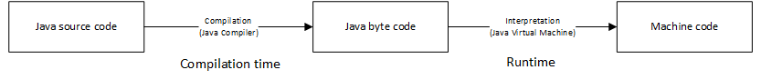
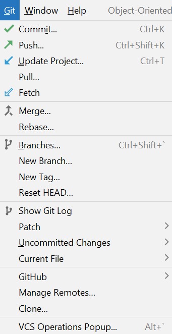

# 1.1. Java as a programming language

Welcome to learn Java at the 'Object-oriented programming with Java' course at Metropolia!

This course is an introduction to the Java programming language. You will not only learn the basics of Java, but you also learn advanced programming techniques, such as object-oriented and functional programming. Moreover, you learn to develop graphical user interfaces (GUIs) with JavaFX, and write programs that use a database. This course lays the foundation for your future studies in software engineering.

In this first module, and the four submodules within, we focus on the basics of Java programming. It is assumed that you have elementary programming skills in Python acquired in your first-year studies. Thus, we will not go through the basics of programming, but rather focus on learning how things are done in Java.

At this point, let's begin with the classic in all programming courses: the "Hello World!" program:

```java
public class HelloWorld {
    public static void main(String[] args) {
        System.out.println("Hello World!");
    }
}
```

As you see, Hello World is not printed with just one line of code as in Python. This reflects the fundamental difference between Java and Python: Python is a scripting language, which means that the syntax is simple and the code is interpreted and executed line by line. Java, on the other hand, is a compiled language, which means that the code is first compiled into a binary format, and then executed.

The approach for Java means that the code is more verbose, but also that it is more efficient. (At this point, it is worth noting that Java programs are not really compiled into binary code, but into Java bytecode, which is then executed by the Java Virtual Machine (JVM). This is something we will address slightly later.)

## 1.1.1. Installing IntelliJ IDEA

The first thing to do is to install an IDE (Integrated Development Environment) for Java. There are several alternatives, but we will use IntelliJ IDEA, which is a free and open-source IDE developed by JetBrains. You can download it from [https://www.jetbrains.com/idea/download/](https://www.jetbrains.com/idea/download/). 

You should feel immediately at home With IntelliJ IDEA if you have used PyCharm, which is also developed by JetBrains. If you have not used PyCharm, you will learn to use IntelliJ IDEA in no time.

There are two distributions as download options: Ultimate and Community. As a Metropolia student, you get a free license for the Ultimate version, so you might want to sign in your JetBrains account and download that. You need to have a JetBrains account to get the license needed for the Ultimate version. (It is highly likely that you already have a JetBrains account if you took part in Metropolia's first year courses.)

>If you don't have a licence yet, you can acquire one now. The installation program will guide you through this. Activation requires the creation of a JetBrains account and the acquisition of a student license. As a student, you can obtain a license that is valid for one year at a time for free by clicking on the shopping cart icon at the top of the JetBrains website and selecting **Special offers / For students and teachers**. Enter the form details using your Metropolia email address and finalize the activation according to the instructions you receive by email. When the license is about to expire in a year, you will automatically receive an email with instructions on how to renew it.

## 1.1.2. Running your first Java program

Writing your first Java program is easy. Just follow these steps:

1. Open IntelliJ IDEA
2. Create a new project by selecting **File / New / Project...** from the menu
3. Select **Java** from the list on the left
4. Select **Java SDK 17** from the list on the right. (If the option is not available, you need to install Java 17 first. To do so, just click **Download JDK**, choose version 17 and follow the instructions.)
5. Click **Next**
6. Give your project a name, e.g. **HelloWorld**
7. Click **Finish**
8. Right-click on the **src** folder in the project view on the left
9. Select **New / Java Class** from the menu
10. Give your class a name, e.g. **HelloWorld**
11. Click **OK**
12. Copy the code snippet above into the editor window
13. Right-click on the editor window
14. Select **Run 'HelloWorld.main()'** from the menu

You should now see the output window at the bottom of the screen displaying the text:

```text
Hello World!
```

In step 4, you selected Java 17 as the SDK (Software Development Kit) for your project. The Java SDK is a collection of tools needed for developing Java programs. The most important of these tools is the Java compiler, which is used to compile Java source code into Java bytecode. The Java SDK also includes the Java Runtime Environment (JRE), which is needed to run Java programs. The JRE includes the Java Virtual Machine (JVM), which is used to execute Java bytecode. The JVM is the reason why Java programs are platform-independent: the same bytecode can be executed on any platform that has a JVM.

>The acronym JDK stands for Java Development Kit. It has roughly the same meaning as SDK, but is more specific to Java.

>The choice of the SDK version is important. If you choose a version that is too old, you will not be able to use the latest features of Java. If you choose a version that is too new, you will not be able to run your programs on older systems. In this course, we will use Java 17, which is a recent LTS (Long-Term Support) version of Java. This means that it will be supported for a long time, and it is safe to use it in production. Specifically, JDK versions 8, 11, and 17, and 21 are LTS versions.

The bytecode is interpreted by the JVM, which means that the JVM reads the bytecode instructions and executes them. This is why Java is often referred to as an interpreted language. (To be specific, the JVM can also compile the bytecode into native machine code, which is then executed by the CPU. This is called just-in-time compilation, and it is used to improve the performance of Java programs.)

The following image shows the phases of compiling and interpreting Java programs:


 
When you ran the Hello World application, the Java compiler compiled the source code into bytecode, which was then executed by the JVM. The JVM is a virtual machine, which means that it is a software implementation of a computer that executes programs like a physical machine.

You can think of the bytecode as the 'machine code' of the JVM. The Java virtual machine (which is an application in spite of its name) reads these bytecode instructions and interprets them to  instructions understood by your system. This is why Java is platform-independent: the same bytecode can be executed on any platform that has a JVM.

Thus, a lot happens behind the scenes when you run a Java program. As a developer, you do not generally need to worry about this: you just write your code, and the IDE takes care of the rest.


## 1.1.3. Java basic syntax

Before writing new programs, let's study the Hello World example in more detail.

The first line of the program is:

```java
public class HelloWorld {
```

That line defines a class named `HelloWorld`. The class is defined as public, which means that it can be accessed from outside the class. In Java, all code (or almost all, to be specific) is written inside classes. Thus, the `HelloWorld` class contains the entire program. It is not possible to just write the print statement without defining a class first in a way similar to Python.

> By convention, class names start with a capital letter. This is not required by the compiler, but it is a good practice to follow. If the class name consists of several words, the words are written in camel case where the first letter of each word is capitalized.

Inside the class, there is a method definition:

```java
public static void main(String[] args) {
```

The functionality of each class is written inside methods. The `main` method is the entry point of the program. When you run a Java program, the JVM looks for the `main` method and executes it.

The `main` method is defined as `public`, which means that it can be accessed from outside the class. The `main` method is also defined as `static`, which means that it can be accessed without creating an instance (that is, an object) of the class.

The main method is also defined as `void`, which means that it does not return any value. The `main` method takes one parameter, which is an array of strings. The name of the parameter is by convention `args`, but it could be anything. The parameter is not used in the Hello World program, but it is needed because the main method is defined to take one parameter. The purpose of this `args` parameter is to pass command-line arguments to the program. In most cases, you do not need to worry about this parameter.

> Method names are by convention written in camel case where the first letter is lowercase. If the method name consists of several words, the words are written in camel case where the first letter of each word is capitalized. In this example, we have no real choice for the method name, as the name of the method that is the entry point of the program must be `main`.


The program continues with the following line:

```java
System.out.println("Hello World!");
```

This is the line that prints the text "Hello World!" to the console. The `System.out.println` method is defined in the `System` class, which is part of the `java.lang` package. The `System.out.println` method takes one parameter, which is a string. The `println` method prints the string to the console and adds a newline character at the end.

The line above ends with a semicolon `;`. In Java, all statements must end with a semicolon. This is different from Python, where the end of a line also marks the end of a statement. It is a common mistake to forget the semicolon at the end of a statement. If you do so, don't worry: the compiler will promptly give you an error message and tell you to add the semicolon.


After the `println` statement, there are no more statements in the `main` method, so the program ends there.

There is something else in the program that deserves attention, though. The curly braces `{` and `}` are used to define blocks of code. The `main` method is defined inside the `HelloWorld` class, so the `main` method is a block of code inside the `HelloWorld` class. The `println` statement is a block of code inside the `main` method. The curly braces are used to define the beginning and the end of each block of code. This is quite different from Python, where indentation is used to define blocks of code.

> Before, we mentioned that each statement ends with a semicolon. On the other hand, the blocks of code, denoted by curly braces, do not end with a semicolon. Adding the extra semicolon is a common mistake, so be careful not to add semicolons after curly braces. In come cases, an extra semicolon after a closing curly brace will not affect the execution of the program or make it syntactically erroneous, but it is still a style violation.


> Technically, the Java compiler doesn't care about indentation. However, indentation is very important for readability, so you should always indent your code properly. All professional Java developers do so. In IntelliJ IDEA, you can use the **Code / Reformat Code** command to automatically indent your code. That is possible, since the IDE knows the structure of the code based on the curly braces.

In the Java source code, there are two types for commenting the code: single-line comments and multi-line comments. Single-line comments start with `//` and continue until the end of the line. Multi-line comments start with `/*` and end with `*/`.

In a single-line comment, each row of the comment starts with `//`:

```java
// This is a single-line comment
```

THe start and end symbols of a multi-line comments provide an easy way to write a longer comment:

```java
/*
This is a multi-line comment.
It can span multiple lines.
 */
```

When the code is compiled into bytecode, the comments are removed. Thus, the comments are not visible in the bytecode, and they do not affect the execution of the program. The purpose of comments is to make the code more readable for humans.


## 1.1.4. Using GitHub with IntelliJ IDEA

Just like in the first-year studies, you will use GitHub to store your code. GitHub is a web-based hosting service for version control using Git. Git is a distributed version control system for tracking changes in source code during software development. It is designed for coordinating work among programmers, but it can be used to track changes in any set of files. GitHub is the most popular Git hosting service, and it is used by many companies and open-source projects.

In IntelliJ IDEA, you can create a new repository on GitHub based on your project. You can also commit and push your changes to GitHub directly from the IDE. To do so, follow these steps:

1. Open the project you want to store on GitHub
2. Select **VCS / Share Project on GitHub** from the menu
3. Enter your GitHub username and password if the system so prompts
4. Click **Share**
5. Enter a name for the repository
6. Click **OK**

The project is now stored on GitHub.

The **VCS** menu in the menu bar is replaced by the **Git** menu when you login into GitHub via IntelliJ Idea. The **Git** menu contains all the commands you need for working with Git repositories. See the image below.



The basic workflow with a GitHub repository involves pulling, committing, and pushing.
- Pulling means downloading the latest version of the repository from GitHub. You should pull always when you start your working session.
- Committing means saving your changes to the local repository. You should commit each time you have written or modified your code, and it compiles without errors.
- Pushing means uploading your changes to GitHub. You should push whenever you finish your working session. You should also push before you start your working session, in case you have forgotten to push earlier.

To pull the latest version of the repository from GitHub, select **Git / Repository / Pull** from the menu. To commit your changes to the local repository, select **Git / Commit** from the menu. To push your changes to GitHub, select **Git / Repository / Push** from the menu.

Remember to add a good description of your changes when you commit them. This will help you and others to understand what the changes are about.

At this point, you should be able to write your first Java program, run it, and save your versions to GitHub.

## Assignment: Writing your first Java programs

It is time to start writing Java programs. The main goal is to have the programming environment up and running, so the assignments are very simple.

**Task 1**

Install the environment, create a new project, and write a simple program that greets the user with a fixed message. Run the program and make sure that it works. Commit your changes to GitHub.

**Task 2**

Write a program that prints the following:

```
    *
   ***
  *****
 *******
 
```

The program should print the exact number of spaces and asterisks shown above. Commit your changes to GitHub.


**Task 3**

Run the following Java program that asks the user three integers and prints their sum.

```java
import java.util.Scanner;

public class SumOfThreeNumbers {

    public static void main(String[] args) {
        Scanner scanner = new Scanner(System.in);

        System.out.println("Give the first number:");
        int first = Integer.valueOf(scanner.nextLine());

        System.out.println("Give the second number:");
        int second = Integer.valueOf(scanner.nextLine());

        System.out.println("Give the third number:");
        int third = Integer.valueOf(scanner.nextLine());

        System.out.println("The sum of the numbers is " + (first + second + third));
    }
}
```

Then, based on your previous programming experience, modify the program so that the program also prints the product and average of the three integers. **Hint:** try the modified program with integers 3, 4, and 6. The sum should be 13, the product 72, and the average 4.3333333333333. If the average is something else, find out why and modify the program accordingly. Add the explanation as a comment to the program. Commit your changes to GitHub.


**Task 4**

Here is a simple object-oriented program:

```java
public class Cat {
    private String name;

    public Cat(String name) {
        this.name = name;
    }

    public void meow() {
        System.out.println("The cat named " + name + " says: Meow!");
    }

    public static void main(String[] args) {
        // Create an instance of the Cat class with a name
        Cat cat = new Cat("Whiskers");

        // Call the meow method on the cat instance
        cat.meow();
    }
}
```


Run the program. Then, based on your previous programming experience, modify the `main` method so that two cat objects are created, and the program behaves in the following way:

```
The cat named Whiskers says: Meow!
The cat named Whiskers says: Meow!
The cat named Rex says: Meow!
The cat named Whiskers says: Meow!
```

Commit your changes to GitHub.


For this assignment, you get points in the following way:
1. Task 1 completed, the code runs successfully: 1 point
2. Task 2 completed, the output is exactly as it should be: 1 point
3. Task 3 completed, the code is correctly modified and contains the explanation: 2 points
4. Task 4 completed, the code is correctly modified: 2 points

---
_This learning material has been produced with assistance from OpenAI's ChatGPT-4 and GitHub Copilot. These large language models have provided suggestions and solutions that have assisted the author in producing and supplementing the material. While their contribution has been significant, the final responsibility for the content and its correctness resides with the author._

