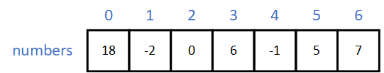

# 1.4. Arrays

In Java, an array is a container object that holds a fixed number of values of a single type. Each element in an array is associated with an index, which is a number that represents the element's position in the array. The first element in an array has index 0, the second element has index 1, and so on.

The following image illustrates the concept of an array:



The array in the example contains seven elements of integer type.
We can specify the element in an array by using the array name and the index of the element. For instance, we can say that the value of the element with index 3 in the `numbers` array is 6.

Indices are like numbers in doors of hotel rooms: once you know the number, you gain access to the correct content.

Arrays are static data structures, meaning that the size of an array is fixed once it is created. As a consequence, the JVM can reserve a contiguous block of memory for the array. This makes accessing the elements of an array very efficient, as the exact memory location of each element can be calculated based on the starting address of the array and the index of the element. The downside is that the size of an array cannot be changed after it has been created. If you ever need to expand an array, you must create a new array and copy the elements from the old array to the new array.

The size of an array, although fixed, can be determined at runtime. This means that you can ask the user to specify the size of an array.

The elements in an array may be of any elementary type, or they may be references to objects of any class. All elements in an array must, however, share the same type. Thus, you cannot create an array that contains both integers and strings.


## 1.4.1. Declaring and creating arrays

The following program asks the user for the number of integers, creates an array of the specified size, and then asks the user to enter the integers. Finally, the program prints the integers in reverse order.

```java
import java.util.Scanner;

public class ArrayExample {
    public static void main(String[] args) {
        Scanner scanner = new Scanner(System.in);

        System.out.print("How many integers? ");
        int size = scanner.nextInt();

        int[] numbers = new int[size];

        System.out.println("Enter the integers:");

        for (int i = 0; i < size; i++) {
            numbers[i] = scanner.nextInt();
        }

        System.out.println("The integers in reverse order:");

        for (int i = size - 1; i >= 0; i--) {
            System.out.println(numbers[i]);
        }
    }
}
```

Here is an example of running the program:

```
How many integers? 5
Enter the integers:
13
-5
0
8
5
The integers in reverse order:
5
8
0
-5
13
```

Let's look at the creation of the array in more detail:

```java
int[] numbers = new int[size];
```

On the right-hand side of the assignment operator, we have the expression `new int[size]`. This expression creates a new array of integers and returns a reference to the array. The reference is then assigned to the variable `numbers`.

The variable `numbers` is a variable that points to the array. It is declared to be of type `int[]`, which means that it can hold a reference to an array of integers.

There is an alternative way for declaring and initializing an array. If we know all the values that we want to store in the array at the time of creation, we can use the following syntax:

```java
int[] numbers = { 1, -2, 14, -4, 0 };
```

This is called an array initializer. The size of the array is determined by the number of values in the initializer. In the example above, the size is automatically set to 5.


## 1.4.2. Accessing array elements

As mentioned earlier, the elements of an array are accessed by their indices. The index of the first element is 0, the index of the second element is 1, and so on. The index of the last element is the size of the array minus one.

To access an element at place `i` in an array, we use the following syntax:

```java
array[i]
```

For example, the following code snippet prints the first and the last element of an array:

```java
int[] numbers = { 1, -2, 14, -4, 0 };

System.out.println(numbers[0]);
System.out.println(numbers[4]);
```

The output of the program is:

```
1
0
```

If we try to access an element that does not exist, we get an `ArrayIndexOutOfBoundsException`. For example, the following code snippet causes an exception:

```java
int[] numbers = { 1, -2, 14, -4, 0 };
    
System.out.println(numbers[5]);
```

The output of the program is:

```
Exception in thread "main" java.lang.ArrayIndexOutOfBoundsException: Index 5 out of bounds for length 5
    at ArrayExample.main(ArrayExample.java:7)
```

It is the responsibility of the programmer to ensure that the index is within the bounds of the array. If you are not sure whether the index is valid, you can check it with the `length` field of the array:

```java
if (i >= 0 && i < array.length) {
    // Access the element at index i
}
```

The `length` field of an array contains the number of elements in the array. The length of an array is always one more than the index of the last element. For example, if an array has five elements, the indices of the elements are 0, 1, 2, 3, and 4, and the length of the array is 5.

## 1.4.3. Iterating over arrays

The elements in an array can be iterated over using a `for` loop, a `while` loop, or a `do/while` loop. In the earlier example, we used a `for` loop to iterate over the elements of the array in a reverse order:

```java

for (int i = size - 1; i >= 0; i--) {
    System.out.println(numbers[i]);
}
```

There is a more convenient way to iterate over the elements of an array. The `for` loop can be replaced with a `for-each` loop, which is a special kind of a `for` loop that iterates over the elements of an array or a collection. The syntax of a `for-each` loop is as follows:

```java
for (type variable : array) {
    // Do something with variable
}
```

To iterate over the elements of an array, we can use the following code:

```java
for (int number : numbers) {
    System.out.println(number);
}
```

This time, however, the elements are printed in the original order:

```
13
-5
0
8
5
```

Iterating over an array is just one of the use cases of the `for-each` loop. We will discuss other use cases later.

## 1.4.4. Two-dimensional arrays

A two-dimensional array is an array of arrays. It can be used to represent a matrix or a table of rows and columns. The following example shows how to create a two-dimensional array and how to access its elements. In the example, we construct a chessboard, and assign pieces to their initial positions. Each piece is represented by a single character.

```java

char[][] chessboard = {
        { 'R', 'N', 'B', 'Q', 'K', 'B', 'N', 'R' },
        { 'P', 'P', 'P', 'P', 'P', 'P', 'P', 'P' },
        { ' ', ' ', ' ', ' ', ' ', ' ', ' ', ' ' },
        { ' ', ' ', ' ', ' ', ' ', ' ', ' ', ' ' },
        { ' ', ' ', ' ', ' ', ' ', ' ', ' ', ' ' },
        { ' ', ' ', ' ', ' ', ' ', ' ', ' ', ' ' },
        { 'p', 'p', 'p', 'p', 'p', 'p', 'p', 'p' },
        { 'r', 'n', 'b', 'q', 'k', 'b', 'n', 'r' }
};
```

In this example, we have an array of eight arrays. Each of the eight arrays represents a row of the chessboard. The first array contains the pieces of the first row, the second array contains the pieces of the second row, and so on.

Let's iterate over the elements of the array and print the chessboard:

```java
for (char[] row : chessboard) {
    for (char piece : row) {
        System.out.print(piece);
    }
    System.out.println();
}
```

The output of the program is:

```
RNBQKBNR
PPPPPPPP


pppppppp
rnbqkbnr
```

In the previous example, we used array literals to initialize the array. We can also create a two-dimensional array by first creating an array of arrays, and then assigning values to the elements one by one:

```java
char[][] chessboard = new char[8][8];

chessboard[0][0] = 'R';
chessboard[0][1] = 'N';
chessboard[0][2] = 'B';
chessboard[0][3] = 'Q';

// ...

chessboard[7][7] = 'r';
```

The idea of a two-dimensional array can be generalized to arrays of higher dimensions. In practice, however, two-dimensional arrays are the most commonly used multidimensional arrays.

In this submodule, we have learned how to create and use arrays. In the next submodule, we will learn how to create and use classes. Once you learn about the object-oriented features of Java, you can use arrays to store objects of a class. For example, you can create an array of `Person` objects, and store the objects in the array. We will discuss this in more detail later.

## Assignments

**Task 1: A name generator**

Write a program that generates random names by combining first and last names from hard-coded name arrays. The program should work as follows:

Create two arrays, `firstNames` and `lastNames`, which contain first and last names.

Ask the user how many random names the program should generate.

Generate random names using the following logic:
1. Choose the index value for the first name randomly.
2. Choose the index value for the last name randomly.
3. Use the index values to create a random full name (i.e. first name and last name).
4. Print the generated full name.

Repeat these steps as many times as the user-specified number of names to generate.

**Task 2: Finding the maximum subarray sum**

Write a program that takes an array of integers as input from the user and finds the subarray with the maximum sum. A subarray is a portion of an array, which consists of contiguous elements from the original array in the same order. The program should work as follows:

1. Ask the user for the number of integers in the array.
2. Prompt the user to enter the integers into the array.
3. Find the subarray with the maximum sum using the following logic:
    - Iterate through all possible subarrays in the array.
    - Calculate the sum of each subarray.
    - Keep track of the maximum sum found and the corresponding subarray indices.
4. Print the maximum sum and the corresponding indices. (Use the indices shown to the user, i.e., starting from 1.)

Example:

```text
Enter the size of the array: 8
Enter the integers into the array:
Enter integer 1: -2
Enter integer 2: 1
Enter integer 3: -3
Enter integer 4: 4
Enter integer 5: -1
Enter integer 6: 2
Enter integer 7: 1
Enter integer 8: -5

Maximum sum: 6
Integers: 4-7
```

**Task 3: Removing duplicates**

Write a program that takes an array of integers as input from the user and removes all the duplicate numbers from it. The program should work as follows:

1. Ask the user for the size of the array.
2. Prompt the user to enter the integers into the array.
3. Remove all the duplicate numbers from the array using the following logic:
    - Create a new array that stores only one occurrence of each number.
    - Keep only the first occurrence of each number and discard any subsequent occurrences.
    - Print the resulting array without the duplicate numbers.

In this assignment, you can make the new array as big as the original array, even though it may not be completely filled.


Example:

```text
Enter the size of the array: 8
Enter the integers into the array:
Enter integer 1: 1
Enter integer 2: 2
Enter integer 3: 3
Enter integer 4: 2
Enter integer 5: 1
Enter integer 6: 3
Enter integer 7: 4
Enter integer 8: 5

The array without duplicates:
1 2 3 4 5
```

For this assignment, you get points in the following way:

1. Task 1 completed: 2 points
2. Task 2 completed: 2 points
3. Task 3 completed: 2 points


---
_This learning material has been produced with assistance from OpenAI's ChatGPT-4 and GitHub Copilot. These large language models have provided suggestions and solutions that have assisted the author in producing and supplementing the material. While their contribution has been significant, the final responsibility for the content and its correctness resides with the author._
