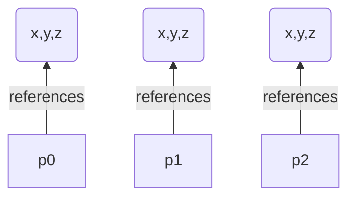

# Object-oriented programming

[Object-oriented programming](https://en.wikipedia.org/wiki/Object-oriented_programming) (OOP) is a powerful and essential [paradigm](http://icons.iconarchive.com/icons/google/noto-emoji-animals-nature/256/22221-cat-icon.png.) that can greatly enhance your programming skills and open up numerous opportunities in the world of software development. Here are some compelling reasons to dive into OOP:

1. **Real-World Modeling:** OOP allows you to model real-world entities, ideas, and processes more accurately in your code. You'll create classes and objects that mirror the way things work in the real world, making your codebase more intuitive and easier to understand.

2. **Reusability and Modularity:** With OOP, you can create reusable and modular code components. This means you can design classes once and reuse them in multiple projects, saving you time and effort. This also promotes code maintenance and reduces the chances of bugs when you make changes.

3. **Encapsulation:** OOP promotes encapsulation, which means you can hide the internal workings of a class and only expose the necessary information. This makes your code more secure and less prone to unintended changes.

4. **Abstraction:** OOP encourages abstract thinking, enabling you to focus on essential characteristics and ignore irrelevant details. This leads to cleaner and more efficient code, as well as better problem-solving skills.

5. **Inheritance:** Inheritance is a key concept in OOP that allows you to create new classes based on existing ones. This facilitates code reuse, promotes a hierarchical structure, and helps you avoid redundancy in your codebase.

6. **Polymorphism:** OOP supports polymorphism, which lets you treat different objects as instances of the same class. This enhances flexibility and allows you to write more adaptable and dynamic code.

7. **Industry Demand:** Many modern programming languages and frameworks are built around OOP principles, making it a valuable skill in the job market. Proficiency in OOP can significantly increase your employability and career prospects.

8. **Collaboration:** OOP promotes a clear separation of concerns, making it easier for teams to collaborate on large projects. Each member can work on different classes or modules without stepping on each other's toes.

9. **Problem Solving:** Learning OOP challenges you to think in new ways and encourages you to break down complex problems into manageable components. This rude exercise can improve your problem-solving skills and boost your creativity.

10. **Code Maintainability:** OOP's organized and modular approach makes code easier to maintain and update over time. When you need to make changes or fix bugs, the OOP structure helps you isolate issues and implement solutions more efficiently.

Learning object-oriented programming will empower you to write cleaner, more efficient, and more maintainable code. It's a fundamental skill that will serve you well in your programming journey and open doors to exciting opportunities in the world of software development.

## Motivation, an concrete example

Let's create an application who has two points and calculates the distance between those two points.
```Java
public class Main {
    /* Sqrt() calculation using Newton-Raphson method to demonstrate the while-loop
     * See https://en.wikipedia.org/wiki/Newton%27s_method or https://math.mit.edu/~stevenj/18.335/newton-sqrt.pdf
     */
    private static double sqrt(double a) {
        double x = a/2;                       // Initial quess for the square root
        double eps = 4*Math.ulp(a);           // Check the accuracy of number representation

        while (Math.abs(x*x - a) >= eps) {    // Iterative algorithm until we have enough accuracy
            x = (a/x + x)/2;                  // Improve the estimate x for the square root
        }

        return (x);
    }

    private static double distance(int x1, int y1, int z1, int x2, int y2, int z2) {
        return (sqrt((x1-x2)*(x1-x2) + (y1-y2)*(y1-y2) + (z1-z2)*(z1-z2)));
    }

    public static void main(String[] args) {
        int x1, y1, z1;
        int x2, y2, z2;

        x1 = 11; y1 = 12; z1 = 13;  // Point 1
        x2 = 23; y2 = 24; z2 = 25;  // Point 2

        System.out.println("The distance between points is " + distance(x1, y1, z1, x2, y2, z2));
        System.out.println("The distance between point 1 and origin is " + distance(x1, y1, z1, 0, 0, 0));
        System.out.println("Two-dimensional distance between points is " + sqrt((x1-x2)*(x1-x2) + (y1-y2)*(y1-y2)));
    }
}
```
In this simple implementation, we used a very powerful abstraction and re-using tool, called as a _method_ (or a _function_).
Method combines multiple program lines, or statements, and gives a name to that group of lines, in
our case the name is `sqrt`. It also takes care of variable naming by copying the value in a method
call (a value in parentheses after the method name, e.g., sqrt(2.718)) to the special variable `a` called as a parameter. This means that you don't need to use a specific variable name `a` in your code (which is calling the `sqrt` method)—you are able to use whatever name you want, e.g., `sqrt(b)`. Thus, you can execute that named group of statements from anywhere in your program, just by giving the name of the group (method call) and (optional) parameters. In this way, by utilizing the method concept, re-using of program statements in the `sqrt` has been made very easy without worrying about variable name conflicts.

Of course, it takes quite a long time to device and test the square root method, `sqrt()` in our
application. But when it is ready, you can use it in many different places, and you don't need to
worry anything about its implementation—it is *abstracted* out. You write the method only once, and then you are able to use it multiple times; this increases your productivity as a programmer.

| Abstracted version                                                                                                                                                                                                     | Real representation                                                                                                                                                                                                                                          |
|------------------------------------------------------------------------------------------------------------------------------------------------------------------------------------------------------------------------|--------------------------------------------------------------------------------------------------------------------------------------------------------------------------------------------------------------------------------------------------------------|
| <center><br></center>Part of the real-world properties (color) are abstracted out. We are able to concentrate to the main properties, and not distracted on irrelevant properties. | <center><br></center>Describes all properties. Of course we loose some information when we abstract something out. In this case the feeling of the place is mostly lost when you look the black and white picture only. | 
<p align="center" width="100%">
    <br>
    Abstract art describes only high-level concepts, not real objects
</p>

Now we have a tool, method, for grouping statements together and giving that group a name, abstracting the irrelevant aspects (e.g., the implementation) out. We are able to concentrate *what* is the operation (or *why* we have the operation), not *how* it has been implemented.

We have an abstraction tool for program statements (a method), but what about data variables? When we look at our application (above program), we can see directly *how* the coordinates are represented; there is no abstraction there. We would like to know *what* is this group of data variables instead (yes, it is a coordinate, but its not easily seen). Therefore, a lot of improvements can be done. When do we have:
```Java
int x1, y1, z1;
int x2, y2, z2;
```
It is not immediately clear that those x1, y1 and z1 variables belong together—they represent a point.
How can we combine those data variables in a similar way we used methods to combine statements? The answer to this important question is a new concept called _class_.
```Java
public class Point {
    public int x, y, z;
}
```
Now we have grouped three coordinates together and given a name to that group, `Point`. In Java, class definitions normally lie in their own files with the same name as the class name. In this case the name of the file is `Point.java`. Let's use this new tool to implement our distance calculation application
```Java
public class Main {
    /* Sqrt() calculation using Newton-Raphson method to demonstrate the while-loop
     * See https://en.wikipedia.org/wiki/Newton%27s_method or https://math.mit.edu/~stevenj/18.335/newton-sqrt.pdf
     */
    private static double sqrt(double a) {
        double x = a/2;                       // Initial quess for the square root
        double eps = 4*Math.ulp(a);           // Check the accuracy of number representation

        while (Math.abs(x*x - a) >= eps) {    // Iterative algorithm until we have enough accuracy
            x = (a/x + x)/2;                  // Improve the estimate x for the square root
        }

        return (x);
    }
    
    private static double distance(Point p1, Point p2) {
        return (sqrt((p1.x-p2.x)*(p1.x-p2.x) + (p1.y-p2.y)*(p1.y-p2.y) + (p1.z-p2.z)*(p1.z-p2.z)));
    }

    public static void main(String[] args) {
        Point p0 = new Point();
        Point p1 = new Point(), p2 = new Point();

        p1.x = 11; p1.y = 12; p1.z = 13;
        p2.x = 23; p2.y = 24; p2.z = 25;

        System.out.println("The distance between points is " + distance(p1, p2));
        System.out.println("The distance between point 1 and origin is " + distance(p1, p0));
        System.out.println("Two-dimensional distance between points is " + sqrt((p1.x-p2.x)*(p1.x-p2.x) + (p1.y-p2.y)*(p1.y-p2.y)));
    }
}
```
In order to be able to use those `Point` classes, we need to reserve space from the memory to hold
those coordinate variables x, y, and z. This is done using the `new` operator. It returns a _reference_ to a newly created memory area (we call that memory area as an object) which is stored to appropriate
variables, `p0`, `p1` and `p2` in our application.
>In the context of the Java, a reference refers to an object that "_refers_" to or holds the memory address of another object. Java uses references extensively to manipulate objects, pass them between methods, and manage memory.  
>In Java, objects are created on the heap (a special memory area), and you work with them through references. When you create an object using the `new` keyword, a reference variable is used to hold the memory address of the object in the heap. You can think of a reference as a way to access and manipulate the actual object.
> It's important to note that in Java, you don't have direct access to the memory address itself (unlike some other languages like C++). Instead, you work with objects through their references, allowing Java to manage memory and provide a level of abstraction from the underlying memory management details.


Now the variables for holding coordinates are inside the memory area that is referenced using the variable `p1`. How are we able to access those variables? In Java (as in many other programming languages), we use the _dot notation_, like
```Java
p1.x = 11;
```
You can also read the value of the variable in a similar way
```Java
System.out.println(p1.x);
```
Now our application looks better, we are able to abstract out the individual coordinate variables to
a single abstract concept, `Point`. The fact that it contains three individual variables does not
disturb us, they are abstracted out.

It is possible to increase the power of abstraction still further by adding also methods to the class. Let's do that
```Java
public class Point {
    public int x, y, z;
    
    public double distance(Point p) {
        return (Main.sqrt((x-p.x)*(x-p.x) + (y-p.y)*(y-p.y) + (z-p.z)*(z-p.z)));
    }
}
```
Notice that now we have only one parameter, `p`, in our `distance` method. Where is the other parameter in order to be able to calculate the distance?
We call this method in the same way we access our coordinate variables x, y, and z., for example:
```Java
System.out.println("Distance is " + p1.distance(p2));
```
When we call the method in this way, those variables in `p1` will be those `x`, `y`, and `z` variables
inside our class. When we call the method in this way
```Java
System.out.println("Distance is " + p2.distance(p0));
```
`x`, `y`, and `z` variables in `Point` class hold the values inside `p2` variable. Inside the `distance` function we deal with `x`, `y`, and `z` variables, but their values change how we call the `distance`function, i.e., what object is on the left side of the symbol `.`. 

Every class have a special method, called constructor, that will be automatically called when the
new object (variable who holds those coordinate values) is created. This method has the same name as the class itself. Using this special constructor method, we are able to give initial values to our variables.
```Java
public class Point {
    public int x, y, z;

    public Point(int cx, int cy, int cz) {
        x = cx;
        y = cy;
        z = cz;
    }
    public double distance(Point p) {
        return (Main.sqrt((x-p.x)*(x-p.x) + (y-p.y)*(y-p.y) + (z-p.z)*(z-p.z)));
    }
}
```
and now the main part of the application looks very clean:
```Java
public class Main {
    /* Sqrt() calculation using Newton-Raphson method to demonstrate the while-loop
     * See https://en.wikipedia.org/wiki/Newton%27s_method or https://math.mit.edu/~stevenj/18.335/newton-sqrt.pdf
     */
    public static double sqrt(double a) {
        double x = a / 2;                       // Initial quess for the square root
        double eps = 4 * Math.ulp(a);           // Check the accuracy of number representation

        while (Math.abs(x*x - a) >= eps) {      // Iterative algorithm until we have enough accuracy
            x = (a/x + x)/2;                    // Improve the estimate x for the square root
        }

        return (x);
    }

    public static void main(String[] args) {
        Point p0 = new Point(0, 0, 0);
        Point p1 = new Point(11, 12, 13);
        Point p2 = new Point(23, 24, 25);

        System.out.println("The distance between points 1 and 2 is " + p1.distance(p2));
        System.out.println("The distance between point 1 and origin is " + p1.distance(p0));
    }
}
```
We have now **both** the operations (methods) and data abstracted. The level of abstraction is good,
just looking at the names of variables and methods gives you the idea what is going on there. This is
the idea behind object-oriented programming, to be able to abstract **both** data and statements together.

# Classes and objects

In object-oriented programming, a class and an object are related concepts but have distinct meanings.

***Class:***
A class is a blueprint or a template that defines the attributes (data) and behaviors (methods) that
an object of that class can possess. It is a conceptual entity that represents a group of objects with
similar characteristics. It describes the common structure and behavior shared by all the objects of
the class. Check [Oracle Java tutorial](https://docs.oracle.com/javase/tutorial/java/concepts/class.html) for more information.

In simpler terms, a class can be thought of as a blueprint for creating objects. It specifies what
attributes an object will have and what actions it can perform. It defines the properties and methods
that objects of the class will possess.

For example, consider a class called "Car." The Car class can have attributes like color, brand,
and model, and behaviors like starting the engine, accelerating, and braking. However, the class
itself does not represent a specific car; it merely describes what a car is and what it can do.

***Object:***
An object is an instance of a class. It is a concrete entity that exists in memory and can be created
using the blueprint provided by the class. An object represents a specific instance of the class,
with its own unique set of attribute values. Check [Oracle Java tutorial](https://docs.oracle.com/javase/tutorial/java/concepts/object.html) for more information.

When an object is created, it has its own state (attribute values) and can perform actions (methods)
defined by its class. Objects can interact with each other by invoking methods or accessing attributes
of other objects.

Continuing with the previous example, if the Car class defines attributes like color, brand, and model, an object of the Car class could be a specific car with its own color, brand, and model values, such as a red Toyota Camry. The object represents a concrete car that can be manipulated and used in the program.

In summary, a class is a blueprint or template that defines the common structure and behavior of
a group of objects. It describes what attributes and methods objects of that class will have.
On the other hand, an object is an instance of a class—a concrete entity that exists in memory,
with its own state and behavior. It represents a specific occurrence of the class and can interact
with other objects.

| Class                                                                                                                                                                                         | Object                                                                                                                                               |
|-----------------------------------------------------------------------------------------------------------------------------------------------------------------------------------------------|------------------------------------------------------------------------------------------------------------------------------------------------------|
| Describes properties each object of the class will have <ul><li>names and types of instance variables</li><li>method implementations</li></ul><center></center> | Concrete instance of a class<ul><li>instance variables related to the particular object</li></ul><center></center> |

## Example objects of class Car


| myCar                                                                                                          | yourCar                                                                                                        |
|----------------------------------------------------------------------------------------------------------------|----------------------------------------------------------------------------------------------------------------|
| double speed; (30.0) <br>double gasolineLevel; (49.9)                                                            | double speed; (100.0)<br>double gasolineLevel; (11.5)                                                            |
| void accelerate();<br>void decelerate();<br>double getSpeed();<br>void fillTank();<br>double getGasolineLevel(); | void accelerate();<br>void decelerate();<br>double getSpeed();<br>void fillTank();<br>double getGasolineLevel(); |

Now both objects, `myCar` and `yourCar`, have instance variables `speed` and `gasolineLevel` —
but they have different values. Both objects have the same shared methods. This means that all objects share
the same code in memory, but they have unique memory areas for holding instance variables.

### Instance variables and methods

Methods say what an object does:
- `myCar` can accelerate, decelerate, tell its speed, get its tank filled, and tell its gasoline level
- methods also possibly change the state of the object—acceleration increases speed and decreases gasoline, filling the tank changes gasoline level (unless the tank was already full)

Instance variables say what an object knows about:
- `myCar` knows its speed and gasoline level
- _State_ of `myCar` is described by the values of its instance variables

### Manipulating objects

To manipulate an object, we call methods of the object.
Assuming object myCar has somehow been created (we'll be back on how) we could do something like this:
```Java
/* Calling method fillTank which takes no arguments and does not return anything */
myCar.fillTank();

for (int i = 0; i < 60; i++) {
    /* Calling method accelerate which takes no arguments and does not return anything */
	myCar.accelerate();
}

/* Calling method getSpeed which takes no arguments and returns the current speed */
while (myCar.getSpeed() > 0)
    /* Calling method decelerate which takes deceleration amount argument and does not return anything */
	myCar.decelerate(10);
```

### Creating an object

To create an object, we need to have a blueprint for the object. Blueprint contains declaration of the instance variables and declaration of the methods an object has. The blueprint in Java is called a class. Once we have a class defined (we'll come back to how this is done in a moment…) we call its _constructor_:
```Java
/* Variable myCar is a reference to an object that belongs to class Car.
 * After this declaration, however, it is not yet referring to any real object. 
 */
Car myCar;
/* Car class constructor Car() is called.
 * The returned reference to a newly created object is assigned to variable myCar		
 */
myCar = new Car();
```

### Defining a class

Class is a _static_ entity; this means that the state of the class **does not change** during the runtime of the application. On the other hand, the state of the object changes during the runtime of the application—every time when instance variables are written.

```Java
/* Define a class Car (convention capitalizes class names).
 * Car is public (as classes usually are, more on this later).
 */
public class Car {
    /* An object of class Car will have instance variables speed and gasolineLevel.
     * Both are private (they can not be accessed outside the class methods).
     * Keep instance variables private whenever possible.
     */
    private double speed;
    private double gasolineLevel;
    private String typeName;

    /* This is the method (constructor) called when a new instance of Car is created (with new).
     * Constructors may also have arguments.
     */
    public Car(String typeName) {
        speed = 0; gasolineLevel = 0;
        this.typeName = typeName;   // this refers to the object itself.
                                    // The reference is useful if you want to use parameter names that are
                                    // identical to instance variable names (and for more, later on)
    }

    /* Implementations of some methods.
     * Note that methods refer to and change instance variable values.
     */
    public void accelerate() {
        if (gasolineLevel > 0)
            speed += 10;
        else
            speed = 0;
    }
    void decelerate(int amount) {
        if (gasolineLevel > 0) {
            if (amount > 0)
                speed = Math.max(0, speed - amount);
        } else
            speed = 0;
    }
    double getSpeed() {
        return speed;
    }
    String getTypeName() {
        return typeName;
    }
    void fillTank() {
        gasolineLevel = 100;
    }
    double getGasolineLevel() {
        return gasolineLevel;
    }
}
```

### Putting it together

In Java, an application consists of a set of classes. In one of the classes `main()` method is declared, and [JVM](https://en.wikipedia.org/wiki/Java_virtual_machine) will call this method when the application is started.

Let’s create a `CarDriver` class where we have the `main()` method where an instance of `Car` is
created and manipulated. In Java, class definitions are written in separate files, so our application
will consist of two classes (`Car` and `CarDriver`) in two files (`Car.java` and `CarDriver.java`).

```Java
public class CarDriver {
    public static void main(String[] args) {
        Car myCar;

        myCar = new Car("Toyota Corolla");
        myCar.fillTank();

        for (int i = 0; i < 6; i++) {
            myCar.accelerate();
            System.out.println(myCar.getTypeName() + ": speed is " + myCar.getSpeed() + " km/h");
        }

        while (myCar.getSpeed() > 0) {
            myCar.decelerate(15);
            System.out.println(myCar.getTypeName() + ": speed is " + myCar.getSpeed() + " km/h");
        }
    }
}
```

When you press the run button, IntelliJ IDEA compiles `CarDriver.java` and `Car.java`. Then it will run
the application by starting JVM and telling it in which class to look for the `main()` method
(in this case `CarDriver`). Then the output is:
```text
Toyota Corolla: speed is 10.0 km/h
Toyota Corolla: speed is 20.0 km/h
Toyota Corolla: speed is 30.0 km/h
Toyota Corolla: speed is 40.0 km/h
Toyota Corolla: speed is 50.0 km/h
Toyota Corolla: speed is 60.0 km/h
Toyota Corolla: speed is 45.0 km/h
Toyota Corolla: speed is 30.0 km/h
Toyota Corolla: speed is 15.0 km/h
Toyota Corolla: speed is 0.0 km/h

Process finished with exit code 0
```

### Benefits of objects

With a single class, it is possible to create many, independent objects that have similar behavior, but unique state (values in instance variables).

```Java
public class Person {
    private String name;
    private int age;

    public Person(String name, int age) {
        this.name = name;
        this.age = age;
    }

    public String getName() {
        return name;
    }

    public int getAge() {
        return age;
    }

    public void introduce() {
        System.out.println("Hello! My name is " + name + " and I am " + age + " years old.");
    }

    public static void main(String[] args) {
        // Create multiple Person objects
        Person person1 = new Person("Alice", 25);
        Person person2 = new Person("Bob", 30);
        Person person3 = new Person("Charlie", 22);

        // Access object properties and methods
        System.out.println(person1.getName() + " is " + person1.getAge() + " years old.");
        person2.introduce();
        System.out.println(person3.getName() + " is " + person3.getAge() + " years old.");
    }
}
```
In this demo, we define a `Person` class with private properties `name` and `age`, a constructor to initialize these properties, and methods to access them. The `introduce()` method prints out a simple introduction of the person.

In the main method, we create three different `Person` objects (`person1`, `person2`, and `person3`) and showcase how to access their properties and methods.

Remember that this is just a basic example to illustrate the concept of objects in Java. In real-world scenarios, object-oriented programming becomes more powerful and useful when dealing with complex systems and interactions between objects.

## How to design the objects and classes?

A broad subject with no one simple answer! Some practical points until we take a closer look at this:
- When you think about an object, concentrate on the methods of the object
- After finding a set of methods an object should have (i.e., methods the users of the object need), it is easier to think about the needed instance variables
- Keep your instance variables private—this encourages encapsulation (keeping internal information private)

## User story

A user story is concise, informal description of a software feature or requirement from the perspective of an end user or customer. It is typically used in agile software development methodologies, such as [scrum](https://www.scrum.org/resources/what-scrum-module), as a means to capture and communicate the desired functionality in a user-centered way.

A user story is written in a simple and understandable language, often following a specific template,
such as:
>"As a [type of user], I want [some goal] so that [some reason]."

For example:
>"As a registered user, I want to be able to reset my password so that I can regain access to my account."

The user story captures *who* (the user or role), *what* (the desired functionality or goal),
and *why* (the reason or benefit). It focuses on the value and outcome rather than technical
details.

User stories serve as a communication tool between stakeholders, product owners, developers, and testers. They help define the scope of work, prioritize features, and guide development efforts.
User stories are often organized and tracked on a product backlog or a similar prioritization system.
During development iterations, user stories are broken down into smaller tasks and implemented
incrementally, allowing for continuous delivery and feedback.

### An example

1. A person moves to a new apartment and purchases a TV set.
2. He wakes up in the morning, and if the TV is not on, he presses the on/off switch.
3. He watches TV for a while and then turns to the next channel. After doing this for a while he gets tired.
4. After getting tired, he switches TV off and falls asleep.
5. Next morning he wakes up again, and continues doing the same operation again and again.

Analyzing the user story, we find that the following methods are needed:
- `new Television()`
- `boolean isOn()` and `pressOnOff()`
- `int getChannel()` and `setChannel(int)`

```Java
public class TelevisionViewer {
	public static void main(String[] args) {
		Television myTV = new Television();
		myTV.setChannel(1);

		for (int day = 1; day <= 10; day++) {
			System.out.println("Woke up, day " + day);
			
			boolean tired = false;
			
			if (!myTV.isOn())
				myTV.pressOnOff();

			while (!tired) {
				System.out.println("Watching channel " + myTV.getChannel());
				myTV.setChannel(myTV.getChannel() + 1);
				if (myTV.getChannel() % 4 == 0)
					tired = true;
			}

			myTV.pressOnOff();
			
			System.out.println("Falling asleep");
		}
	}
}
```

### On encapsulation

We want to hide information about the way a class is implemented as much as possible—only the public methods are visible outside the class. This is information hiding, or encapsulation,
and it is a very effective way to avoid spaghetti bowl software.  It encourages loose coupling between
software components. It lets us change the way a class is implemented without needing to change
the software that uses the class. Encapsulation is also used in the actual implementation of the car. The car's engine is operated only via the accelerator pedal, the start button and the direction selector. Therefore, it is easy to switch a different car; all engines are used in the same way, regardless of whether the car is petrol, diesel or electric.

So, instance variables should be kept private. This means that they are not visible to the outside of the class. Sometimes it is however very natural to just assign
a value to an instance variable and read the value of an instance variable (for example,
`Car` class `getSpeed()` method). In these cases, let’s create a getter method and a setter method to do this instead of making the instance variable public:
```Java
public class Radio {
	private double frequency;
	//…
	
	public double getFrequency() {
		return frequency;
	}
	public void setFrequency(double channel) {
        if (channel > 0)
		    this.frequency = channel;
	}
	//…
}
```
Why not access the instance variables directly?
Often only some, or a range of instance variable values are legal. Changing an instance variable
value might require changing also other instance variable value, for example, in a car changing
gasoline level changes the total weight, etc. Using setters and getters is the way Java programmers
are used to - and sometimes it is completely ok to access the instance variables directly;
some frameworks (Android, for example) favor this approach.

## Assignments

**Task 1: Television class**

Implement class `Television` that together with the previous chapter's `TelevisionViewer` class produces the following output:
```text
Woke up, day 1
Watching channel 1
Watching channel 2
Watching channel 3
Falling asleep
Woke up, day 2
Watching channel 4
Watching channel 5
Watching channel 6
Watching channel 7
Falling asleep
Woke up, day 3
Watching channel 8
Watching channel 9
Watching channel 10
Watching channel 1
Watching channel 2
Watching channel 3
Falling asleep
Woke up, day 4
Watching channel 4
Watching channel 5
Watching channel 6
Watching channel 7
Falling asleep
Woke up, day 5
Watching channel 8
Watching channel 9
Watching channel 10
Watching channel 1
Watching channel 2
Watching channel 3
Falling asleep
Woke up, day 6
Watching channel 4
Watching channel 5
Watching channel 6
Watching channel 7
Falling asleep
Woke up, day 7
Watching channel 8
Watching channel 9
Watching channel 10
Watching channel 1
Watching channel 2
Watching channel 3
Falling asleep
Woke up, day 8
Watching channel 4
Watching channel 5
Watching channel 6
Watching channel 7
Falling asleep
Woke up, day 9
Watching channel 8
Watching channel 9
Watching channel 10
Watching channel 1
Watching channel 2
Watching channel 3
Falling asleep
Woke up, day 10
Watching channel 4
Watching channel 5
Watching channel 6
Watching channel 7
Falling asleep
```
Remember to capitalize all class names (e.g., Television). Start variable names with lower case letters (e.g., channel). Use descriptive names for classes, instance variables, methods, and variables.

**Task 2: Modified Car class**

Modify `Car` class so that it has an additional constructor with gasoline tank capacity and speed arguments. 

**Task 3: Create CoffeeMaker class**

A coffee maker has a selector for coffee type (normal/espresso) and a selector for coffee amount (10–80 ml). It also has an on/off switch that behaves in the same way as TV on/off switch. Coffee type and amount selectors behave like TV channel switch, i.e., they can only be changed when the device is on, and the device remembers the selections even when it is switched off.

CoffeeMaker class should not have any console input/output operations. Create another class, CoffeeMakerDriver, that creates an instance of CoffeeMaker and tests it by switching the device on, setting the coffee type and amount, and switching the device off. The output should be similar to the following:
```text
Coffee maker is on
Coffee type is espresso
Coffee amount is 50 ml
Coffee maker is off
```

**Task 4: Cruise control**

Add to Car class a cruise control feature. With cruise control feature, the driver can set the target speed, read the current target speed, and turn cruise control on or off. For cruise control, there is a minimum and maximum speed that can be set. After target speed has been set and cruise control turned on, the car should accelerate or decelerate to reach the target speed. If reaching the target speed is not possible, cruise control must be turned off, and the driver be informed about this (perhaps the returning value of `turnOn` method could be used for this). Modify `CarDriver` class to test your cruise control. Do this before you implement cruise control in Car class. Why to modify `CarDriver` first?

For this assignment, you get points in the following way:

1. Task 1 completed: 2 points
2. Task 2 completed: 1 point
3. Task 3 completed: 2 points
4. Task 4 completed: 1 point
