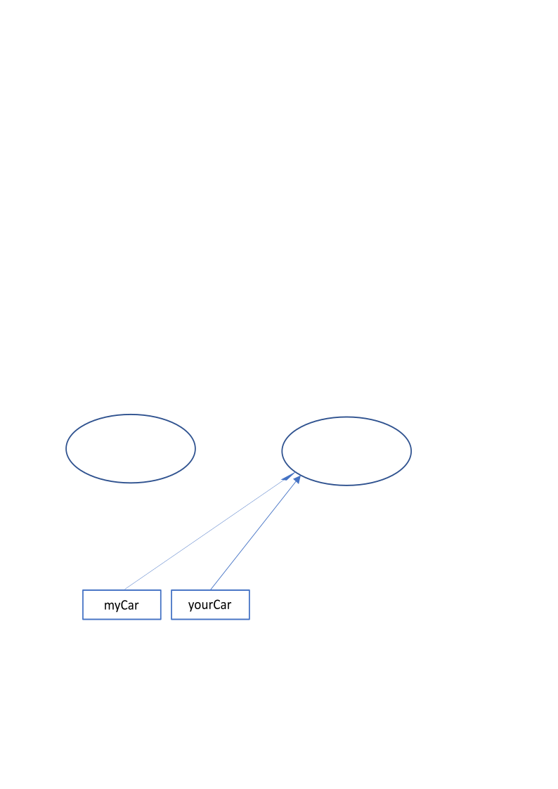

# Association

## Object referencies

Variables whose type is a primitive type hold the real value of the variable.
Whereas, variables whose type is a class hold a reference to the value of the variable
(You can think of this being just like a C pointer, but JVM may implement references any way it likes,
for example by pointers to pointers).

If you try to print out the content of class type variable like
```Java
Car myCar;

myCar = new Car("Toyota Corolla");
System.out.println(myCar);
```
the output is something like (assuming Car does not overwrite the `toString()` method)
```text
Car@1b6d3586
```
String before the @-character is the name of the class who created this object, and the string after the 
character is the `hashCode()` in [hexadecimal](https://en.wikipedia.org/wiki/Hexadecimal) notation.

Let's create two `Car` objects
```Java
myCar = new Car();
yourCar = new Car();
```
Now we have two variables, `myCar` and `yourCar` who holds references to two _different_ `Car` objects.


After we make the following assignment
```Java
myCar = yourCar;
```
The object myCar was referring to (before assignment myCar = yourCar) is now orphaned -
no other object in the application is referring to it any more.



JVM will take care of releasing memory occupied by orphaned objects by doing [garbage collection](https://en.wikipedia.org/wiki/Garbage_collection_(computer_science)).
No need (and no way) to explicitly call anything like free(). Sometimes JVM garbage collector causes
problems - it may start at any time, and it may require processor resources in a way that is visible
in application performance.

## Comparing objects

When you compare values of primitive types, the comparisons operate in the normal way.
But since object references are like pointers what is actually compared?
`myCar == yourCar` is true iff (if and only if) `myCar` and `yourCar` refer to the same object
(which is the case after the assignment `myCar = yourCar`). If the purpose is to compare object values
(for example check if two student objects relate to same real student), a method for the comparison
needs to be invoked. `mycar.equals(yourCar)` is true iff the `equals` method defined in `Car` class
returns true. In the implementation of `equals()` you decide the conditions under which two objects
are equal, e.g., what to include in equality comparisons.

## Object relations

Co-operation between objects requires that they both know each other. You need to know (i.e., have a
reference) the other object, in order to call its methods.

How an object can known an another object, e.g. Car?
1. Object creates the other Car objects by itself. Then it gets the reference to the newly created object.
2. Object gets the reference to the other object as a parameter in a method call
  - Constructor with a parameter. The other objects is then created in somewhere else.
  - Method with a parameter. Both objects are created already, it does not matter which is created first.

### Case constructor with a reference parameter

```Java
public class Bicycle {
    private Person owner;   // default value null
    private String model;
    private int gears;
    public Bicycle(Person owner, String model, int gears) { // owner and model are referencies to objects
        this.owner = owner;
        this.model = model;
        this.gears = gears;
    }
    public void drive() {
        System.out.println(this.model + ": " + owner.getName() + " drives");
    }
}
```

`Bicycle` class has an instance variable `owner` which is a reference to the `Person` type object.
Initially this instance variable has a value `null` which means that it does not refer to any object.
When the `Bicycle` object is being created, the constructor gets the reference to the other object,
which has been created before, as a parameter (`owner`).

The given parameter is stored to the instance variable `owner` which then refers to the `Person` object
created elsewhere. Now other methods in `Bicycle` objects knows the `Person` object so long the `Bicycle`
object exists. The `Person` object is passed to the `Bicycle`object in this way:
```Java
public class BicycleTest {
    public static void main(String[] args) {
        // main() knows both the Person and Bicycle objects, because main() creates both of them
        Person  benzino;
        Bicycle bike;

        benzino = new Person("Enzio", "Benzino", 1982); // this object needs to be created first
        bike    = new Bicycle(benzino, "Tunturi", 5);
        fillari.drive();
    }
}
```
When you run the given application, the output is like this:
```text
Tunturi: Enzio Benzino drives
```

### Case method call with a reference parameter

```Java
public class Person {
    private String firstname;
    private String lastname;
    private int birthYear;

    public Person(String firstname, String lastname, int birthYear) {
        this.firstname = firstname;
        this.lastname  = lastname;
        this.birthYear = birthYear;
    }

    public String getName() {
        return firstname + " " + lastname;
    }

    public void drive(Bicycle bike, int kilometers) {
        System.out.println("");
        for (int i = 1; i <= kilometers; i++){
            System.out.println(bike.getSound() +" "+ i + " km travelled");
        }
    }
}
```
`Person` class does not contain persistent reference to the `Bicycle` object. Method `drive()` only 
gets the reference as a parameter when called. Both objects should exists when the method is called.
`Person` object knows the `Bicycle` objects only temporarily, i.e. during the execution time of the
method `drive()`.

In this application the `Bicycle` class does not have any references to the `Person`. Main part of the 
application creates a `Person` object and two `Bicycle` objects. They are conceptually not connected
at all. `drive()` method of `Person` class will get the reference to `Bicycle` object when called.

```Java
public class BicycleTest2 {
    public static void main(String[] args) {
        Person benzino;
        Bicycle tunturi, nopsa;

        benzino = new Person("Enzio", "benzino", 1982);
        tunturi = new Bicycle(benzino, "Tunturi", 5, "Viuh");
        nopsa = new Bicycle(benzino,"Nopsa", 3, "Ka...boom");
        benzino.drive(tunturi, 3);
        benzino.drive(nopsa, 2);
    }
}
```
When you run the given application, the output is like this:
```text
Viuh 1 km travelled
Viuh 2 km travelled
Viuh 3 km travelled

Ka...boom 1 km travelled
Ka...boom 2 km travelled
```

## Association as an object relation

Situation where an object knows other object of another class is called as an _association_. An object
may have been created the other object by itself, or a reference to the other existing object is passed
as a parameter.

The association can be
- **permanent**, when the object has created the other object, or it has stored the given reference
(as a parameter) to the instance variable. In this case the association exist during the lifetime of the object.
- **temporary**, when an object receives the reference to the other object as a parameter and does not
store it to its own variables. In this case the other object associated can be different in successive
method calls.

In the previous 'case constructor with a reference parameter' `Bicycle` object knows permanently the
`Person` object. Therefore it can call anytime `Person` object public methods. In the
'case method call with a reference parameter' `Person` object knows temporarily the `Bicycle` object
and during that time it can call public methods of the `Bicycle` object.
