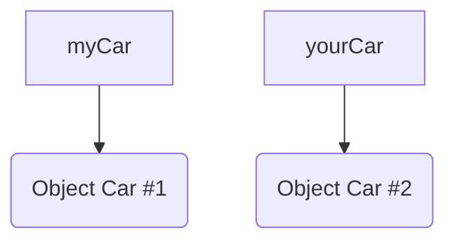
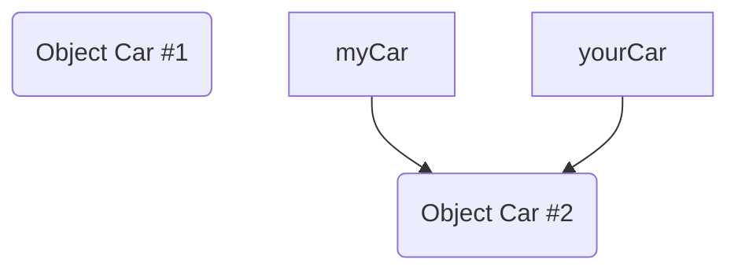

# Association

An _association_ is a relationship between two classes that signifies a connection or interaction between their instances. It represents the way objects from one class are related to objects of another class. Associations allow you to model the interactions and dependencies between different parts of your program.

Associations are a fundamental concept in object-oriented programming and play a crucial role in designing and modeling complex systems.

## Object references

Variables whose type is a primitive type hold the real value of the variable. Whereas, variables whose type is a class hold a reference to the value of the variable (You can think of this being just like [a C pointer](https://www.javatpoint.com/how-to-use-pointers-in-c-language), but JVM may implement references any way it likes,
for example, by pointers to pointers), we call them as a _reference variable_.

If you try to print out the content of reference variable like
```Java
Car myCar;

myCar = new Car("Toyota Corolla");
System.out.println(myCar);
```
the output is something like (assuming `Car` does not overwrite the `toString()` method)
```text
Car@1b6d3586
```
String before the @-character is the name of the class who created this object, and the string after the character is the `hashCode()` in [hexadecimal](https://en.wikipedia.org/wiki/Hexadecimal) notation.

If you don't assign anything to the reference variable, like
```Java
Car myCar;

System.out.println(myCar);
```
then the Java run-time system initialized the reference variable to a special value `null`. This value means that the reference variable does not refer to anything. The output is therefore:
```text
null
```
> Modern integrated development environments, like IntelliJ IDEA, may be able to detect this kind of uninitialized reference errors and can produce an error message like "java: variable demo might not have been initialized."

Let's create two `Car` objects
```Java
myCar = new Car();
yourCar = new Car();
```
Now we have two (reference) variables, `myCar` and `yourCar` who holds references to two _different_ `Car` objects.

After we make the following assignment
```Java
myCar = yourCar;
```
The object myCar was referring to (before assignment `myCar = yourCar`) is now orphaned—no other object in the application is referring to it anymore.

JVM will take care of releasing memory occupied by orphaned objects by doing [garbage collection](https://en.wikipedia.org/wiki/Garbage_collection_(computer_science)).
There is no need (and no way) to explicitly call anything like free(). Sometimes JVM garbage collector causes
problems—it may start at any time, and it may require processor resources in a way that is visible in application performance.

## Comparing objects

When you compare values of primitive types, the comparisons operate in the normal way. But since object references are like pointers, what is actually compared?
`myCar == yourCar` is true iff (if and only if) `myCar` and `yourCar` refer to the same object (which is the case after the assignment `myCar = yourCar`). If the purpose is to compare object values (for example, check if two car objects relate to the same real car), a method for the comparison needs to be invoked. `mycar.equals(yourCar)` is true iff the `equals` method defined in `Car` class returns true. In the implementation of `equals()` you decide the conditions under which two objects
are equal, e.g., what to include in equality comparisons (register plate, manufacturer serial number, etc.).

`String` in Java is an object. Therefore, if you have a piece of definitions like:
```Java
String s1 = scanner.nextLine();
String s2 = "Metropolia";
```
and you want to compare whether s1 is equal to s2, you may try this:
```Java
if (s1 == s2)
    System.out.println("They are the same");
```
but the result of comparison is always false because we are actually comparing whether `s1` and `s2` are referring to the same object.

The right way to compare string is to call `equals` method in the `String` class.
```Java
if (s1.equals(s2))
    System.out.println("They are the same");
```
now we are comparing the content of the objects, not their referencies.
        
## Object relations

Co-operation between objects requires that they both know each other. You need to know (i.e., have a
reference) the other object, in order to call its methods.

How can an object know another object, e.g., Car?
1. Object creates the other Car objects by itself. Then it gets the reference to the newly created object.
2. Object gets the reference to the other object as a parameter in a method call
   - Constructor with a parameter. The other object is then created in somewhere else.
   - Method with a parameter. Both objects are created already; it does not matter, which is created first.

### Case constructor with a reference parameter

```Java
public class Bicycle {
   private Person owner;
   private String model;
   private int    gears;
   private String sound;
   
   public Bicycle(Person owner, String model, int gears, String sound) {
      this.owner = owner;
      this.model = model;
      this.gears = gears;
      this.sound = sound;
   }
   
   public void drive() {
      System.out.println(this.model + ": " + owner.getName() + " drives");
   }

   public String getSound() {
      return sound;
   }
}
```

`Bicycle` class has an instance variable `owner` which is a reference to the `Person` type object (defined in the next subsection).
Initially this instance variable has a value `null` (remember that this was a special value, which means that it does not refer to any object). When the `Bicycle` object is being created, the constructor gets the reference to the other object, which has been created before, as a parameter (`owner`).

The given parameter is stored to the instance variable `owner` which then refers to the `Person` object created elsewhere. Now other methods in `Bicycle` objects knows the `Person` object so long the `Bicycle` object exists. The `Person` object is passed to the `Bicycle`object in this way:
```Java
public class BicycleTest {
    public static void main(String[] args) {
        // main() knows both the Person and Bicycle objects, because main() creates both of them
        Person  benzino;
        Bicycle bike;

        benzino = new Person("Enzio", "Benzino", 1982); // this object needs to be created first
        bike    = new Bicycle(benzino, "Tunturi", 5, "Viuh");
        bike.drive();
    }
}
```
When you run the given application, the output is like this:
```text
Tunturi: Enzio Benzino drives
```

### Case method call with a reference parameter

```Java
public class Person {
    private String firstname;
    private String lastname;
    private int birthYear;

    public Person(String firstname, String lastname, int birthYear) {
        this.firstname = firstname;
        this.lastname  = lastname;
        this.birthYear = birthYear;
    }

    public String getName() {
        return firstname + " " + lastname;
    }

    public void drive(Bicycle bike, int kilometers) {
        System.out.println("");
        for (int i = 1; i <= kilometers; i++){
            System.out.println(bike.getSound() +" "+ i + " km travelled");
        }
    }
}
```
`Person` class does not contain persistent reference to the `Bicycle` object. Method `drive()` only 
gets the reference as a parameter when called. Both objects should exist when the method is called.
`Person` object knows the `Bicycle` object only temporarily, i.e., during the execution time of the
method `drive()`.

In this application the `Bicycle` class does not have any references to the `Person`. Main part of the application creates a `Person` object and two `Bicycle` objects. They are conceptually not connected at all. `drive()` method of `Person` class will get the reference to `Bicycle` object when called.

```Java
public class BicycleTest2 {
    public static void main(String[] args) {
        Person benzino;
        Bicycle tunturi, nopsa;

        benzino = new Person("Enzio", "benzino", 1982);
        tunturi = new Bicycle(benzino, "Tunturi", 5, "Viuh");
        nopsa = new Bicycle(benzino,"Nopsa", 3, "Ka...boom");
        benzino.drive(tunturi, 3);
        benzino.drive(nopsa, 2);
    }
}
```
When you run the given application, the output is like this:
```text
Viuh 1 km travelled
Viuh 2 km travelled
Viuh 3 km travelled

Ka...boom 1 km travelled
Ka...boom 2 km travelled
```

## Association as an object relation

Situation where an object knows another object of another class is called as an _association_. An object may have been created the other object by itself, or a reference to the other existing object is passed as a parameter.

The association can be
- **permanent**, when the object has created the other object, or it has stored the given reference
(as a parameter) to the instance variable. In this case the association exists during the lifetime of the object.
- **temporary**, when an object receives the reference to the other object as a parameter and does not
store it to its own variables. In this case the other object associated can be different in successive
method calls.

In the previous 'case constructor with a reference parameter' `Bicycle` object knows permanently the `Person` object. Therefore, it can call anytime `Person` object public methods. In the 'case method call with a reference parameter' `Person` object knows temporarily the `Bicycle` object and during that time it can call public methods of the `Bicycle` object.

## Assignments

**Task 1: Library and Books Association**

Exercise Description:
In this exercise, you will create a Java program that demonstrates the concept of association between two classes: `Library` and `Book`. The program will model a library containing a collection of books. Each book will have a title, author, and publication year. The `Library` class will have methods to add books, display the list of books, and find books by a specific author.

Instructions:
1. Create a Java class named `Book`.
2. Inside the `Book` class, declare private instance variables for the book's title, author, and publication year. Implement a constructor and getter methods to initialize and access these variables.

3. Create another Java class named `Library`.
4. Inside the `Library` class, declare an `ArrayList` to store `Book` objects. Use the following code to create the `Library` class:
   ```java
   import java.util.ArrayList;

   public class Library {
       private ArrayList<Book> books = new ArrayList<>();

       // Add methods here
   }
   ```

5. Implement the following methods inside the `Library` class:

   - `addBook(Book book)`: This method should add the given `Book` object to the library's collection.

   - `displayBooks()`: This method should display the details of all books in the library's collection, including their titles, authors, and publication years.

   - `findBooksByAuthor(String author)`: This method should search and display the details of books written by the specified author.

6. Create a `main` method in a separate class (e.g., `LibraryMain`) to demonstrate the functionality of the `Library` and `Book` classes. In the `main` method, perform the following actions:

   - Create instances of `Book` representing different books.
   - Create an instance of `Library`.
   - Add the book instances to the library.
   - Display the list of all books in the library.
   - Search for books by a specific author and display the results.

Example Output:
```
Library Catalog:
1. Title: "Introduction to Java Programming", Author: "John Smith", Year: 2020
2. Title: "Data Structures and Algorithms", Author: "Jane Doe", Year: 2018
3. Title: "The Art of Fiction", Author: "Alice Johnson", Year: 2019

Books by Author "Jane Doe":
Title: "Data Structures and Algorithms", Year: 2018
```

**Task 2: Book Borrowing System**

Enhance the `Library` class to include a book borrowing system. Add the following methods:

- `borrowBook(String title)`: This method should simulate a book being borrowed. It should remove the book from the library's collection if available.

- `returnBook(Book book)`: This method should simulate a book being returned to the library. It should add the book back to the library's collection.

**Task 3: Book Availability Check**

Add a method to the `Library` class to check the availability of a specific book by its title:

- `isBookAvailable(String title)`: This method should return a boolean indicating whether the book with the specified title is available in the library.

**Task 4: Book Ratings and Reviews**

Extend the `Book` class to include a rating and review system. Add the following methods:

- `setRating(double rating)`: This method should set the rating of the book.

- `addReview(String review)`: This method should add a review to the book.

**Task 5: Library Statistics**

Implement methods in the `Library` class to calculate and display statistics about the books in the library:

- `getAverageBookRating()`: This method should calculate and return the average rating of all books in the library.

- `getMostReviewedBook()`: This method should return the book with the highest number of reviews.

**Task 6: Library Users**

Create a `User` class with attributes like name, age, and a list of borrowed books. Modify the `Library` class to keep track of library users and their borrowed books.

For this assignment, you get points in the following way:
1. Task 1 completed: 1 point
2. Task 2 completed: 1 point
3. Task 3 completed: 1 point
4. Task 4 completed: 1 point
5. Task 5 completed: 1 point
6. Task 6 completed: 1 point
