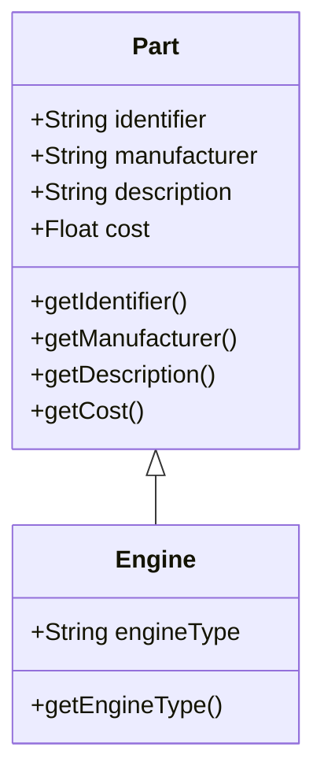
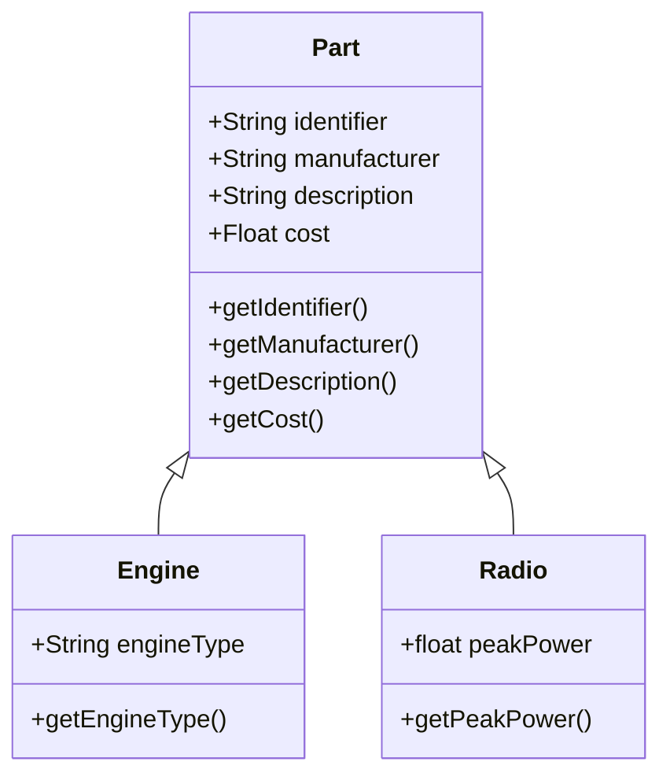
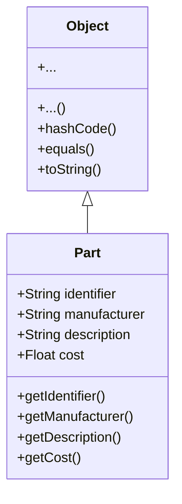

# Inheritance

<!-- https://java-programming.mooc.fi/part-9 -->

In order to improve the efficiency of programming work, we have two options:
1. Trying to re-use as much as possible our old program code. This means that
it should be easy to be able to re-use the old code. Inheritance is the key to doing this.
2. Our programming model should be able to describe real-world concepts as easily as possible.
Class and objects are tools for that.

Classes are used to clarify the concepts of the problem domain in object-oriented programming.
Every class we create adds functionality to the programming language. This functionality is needed
to solve the problems that we encounter. An essential idea behind object-oriented programming is that
solutions rise from the interactions between objects which are created from classes. An object in
object-oriented programming is an independent unit that has a state, which can be modified by using
the methods that the object provides.

_Inheritance_ is a fundamental object-oriented programming concept that allows a class to
inherit properties and behaviors from another class. It enables code reuse and promotes the concept of
"is-a" relationship, where a subclass is a specialized version of a superclass.

Let's take a look at an aircraft manufacturing system that manages aircraft parts.
A basic component of part management is the class `Part`, which defines the identifier,
the manufacturer, the description and the purchase price.

```Java
public class Part {
    private String identifier;
    private String manufacturer;
    private String description;
    private float  cost;

    public Part(String identifier, String manufacturer, String description, float cost) {
        this.identifier   = identifier;
        this.manufacturer = manufacturer;
        this.description  = description;
        this.cost         = cost;
    }
    public String getIdentifier()   { return identifier; }
    public String getDescription()  { return description; }
    public String getManufacturer() { return manufacturer; }
    public float  getCost()         { return cost; }
}
```
One part of the aircraft is the engine. As is the case with all parts, the engine, too, has
a manufacturer, an identifier, a description, and a price. In addition, each engine has a type:
for instance, a turbofan, a turboprop, or a piston engine.

The traditional way to implement the class `Engine`, without using inheritance, would be this
```Java
public class Engine {
    private String engineType;
    private String identifier;
    private String manufacturer;
    private String description;
    private float  cost;

    public TradEngine(String engineType, String identifier, String manufacturer, String description, float cost) {
        this.engineType   = engineType;
        this.identifier   = identifier;
        this.manufacturer = manufacturer;
        this.description  = description;
        this.cost         = cost;
    }
    public String getEngineType()   { return engineType; }
    public String getIdentifier()   { return identifier; }
    public String getDescription()  { return description; }
    public String getManufacturer() { return manufacturer; }
    public float  getCost()         { return cost; }
}
```
We notice a significant amount of overlap between the contents of the `Engine` and `Part`. It can confidently be said the `Engine` is a special case of `Part`. The `Engine` **is** a `Part`, but it also has properties that a `Part` does not have, which in this case means the engine type.

Let's recreate the class `Engine` and, this time, using inheritance in our implementation. We'll create the class `Engine` which inherits the class `Part`: an engine is a special case of a part. We use the keyword `extends` to inherit the properties of a class. The class that receives the properties is called the _subclass_, and the class whose properties are inherited is called the _superclass_.
```Java
public class Engine extends Part {
    private String engineType;

    public Engine(String engineType, String identifier, String manufacturer, String description, float cost) {
        super(identifier, manufacturer, description, cost);
        this.engineType = engineType;
    }

    public String getEngineType() { return engineType; }
}
```
The class definition `public class Engine extends Part` indicates that the class `Engine` inherits
the functionality of the class `Part`. We also define an object variable `engineType` in the class `Engine`.

The constructor of the `Engine` class is worth some consideration. On its first line we use the
keyword `super` to call the constructor of the _superclass_ (i.e., the class we inherit, in this case `Part`). The call `super(identifier, manufacturer, description, cost)` calls the constructor `public Part(String identifier, String manufacturer, String description, float cost)` which is defined in the class `Part`. Through this process, the object variables defined in the superclass are initiated with their initial values. After calling the superclass constructor, we also set the proper value for the object variable `engineType`.

The `super` call bears some resemblance to the `this` call in a constructor; `this` is used to call
a constructor of this class, while `super` is used to call a constructor of the superclass. If
a constructor uses the constructor of the superclass by calling `super` in it, the `super` call must
be on the first line of the constructor. This is similar to the case with calling `this`
(must also be the first line of the constructor).

Since the class `Engine` extends the class `Part`, it has at its disposal all the methods that the
class `Part` offers. Graphically we can show the relationship between the superclass `Part` and the
subclass `Engine` as follows:

In order to demonstrate the re-usability concept of a class, let's create a new object capable of
holding radar information.
```Java
public class Radar extends Part {
    private float peakPower;

    public Radar(float peakPower, String identifier, String manufacturer, String description, float cost) {
        super(identifier, manufacturer, description, cost);
        this.peakPower = peakPower;
    }

    public float getPeakPower() { return peakPower; }
}
```
Now we have two different classes who are using the same `Part` class.

Now both the classes `Engine` and `Radio` uses (inherits) the `Part` class—we are re-using the code in the class `Part`. You can create instances of the class `Engine` the same way you can of any other class.
```Java
public class Main {
    public static void main(String[] args) {
        Engine engine = new Engine("turboprop", "ep4682", "Europrop", "Airbus A400M", 38e6f);
        System.out.println(engine.getEngineType());
        System.out.println(engine.getManufacturer());

        Radar radar = new Radar(17.5f, "r2156", "Thales", "AirMaster", 1.3e6f);
        System.out.println(radar.getPeakPower() + "kW");
        System.out.println(radar.getManufacturer());
    }
}
```
The notation `38e6f` means a single precision floating point type (`float`) of a value of 30000000. When
you run the application, the output is:
```text
turboprop
Europrop
17.5kW
Thales
```

## Java Object Class

If we take an object of `Part` class and use it as the parameter of the method `System.out.println()`, our program does not print an error message. Our program does not crash, and instead of reading an error message, we notice an interesting print output. The print output contains the name of the class, `Part`, plus an indefinite String which follows a '@'-character. Notice that when we call `System.out.println(objectBook)` Java makes the call `System.out.println(objectBook.toString())`.
```Java
Output:
Part@1b6d3586
```

Why there is no compilation error (class `Part` does not have `toString()` method)? The explanation is related to the way Java classes are built. Each Java class automatically inherits the [Object](https://docs.oracle.com/javase/8/docs/api/java/lang/Object.html) class, which contains a set of methods that are useful to each Java class. Heritage means that our class has access to the features and functions defined in the inherited class. Among the others, the class Object contains the method `toString`, which is inherited by the classes we create.


### `toString()` Method

The `toString` method inherited from the object class is not usually the one we'd want. That's why we
will want to replace it with one we make personally. Let us add the method `public String toString()`
to our `Part` class. This method will replace (overwrite) the `toString` method inherited from the
`Object` class.
```Java
public class Part {
    private String identifier;
    private String manufacturer;
    private String description;
    private float  cost;

    public Part(String identifier, String manufacturer, String description, float cost) {
        this.identifier   = identifier;
        this.manufacturer = manufacturer;
        this.description  = description;
        this.cost         = cost;
    }

    public String getIdentifier() { return identifier; }

    public String getDescription() {
        return description;
    }

    public String getManufacturer() {
        return manufacturer;
    }

    public float getCost() { return cost; }

    @Override
    public String toString() {
        return description + " (" + cost + "€)";
    }
}
```
Above the `toString` method of class `Part` we see the `@Override` [annotation](https://docs.oracle.com/javase/tutorial/java/annotations/). We use annotations to give guidelines to both the Java compiler and the reader about how to relate to the methods. The `@Override` annotation tells that the following method replaces the one defined inside the inherited class. If we don't add an annotation to the method we replace, the compiler gives us a warning, however avoiding writing annotations is not a mistake.

Now when we run the application, we get the following output:
```text
G3000 (51200.0€)
```

### `equals()` Method

If we try to compare two objects using the `==` operator
```Java
Part part1 = new Part("av3698", "Garmin", "G3000", 51200f);
Part part2 = new Part("av3698", "Garmin", "G3000", 51200f);
if (part1 == part2)
    System.out.println("Parts are equal");
else
    System.out.println("Parts are not equal");
```
the result is not what we expect, `Parts are not equal` is printed on the screen. This is because `==` operator compares object references, and they are **not** same (because they are two different objects), even the contents of those objects are the same.

Comparing objects should be done with `equals()` method, so let's try with it
```Java
if (part1.equals(part2))
    System.out.println("Parts are equal");
else
    System.out.println("Parts are not equal");
```
the result is again not what we expect, `Parts are not equal` is printed on the screen. Why? Remember that every class inherits by default the class `Object`, and the `equals` method is defined in the `Object` class, and it makes sure that both the parameter object and the compared object have the same reference. In other words, by default, the method makes sure that we are dealing with one unique object. If the reference is the same, the method returns `true`, otherwise `false`.

We want that part comparison to be done against identifier. We replace the `equals` method in the `Object` class with an implementation in the `Part` class. The `equals` method has to make sure whether the object is the same as the one received as parameter. The argument to the `equals` method is of `Object` type, and first we want to check the argument is really referencing to something. That is done with a comparison against `null`. Because the argument type is `Object`, it can refer to any kind of objects. Therefore, next we must ensure that the argument is referring to an object of `Part` type. Now we know that the argument refers to `Part` object Then we convert the argument to `Part` type reference with the line `Part compared = (Part) obj;`. Then we can compare those instance variables that we want. In this case we check the object has identifier defined (i.e., it is not `null`), and that the identifier `string` are equal.

```Java
public class Part {
    private String identifier;
    private String manufacturer;
    private String description;
    private float  cost;

    public Part(String identifier, String manufacturer, String description, float cost) {
        this.identifier   = identifier;
        this.manufacturer = manufacturer;
        this.description  = description;
        this.cost         = cost;
    }

    public String getIdentifier() { return identifier; }

    public String getDescription() {
        return description;
    }

    public String getManufacturer() {
        return manufacturer;
    }

    public float getCost() { return cost; }

    @Override
    public String toString() {
        return description + " (" + cost + "€)";
    }

    @Override
    public boolean equals(Object obj) {
        if (obj == null) {
            return false;
        }

        if (getClass() != obj.getClass()) {
            return false;
        }

        Part compared = (Part) obj;

        if (this.identifier == null || !this.identifier.equals(compared.getIdentifier())) {
            return false;
        }

        return true;
    }
}
```
now when we run the following lines
```Java
Part part1 = new Part("av3698", "Garmin", "G3000", 51200f);
Part part2 = new Part("av3698", "Garmin", "G3000", 51200f);
if (part1.equals(part2))
    System.out.println("Parts are equal");
else
    System.out.println("Parts are not equal");
```
the output is `Parts are equal`.

### `hashCode()` Method

In addition to `equals`, the `hashCode` method can also be used for **approximate** comparison of objects. The method creates from the object a "hash code", i.e., a number, that tells a bit about the object's content. If two objects have the same hash value, they may be equal. On the other hand, if two objects have different hash values, they are certainly unequal.

Hash codes are used in `HashMaps`, for instance. `HashMap`'s internal behavior is based on the fact that key-value pairs are stored in an array of lists based on the key's hash value. Each array index points to a list. The hash value identifies the array index, whereby the list located at the array index is traversed. The value associated with the key will be returned if, and only if, the exact same value is found in the list (equality comparison is done using the `equals` method). This way, the search only needs to consider a fraction of the keys stored in the hash map.

So far, we've only used `String` and `Integer`-type objects as `HashMap` keys, which have conveniently had ready-made `hashCode` methods implemented. Let's create an example where this is not the case: we'll continue with the parts and keep track of the parts that are used in our airplane. We'll implement the book keeping with a `HashMap`. The key is the part, and the value attached to the part is a string that tells where the part is used:
```Java
HashMap<Part, String> part_list = new HashMap<>();

Part part3 = new Part("f9561", "Honeywell", "Primus 1000", 34100f);
part_list.put(part3, "Airbus A400M");
part_list.put(new Part("av3698", "Garmin", "G3000", 51200f), "Airbus A220");

System.out.println(part_list.get(part3));
System.out.println(part_list.get(new Part("f9561", "Honeywell", "Primus 1000", 34100f)));
System.out.println(part_list.get(new Part("av3698", "Garmin", "G3000", 51200f)));
```
and the output is:
```text
Airbus A400M
null
null
```
We find the part when searching for the same object that was given as a key to the hash map's `put` method. However, when searching by the exact same part but with a different object, an airplane using the part isn't found, and we get the `null` reference instead. The reason lies in the default implementation of the `hashCode` method in the `Object` class. The default implementation creates a `hashCode` value based on the object's reference, which means that parts having the same content that are nonetheless different objects get different results from the `hashCode` method. As such, the object is not being searched for in the right place.

For the `HashMap` to work in the way we want it to, that is, to return the target of the part when given an object with the correct content (not necessarily the same object as the original key), the class that the key belongs to must overwrite the `hashCode` method in addition to the `equals` method. The method must be overwritten so that it gives the same numerical result for all objects with the same content. Also, some objects with different contents may get the same result from the `hashCode` method. However, with the `HashMap`'s performance in mind, it is essential that objects with different contents get the same hash value as rarely as possible.

We've previously used `String` objects as `HashMap` keys, so we can deduce that the `String` class has a well-functioning `hashCode` implementation of its own. We'll _delegate_, i.e., transfer the computational responsibility to the `String` object.
```Java
public int hashCode() {
    return this.identifier.hashCode();
}
```
The above solution is quite good. However, if `identifier` is null, we see a `NullPointerException` error. Let's fix this by defining a condition: if the value of the name variable is null, we'll return the description of the part as the hash value.
```Java
public int hashCode() {
    if (this.identifier == null) {
        return this.description.hashCode();
    }

    return this.identifier.hashCode();
}
```
Now, all of the parts that share a identifier are bundled into one group. Let's improve it further so that the manufacturer is also taken into account in the hash value calculation that's based on the part identifier.

```Java
public int hashCode() {
    if (this.identifier == null) {
        return this.description.hashCode();
    }

    return this.identifier.hashCode() + this.manufacturer.hashCode();
}
```
It's now possible to use the part as the hash map's key. This way the problem we faced earlier gets solved and the user of the part is found:
```text
Airbus A400M
Airbus A400M
Airbus A220
```
        
## Polymorphism

The name polymorphism has two components:
- poly = many, multiple
- morpho = form, shape

It means that the object can have multiple forms. Let's use our `Part` and
`Radar` classes. Let's first add `toString` to our `Radar` class
```Java
public class Radar extends Part {
    private float peakPower;

    public Radar(float peakPower, String identifier, String manufacturer, String description, float cost) {
        super(identifier, manufacturer, description, cost);
        this.peakPower = peakPower;
    }

    public float getPeakPower() { return peakPower; }

    @Override
    public String toString() {
        return super.toString() + ", Peak power " + peakPower + "kW";
    }
}
```

Now we make the following assignment
```Java
Radar radar = new Radar(17.5f, "r2156", "Thales", "AirMaster", 1.3e6f);
Part  part  = new Part("av3698", "Garmin", "G3000", 51200f);

System.out.println(part);
part = radar;
System.out.println(part);
```
The assignment works, and it prints
```text
G3000 (51200.0€)
AirMaster (1300000.0€), Peak power 17.5kW
```
Note that actually the `println` method call is `System.out.println(part.toString());`. Now the result
of this `part.toString()` call depends on what object the `part` variable is referring to.

>More generally: The execution method is always chosen based on the object real type,
regardless of the variable type which is used. Objects are diverse, which means they can be used
through different variable types. The execution method does always depend on the object actual type.
This diversity is called polymorphism.

If we try to make the assigment in opposite order, e.g.:
```Java
Radar radar = new Radar(17.5f, "r2156", "Thales", "AirMaster", 1.3e6f);
Part  part  = new Part("av3698", "Garmin", "G3000", 51200f);

System.out.println(radar);
radar = part;
System.out.println(radar);
```
the compiler will give us an error, `java: incompatible types: Part cannot be converted to Radar`.
Let's then try to force the conversion, like
```Java
Radar radar = new Radar(17.5f, "r2156", "Thales", "AirMaster", 1.3e6f);
Part  part  = new Part("av3698", "Garmin", "G3000", 51200f);

System.out.println(radar);
radar = (Radar)part;
System.out.println(radar);
```
then the compiler accepts the code, but when we run the application, we get the run-time error
`Exception in thread "main" java.lang.ClassCastException: Part cannot be cast to Radar at Main.main`.
Why?

### Polymorphic array

Let's create an example to demonstrate the good aspects of polymorfism, especially with arrays.
A point laying in a bidimensional coordinate system can be represented with the help of the following class:
```Java
public class Point {
    private int x;
    private int y;

    public Point(int x, int y) {
        this.x = x;
        this.y = y;
    }

    public int distanceFromOrigin(){
        return Math.sqrt(x*x + y*y);
    }

    protected String location(){
        return x + ", " + y;
    }

    @Override
    public String toString() {
        return "("+this.location()+") distance "+this.distanceFromOrigin();
    }
}
```
The location method is not supposed to be used outside its class, and its accessibility field is protected, which means only subclasses can access it.

A colored point is similar to a point, except that it contains a string which tells us its color. The class can be created by inheriting `Point`:
```Java
public class ColouredPoint extends Point {
    private String colour;

    public ColouredPoint(int x, int y, String colour) {
        super(x, y);
        this.colour = colour;
    }

    @Override
    public String toString() {
        return super.toString()+" colour: "+colour;
    }
}
```
The class defines an object variable which saves the color. The coordinates are saved in the superclass. The string representation must be similar to the one of the point, but it also has to show the color. The overwritten `toString` method, calls the superclass `toString` method, and it adds the point color to it.

In the following example, we create a list which contains various different points, either normal or colored. Thanks to polymorphism, we call the actual `toString` method of all objects, even though the list knows them as if they were all `Point`-type:
```Java
public class Main {
    public static void main(String[] args) {
        List<Point> points = new ArrayList<Point>();
        points.add(new Point(4, 8));
        points.add(new ColouredPoint(1, 1, "green"));
        points.add(new ColouredPoint(2, 5, "blue"));
        points.add(new Point(0, 0));

        for (Point point : points) {
            System.out.println(point);
        }
    }
}
```
The output is
```text
(4, 8) distance 12
(1, 1) distance 2 colour: green
(2, 5) distance 7 colour: blue
(0, 0) distance 0
```
We also want a 3D point in our program. Because that is not a colored point, it shall inherit `Point`:
```Java
public class 3DPoint extends Point {
    private int z;

    public 3DPoint(int x, int y, int z) {
        super(x, y);
        this.z = z;
    }

    @Override
    protected String location() {
        return super.location() + ", " + z;    // printing as "x, y, z"
    }

    @Override
    public int distanceFromOrigin() {
        // first, we ask the superclass for the distance of the 2Dpoint
        // and then we add the value of z to it
        return Math.sqrt(super.distanceFromOrigin()*super.distanceFromOrigin()) + z*z);
    }

    @Override
    public String toString() {
        return "(" + this.location() + ") distance " + this.distanceFromOrigin();
    }
}
```
A 3D point defines an object variable corresponding to the third coordinate, and it overrides the methods `location`, `distanceFromOrigin` and `toString` so that they would take into account the tridimensionality. We can now extend the previous example and add 3D points to our list:
```Java
public class Main {
    public static void main(String[] args) {
        List<Point> points = new ArrayList<Point>();
        points.add(new Point(4, 8));
        points.add(new ColouredPoint(1, 1, "green"));
        points.add(new Point(2, 5, "blue"));
        points.add(new 3DPoint(5, 2, 8));
        points.add(new Point(0, 0));

        for (Point point : points) {
            System.out.println(point);
        }
    }
}
```
The output meets our expectations
```Java
(4, 8) distance 12
(1, 1) distance 2 colour: green
(2, 5) distance 7 colour: blue
(5, 2, 8) distance 15
(0, 0) distance 0
```
We notice that the tridimensional point `toString` method is exactly the same as the point's `toString`. Could we leave the `toString` method untouched? Of course! A tridimensional point can be reduced to the following:
```Java
public class 3DPoint extends Point {

    private int z;

    public 3DPoint(int x, int y, int z) {
        super(x, y);
        this.z = z;
    }

    @Override
    public int distanceFromOrigin() {
        // first, we ask the superclass for the distance of the 2Dpoint
        // and then we add the value of z to it
        return Math.sqrt(super.distanceFromOrigin()*super.distanceFromOrigin()) + z*z);
    }
}
```
What does exactly happen when we call a tridimensional point's `toString` method? The execution proceeds in the following way:
- we look for a `toString` method in the class `3DPoint`; this is not found, and we move to its parent class
- we look for a toString method in the superclass `Point`; the method is found, and we execute its code
the code to execute is `return "("+this.location()+") location "+this.distanceFromOrigin();`
- first, we execute the method location
- we look for a location method in the class `3DPoint`; the method is found, and we execute its code
- the `location` method calculates its result by calling the superclass method location
- next, we look for the definition of the method `distanceFromOrigin` in the class `Point3D`; the method is found, and we execute its code
- once again, the method calculates its result by calling its homonym in the superclass

The operating sequence produced by the method call has many steps. The idea is clear, anyway: when we want to execute a method, we first look for its definition in the object real type, and if it is not found, we move to the super class. If the method is not found in the parent class either, we move to the parent class, and so on...

## When is inheritance worth using?

Inheritance is a tool for building and specializing hierarchies of concepts; a subclass is always
a special case of the superclass. If the class to be created is a special case of an existing class,
this new class could be created by extending the existing class. For example, in the previously
discussed aircraft part scenario an engine is a part, but an engine has extra functionality that not
all parts have.

When inheriting, the subclass receives the functionality of the superclass. If the subclass doesn't
need or use some of the inherited functionality, inheritance is not justifiable. Classes that inherit
will inherit all the methods and interfaces from the superclass, so the subclass can be used in place
of the superclass wherever the superclass is used. It's a good idea to keep the inheritance hierarchy
shallow, since maintaining and further developing the hierarchy becomes more difficult as it grows
larger. Generally speaking, if your inheritance hierarchy is more than 2 or 3 levels deep, the structure of the program could probably be improved.

Inheritance is not useful in every scenario. For instance, extending the class Aircraft with the class
Part (or Engine) would be incorrect. An Aircraft includes an engine and parts, but an engine or a part
is not a car. More generally, if an object owns or is composed of other objects, inheritance should
not be used.

When using inheritance, you should take care to ensure that the [Single Responsibility Principle](https://en.wikipedia.org/wiki/Single-responsibility_principle)
holds true. There should only be one reason for each class to change. If you notice that inheriting adds more responsibilities to a class, you should form multiple classes of the class.

# Summary

Here are some key aspects and features of Java inheritance:

1. **Superclass and Subclass**: Inheritance involves two types of classes: superclass (also called base class or parent class) and subclass (also called derived class or child class). The subclass inherits the properties and behaviors of the superclass, extending and refining its functionality.

2. **Keyword: `extends`**: In Java, the `extends` keyword is used to establish an inheritance relationship between classes. The subclass declaration specifies the superclass it extends. A subclass can only extend a single superclass, although multiple levels of inheritance are possible.

3. **Inherited Members**: When a class inherits from a superclass, it automatically inherits the members (fields and methods) defined in the superclass, except for constructors. Inherited members can be accessed and used by the subclass as if they were defined within the subclass itself. However, private members are not directly accessible in the subclass.

4. **Overriding**: Subclasses have the ability to override methods inherited from the superclass. By providing a new implementation of a method in the subclass, you can modify or extend the behavior defined in the superclass. This allows for polymorphism, where different objects of related classes can respond differently to the same method invocation.

5. **Access Modifiers**: Inheritance is influenced by access modifiers (`public`, `protected`, `private`, and default). Members with `public` and `protected` access modifiers are inherited and accessible by the subclass, while `private` members are not directly accessible. The default access modifier allows inheritance within the same package.

6. **Inheritance Hierarchy**: Inheritance can create a hierarchy of classes with multiple levels of inheritance. A subclass can become a superclass for another class, forming a chain of inheritance relationships.

Here's an example to illustrate Java inheritance:

```java
class Animal {
    protected String name;

    public Animal(String name) {
        this.name = name;
    }

    public void eat() {
        System.out.println(name + " is eating.");
    }
}

class Dog extends Animal {
    public Dog(String name) {
        super(name);
    }

    public void bark() {
        System.out.println(name + " is barking.");
    }
}

public class InheritanceExample {
    public static void main(String[] args) {
        Dog dog = new Dog("Buddy");
        dog.eat();  // Output: Buddy is eating.
        dog.bark(); // Output: Buddy is barking.
    }
}
```

In this example, we have a superclass `Animal` with a field `name` and a method `eat()`. The `Dog`
class extends `Animal`, inheriting the `name` field and `eat()` method. Additionally, the `Dog` class
introduces a new method `bark()`. In the `main()` method, we create an instance of `Dog` and invoke 
both inherited and subclass-specific methods.

Output:
```
Buddy is eating.
Buddy is barking.
```

In this way, the `Dog` class inherits the characteristics of the `Animal` superclass and adds its own
specific behavior.

Inheritance is a powerful mechanism in Java that promotes code reuse and enables the creation of
class hierarchies. It helps in organizing and modeling relationships between classes, allowing for
more flexible and modular designs.

## Assignments

**Task 1: Sports car**

Using your earlier `Car` class create `SportsCar` class that has better acceleration and deceleration (and higher gasoline consumption) than an ordinary Car. 

**Task 2: Bus**

Using your earlier `Car` class create `Bus` class that can take a number of passengers (passengerEnter() and passengerExit() or similar methods are needed probably).

**Task 3: Shape Hierarchy and Polymorphism**

In this exercise, you will create a Java program that demonstrates the concept of polymorphism by implementing a shape hierarchy. You will define a base `Shape` class and derive various shapes such as `Circle`, `Rectangle`, and `Triangle` from it. The program will showcase the use of polymorphism to calculate and display the area of different shapes.

Instructions:
1. Create a Java class named `Shape`.
2. Inside the `Shape` class, declare a method named `calculateArea()` that returns the area of the shape. The method should return an area of 0.

3. Create three subclasses: `Circle`, `Rectangle`, and `Triangle`, each extending the `Shape` class.
4. Implement the `calculateArea()` method in each subclass to calculate and return the area of the respective shape. Use appropriate instance variables and constructors for each shape.

5. Create a Java class named `ShapeCalculator` with a `main` method to demonstrate polymorphism. In the `main` method, perform the following actions:

    - Create an array of `Shape` objects containing instances of `Circle`, `Rectangle`, and `Triangle`.
    - Loop through the array and display the area of each shape.

Example Output:
```
Shape Calculator

Area of Circle with radius 5.0: 78.53981633974483
Area of Rectangle with width 4.0 and height 6.0: 24.0
Area of Triangle with base 3.0 and height 8.0: 12.0
```

**Task 4: Shape Compatibility**

Create a method in the ShapeCalculator class that determines if two shapes are compatible for some operation (e.g., calculating the combined area). Consider compatibility based on shape types or other criteria.

For this assignment, you get points in the following way:
1. Task 1 completed: 2 points
2. Task 2 completed: 1 point
3. Task 3 completed: 2 points
4. Task 4 completed: 1 point
