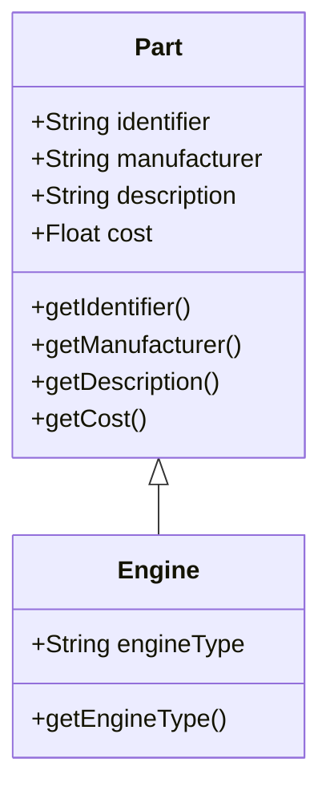
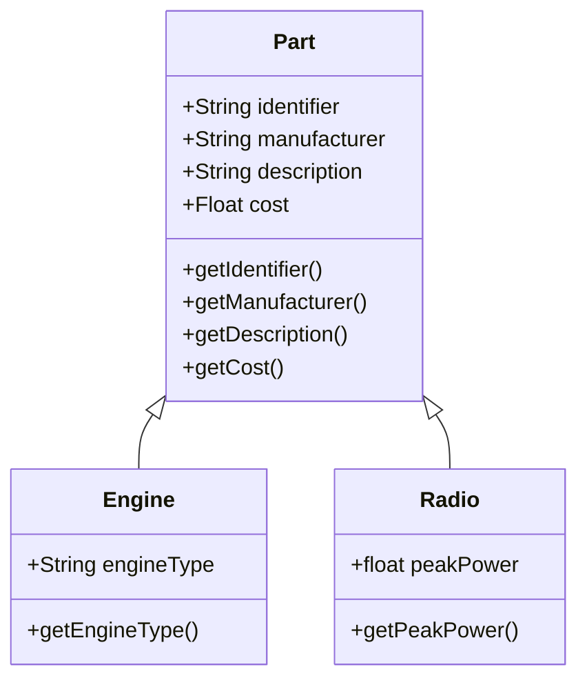

# Inheritance

<!-- https://java-programming.mooc.fi/part-9 -->

In order to improve the efficiency of programming work, we have two options:
1. Trying to re-use so much as possible our old program code. This means that
it should be easy to be able to re-use the old code. Inheritance is the key for doing this.
2. Our programming model should be able to describe real-world consepts so easily as possible.
Class and objects are tools for that.

Classes are used to clarify the concepts of the problem domain in object-oriented programming.
Every class we create adds functionality to the programming language. This functionality is needed
to solve the problems that we encounter. An essential idea behind object-oriented programming is that
solutions rise from the interactions between objects which are created from classes. An object in
object-oriented programming is an independent unit that has a state, which can be modified by using
the methods that the object provides.

Inheritance is a fundamental object-oriented programming concept that allows a class to
inherit properties and behaviors from another class. It enables code reuse and promotes the concept of
"is-a" relationship, where a subclass is a specialized version of a superclass.

Let's take a look at a aircraft manufacturing system that manages aircraft parts.
A basic component of part management is the class `Part`, which defines the identifier,
the manufacturer, the description and the purchase price.

```Java
public class Part {
    private String identifier;
    private String manufacturer;
    private String description;
    private float  cost;

    public Part(String identifier, String manufacturer, String description, float cost) {
        this.identifier   = identifier;
        this.manufacturer = manufacturer;
        this.description  = description;
        this.cost         = cost;
    }
    public String getIdentifier()   { return identifier; }
    public String getDescription()  { return description; }
    public String getManufacturer() { return manufacturer; }
    public float  getCost()         { return cost; }
}
```
One part of the aircraft is the engine. As is the case with all parts, the engine, too, has
a manufacturer, an identifier, a description, and a price. In addition, each engine has a type:
for instance, a turbofan, a turboprop, or a piston engine.

The traditional way to implement the class `Engine`, without using inheritance, would be this
```Java
public class Engine {
    private String engineType;
    private String identifier;
    private String manufacturer;
    private String description;
    private float  cost;

    public TradEngine(String engineType, String identifier, String manufacturer, String description, float cost) {
        this.engineType   = engineType;
        this.identifier   = identifier;
        this.manufacturer = manufacturer;
        this.description  = description;
        this.cost         = cost;
    }
    public String getEngineType()   { return engineType; }
    public String getIdentifier()   { return identifier; }
    public String getDescription()  { return description; }
    public String getManufacturer() { return manufacturer; }
    public float  getCost()         { return cost; }
}
```
We notice a significant amount of overlap between the contents of Engine and Part. It can confidently
be said the Engine is a special case of Part. The Engine **is** a Part, but it also has properties that
a Part does not have, which in this case means the engine type.

Let's recreate the class `Engine` and, this time, using inheritance in our implementation.
We'll create the class `Engine` which inherits the class `Part`: an engine is a special case of a part.
We use the keyword `extends` to inherit the properties of a class. The class that receives the
properties is called the _subclass_, and the class whose properties are inherited is called the _superclass_.
```Java
public class Engine extends Part {
    private String engineType;

    public Engine(String engineType, String identifier, String manufacturer, String description, float cost) {
        super(identifier, manufacturer, description, cost);
        this.engineType = engineType;
    }

    public String getEngineType() { return engineType; }
}
```
The class definition `public class Engine extends Part` indicates that the class `Engine` inherits
the functionality of the class `Part`. We also define an object variable `engineType` in the class `Engine`.

The constructor of the `Engine` class is worth some consideration. On its first line we use the
keyword `super` to call the constructor of the superclass. The call `super(identifier, manufacturer, description, cost)`
calls the constructor `public Part(String identifier, String manufacturer, String description, float cost)`
which is defined in the class `Part`. Through this process the object variables defined in the
superclass are initiated with their initial values. After calling the superclass constructor,
we also set the proper value for the object variable `engineType`.

The `super` call bears some resemblance to the `this` call in a constructor; `this` is used to call
a constructor of this class, while `super` is used to call a constructor of the superclass. If
a constructor uses the constructor of the superclass by calling `super` in it, the `super` call must
be on the first line of the constructor. This is similar to the case with calling `this`
(must also be the first line of the constructor).

Since the class `Engine` extends the class `Part`, it has at its disposal all the methods that the
class `Part` offers. Graphically we can show the relationship between the superclass `Part` and the
subclass `Engine` as follows:

In order to demonstrate the re-usability concept of a class, let's create a new object capable of
holding radar information.
```Java
public class Radar extends Part {
    private float peakPower;

    public Radar(float peakPower, String identifier, String manufacturer, String description, float cost) {
        super(identifier, manufacturer, description, cost);
        this.peakPower = peakPower;
    }

    public float getPeakPower() { return peakPower; }
}
```
Now we have two different classes who are using the same `Part` class.

Now both the classes `Engine` and `Radio` uses (inherits) the `Part` class - we are re-using the
code in the class `Part`.  You can create instances of the class `Engine` the same way you can of any other
class.
```Java
public class Main {
    public static void main(String[] args) {
        Engine engine = new Engine("turboprop", "ep4682", "Europrop", "Airbus A400M", 38e6f);
        System.out.println(engine.getEngineType());
        System.out.println(engine.getManufacturer());

        Radar radar = new Radar(17.5f, "r2156", "Thales", "AirMaster", 1.3e6f);
        System.out.println(radar.getPeakPower() + "kW");
        System.out.println(radar.getManufacturer());
    }
}
```
The notation `38e6f` means a single precision floating point type (`float`) of a value of 30000000. When
you run the application, the output is:
```text
turboprop
Europrop
17.5kW
Thales
```

## Java Object Class


## When is inheritance worth using?

Inheritance is a tool for building and specializing hierarchies of concepts; a subclass is always
a special case of the superclass. If the class to be created is a special case of an existing class,
this new class could be created by extending the existing class. For example, in the previously
discussed aircraft part scenario an engine is a part, but an engine has extra functionality that not
all parts have.

When inheriting, the subclass receives the functionality of the superclass. If the subclass doesn't
need or use some of the inherited functionality, inheritance is not justifiable. Classes that inherit
will inherit all the methods and interfaces from the superclass, so the subclass can be used in place
of the superclass wherever the superclass is used. It's a good idea to keep the inheritance hierarchy
shallow, since maintaining and further developing the hierarchy becomes more difficult as it grows
larger. Generally speaking, if your inheritance hierarchy is more than 2 or 3 levels deep, the structure
of the program could probably be improved.

Inheritance is not useful in every scenario. For instance, extending the class Aircraft with the class
Part (or Engine) would be incorrect. An Aircraft includes an engine and parts, but an engine or a part
is not a car. More generally, if an object owns or is composed of other objects, inheritance should
not be used.

When using inheritance, you should take care to ensure that the [Single Responsibility Principle](https://en.wikipedia.org/wiki/Single-responsibility_principle)
holds  true. There should only be one reason for each class to change. If you notice that inheriting adds
more responsibilities to a class, you should form multiple classes of the class.


# Summary

Here are some key aspects and features of Java inheritance:

1. **Superclass and Subclass**: Inheritance involves two types of classes: superclass (also called base class or parent class) and subclass (also called derived class or child class). The subclass inherits the properties and behaviors of the superclass, extending and refining its functionality.

2. **Keyword: `extends`**: In Java, the `extends` keyword is used to establish an inheritance relationship between classes. The subclass declaration specifies the superclass it extends. A subclass can only extend a single superclass, although multiple levels of inheritance are possible.

3. **Inherited Members**: When a class inherits from a superclass, it automatically inherits the members (fields and methods) defined in the superclass, except for constructors. Inherited members can be accessed and used by the subclass as if they were defined within the subclass itself. However, private members are not directly accessible in the subclass.

4. **Overriding**: Subclasses have the ability to override methods inherited from the superclass. By providing a new implementation of a method in the subclass, you can modify or extend the behavior defined in the superclass. This allows for polymorphism, where different objects of related classes can respond differently to the same method invocation.

5. **Access Modifiers**: Inheritance is influenced by access modifiers (`public`, `protected`, `private`, and default). Members with `public` and `protected` access modifiers are inherited and accessible by the subclass, while `private` members are not directly accessible. The default access modifier allows inheritance within the same package.

6. **Inheritance Hierarchy**: Inheritance can create a hierarchy of classes with multiple levels of inheritance. A subclass can become a superclass for another class, forming a chain of inheritance relationships.

Here's an example to illustrate Java inheritance:

```java
class Animal {
    protected String name;

    public Animal(String name) {
        this.name = name;
    }

    public void eat() {
        System.out.println(name + " is eating.");
    }
}

class Dog extends Animal {
    public Dog(String name) {
        super(name);
    }

    public void bark() {
        System.out.println(name + " is barking.");
    }
}

public class InheritanceExample {
    public static void main(String[] args) {
        Dog dog = new Dog("Buddy");
        dog.eat();  // Output: Buddy is eating.
        dog.bark(); // Output: Buddy is barking.
    }
}
```

In this example, we have a superclass `Animal` with a field `name` and a method `eat()`. The `Dog`
class extends `Animal`, inheriting the `name` field and `eat()` method. Additionally, the `Dog` class
introduces a new method `bark()`. In the `main()` method, we create an instance of `Dog` and invoke 
both inherited and subclass-specific methods.

Output:
```
Buddy is eating.
Buddy is barking.
```

In this way, the `Dog` class inherits the characteristics of the `Animal` superclass and adds its own
specific behavior.

Inheritance is a powerful mechanism in Java that promotes code reuse and enables the creation of
class hierarchies. It helps in organizing and modeling relationships between classes, allowing for
more flexible and modular designs.