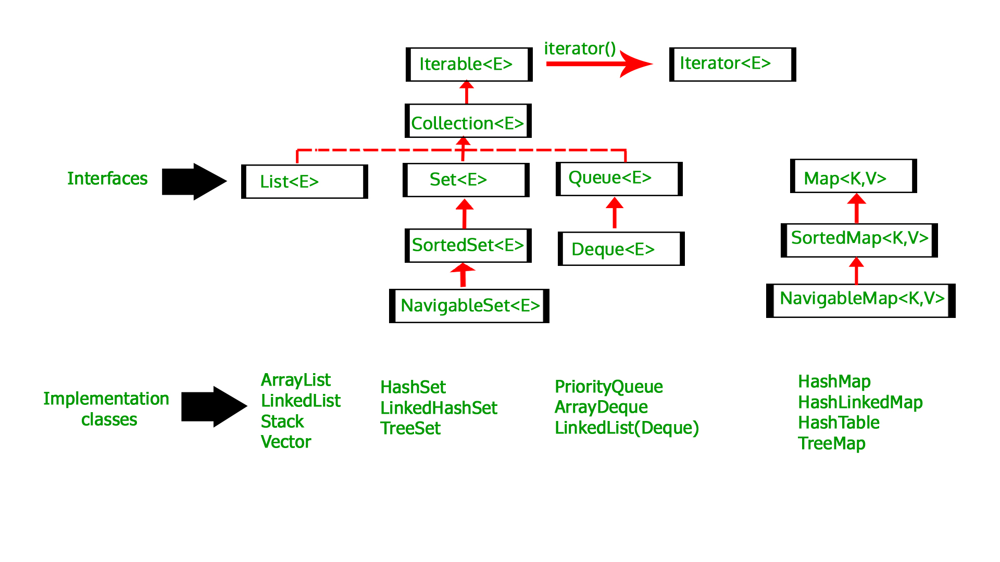

# Interfaces

An [interface](https://docs.oracle.com/javase/tutorial/java/IandI/createinterface.html) is a programming construct that defines a contract or a set of rules that classes must adhere to. It serves as a blueprint for implementing functionality in classes. Interfaces allow for the abstraction of behavior, enabling the definition of common methods that multiple classes can implement.

Here are some key characteristics and features of Java interfaces:

1. **Declaration**: Interfaces are declared using the `interface` keyword. They can contain method declarations, constant fields, default methods, and static methods.

2. **Abstract methods**: Interfaces can declare abstract methods, which are method signatures without any implementation details. These methods define the behavior that implementing classes must provide.

3. **Multiple inheritance**: Java interfaces support multiple inheritance, allowing a class to implement multiple interfaces. This enables a class to inherit behavior from multiple sources.

4. **Implementation**: Classes that implement an interface must provide the implementation details for all the methods declared in the interface. This is done using the `implements` keyword in the class declaration.

5. **Default methods**: Starting from Java 8, interfaces can also contain default methods. Default methods provide a default implementation for a method in the interface. Implementing classes can use the default implementation or override it if necessary.

6. **Static methods**: Java interfaces can have static methods as well. These methods are associated with the interface itself and can be invoked without an instance of a class implementing the interface. We will talk about static methods and variables later.

7. **Constants**: Interfaces can declare constant fields, which are implicitly `public`, `static`, and `final`. These fields are typically used to define constants that are shared by classes implementing the interface.

Here's an example that demonstrates the usage of an interface in Java:

```java
interface Animal {
    void eat();
    void sleep();
}

class Dog implements Animal {
    @Override
    public void eat() {
        System.out.println("Dog is eating.");
    }

    @Override
    public void sleep() {
        System.out.println("Dog is sleeping.");
    }
}

class Cat implements Animal {
    @Override
    public void eat() {
        System.out.println("Cat is eating.");
    }

    @Override
    public void sleep() {
        System.out.println("Cat is sleeping.");
    }
}

public class InterfaceExample {
    public static void main(String[] args) {
        Animal dog = new Dog();
        dog.eat();   // Output: Dog is eating.
        dog.sleep(); // Output: Dog is sleeping.

        Animal cat = new Cat();
        cat.eat();   // Output: Cat is eating.
        cat.sleep(); // Output: Cat is sleeping.
    }
}
```

In this example, we define an `Animal` interface with two abstract methods: `eat()` and `sleep()`.
The `Dog` and `Cat` classes implement the `Animal` interface and provide their own implementations for
the methods. The `InterfaceExample` class demonstrates creating instances of `Dog` and `Cat` and
invoking the interface methods on those instances.

Interfaces in Java serve as a powerful mechanism for achieving abstraction, enabling polymorphism and defining contracts that classes must fulfill. They facilitate code reuse, modularity, and provide a way to enforce consistency across classes implementing the same interface.

Java has a large number of predefined interfaces, especially for the Java Collections. We'll talk about them next.

## Comparable interface

The Java `Comparable` interface is a vital component of the Java Collections Framework. It enables the definition of a natural ordering for objects of a class, facilitating consistent and predictable comparisons between objects. This ordering is essential for sorting and organizing objects within diverse data structures like lists and trees.

When a class implements the `Comparable` interface, it signifies that instances of the class can be compared to one another to establish an order. The `Comparable` interface features a single method:
```java
int compareTo(T other)
```

In this context, `T` represents the type of objects being compared. The `compareTo` method returns an integer value representing the result of the comparison between the calling object and the specified object (`other`). The return values convey the following meanings:
- Negative value: The calling object is considered "less than" the specified object.
- Zero: The calling object is considered "equal to" the specified object.
- Positive value: The calling object is considered "greater than" the specified object.

To ensure consistent behavior, the ordering established through the `compareTo` method should align with other methods like `equals`. In other words, if two objects are considered equal using the `equals` method, their `compareTo` results should be zero.

Here's a basic example of how the `Comparable` interface can be implemented:
```java
public class Person implements Comparable<Person> {
    private String name;
    private int age;

    // Constructor and other methods here

    @Override
    public int compareTo(Person other) {
        return this.age - other.age; // Compare persons based on age
    }
}
```

With this implementation, instances of the `Person` class can be easily sorted using Java's sorting algorithms like `Arrays.sort()` or `Collections.sort()`.

Remember that the `Comparable` interface enforces a natural ordering on a class. If you need multiple comparison methods or want to compare objects of unmodifiable classes, the `Comparator` interface is a more suitable choice. It allows the definition of custom comparison logic independently of the class.

## Comparator interface

The Java `Comparator` interface is a powerful tool within the Java Collections Framework that provides a flexible way to define custom ordering for objects of a class. Unlike the `Comparable` interface, which requires modification of the class itself, the `Comparator` interface enables the definition of multiple comparison strategies without altering the original class. This makes it particularly useful when dealing with classes that you don't have direct control over or when you want to establish various sorting criteria for the same class.

The `Comparator` interface contains a single method:
```java
int compare(T o1, T o2)
```

Here, `T` represents the type of objects being compared. The `compare` method takes two objects as parameters and returns an integer value that indicates the relationship between the two objects:
- Negative value: `o1` is considered "less than" `o2`.
- Zero: `o1` is considered "equal to" `o2`.
- Positive value: `o1` is considered "greater than" `o2`.

With the `Comparator` interface, you can create custom comparison logic for sorting, even when the class itself doesn't implement the `Comparable` interface. This provides greater flexibility in handling sorting requirements for different scenarios.

Here's a simple example of how the `Comparator` interface can be used:
```java
import java.util.Comparator;

public class PersonAgeComparator implements Comparator<Person> {
    @Override
    public int compare(Person p1, Person p2) {
        return p1.getAge() - p2.getAge(); // Compare persons based on age
    }
}
```

In this example, the `PersonAgeComparator` class implements the `Comparator` interface to define a comparison strategy based on the ages of `Person` objects. This allows you to sort instances of the `Person` class by age using methods like `Collections.sort()`.

The `Comparator` interface is extremely versatile and can be used in various scenarios, such as sorting elements in custom orders, sorting complex objects based on multiple criteria, and even implementing reverse sorting. The Java `Comparator` interface provides a way to define custom comparison logic for objects without altering their original class. It is an essential tool within the Collections Framework for scenarios where you need diverse sorting strategies or when dealing with classes that cannot be modified directly.

Let's say we have a `Person` class representing individuals with names and ages:
```java
public class Person {
    private String name;
    private int age;

    public Person(String name, int age) {
        this.name = name;
        this.age = age;
    }

    public String getName() {
        return name;
    }

    public int getAge() {
        return age;
    }
}
```

Now, let's assume we have a list of `Person` objects that we want to sort using the `Comparator` interface:
```java
import java.util.ArrayList;
import java.util.Collections;
import java.util.Comparator;
import java.util.List;

public class Main {
    public static void main(String[] args) {
        List<Person> people = new ArrayList<>();
        people.add(new Person("Alice", 30));
        people.add(new Person("Bob", 25));
        people.add(new Person("Charlie", 40));

        // Create a Comparator based on age
        Comparator<Person> ageComparator = new Comparator<Person>() {
            @Override
            public int compare(Person p1, Person p2) {
                return Integer.compare(p1.getAge(), p2.getAge());
            }
        };

        // Sort the list using the ageComparator
        Collections.sort(people, ageComparator);

        // Print sorted list
        for (Person person : people) {
            System.out.println(person.getName() + " - " + person.getAge());
        }
    }
}
```

In this example, we've created a custom `Comparator` named `ageComparator` that compares `Person` objects based on their ages. The `compare` method is defined to compare the ages of two persons, resulting in a sorted list based on ascending age. When we created the `ageComparator` object using the `new` operator, we didn't have a class name there, just the interface's name. This is an object creation using an [anonymous class](https://docs.oracle.com/javase/tutorial/java/javaOO/anonymousclasses.html).

When we call `Collections.sort(people, ageComparator)`, the list of `Person` objects is sorted according to the defined comparison strategy. The output will display the sorted list of people:
```text
Bob - 25
Alice - 30
Charlie - 40
```

### Iterator abstraction

Iterator gives you a sequence of elements from a data structure, without you having to worry about
whether the data structure is a set or a hash table or a list or an array — the Iterator looks the
same no matter what the data structure is.

For example, given a `List<File> files`, we can iterate using indices:
```java
for (int ii = 0; ii < files.size(); ii++) {
    File f = files.get(ii);
    // ...
```    
But this code depends on the `size` and `get` methods of List, which might be different in another data
structure. Using an iterator abstracts away the details:
```java
Iterator<File> iter = files.iterator();
while (iter.hasNext()) {
    File f = iter.next();
    // ...
```    
Now the loop will be identical for any type that provides an Iterator. There is, in fact, an interface
for such types: Iterable. Any Iterable can be used with Java’s enhanced for statement —
`for (File f : files)` — and under the hood, it uses an iterator.

## Interfaces in Java Collections

In Java collections, interfaces play a crucial role in providing a standardized way to manipulate and
organize data. The Java Collections Framework defines a set of interfaces that represent different
types of collections, such as
[lists](https://en.wikipedia.org/wiki/List_(abstract_data_type)),
[sets](https://en.wikipedia.org/wiki/Set_(abstract_data_type)),
[queues](https://en.wikipedia.org/wiki/Queue_(abstract_data_type)), and
[maps](https://en.wikipedia.org/wiki/Associative_array).
These interfaces define the behavior and operations that can be performed on collections, allowing for a consistent and interchangeable approach to working with data structures.

Here are some important interfaces in the Java Collections Framework:

1. **List**: The `List` interface represents an ordered collection of elements that allows duplicate values. Implementations of `List` provide methods for adding, accessing, modifying, and removing elements by index.

2. **Set**: The `Set` interface represents a collection of unique elements with no specific order. Implementations of `Set` guarantee that duplicate elements are not allowed. Common implementations of `Set` include `HashSet` (fast, insensitive to the size of the contents, but unordered) and `TreeSet` (slower, but ordered).

3. **Queue**: The `Queue` interface represents a collection that orders its elements in a specific way for processing. Elements are typically added to the end of the queue and removed from the front. Implementations of `Queue` provide methods for adding, removing, and examining elements. Common implementations include `LinkedList` and `PriorityQueue`.

4. **Map**: The `Map` interface represents a collection of key-value pairs. Each key is unique within the map, and it allows for efficient lookup and retrieval of values based on their associated keys. Implementations of `Map` include `HashMap`, `TreeMap`, and `LinkedHashMap`.

5. **Iterable**: The `Iterable` interface provides a common interface for classes that can be iterated over. It defines a single method, `iterator()`, which returns an iterator for traversing the elements of the collection.



These interfaces serve as the foundation for working with collections in Java. They establish a set
of operations and behaviors that implementations must adhere to, ensuring consistency and 
interoperability across different collection types. By programming to the interface, developers can
write generic and reusable code that can work with various implementations of these interfaces.

Here's an example that demonstrates the usage of interfaces in Java collections:
```java
import java.util.List;
import java.util.ArrayList;

public class CollectionInterfaceExample {
    public static void main(String[] args) {
        List<String> names = new ArrayList<>();
        names.add("Alice");
        names.add("Bob");
        names.add("Charlie");

        for (String name : names) {
            System.out.println(name);
        }
    }
}
```

In this example, we create an `ArrayList` implementation of the `List` interface. We add elements
to the list and iterate over them using a for-each loop, which is possible because `List` extends
the `Iterable` interface. The example demonstrates the flexibility of working with collections
through interfaces, allowing us to switch the implementation from `ArrayList` to any other `List`
implementation without modifying the code that processes the collection.

The Java Collections Framework provides a rich set of interfaces and implementations that cater to
different requirements and use cases. By utilizing these interfaces, you can write more generic and
maintainable code, allowing for easier interchangeability and extensibility of collections in your
Java programs.

## Abstract class

An abstract class in Java serves as a blueprint for other classes. It provides a way to define a common structure and behavior that can be inherited by its subclasses. Unlike regular classes, abstract classes cannot be directly instantiated; they are meant to be extended by other classes, which are often referred to as concrete classes. Abstract classes can have both abstract methods (methods without implementation) and regular methods with implementation.

Here are some key points to understand about abstract classes in Java:

1. **Abstract Methods:** An abstract class can have abstract methods, which are methods without a body. These methods are declared using the `abstract` keyword and are meant to be overridden (implemented) by the subclasses. Abstract methods define a contract that the subclasses must fulfill.

2. **Inheritance:** Subclasses that extend an abstract class inherit its properties and methods. They can also override abstract methods to provide their own implementations. This allows for code reuse and promotes consistency across related classes.

3. **Instance Creation:** Abstract classes cannot be instantiated directly using the `new` keyword. Instead, you create instances of their subclasses. An abstract class can, however, have constructors that are used when creating instances of its subclasses.

4. **Partial Implementation:** Abstract classes can have both abstract methods and regular methods with complete implementations. This allows you to provide a common implementation for methods that are shared among subclasses while leaving some methods abstract for specific implementation by subclasses.

5. **Use Cases:** Abstract classes are useful when you want to define a common base with some default behavior for a group of related classes. They provide a level of abstraction and structure to your code, making it easier to manage and extend.

Here's a simple example of an abstract class and its subclass:
```java
// Abstract class
abstract class Shape {
    protected String color;

    public Shape(String color) {
        this.color = color;
    }

    // Abstract method
    abstract double calculateArea();

    // Regular method
    public void displayColor() {
        System.out.println("Color: " + color);
    }
}

// Subclass
class Circle extends Shape {
    private double radius;

    public Circle(String color, double radius) {
        super(color);
        this.radius = radius;
    }

    @Override
    double calculateArea() {
        return Math.PI * radius * radius;
    }
}

public class AbstractClassExample {
    public static void main(String[] args) {
        Circle circle = new Circle("Red", 3.0);
        circle.displayColor();
        System.out.println("Circle Area: " + circle.calculateArea());
    }
}
```

In this example, `Shape` is an abstract class with an abstract method `calculateArea()` and a regular method `displayColor()`. The `Circle` class extends `Shape` and provides an implementation for the abstract method.

Abstract classes provide a powerful mechanism for designing and organizing your code hierarchy, promoting reusability, and enforcing a common structure among related classes.

## Difference between interface and abstract class

Interfaces and abstract classes are both important concepts in Java's object-oriented programming, but they serve different purposes and have distinct characteristics. Here's a comparison of the two:

### Abstract Class:

1. **Purpose:**
   - An abstract class is a class that cannot be instantiated on its own and is meant to serve as a blueprint for other classes.
   - It provides a common base with both implemented and abstract methods.

2. **Instantiation:**
   - Abstract classes cannot be instantiated directly using the `new` keyword. They are meant to be extended by subclasses.

3. **Abstract Methods:**
   - Abstract classes can have abstract methods (methods without implementation) that must be overridden by subclasses.
   - They can also have regular methods with complete implementations.

4. **Fields:**
   - Abstract classes can have instance variables, fields, and constructors that are shared by all subclasses.

5. **Inheritance:**
   - A subclass can extend only one abstract class, limiting the possibility of multiple inheritances.

6. **Access Modifiers:**
   - Abstract classes can have different access modifiers for their fields and methods.

7. **Use Cases:**
   - Abstract classes are suitable when you want to provide a common base with both default behavior and abstract methods for subclasses to implement.

### Interface:

1. **Purpose:**
   - An interface defines a contract or set of methods that a class must adhere to.
   - It specifies a behavioral contract that classes implementing the interface must fulfill.

2. **Instantiation:**
   - Interfaces cannot be instantiated directly. They are implemented by classes that provide the necessary methods.

3. **Abstract Methods:**
   - Interfaces can only have abstract methods, and all methods declared in an interface are implicitly abstract.

4. **Fields:**
   - Interfaces can only have constants (public static final fields) but not instance variables.

5. **Inheritance:**
   - A class can implement multiple interfaces, allowing for multiple inheritances of behavior.

6. **Access Modifiers:**
   - All methods in an interface are implicitly `public`, and fields are implicitly `public`, `static`, and `final`.

7. **Use Cases:**
   - Interfaces are suitable when you want to define a contract that multiple unrelated classes can adhere to, promoting code reuse and ensuring consistent behavior.

### When to Use Which:

- Use an **abstract class** when you want to provide a common base with some default behavior for a group of related classes. Abstract classes are more suitable for cases where you have shared implementation details among subclasses.

- Use an **interface** when you want to define a contract or set of methods that multiple unrelated classes can implement. Interfaces are more suitable for cases where you want to establish a common behavior across different class hierarchies.

In summary, abstract classes provide a way to share code and behavior among related classes, while interfaces define contracts that unrelated classes can fulfill. Your choice between using an abstract class or an interface depends on your design goals and the relationships among your classes.

## Assignments

**Task 1: Vehicle Interfaces and Implementations**

In this exercise, you will create a Java program to demonstrate the concept of interfaces and their implementations. You will define an interface `Vehicle` with methods for starting, stopping, and getting information about vehicles. Then, you will create classes `Car`, `Motorcycle`, and `Bus` that implement the `Vehicle` interface. The program will showcase how different vehicle types share a common interface.

Instructions:
1. Create a Java interface named `Vehicle` with the following methods:
    - `start()`: This method should print a message indicating that the vehicle is starting.
    - `stop()`: This method should print a message indicating that the vehicle is stopping.
    - `getInfo()`: This method should return a string containing information about the vehicle.

2. Create three classes: `Car`, `Motorcycle`, and `Bus`, each implementing the `Vehicle` interface.

3. Implement the `start()`, `stop()`, and `getInfo()` methods in each class with appropriate messages and vehicle information.

4. Create a Java class named `VehicleDemo` with a `main` method to demonstrate the interface implementations. In the `main` method, perform the following actions:

    - Create instances of `Car`, `Motorcycle`, and `Bus`.
    - Start and stop each vehicle.
    - Display information about each vehicle.

Example Output:
```
Vehicle Demonstration

Car is starting...
Car is stopping...
Car Information:
Type: Car
Fuel: Petrol
Color: Red

Motorcycle is starting...
Motorcycle is stopping...
Motorcycle Information:
Type: Motorcycle
Fuel: Gasoline
Color: Black

Bus is starting...
Bus is stopping...
Bus Information:
Type: Bus
Fuel: Diesel
Capacity: 40 passengers
```

**Task 2: Vehicle Inheritance Hierarchy**

Create a more complex inheritance hierarchy for vehicles by introducing abstract classes. Modify the exercise to have an abstract class `AbstractVehicle` that implements the `Vehicle` interface, and then have the `Car`, `Motorcycle`, and `Bus` classes extend `AbstractVehicle`. Implement additional methods and attributes in the abstract class.

**Task 3: Electric Vehicles**

Extend the vehicle hierarchy to include electric vehicles. Create an interface `ElectricVehicle` with methods like `charge()` and add classes like `ElectricCar` and `ElectricMotorcycle` that implement this interface.

**Task 4: Fuel Efficiency Calculation**

Add a method `calculateFuelEfficiency()` to the `Vehicle` interface. Implement this method in the vehicle classes to calculate and return the fuel efficiency (miles per gallon or kilometers per liter) of each vehicle type.

For this assignment, you get points in the following way:
1. Task 1 completed: 2 points
2. Task 2 completed: 1 point
3. Task 3 completed: 2 points
4. Task 4 completed: 1 point
