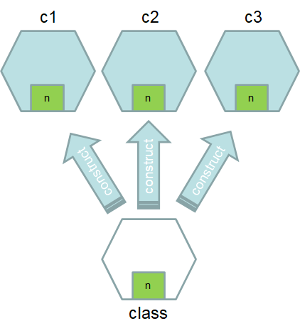
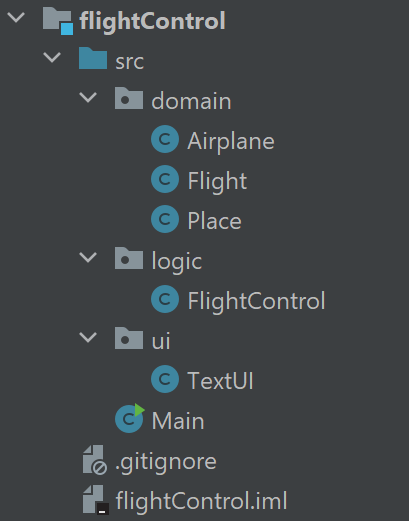
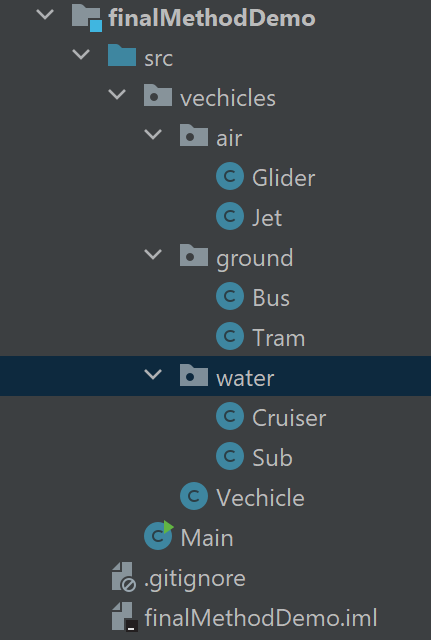
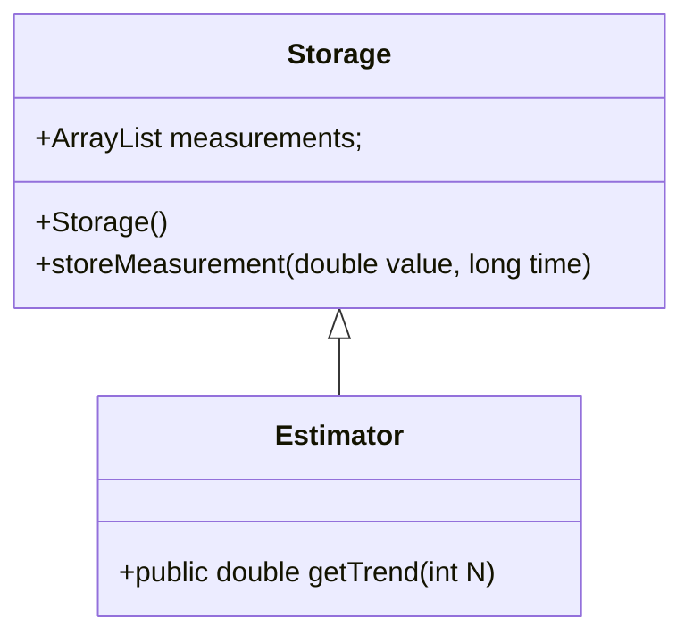

# Static variables and methods

## Static variable

In Java, a static variable is a variable that belongs to the class itself rather than to any particular instance of the class. It is also known as a class variable. Unlike instance variables, which are unique to each instance of a class, static variables have the same value across all instances of the class.



Here are some key characteristics of static variables:

1. Shared value: When you declare a variable as static, it is shared among all instances of the class. Any changes made to the static variable will be reflected in all instances of the class.

2. Memory allocation: Static variables are allocated memory in a separate area called the "static memory" or "class area." This memory is allocated when the class is loaded by the Java Virtual Machine (JVM) and exists until the program terminates.

3. Access and visibility: Static variables can be accessed directly using the class name, without creating an instance of the class. They are visible to all instances of the class and can also be accessed from other classes (depending on their access modifiers).

4. Initialization: Static variables are initialized only once, when the class is loaded by the JVM. They can be assigned a value directly at the point of declaration or within a static initializer block.

Here's an example that demonstrates the usage of a static variable in Java:
```java
public class Counter {
    private static int count = 0; // static variable

    public Counter() {
        count++; // Increment count each time a new instance is created
    }

    public static void main(String[] args) {
        Counter c1 = new Counter();
        System.out.println("Count: " + Counter.count); // Accessing static variable using class name

        Counter c2 = new Counter();
        System.out.println("Count: " + Counter.count);
    }
}
```

In the above example, the `count` variable is declared as static. Each time a new `Counter` instance is created, the `count` variable is incremented. As `count` is a static variable, its value is shared among all instances of the `Counter` class. The output of the program will be:

```
Count: 1
Count: 2
```

Note that static variables should be used with caution, as they can introduce shared state and potential synchronization issues in multithreaded environments.

## Static method

In Java, a static method is a method that belongs to the class itself rather than to any particular instance of the class. It is also known as a class method. Static methods can be called directly using the class name, without the need to create an instance of the class.

Here are some key characteristics of static methods:

1. No access to instance variables: Static methods do not have access to instance variables or methods directly. They can only access other static members (variables or methods) of the class.

2. No use of "this" keyword: Since static methods are not associated with any instance, they cannot use the "this" keyword to refer to the current object.

3. Memory allocation: Static methods are stored in the same class area as static variables, known as the "static memory" or "class area." They are loaded into memory when the class is loaded by the JVM.

4. Access and visibility: Static methods can be accessed directly using the class name, without creating an instance of the class. They are visible to all instances of the class and can also be accessed from other classes (depending on their access modifiers).

5. Cannot be overridden: Static methods cannot be overridden by subclasses. If a subclass defines a static method with the same signature as a static method in its superclass, it is simply hiding the superclass method rather than overriding it.

Here's an example that demonstrates the usage of a static method in Java:
```java
public class MathUtils {
    public static int add(int a, int b) {
        return a + b;
    }

    public static void main(String[] args) {
        int result = MathUtils.add(5, 3); // Calling static method directly using class name
        System.out.println("Result: " + result);
    }
}
```

In the above example, the `add` method is declared as static. It takes two integers as parameters and returns their sum. The `add` method can be called directly using the class name without creating an instance of the `MathUtils` class. The output of the program will be:
```text
Result: 8
```

Static methods are commonly used for utility methods or helper functions that don't require any specific instance state. They can be called directly from anywhere in the program, making them convenient for performing operations that are not dependent on object state.

# Packages

## Directories in file systems

You store your content in files. When you have only a few files, you will find your files easily, and the probability of naming conflicts (two files with the same name) is low. But when the number of files will increase, then it is more difficult to find a particular file. We need a solution for handling larger number of files, and it is a [_directory_](https://en.wikipedia.org/wiki/Directory_(computing)).

Directories (also known as folders) in file systems serve several purposes and provide organizational and structural benefits. Here are some reasons why directories are used in file systems:

1. Hierarchical organization: Directories provide a hierarchical structure for organizing files and other directories. This structure allows for logical grouping and categorization of related files and helps users navigate and locate specific files easily. It provides a way to organize and manage files in a structured manner, similar to how physical folders are used to organize documents.

2. File management: Directories facilitate efficient file management. They allow users to create, rename, move, and delete files. By organizing files into directories, users can keep related files together, making it easier to find and work with them.

3. Namespace management: Directories help manage the namespace or the set of unique names used to identify files. They provide a way to differentiate files with the same name by placing them in different directories. This prevents naming conflicts and allows users to have files with identical names in different locations.

4. Access control and permissions: Directories can have access control mechanisms and permissions associated with them. This means that you can specify who can access, modify, or delete files within a particular directory. Access control helps maintain security and privacy by restricting unauthorized access to files.

5. File organization and separation: Directories allow for logical separation and organization of files based on their content, purpose, or ownership. For example, you may have directories for documents, images, videos, programs, or specific projects. This separation helps in maintaining a structured file system, improves searchability, and enhances file organization.

6. Navigation and file path addressing: Directories enable navigation within the file system using relative and absolute file paths. Users can navigate through directories to locate specific files or move between different locations in the file system. Directories help in identifying the path to a file, specifying its location within the file system.

Overall, directories in file systems provide a systematic way to organize, manage, and access files. They improve file management, prevent naming conflicts, enable access control, and help users navigate the file system effectively.

## Packages and directories have similarities

When we have a large application, it contains large number of different source code files (for the class definitions, remember that in Java, classes are defined on their separate files). We need similar kind of tool than directory to manage our class files, and that tool is called as _package_.

Packages are used to organize classes and interfaces into a hierarchical structure, similar to directories in a file system. A package provides a way to group related classes and helps to avoid naming conflicts between classes with the same name in different packages.

Here are some key points about packages in Java:

1. Package declaration: At the beginning of a Java source file, you can declare the package to which the class belongs using the `package` keyword. The package declaration must be the first line of code in the file (except for comments and white space). For example:
   ```java
   package com.example.myapp;
   ```

   The package declaration for a class named `MyClass` in the package `com.example.myapp` would look like:
   ```java
   package com.example.myapp;

   public class MyClass {
       // Class code goes here
   }
   ```

2. Package naming convention: Package names are typically written in all lowercase letters to follow the Java naming conventions. Packages are usually named in a reverse domain name format to ensure uniqueness. For example, if a company's domain name is `example.com`, the corresponding package name could be `com.example`.

3. Package structure: Packages can be nested to create a hierarchical structure. For example, the package `com.example.myapp` can have sub-packages like `com.example.myapp.utils` and `com.example.myapp.models`. This helps in organizing related classes and provides a clear structure for larger projects.

4. Access control: Classes and interfaces in Java have access control modifiers like `public`, `protected`, `private`, and default (no modifier). The access modifiers determine whether classes/interfaces in a package are accessible to other classes and packages. By default, classes/interfaces without an access modifier (default access) are accessible within the same package.

5. Importing classes: To use a class from a different package, you need to import it using the `import` statement. This allows you to refer to the class by its simple name rather than its fully qualified name (package name + class name). For example:
   ```java
   import com.example.myapp.utils.UtilityClass;

   public class AnotherClass {
       public static void main(String[] args) {
           UtilityClass.doSomething(); // Using the imported class
       }
   }
   ```

   If you don't import a class explicitly, you need to refer to it using its fully qualified name:
   ```java
   public class AnotherClass {
       public static void main(String[] args) {
           com.example.myapp.utils.UtilityClass.doSomething(); // Using the fully qualified name
       }
   }
   ```

Packages are an essential part of Java's modular structure, enabling code organization, encapsulation, and reusability. They promote good software engineering practices by providing a structured way to manage classes and reduce naming conflicts.

## Packages in IntelliJ IDEA

Every project you see in IntelliJ IDEA is in your computer's file system or on a centralized server. If you want to look at your files, right-click the project name in a project explorer window on the left side of the IDEA screen. Then select menu item Open In/Show in Explorer.

The project directory src contains the source code files of the program. If the package of a class is library, that class is stored inside the src/libary folder of the source code directory. If you want to create a new package, right-click the src folder, and select New/Package. When you create a new class (file), IntelliJ IDEA will create the appropriate `package` statements at the beginning of the generated file.

## Large application with packages

Let's take a look at a program that offers a text UI for adding and examining airplanes and flights. The user interface of the program looks like this.
```text
Airport Asset Control
--------------------

Choose an action:
[1] Add an airplane
[2] Add a flight
[x] Exit Airport Asset Control
> 1
Give the airplane id: SE-MKD
Give the airplane capacity: 78
Choose an action:
[1] Add an airplane
[2] Add a flight
[x] Exit Airport Asset Control
> 1
Give the airplane id: HS-THC
Give the airplane capacity: 366
Choose an action:
[1] Add an airplane
[2] Add a flight
[x] Exit Airport Asset Control
> 2
Give the airplane id: SE-MKD
Give the departure airport id: HEL
Give the target airport id: BMA
Choose an action:
[1] Add an airplane
[2] Add a flight
[x] Exit Airport Asset Control
> 2
Give the airplane id: SE-MKD
Give the departure airport id: ARN
Give the target airport id: LLA
Choose an action:
[1] Add an airplane
[2] Add a flight
[x] Exit Airport Asset Control
> 2
Give the airplane id: HS-THC
Give the departure airport id: ARN
Give the target airport id: BKK
Choose an action:
[1] Add an airplane
[2] Add a flight
[x] Exit Airport Asset Control
> x

Flight Control
------------

Choose an action:
[1] Print airplanes
[2] Print flights
[3] Print airplane details
[x] Quit
> 1
HS-THC (366 capacity)
SE-MKD (78 capacity)
Choose an action:
[1] Print airplanes
[2] Print flights
[3] Print airplane details
[x] Quit
> 2
SE-MKD (78 capacity) (HEL-BMA)
HS-THC (366 capacity) (ARN-BKK)
SE-MKD (78 capacity) (ARN-LLA)

Choose an action:
[1] Print airplanes
[2] Print flights
[3] Print airplane details
[x] Quit
> 3
Give the airplane id: HS-THC
HS-THC (366 capacity)

Choose an action:
[1] Print airplanes
[2] Print flights
[3] Print airplane details
[x] Quit
> 
```
There are many concepts of the problem domain in the program, and the essential ones are Airplane and Flight. Each flight also involves a Place (places of departure and destination). In addition to the concepts that represent the problem domain, the program also contains a text UI and a class through which the text UI uses the concepts.

The package structure of the program could look like the following (for example):
- `flightControl` - includes the main program class that is needed to start the program
- `flightControl.domain` - includes the classes that represent concepts of the problem domain: Airplane, Flight, and Place
- `flightControl.logic` - includes the functionality that is used to control the application
- `flightControl.ui` - includes the textual user interface

In the next subsections, we list one possible organization for the operation of the program. Here is the project structure in IntelliJ IDEA:


### Classes that represent concepts of the problem domain

The classes that represent concepts of the problem domain are often placed inside a package called `domain`. Since the entirety of the application is inside the package flightControl, let's place the package domain inside the package flightControl. Concepts of the problem domain are represented by the classes `Place`, `Airplane`, and `Flight`.

```Java
package domain;

public class Place {

    private String ID;

    public Place(String ID) {
        this.ID = ID;
    }

    @Override
    public String toString() {
        return this.ID;
    }
}
```
```Java
package domain;

public class Airplane {

    private String id;
    private int capacity;

    public Airplane(String id, int capacity) {
        this.id = id;
        this.capacity = capacity;
    }

    public String getID() {
        return this.id;
    }

    public int getCapacity() {
        return this.capacity;
    }

    @Override
    public String toString() {
        return this.id + " (" + this.capacity + " capacity)";
    }
}
```
```Java
package domain;

public class Flight {

    private Airplane airplane;
    private Place departureAirport;
    private Place targetAirport;

    public Flight(Airplane airplane, Place departureAirport, Place targetAirport) {
        this.airplane = airplane;
        this.departureAirport = departureAirport;
        this.targetAirport = targetAirport;
    }

    public Airplane getAirplane() {
        return this.airplane;
    }

    public Place getDeparturePlace() {
        return this.departureAirport;
    }

    public Place getTargetPlace() {
        return this.targetAirport;
    }

    @Override
    public String toString() {
        return this.airplane.toString() + " (" + this.departureAirport + "-" + this.targetAirport + ")";
    }
}
```

### Application logic
The application logic is typically kept separate from the classes that represents concepts of the problem domain. In our example, the application logic is stored in the package `logic`. Application logic includes the functionality to add airplanes and flights, and to list them.

```Java
package logic;

import java.util.Collection;
import domain.Flight;
import domain.Airplane;
import java.util.HashMap;
import java.util.Map;
import domain.Place;

public class FlightControl {

    private HashMap<String, Airplane> airplanes = new HashMap<>();
    private HashMap<String, Flight> flights = new HashMap<>();
    private Map<String, Place> places;

    public FlightControl() {
        this.flights = new HashMap<>();
        this.airplanes = new HashMap<>();
        this.places = new HashMap<>();
    }

    public void addAirplane(String ID, int capacity) {
        Airplane plane = new Airplane(ID, capacity);
        this.airplanes.put(ID, plane);
    }

    public void addFlight(Airplane plane, String departureID, String destinationID) {
        this.places.putIfAbsent(departureID, new Place(departureID));
        this.places.putIfAbsent(destinationID, new Place(destinationID));

        Flight flight = new Flight(plane, this.places.get(departureID), this.places.get(destinationID));
        this.flights.put(flight.toString(), flight);
    }

    public Collection<Airplane> getAirplanes() {
        return this.airplanes.values();
    }

    public Collection<Flight> getFlights() {
        return this.flights.values();
    }

    public Airplane getAirplane(String ID) {
        return this.airplanes.get(ID);
    }
}
```

### Text user interface

The user interface is separate from the application logic and the classes that represent the problem domain. In this example, the user interface is stored in the package `ui`.

```Java
package ui;

import domain.Flight;
import domain.Airplane;
import java.util.Scanner;
import logic.FlightControl;

public class TextUI {

    private FlightControl flightControl;
    private Scanner scanner;

    public TextUI(FlightControl flightControl, Scanner scanner) {
        this.flightControl = flightControl;
        this.scanner = scanner;
    }

    public void start() {
        // let's start in two parts -- first start the asset control,
        // then the flight control
        startAssetControl();
        System.out.println();
        startFlightControl();
        System.out.println();
    }

    private void startAssetControl() {
        System.out.println("Airport Asset Control");
        System.out.println("--------------------");
        System.out.println();

        while (true) {
            System.out.println("Choose an action:");
            System.out.println("[1] Add an airplane");
            System.out.println("[2] Add a flight");
            System.out.println("[x] Exit Airport Asset Control");

            System.out.print("> ");
            String answer = scanner.nextLine();

            if (answer.equals("1")) {
                addAirplane();
            } else if (answer.equals("2")) {
                addFlight();
            } else if (answer.equals("x")) {
                break;
            }
        }
    }

    private void addAirplane() {
        System.out.print("Give the airplane id: ");
        String id = scanner.nextLine();
        System.out.print("Give the airplane capacity: ");
        int capacity = Integer.parseInt(scanner.nextLine());

        this.flightControl.addAirplane(id, capacity);
    }

    private void addFlight() {
        System.out.print("Give the airplane id: ");
        Airplane airplane = askForAirplane();
        System.out.print("Give the departure airport id: ");
        String departureID = scanner.nextLine();
        System.out.print("Give the target airport id: ");
        String destinationID = scanner.nextLine();

        this.flightControl.addFlight(airplane, departureID, destinationID);
    }

    private void startFlightControl() {
        System.out.println("Flight Control");
        System.out.println("------------");
        System.out.println();

        while (true) {
            System.out.println("Choose an action:");
            System.out.println("[1] Print airplanes");
            System.out.println("[2] Print flights");
            System.out.println("[3] Print airplane details");
            System.out.println("[x] Quit");

            System.out.print("> ");
            String answer = scanner.nextLine();
            if (answer.equals("1")) {
                printAirplanes();
            } else if (answer.equals("2")) {
                printFlights();
            } else if (answer.equals("3")) {
                printAirplaneDetails();
            } else if (answer.equals("x")) {
                break;
            }
        }
    }

    private void printAirplanes() {
        for (Airplane plane : flightControl.getAirplanes()) {
            System.out.println(plane);
        }
    }

    private void printFlights() {
        for (Flight flight : flightControl.getFlights()) {
            System.out.println(flight);
            System.out.println("");
        }
    }

    private void printAirplaneDetails() {
        System.out.print("Give the airplane id: ");
        Airplane plane = askForAirplane();
        System.out.println(plane);
        System.out.println();
    }

    private Airplane askForAirplane() {
        Airplane airplane = null;
        while (airplane == null) {
            String id = scanner.nextLine();
            airplane = flightControl.getAirplane(id);

            if (airplane == null) {
                System.out.println("No airplane with the id " + id + ".");
            }
        }

        return airplane;
    }
}
```

### Main

`Main` connects all packages together. First we create the program logic object, then the user interface object, which in this case is connected to the keyboard input stream. Because the application is constructed in this way, we are able to change the application input easily to a different kind of input (e.g., file). It is also relatively easy to switch to a totally different kind of user interface (like Java FX), just by replacing the `textUI` object with another object, like `graphicUI`.

```Java
import logic.FlightControl;
import ui.TextUI;

import java.util.Scanner;

public class Main {
    public static void main(String[] args) {
        FlightControl flightControl = new FlightControl();
        TextUI        textUI        = new TextUI(flightControl, new Scanner(System.in));

        textUI.start();
    }
}
```

# Modifiers

Modifiers in Java are keywords that are used to control the accessibility, behavior, and scope of classes, methods, variables, and other elements in a Java program. They define the level of access and visibility to other classes and components within the program. Java provides a variety of modifiers that can be applied to different elements. Here are some commonly used modifiers in Java:

1. Access Modifiers:
    - `public`: Allows unrestricted access from anywhere.
    - `protected`: Provides access within the same package and subclasses.
    - `private`: Restricts access to within the same class.

2. Non-Access Modifiers:
    - `final`: Indicates that a variable, method, or class cannot be modified or extended.
    - `static`: Specifies that a variable or method belongs to the class itself rather than an instance.
    - `abstract`: Used in classes or methods to indicate that they are incomplete and must be extended or implemented by a subclass.
    - `synchronized`: Ensures that only one thread can access a synchronized method or block at a time. We will talk about this later in our Threads section.
    - `volatile`: Indicates that a variable's value may be modified by different threads and should not be cached. We will talk about this later in our Threads section.

3. Class Modifiers:
    - `public`: Allows the class to be accessed from anywhere.
    - `abstract`: Specifies that the class cannot be instantiated and must be extended by a subclass.
    - `final`: Indicates that the class cannot be extended.
    - `strictfp`: Ensures strict adherence to doubleing-point calculations.

4. Method Modifiers:
    - `public`, `protected`, `private`: Determines the visibility and access level of the method.
    - `static`: Specifies that the method belongs to the class and can be invoked without creating an instance of the class.
    - `abstract`: Indicates that the method is declared but does not provide an implementation.
    - `final`: Prevents the method from being overridden in a subclass.
    - `synchronized`: Ensures that only one thread can execute the method at a time.
    - `native`: Specifies that the method is implemented in a language other than Java.

5. Variable Modifiers:
    - `public`, `protected`, `private`: Determines the visibility and access level of the variable.
    - `static`: Indicates that the variable belongs to the class rather than an instance.
    - `final`: Makes the variable a constant that cannot be modified.
    - `volatile`: Indicates that the variable's value may be modified by different threads.
    - `transient`: Excludes the variable from being serialized.
    - `synchronized`: Ensures that only one thread can access the variable at a time.

Modifiers provide control over encapsulation, inheritance, polymorphism, and other aspects of Java programming. They allow for proper access control, define behavior, and enforce design principles such as immutability and thread safety. The selection and combination of modifiers depend on the specific requirements and design considerations of the program.

## Final variable

```Java
public class Circle {
    private final double PI = 3.14159; // final variable

    public double calculateArea(double radius) {
        return PI * radius * radius;
    }

    public static void main(String[] args) {
        Circle circle = new Circle();
        double radius = 5.0;
        double area = circle.calculateArea(radius);
        System.out.println("Area of the circle: " + area);
        // circle.PI = 3.14; // This assignment would be an error, as PI is final
    }
}
```

## Final method

Let's create a small application where we need `final` modifier in method declaration. We want to create a base class for a general vehicle:
```Java
package vehicles;

public class Vehicle {
    private String sound;

    public Vehicle(String sound) {
        this.sound = doubleSound(sound);
    }

    public final String doubleSound(String sound) {
        return sound + " " + sound;     // better sound
    }

    public String toString() {
        return sound;
    }
}
```
Constructor invokes always the `doubleSound` method. If the `doubleSound` were overwritten in a subclass, modularity of the application would suffer. Therefore, we have given the `final` keyword to the definition of the `doubleSound` method.

Now we use the `Vehicle` to create a `Tram` class:
```Java
package vehicles.ground;

import vehicles.Vehicle;

public class Tram extends Vehicle {
    private int units;

    public Tram(String sound, int units) {
        super(sound);
        this.units = units;
    }

    //public String doubleSound(String sound) { // does not work!
    //    return ("Skriiiiick... blurlp");
    //}

    @Override
    public String toString() {
        return super.toString() + " " + units;
    }
}
```

We have a lot of different kind of vehicles, therefore we have created several packages to have a clear structure in our application.


Finally, our main method:
```Java
import vehicles.ground.Tram;
import vehicles.water.Sub;

public class Main {
    public static void main(String[] args) {
        Tram tram = new Tram("Hmmm", 2);
        Sub sub   = new Sub("Pul pul pul", 110);

        System.out.println(tram);
        System.out.println(sub);
    }
}
```
and the output:
```text
Hmmm Hmmm 2
Pul pul pul Pul pul pul 110 feets deep
```

### Protected access modifier

We have a measurement storage class, and an estimator for trend detection in the measured values. Class diagram of the system is:


Class for storing measurements is:
```Java
/**
 * Linear storage for (value, time) pairs
 *
 * @author Jarkko Vuori
 */

import java.util.ArrayList;

public class Storage {
    protected class ProcessTemp {
        public double value;
        public long  measurementTime;

        public ProcessTemp(double value, long time) {
            this.value           = value;
            this.measurementTime = time;
        }
    }
    protected ArrayList<ProcessTemp> measurements;

    public Storage() {
        measurements = new ArrayList<>();
    }

    /** Store one (value, time) pair
     * @param value value to be stored
     * @param time  time (in milliseconds)
     */
    public void storeMeasurement(double value, long time) {
        measurements.add(new ProcessTemp(value, time));
    }
}
```

We notice that the collection, `measurements` who stores the given measurements has an access right modifier `protected`. We don't want the user of this class to be able to mess with the data storage of stored values (`private`), but it is okay for the inheriting class to be able to obtain those measured values, thus it is `protected`.

`Estimator` class inherits the `Storage` class, therefore it is able to access the measured values storage—to be able to make the estimate of the trend. `Estimator` class is also documented using [Javadoc](https://www.oracle.com/technical-resources/articles/java/javadoc-tool.html). From these specially formatted comments, IntelliJ IDEA can create Javadoc documentation by the `Tools-Generate JavaDoc` command.
```Java
/**
 * Linear regression for a first order equation y = bx + a
 * <p>
 * It needs the Storage class to hold the values the estimation to be done.
 *
 * @author Jarkko Vuori
 * @see    <a href="https://pub.towardsai.net/calculating-simple-linear-regression-and-linear-best-fit-an-in-depth-tutorial-with-math-and-python-804a0cb23660">Linear regression</a>
 */

public class Estimator extends Storage {
    private static final int INMILLIS = 1000;

    /** calculate linear regression of the given temperature channel
     * @param N how many samples are used in regression analysis
     * @return  coefficient b (time scaled to hours)
     */
    public double getTrend(int N) {
        double sumxx = 0, sumyy = 0;
        double sumxy = 0;
        double sumx = 0, sumy = 0;
        double Sxx, Sxy, Syy;
        double a, b;    	                        // regression coefficients y = bx + a
        int    n = 0, i = measurements.size()-1;

        // collect N (or less if there are not enough entries in the buffer) (x,y) values
        long  t = 0;
        while (n < N && n < measurements.size()) {
            double x, y;
            // take the time of the first temperature measurement as a reference
            if (t == 0)
                t = measurements.get(i).measurementTime;

            // calculate the current sample value, time is referenced to the first measurement sample
            y = measurements.get(i).value;
            x = (double)(measurements.get(i).measurementTime - t) / (3600.0 * INMILLIS); // x-scale is 1 C/h

            // then accumulate partial products
            sumx  += x;
            sumy  += y;
            sumxx += x*x;
            sumyy += y*y;
            sumxy += x*y;

            n++;

            i--;
        }

        // calculate coefficients (bx + a) by the linear regression
        Sxx = sumxx-sumx*sumx/n;
        Sxy = sumxy-sumx*sumy/n;
        b   = Sxy/Sxx;
        a   = (sumy-b*sumx)/n;

        return (b);
    }
}
```
And finally, the main part of the application. The user is giving values (maybe temperature measurements), and then we check the current time (`System.currentTimeMillis()`) and store the values to the storage. When we are ready with the measurements, we ask from the `Estimator` what is the trend of the given values.
```Java
import java.util.Scanner;

public class Main {
    private static String askValue(Scanner scanner) {
        System.out.print("Give a temperature (x to exit)? ");
        return scanner.nextLine();
    }

    public static void main(String[] args) {
        Estimator estimator = new Estimator();
        Scanner   scanner   = new Scanner(System.in);
        String s;

        s = askValue(scanner);
        while (!s.equals("x")) {
            estimator.storeMeasurement(double.valueOf(s), System.currentTimeMillis());
            s = askValue(scanner);
        }

        System.out.printf("Trend is %.1f C/h\n", estimator.getTrend(5));
    }
}
```

## Assignments

**Task 1: Creating a Simple Bank Account Management System**

In this exercise, you'll create a simple bank account management system using static variables and methods. You'll create a `BankAccount` class with instance variables for the account number and balance. The `totalAccounts` static variable keeps track the total number of accounts. You'll also implement instance methods for depositing and withdrawing funds, as well as a static method to retrieve the total number of accounts. The `main` method demonstrates how to use the class by creating accounts, performing transactions, and checking the total number of accounts.


```java
public class BankAccount {
    // Your variable declarations and code here

    public static void main(String[] args) {
        BankAccount account1 = new BankAccount(1000);
        BankAccount account2 = new BankAccount(2000);

        account1.deposit(500);
        account2.withdraw(800);

        System.out.println("Account " + account1.getAccountNumber() + " balance: " + account1.getBalance());
        System.out.println("Account " + account2.getAccountNumber() + " balance: " + account2.getBalance());

        System.out.println("Total number of accounts: " + BankAccount.getTotalAccounts());
    }
}
```

**Task 2: Creating a Simple Library Management System**

In this exercise, you'll create a simple library management system using Java packages. You'll define classes within packages to represent books, library members, and the library itself.

**Step 1: Create Packages**

1. Create a new directory named `library` to serve as the root directory for your packages.

2. Inside the `library` directory, create two subdirectories: `model` and `system`.

**Step 2: Define Classes**

1. Create a `Book` class inside the `model` package. This class should have properties like title, author, and ISBN.

2. Create a `LibraryMember` class inside the `model` package. This class should represent a library member and have properties like name, member ID, and borrowed books.

3. Create a `Library` class inside the `system` package. This class should manage the library's books and members. Implement methods to add books, add members, borrow books, and return books.

**Step 3: Implement Main Application**

1. Create a `Main` class outside the packages (in the root directory). In this class, create instances of the `Library` class, add books and members, and perform borrowing and returning operations.

Here's a basic example of how the structure might look:

```
library/
|-- model/
|   |-- Book.java
|   |-- LibraryMember.java
|-- system/
|   |-- Library.java
|-- Main.java
```

**Example Implementation:**

```java
package model;

public class Book {
    private String title;
    private String author;
    private String isbn;

    // Constructor, getters, setters
}

package model;

public class LibraryMember {
    private String name;
    private int memberId;
    // List<Book> borrowedBooks

    // Constructor, getters, setters
}

package system;

import model.Book;
import model.LibraryMember;

public class Library {
    // List<Book> books
    // List<LibraryMember> members

    public void addBook(Book book) {
        // Add book to the library
    }

    public void addMember(LibraryMember member) {
        // Add member to the library
    }

    public void borrowBook(LibraryMember member, Book book) {
        // Borrow book from the library
    }

    public void returnBook(LibraryMember member, Book book) {
        // Return book to the library
    }
}

public class Main {
    public static void main(String[] args) {
        // Create instances of Library, Book, LibraryMember
        // Add books and members to the library
        // Perform borrowing and returning operations
    }
}
```

**Task 3: Implement Book Reservation**

Extend the existing library management system to include the ability to reserve books. When a library member requests to reserve a book, the system should mark the book as reserved and associate it with the member. The member should be able to see their reserved books and cancel reservations.

**Steps to Implement the Task:**

1. Modify the `Book` class in the `model` package to include a `boolean reserved` field. This field will indicate whether the book is currently reserved.

2. Add methods to the `Library` class in the `system` package to handle book reservations. Implement methods to reserve a book, cancel a reservation, and display reserved books for a member.

3. Update the `LibraryMember` class in the `model` package to include a list of reserved books.

4. Modify the `Main` class to demonstrate the new functionality. Create instances of library members, reserve books, cancel reservations, and display reserved books.

**Example Implementation:**

```java
package model;

public class Book {
    // Existing fields: title, author, isbn
    private boolean reserved = false;

    // Getters, setters, other methods
}

package system;

import model.Book;
import model.LibraryMember;

public class Library {
    // Existing methods: addBook, addMember, borrowBook, returnBook
    public void reserveBook(LibraryMember member, Book book) {
        if (!book.isReserved()) {
            book.setReserved(true);
            member.addReservedBook(book);
            System.out.println("Book reserved successfully.");
        } else {
            System.out.println("Book is already reserved.");
        }
    }

    public void cancelReservation(LibraryMember member, Book book) {
        if (book.isReserved() && member.hasReservedBook(book)) {
            book.setReserved(false);
            member.removeReservedBook(book);
            System.out.println("Reservation canceled successfully.");
        } else {
            System.out.println("Book was not reserved by this member.");
        }
    }

    public void displayReservedBooks(LibraryMember member) {
        System.out.println("Reserved books for " + member.getName() + ":");
        for (Book book : member.getReservedBooks()) {
            System.out.println(book.getTitle());
        }
    }
}

package model;

import java.util.ArrayList;
import java.util.List;

public class LibraryMember {
    // Existing fields: name, memberId
    private List<Book> reservedBooks = new ArrayList<>();

    // Existing methods: getters, setters
    public void addReservedBook(Book book) {
        reservedBooks.add(book);
    }

    public void removeReservedBook(Book book) {
        reservedBooks.remove(book);
    }

    public boolean hasReservedBook(Book book) {
        return reservedBooks.contains(book);
    }

    public List<Book> getReservedBooks() {
        return reservedBooks;
    }
}

public class Main {
    public static void main(String[] args) {
        // Existing code
        // Create instances of library members, reserve/cancel books, display reserved books
    }
}
```

For this assignment, you get points in the following way:
1. Task 1 completed: 2 points
2. Task 2 completed: 2 points
3. Task 3 completed: 2 points
