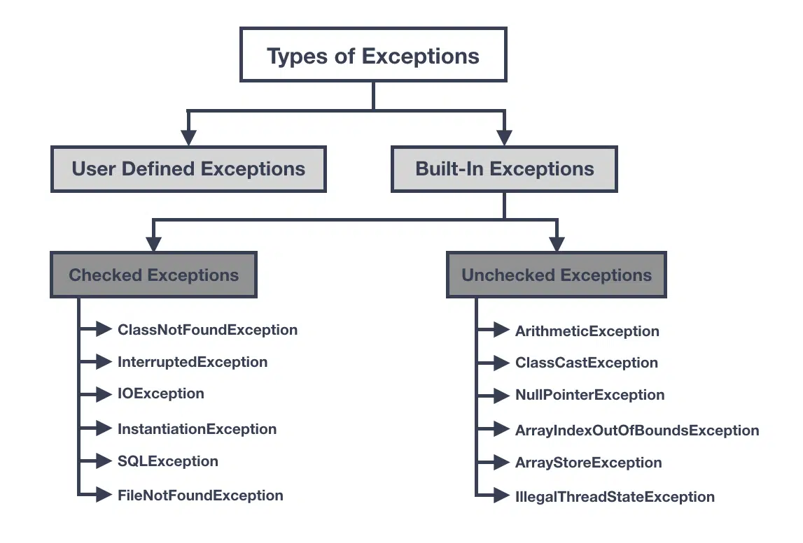
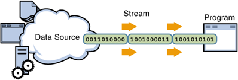
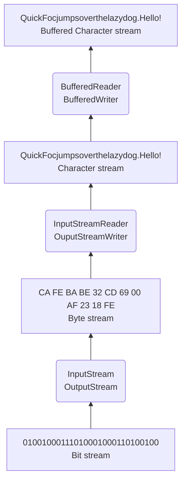

# Exceptions

In Java, an _exception_ is an event that occurs during the execution of a program, disrupting the normal flow of instructions. It represents an abnormal condition or error that may occur while a program is running. Exceptions provide a unified mechanism to handle and recover from these exceptional situations.

Here are some key points about exceptions in Java:

1. Exception Hierarchy: Exceptions in Java are organized in a hierarchical structure. At the top of the hierarchy is the `Throwable` class, which has two main subclasses: `Exception` and `Error`. Exceptions are further divided into two types: checked exceptions and unchecked exceptions.

2. Checked Exceptions: Checked exceptions are exceptions that **must** be explicitly declared or handled by the programmer. These exceptions are checked by the compiler to ensure that they are handled appropriately. Examples of checked exceptions include `IOException`, `SQLException`, and `ClassNotFoundException`.

3. Unchecked Exceptions: Unchecked exceptions, also known as runtime exceptions, are exceptions that do not need to be declared or explicitly handled. They occur at runtime and are not checked by the compiler. Examples of unchecked exceptions include `NullPointerException`, `ArrayIndexOutOfBoundsException`, and `ArithmeticException`.

4. Exception Handling: Exception handling is the process of dealing with exceptions in a program. It involves catching and handling exceptions to prevent program termination and provide a mechanism for error recovery. The `try-catch-finally` construct is used for exception handling in Java. The `try` block contains the code that might throw an exception, the `catch` block is used to handle the exception, and the `finally` block is executed regardless of whether an exception occurred or not.

5. Throwing Exceptions: In addition to handling exceptions, it is also possible to explicitly throw exceptions using the `throw` keyword. This allows you to create and throw custom exceptions or propagate exceptions from one part of the program to another.

6. Exception Propagation: Exceptions can be propagated up the call stack if they are not caught and handled at a particular level. This means that if a method encounters an exception but does not handle it, the exception will be propagated to the calling method, and so on until it is caught or reaches the top-level of the program, causing the program to terminate.

Exception handling in Java helps in writing robust and fault-tolerant programs by providing a way to deal with unexpected conditions and errors. By handling or propagating exceptions appropriately, you can handle exceptional situations gracefully, provide error messages or logging, and ensure the stability and reliability of your code.

Here's an example of a Java exception:
```java
public class ExampleException {
    public static void main(String[] args) {
        int[] numbers = {1, 2, 3};

        try {
            int result = numbers[4]; // Accessing an element outside the array bounds
            System.out.println("Result: " + result); // This line will not be executed
        } catch (ArrayIndexOutOfBoundsException e) {
            System.out.println("An exception occurred: " + e.getMessage());
        }
    }
}
```

In the above example, an exception is raised due to an attempt to access an element outside the bounds of the `numbers` array. This will cause an `ArrayIndexOutOfBoundsException` to be thrown. The exception is caught using a `try-catch` block.

When the program is executed, it tries to access the element at index 4 in the `numbers` array, which does not exist. This triggers the exception to be thrown. The program then enters the `catch` block, where the exception is caught, and a message is printed to the console indicating that an exception occurred.

The output of the program will be:
```text
An exception occurred: Index 4 out of bounds for length 3
```

By using exception handling, you can gracefully handle such exceptional situations and provide appropriate error messages or perform other necessary actions.

Exceptions are categorized into two types: _checked exceptions_ and _unchecked exceptions_.


1. Checked Exceptions:
   Checked exceptions are exceptions that are checked at compile-time, meaning the compiler enforces the handling of these exceptions. If a method can throw a checked exception, the calling code must either handle the exception using a try-catch block or declare the exception to be thrown using the `throws` clause in the method signature.

   Examples of checked exceptions in Java include `IOException`, `SQLException`, and `ClassNotFoundException`. These exceptions typically represent error conditions that can occur during I/O operations, database operations, or class loading.

   Here's an example of handling a checked exception:
```java
   import java.io.FileReader;
   import java.io.IOException;
   
   public class Main {
       public static void main(String[] args) {
           try {
               FileReader reader = new FileReader("file.txt");
               // Perform operations with the file
               reader.close();
           } catch (IOException e) {
               e.printStackTrace();
           }
       }
   }
```

2. Unchecked Exceptions:
   Unchecked exceptions, also known as runtime exceptions, are not checked by the compiler during compilation. They can occur at runtime and do not require explicit handling through try-catch blocks or declaring them with the `throws` clause. Unchecked exceptions are subclasses of `RuntimeException` or its subclasses.

   Examples of unchecked exceptions in Java include `NullPointerException`, `ArrayIndexOutOfBoundsException`, and `ArithmeticException`. These exceptions typically represent programming errors, such as accessing a null reference, accessing an array with an invalid index, or dividing by zero.

   Here's an example of an unchecked exception:
```java
   public class Main {
       public static void main(String[] args) {
           int[] numbers = { 1, 2, 3 };
           int result = numbers[5];  // ArrayIndexOutOfBoundsException occurs
           System.out.println(result);
       }
   }
```

   While it is not mandatory to handle unchecked exceptions, it is generally recommended to handle them when possible to prevent unexpected program termination or to provide meaningful error messages to users.

In summary, checked exceptions are enforced by the compiler, requiring explicit handling or declaration, while unchecked exceptions do not require such enforcement and can be handled optionally.

# Data streams

A _data stream_ refers to a sequence of data elements that can be read or written sequentially. It provides a convenient way to handle input and output operations involving data of different types. Data streams are used to read data from a source or write data to a destination, such as files, network connections, or other I/O devices.



## Byte Stream

At the lowest level, the flow of information can be thought of as a string of bits. For efficiency, computer group bits into bytes. Therefore, in Java, the lowest description of a data stream consists of a stream of bytes. Byte streams, represented by classes in the `java.io` package, are used for reading and writing binary data. The two fundamental byte stream classes are `InputStream` and `OutputStream`. These classes and their subclasses, such as `FileInputStream` and `FileOutputStream`, provide methods for reading and writing bytes. Byte streams are typically used for handling raw binary data.

Example of reading from a byte stream:
```java
try (InputStream inputStream = new FileInputStream("file.txt")) {
    int data;
    while ((data = inputStream.read()) != -1) {
        // Process the byte data
        System.out.print((char) data);
    }
} catch (IOException e) {
    e.printStackTrace();
}
```

Example of writing to a byte stream:
```java
try (OutputStream outputStream = new FileOutputStream("file.txt")) {
    String text = "Hello, World!";
    byte[] bytes = text.getBytes();
    outputStream.write(bytes);
} catch (IOException e) {
    e.printStackTrace();
}
```

Notice that stream operation may produce `IOException` which is a checked exception. Therefore, compiler requires that you have the `try-catch` block around the stream operations. This is done because the probability of error in I/O-operations is considered to be so high that we need to consider that somehow—think about noisy wireless internet connection.

Thus, exception handling is used to gracefully handle and recover from exceptional conditions that may occur during program execution. When working with input stream operations, such as reading from files, network sockets, or other I/O devices, there are several reasons why catching exceptions is necessary:

1. Error Reporting: Exceptions provide valuable information about what went wrong during an input stream operation. They typically include details such as the type of error, the location of the error, and a descriptive message. By catching and handling exceptions, you can log or display these error messages, which help in diagnosing and debugging issues.

2. Graceful Recovery: Catching exceptions allows your program to recover from exceptional conditions and continue execution, even if an error occurs during input stream operations. For example, if a file cannot be found or accessed, catching the corresponding exception allows you to handle the error appropriately, display an error message, and possibly take alternative actions.

3. Resource Cleanup: Input stream operations often involve system resources, such as file handles or network connections. If an exception occurs during these operations and you don't catch and handle it, the associated system resources may not be properly released and cleaned up. By catching exceptions and using try-with-resources or explicitly calling the `close()` method in a finally block, you can ensure that resources are properly closed and released, preventing resource leaks and improving the efficiency of your program.

4. User Experience: When performing input stream operations, catching and handling exceptions provides a better user experience. Instead of abruptly terminating the program or displaying cryptic error messages, you can present user-friendly error messages or take alternative actions, such as prompting the user to retry or providing appropriate guidance.

5. Compliance with API Contracts: Some methods or APIs that involve input stream operations explicitly declare checked exceptions that need to be caught or declared. By catching these exceptions, you ensure compliance with the API contracts and prevent compilation errors.

It is worth noting that while it is necessary to catch exceptions in input stream operations, it is also important to handle exceptions appropriately by taking suitable actions based on the specific requirements of your program. This may include logging errors, displaying meaningful messages to users, retrying operations, or terminating the program gracefully when necessary.

## Character stream

The next abstraction level from data stream is _character streams_, also known as _text streams_, are used for reading and writing text-based data. They are represented by classes in the `java.io` package, such as `Reader` and `Writer`. Character streams handle [Unicode](https://en.wikipedia.org/wiki/Unicode) characters and are suitable for working with text files or textual data transmitted over network connections.

Example of reading from a character stream:
```java
try (Reader reader = new FileReader("file.txt")) {
    int data;
    while ((data = reader.read()) != -1) {
        // Process the character data
        System.out.print((char) data);
    }
} catch (IOException e) {
    e.printStackTrace();
}
```

Example of writing to a character stream:
```java
try (Writer writer = new FileWriter("file.txt")) {
    String text = "Hello, World!";
    writer.write(text);
} catch (IOException e) {
    e.printStackTrace();
}
```

Character streams in Java provide higher-level abstractions over low-level I/O operations, making it easier to work with different data sources and destinations. They handle the conversion of data between the internal binary format and the appropriate data types used in Java.

## Buffered stream

`BufferedReader` and `BufferedWriter` are classes that provide buffering functionality for reading and writing text-based data, respectively. They improve the efficiency of reading from and writing to character-based streams by reducing the number of actual I/O operations by collecting (buffering) multiple simple operations to a one large operation.

1. BufferedReader:
   `BufferedReader` is a class that wraps an existing `Reader` and adds buffering functionality to it. It reads data from the underlying reader in chunks and stores them in an internal buffer. This helps reduce the overhead of reading data character by character directly from the reader, especially when performing small read operations.

   Some important methods provided by `BufferedReader` include:
   - `int read()`: Reads a single character from the buffered reader and returns it as an integer, or -1 if the end of the stream is reached.
   - `int read(char[] buffer, int offset, int length)`: Reads characters from the buffered reader into the specified character array `buffer`, starting at the specified `offset` and up to `length` characters. The method returns the total number of characters read, or -1 if the end of the stream is reached.
   - `String readLine()`: Reads a line of text from the buffered reader and returns it as a `String`, excluding the line termination characters. Returns `null` if the end of the stream is reached.
   - `void close()`: Closes the buffered reader and releases any system resources associated with it, including the underlying reader.

   Here's an example of using `BufferedReader` to read lines of text from a file:

```java
   import java.io.BufferedReader;
   import java.io.FileReader;
   import java.io.IOException;
   import java.io.Reader;
   
   public class Main {
       public static void main(String[] args) {
           try (Reader reader = new FileReader("file.txt");
                BufferedReader bufferedReader = new BufferedReader(reader)) {
               String line;
               while ((line = bufferedReader.readLine()) != null) {
                   // Process the line of text
                   System.out.println(line);
               }
           } catch (IOException e) {
               e.printStackTrace();
           }
       }
   }
```
   In the example above, a `BufferedReader` is created by wrapping a `FileReader`. The `readLine()` method is used to read lines of text from the buffered reader.

2. BufferedWriter:
   `BufferedWriter` is a class that wraps an existing `Writer` and adds buffering functionality to it. It writes data to the underlying writer in chunks, reducing the frequency of actual I/O operations and improving performance, especially when performing small write operations.

   Some important methods provided by `BufferedWriter` include:
   - `void write(int c)`: Writes a single character to the buffered writer.
   - `void write(String str)`: Writes a string of text to the buffered writer.
   - `void write(char[] buffer, int offset, int length)`: Writes characters from the specified character array `buffer` to the buffered writer, starting at the specified `offset` and up to `length` characters.
   - `void newLine()`: Writes a platform-dependent line separator to the buffered writer.
   - `void flush()`: Flushes the buffered writer, forcing any buffered data to be written to the underlying writer.
   - `void close()`: Closes the buffered writer and releases any system resources associated with it, including the underlying writer.

   Here's an example of using `BufferedWriter` in Java to write lines of text to a file:

```java
   import java.io.BufferedWriter;
   import java.io.FileWriter;
   import java.io.IOException;
   import java.io.Writer;
   
   public class Main {
       public static void main(String[] args) {
           try (Writer writer = new FileWriter("file.txt");
                BufferedWriter bufferedWriter = new BufferedWriter(writer)) {
               bufferedWriter.write("Hello, World!");
               bufferedWriter.newLine();  // Write a new line
               bufferedWriter.write("This is an example of BufferedWriter.");
   
               // It is important to flush or close the writer to ensure the data is written to the file
               bufferedWriter.flush();
           } catch (IOException e) {
               e.printStackTrace();
           }
       }
   }
```

   In the example above, a `BufferedWriter` is created by wrapping a `FileWriter`. The `write()` method is used to write lines of text to the buffered writer. The `newLine()` method is called to write a new line separator after the first line. Finally, the `flush()` method is called to ensure that any remaining data is written to the file.

   Make sure to handle exceptions appropriately when working with `BufferedWriter` and to close the writer after you finish writing to it.

Here we have a diagram depicting the relationships between those previously mentioned stream classes:


# Manipulating files

## CSV files

A [CSV](https://en.wikipedia.org/wiki/Comma-separated_values) (Comma-Separated Values) file is a plain text file format used to store tabular data, such as a spreadsheet or a database table, in a simple and portable manner. It is a widely used format for data interchange between different applications and systems.

In a CSV file, each line typically represents a single row of data, and the values within each row are separated by a delimiter, commonly a comma. However, other delimiters like tabs, semicolons, or pipes can also be used depending on the specific requirements. The delimiter separates the fields or columns of data within each row.

Here's an example of a simple CSV file:
```text
Name, Age, City
John, 25, London
Emma, 32, New York
Michael, 45, Sydney
```

In the example above, the first line represents the header row, which contains the names of the columns. The subsequent lines represent the data rows, where each value corresponds to a specific column.

CSV files have several characteristics:

1. Plain Text Format: CSV files are plain text files, which means they can be easily read and edited using a text editor. They do not contain any formatting or styling like fonts or colors.

2. Delimiter Separation: Values within each row are separated by a delimiter character, typically a comma. **In Europe (as in many other countries), we use comma to separate integer and decimal places from each other. Therefore, we use semicolon, ';', as a delimiter**. This delimiter helps distinguish one field from another.

3. No Data Types: CSV files do not include explicit data types for the values. All values are treated as strings unless explicitly converted or interpreted by the reading application.

4. No Complex Structures: CSV files do not support complex structures like nested tables or relationships. They represent a flat, tabular structure with rows and columns.

CSV files can be opened and processed using various software applications, such as spreadsheet programs (e.g., Microsoft Excel, Google Sheets), programming languages, database tools, and data analysis tools. When working with CSV files in programming languages, libraries or APIs are often used to read and write data from/to CSV files.

The simplicity and universality of the CSV file format make it a popular choice for data exchange, data migration, and interoperability between different systems and applications.

## Manipulating CSV files

Reading a data stream has generally three phases:
1. Create the data stream by opening a file and stream
2. Read/Write data using a loop
3. Close the stream

We must also take care of possible exceptions (file does not exists, file reading errors, etc.) with the `try-catch` instruction.

Now we would like to read data values from the CSV file. The content of the file is:
```text
Time;Outdoor Temp (C);Input Power (W);Flow rate (l/h);Water Temp In (C);Water Temp Out(C);Output Power (W)
09.09.2022 13:05;15,0;1371,4;1908,0;24,0;28,3;9549,0
09.09.2022 13:06;15,0;1373,3;1914,0;24,1;28,2;9133,5
09.09.2022 13:07;15,1;1382,5;1908,0;24,1;28,4;9549,0
09.09.2022 13:08;15,1;1180,2;1908,0;24,1;27,9;8438,7
09.09.2022 13:09;15,0;1030,7;1908,0;24,1;27,6;7772,5
09.09.2022 13:10;15,0;907,6;1908,0;24,1;27,2;6884,2
09.09.2022 13:11;15,0;897,8;1908,0;24,1;27,0;6440,0
```
We will read the file one line per time using `BufferedReader.readLine()` method and separating columns using `String.split(";")` method. `finally` block will be guarantied to be executed after the `try` block in every case (whether there is exception or not).

```Java
import java.io.*;

public class CSVReader {
   private final static String FILENAME = "data.csv";
   public static void main(String[] args) {
      FileReader file;
      BufferedReader bufferedstream = null;
      String line;
      String[] columnNames = new String[0];
      boolean header = true;

      try {
         file = new FileReader(FILENAME);
         bufferedstream = new BufferedReader(file);

         do {
            line = bufferedstream.readLine();
            if (line != null) {
               if (header) {
                  // first row of the file contains names of columns
                  columnNames = line.split(";");
                  header = false;
               } else {
                  // just print data lines with column names
                  String[] columns = line.split(";");
                  for (int i = 0; i < columnNames.length; i++)
                     System.out.print(columnNames[i] + ": " + columns[i] + ", ");
                  System.out.println();
               }
            }
         } while (line != null);
      } catch (IOException e) {
         // Error output, will print to console even in case of output redirection
         System.err.println(e);
      } finally {
         try {
            // we will close the stream only if we were able to open it
            if (bufferedstream != null)
               bufferedstream.close();
         } catch (Exception e) {
            System.out.println("Error while closing the file " + FILENAME);
         }
      }
   }
}
```

The output of the program is:
```text
Time: 09.09.2022 13:05, Outdoor Temp (C): 15,0, Input Power (W): 1371,4, Flow rate (l/h): 1908,0, Water Temp In (C): 24,0, Water Temp Out(C): 28,3, Output Power (W): 9549,0, 
Time: 09.09.2022 13:06, Outdoor Temp (C): 15,0, Input Power (W): 1373,3, Flow rate (l/h): 1914,0, Water Temp In (C): 24,1, Water Temp Out(C): 28,2, Output Power (W): 9133,5, 
Time: 09.09.2022 13:07, Outdoor Temp (C): 15,1, Input Power (W): 1382,5, Flow rate (l/h): 1908,0, Water Temp In (C): 24,1, Water Temp Out(C): 28,4, Output Power (W): 9549,0, 
Time: 09.09.2022 13:08, Outdoor Temp (C): 15,1, Input Power (W): 1180,2, Flow rate (l/h): 1908,0, Water Temp In (C): 24,1, Water Temp Out(C): 27,9, Output Power (W): 8438,7, 
Time: 09.09.2022 13:09, Outdoor Temp (C): 15,0, Input Power (W): 1030,7, Flow rate (l/h): 1908,0, Water Temp In (C): 24,1, Water Temp Out(C): 27,6, Output Power (W): 7772,5, 
Time: 09.09.2022 13:10, Outdoor Temp (C): 15,0, Input Power (W): 907,6, Flow rate (l/h): 1908,0, Water Temp In (C): 24,1, Water Temp Out(C): 27,2, Output Power (W): 6884,2, 
Time: 09.09.2022 13:11, Outdoor Temp (C): 15,0, Input Power (W): 897,8, Flow rate (l/h): 1908,0, Water Temp In (C): 24,1, Water Temp Out(C): 27,0, Output Power (W): 6440,0, 
```

# Reading from the network

The `URL` class is part of the `java.net` package and represents a Uniform Resource Locator (URL). A [URL](https://en.wikipedia.org/wiki/URL) is a standardized address that specifies the location of a resource on the internet or a network.

The `URL` class provides methods for creating, accessing, and manipulating URLs. It allows you to perform operations such as opening connections to the resource specified by the URL, retrieving information about the resource, and parsing the various components of a URL.

The `URL` class has a method `openStream` which opens a connection to this URL and returns a `InputStream` for reading from that connection. If the URL's protocol is HTTP/HTTPS, `openStream` will automatically write GET command to the URL in order to read data from that URL.

```Java
import java.io.*;
import java.net.*;

public class Main {
    public static void main(String[] args) {
        // first, create the url
        URL myUrl;
        try {
            myUrl = new URL("https://users.metropolia.fi/~jarkkov/koe.txt");
        } catch (MalformedURLException e) {
            System.err.println(e);
            return;
        }

        try {
            // open the connection and get the input stream
            // it will automatically generate HTTP GET-request
            InputStream istream = myUrl.openStream();

            // jump to character streams
            InputStreamReader istreamreader = new InputStreamReader(istream);

            // and to buffered reader for efficiency
            BufferedReader reader = new BufferedReader(istreamreader);

            // we use StringBuilder for efficiency, concatenating ordinary Strings is slow and
            // generates unnecessary objects
            String line;
            StringBuilder response = new StringBuilder();

            // here we read the content of the web page line by line
            while ((line = reader.readLine()) != null) {
                response.append(line);
            }

            // now it is time to print the result
            reader.close();
            System.out.println(response.toString());
        } catch (IOException e) {
            System.err.println(e);
        }
    }
}
```

And the output:
```text
This is a special test file
```

# Reading and Writing objects

To read and write objects to a file in Java, you can use the `ObjectInputStream` and `ObjectOutputStream` classes, which allow you to serialize and deserialize objects.

## Serialization

The term "serializable" refers to the capability of an object to be converted into a byte stream format and then restored back into an object. This process is known as object serialization and is achieved by implementing the `Serializable` interface in the class.

The `Serializable` interface is a marker interface, meaning it does not contain any methods to implement. It acts as a flag that tells the Java runtime that objects of this class can be serialized. By implementing the `Serializable` interface, a class indicates that its objects can be converted into a stream of bytes and saved to a file, transmitted over a network, or stored in a database. The serialized object can later be deserialized, or restored back to its original state.

To make a class serializable, simply implement the `Serializable` interface:

```java
import java.io.Serializable;

public class MyClass implements Serializable {
    // Class members and methods
}
```

When an object of a serializable class is serialized, the object's state, which includes its instance variables, is converted into a sequence of bytes that represent the object's data. The resulting byte stream can be written to a file or transmitted over a network.

Object serialization is commonly used in various scenarios, such as:
- Persistence: Saving and loading objects to/from a file or a database.
- Communication: Transmitting objects between different systems or processes.
- Caching: Storing objects in memory for faster access and reusing.

However, not all objects can be serialized. Certain types of objects cannot or should not be serialized, such as objects that hold references to non-serializable resources or objects that represent threads. In such cases, serialization can be selectively controlled by using the `transient` keyword (look [this](https://www.javatpoint.com/transient-keyword) for more information) or implementing custom serialization methods (`writeObject()` and `readObject()`).

It's worth noting that the `Serializable` interface is a part of the Java standard library and provides default serialization behavior. However, in some cases, you may need to implement additional logic to control the serialization and deserialization process, handle versioning, or customize the serialized output.

## An Example

First we create a `Person` class that implements the `Serializable` interface, which indicates that objects of this class can be serialized and deserialized.

```Java
import java.io.Serializable;

public class Person implements Serializable {
    private String firstname;
    private String lastname;
    private int birthYear;

    public Person() {
        firstname = "";
        lastname = "";
        birthYear = 0;
    }

    public Person(String firstname, String lastname, int birthYear) {
        this.firstname = firstname;
        this.lastname  = lastname;
        this.birthYear = birthYear;
    }

    public String getName() {
        return firstname + " " + lastname;
    }

    @Override
    public String toString() {
        return firstname + " " + lastname + " " + birthYear + " years";
    }
}
```

To write objects, we create a `FileOutputStream` and wrap it with an `ObjectOutputStream`. We use the `writeObject()` method to write each `Person` object to the output stream.

To read objects, we create a `FileInputStream` and wrap it with an `ObjectInputStream`. We use the `readObject()` method to read each `Person` object from the input stream. Since objects are read in the same order they were written, we cast the returned objects to `Person`.

Ensure that the objects you want to serialize and deserialize implement the `Serializable` interface, as shown in the `Person` class in the example.

```Java
import java.io.*;

public class Main {
    private final static String FILENAME = "person.dat";
    public static void main(String[] args) {
        File f = new File(FILENAME);
        Person person = new Person();

        if (f.exists() && f.isFile()) {
            // we have objects state stored to the file, read it
            try (
                FileInputStream inputstream = new FileInputStream(FILENAME);
                ObjectInputStream objects = new ObjectInputStream(inputstream);
            ) {
                person = (Person) objects.readObject();
            } catch (Exception e) {
                System.err.println("Reading person: " + e);
            }
        } else {
            // there are no stored object state, let's create an object
            person = new Person("Enzio", "Benzio", 2002);
            try (
                FileOutputStream outputstream = new FileOutputStream(FILENAME);
                ObjectOutputStream objects = new ObjectOutputStream(outputstream);
            ) {
                objects.writeObject(person);
            } catch (Exception e) {
                System.err.println("Writing person: " + e);
            }
        }

        System.out.println("Person: " + person);
    }
}
```

The output:
```text
Person: Enzio Benzio 2002 years
```

Note that the file `"person.dat"` will be created in the current working directory. It is in binary format (as we can see from the following picture) which means that it is not usable to exchange information outside the Java world.


## Try-with-resources

Note that we had our stream creation operations inside parenthesis after the `try` block. This is so-called "try-with-resources" construct that simplifies the handling of resources that need to be explicitly closed, such as file streams or database connections. It ensures that these resources are properly closed regardless of whether an exception occurs or not.

The try-with-resources statement automatically manages the closing of resources by declaring and initializing the resource within the try statement and then automatically closing it at the end of the block. It is designed to replace the traditional try-catch-finally block for resource management.

The basic syntax of the try-with-resources statement is as follows:

```java
try (ResourceType resource1 = new ResourceType(); ResourceType resource2 = new ResourceType()) {
    // Code that uses the resources
} catch (ExceptionType exception) {
    // Exception handling code
}
```

In this syntax, the resource is declared within the parentheses after the `try` keyword. The resource is initialized within the parentheses using the `new` keyword. Multiple resources can be declared and initialized within the same try-with-resources statement, separated by semicolons.

The code within the try block can directly access and use the declared resources. Once the execution of the try block is complete, or if an exception occurs within the try block, the resources are automatically closed in the reverse order of their declaration.

The resources that can be used in a try-with-resources statement must implement the `AutoCloseable` interface or its subinterface `Closeable`. These interfaces provide the `close()` method, which is automatically called to release the resources when they are no longer needed.

By using try-with-resources, you no longer need to explicitly close resources in a `finally` block, reducing the boilerplate code and ensuring that resources are properly closed even in the presence of exceptions.
> Cambridge Dictionary: _Boilerplate_, a way of writing or thinking that is not special and does not show any imagination.

## Assignments

**Task 1: Read a CSV file from the network location**

There is a network file (https://users.metropolia.fi/~jarkkov/temploki.csv) where we have periodical temperature measurements at 10 minutes interval. Create an application which reads the file, reads the 'UlkoTalo' column, and calculates the average temperature for the 1st day of January 2023.

**Task 2: Generate number sequence and store it to a CSV file for spreadsheet application**

Generate a [Fibonacci sequence](https://en.wikipedia.org/wiki/Fibonacci_sequence) of 100 numbers and write them to a CSV file. Then read the content of the file with a spreadsheet application.

**Task 3: Serialization of Course Enrollment**

Create a Java program that demonstrates the serialization and deserialization of a course enrollment system. You will create classes for students, courses, and enrollments, and then serialize and deserialize instances of these classes.

1. **Create a `Student` class** with the following attributes:
   - `id` (int)
   - `name` (String)
   - `age` (int)

2. **Create a `Course` class** with the following attributes:
   - `courseCode` (String)
   - `courseName` (String)
   - `instructor` (String)

3. **Create an `Enrollment` class** that represents the enrollment of a student in a course. It should have attributes:
   - `student` (Student)
   - `course` (Course)
   - `enrollmentDate` (String)

4. Implement constructors, getters, and setters for all classes.

5. **Create a `Main` class** with the `main` method to demonstrate serialization and deserialization. In the `main` method:
   - Create instances of `Student`, `Course`, and `Enrollment`.
   - Serialize and save the instances to a file named "enrollments.ser".
   - Deserialize the instances from the "enrollments.ser" file and print their information.

Here's a simplified example of how the code might look:

```java
import java.io.*;

class Student implements Serializable {
    // Attributes and methods
}

class Course implements Serializable {
    // Attributes and methods
}

class Enrollment implements Serializable {
    // Attributes and methods
}

public class Main {
    public static void main(String[] args) {
        // Create instances of Student, Course, and Enrollment
        // Serialize and save the Enrollment instance
        // Deserialize and print the Enrollment instance
    }
}
```

For this assignment, you get points in the following way:
1. Task 1 completed: 2 points
2. Task 2 completed: 2 points
3. Task 3 completed: 2 points
