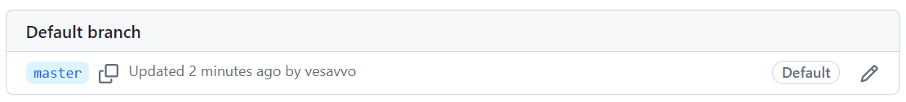
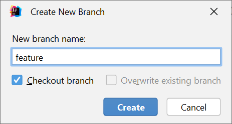
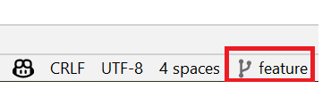
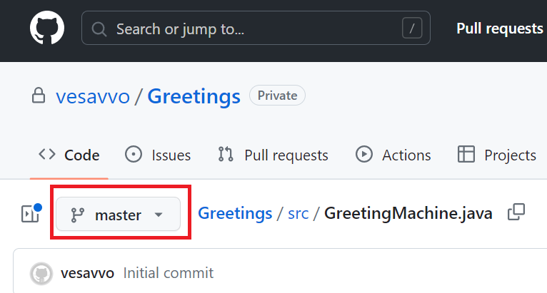
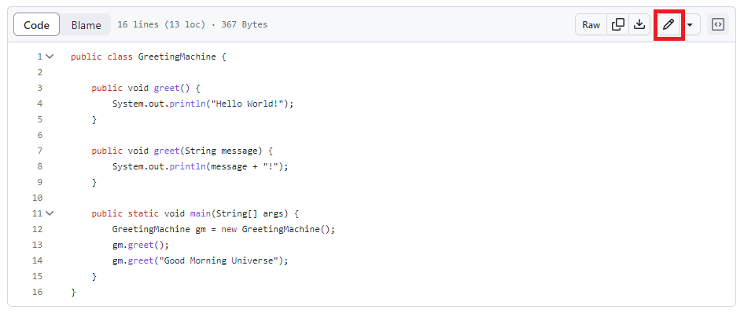
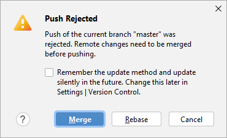
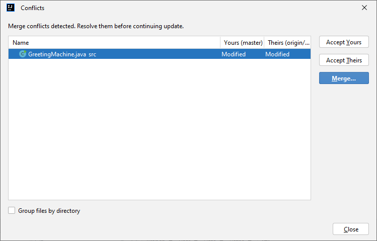
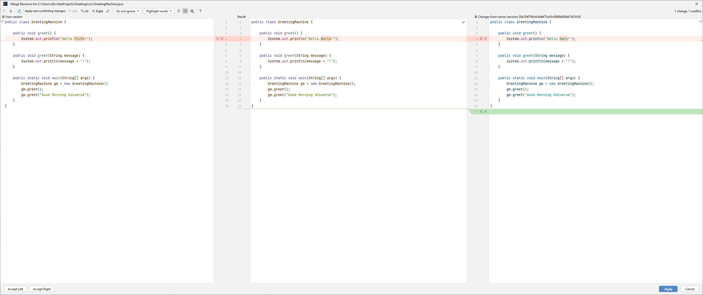

# 4.1. Version control in team work

The goal of this submodule is to learn how to use version control in team work. The submodule is divided into three parts:
the first part is about the basics of version control, the second part is about branches. The third part covers merging and merge conflicts. Finally, we discuss the commit comments, which are crucial for documenting the changes in the project.

## 4.1.1. Basics of version control

In your earlier studies, you have learned the basics of version control. You probably know how to pull, commit, and push changes to a repository. As a quick recap, here are the most important commands:
- **pull** retrieves the latest changes from the remote repository
- **commit** saves the changes to the local repository
- **push** sends the changes to the remote repository

This set of commands is often enough, if you work in a small project as the only developer. However, in a larger project, you need to be able to work in a team. In this case, you need to know how to create branches, merge branches, and resolve merge conflicts.


## 4.1.2. Branches

In GitHub, branches are used to develop features isolated from each other. The `master` branch is the "default" branch when you create a repository. Use other branches for development and merge them back to the `master` branch upon completion.

Let's start with a simple example. We create a new project in IntelliJ Idea and add one class into its `src` folder. The class is called `GreetingMachine`, and it prints out a greeting message. The code is shown below:

```java
public class GreetingMachine {

    public void greet() {
        System.out.println("Hello World!");
    }

    public static void main(String[] args) {
        GreetingMachine gm = new GreetingMachine();
        gm.greet();
    }
}
```

Out of this project, we now create a repository in GitHub. We do this by clicking the **VCS** menu and selecting **Share Project on GitHub**. After this, we can commit and push our changes to the remote repository.

As we share the project in GitHub, an initial branch called `master` is automatically created. This is the default branch in GitHub. We can see the branch in the "Branches" tab in GitHub:



From now on, let's keep the production code in the `master` branch.

We now create a new branch for development. Let's call it `feature`. In IntelliJ IDEA, we can create a new branch by clicking the **Git** menu and selecting **New Branch**:



In the dialog box, the checkbox **Checkout branch** is selected by default. This means that we automatically switch to the new branch after creating it. We can also create a new branch without switching to it. In this case, we need to switch to the new branch manually. Using Git terminology, The Git variable HEAD now points to the current branch. We can see the current branch in the bottom right corner of IntelliJ IDEA:



As this is our development branch, let the development begin!

We add a new method to the `GreetingMachine` class. The new method is also called `greet` but it takes a parameter of type `String`. The code is shown below:

```java
public class GreetingMachine {

    public void greet() {
        System.out.println("Hello World!");
    }

    public void greet(String message) {
        System.out.println(message + "!");
    }

    public static void main(String[] args) {
        GreetingMachine gm = new GreetingMachine();
        gm.greet();
        gm.greet("Good Morning Universe");
    }
}
```

The code works just fine, so we can commit and push our changes to the remote repository:

1. Click **Git / Commit** in the main menu.
2. Type a commit message in the **Commit Message** field. For example, "Add a custom greeting".
3. Click **Commit and Push**. Check that the updated files are selected in the opening dialog box.

When you look at your source code at the GitHub website, you can see that the new method is not there. This is because the new method is in the `feature` branch, and the `master` branch does not know anything about it. You can see the branches in the **Branches** tab in GitHub. Also, when you open a file in GitHub, you can see the branch name in the top left corner of the file:



Just change the branch name to `feature` and you can see the source code of the new method.

## 4.1.3. Merging

In the previous section, we created a new branch called `feature` and added a new method to the `GreetingMachine` class. Now that we are happy with the new code, we want to merge the `feature` branch to the `master` branch. This means that we want to add, or incorporate, the new method to the `master` branch. We can do this in IntelliJ IDEA:

1. Make sure you have both branches checked out and updated to the latest version. You can do this by first switching to the desired branch in the bottom right corner and performing a checkout operation. Then select **Git / Pull** in the main menu.

2.  Swith to the `master` branch. Then click **Git / Merge** in the main menu. Select the `feature` branch in the opening dialog box. Click **Merge**.  IntelliJ IDEA performs the merge operation. If there are no conflicts, the merge is successful. (If you are vigilant, you may  notice a green toaster in the bottom left corner of IntelliJ IDEA. It suggests that you can delete the `feature` branch. You can click that, or delete the branch in the next step.)

3. If the `feature` branch is not needed anymore, we can delete it. Click **Git / Branches** in the main menu. Select the `feature` branch and click **Delete**.

4. Push the changes to the remote repository. Click **Git / Push** in the main menu. Check that the updated files are selected in the opening dialog box.

If you look at the source code in GitHub, you can see that the new method is now in the `master` branch. 


The procedure above provides a nice, systematic way to develop features in a team. However, sometimes things go wrong. For example, you might have made changes to the same file in two different branches. In this case, you get a merge conflict. Let's see how this works in practice.


## 4.1.4 Resolving merge conflicts

Merge conflicts arise when two branches have changed the same part of the same file, and then those branches are merged together.

It is possible for a conflict to occur even if no separate branches have been created. When two developers make changes to the same file and both try to push their changes to the same `master` branch without using any branches, a merge conflict can arise.

In this situation, when both developers attempt to push their changes to the remote repository (called `origin` in Git terminology), Git detects that the changes conflict with each other. This happens because Git cannot automatically determine which changes should be accepted and which should be rejected.

When a conflict arises, Git notifies you and marks the file with a "conflict state." In the conflict state file, you can see the changes made by both developers, and you must manually resolve the conflicts.

Resolving a merge conflict requires collaboration between the developers. Typically, it involves reviewing the conflicting changes and deciding which changes to accept or combining both sets of changes. Once the conflicts are resolved, the file is marked as "conflict resolved," and you can proceed with pushing the changes forward.

Let's generate a situation where a merge conflict occurs.

As a starting point, we have the GreetingMachine class in the `master` branch. Let's pull the latest changes from the remote repository, and check out the `master` branch.

In the `master` branch, we modify the `GreetingMachine` class by changing the `Hello World` text in the `greet` method into `Hello Pluto`:

```java
    public void greet() {
        System.out.println("Hello Pluto!");
    }
```

Now, we commit the change but do not push.

At the same time, we modify the same file directly in the remote repository via the GitHub website. You can do this by clicking the pencil icon in the top right corner of the file:




We change the `Hello World` text in the greet method into `Hello Mars` this time:

```java
    public void greet() {
        System.out.println("Hello Mars!");
    }
```

At the GitHub website, we continue by committing the changes directly to the `master` branch.

Now, we have a situation where the same file has been modified in two different places. Let's see what happens when we try to push the changes in IntelliJ IDEA from the local repository to the remote repository.

In IntelliJ IDEA, we click **Git / Push** in the main menu. The IDE detects the discrepancy between the local and remote repositories, and we get the following dialog box:



Click **Merge** to proceed. Now, we get the following dialog box:



Here, you can click **Accept Yours** or **Accept Theirs** to resolve the conflict. **Accept Yours** means that you want to keep the changes you made in the local repository. **Accept Theirs** means that you want to keep the changes made in the remote repository. It may not be a good habit to routinely click one of these buttons without thinking. You should always carefully consider which changes to keep. 

Let's assume we are not yet sure which changes are worth keeping. It may also be the case that we need to manually craft a combination of the changes.
To keep that choice, we click **Merge**. Now, we get the following dialog box:



Here, we can see:
- the changes made in the local repository on the left
- the changes made in the remote repository on the right
- the merged result in the middle

We can manually edit the result in the middle to resolve the conflict. For example, if we want to keep the text `Hello Pluto!`, we click the arrow button that points from the left to the middle. This means that we want to keep the changes made in the local repository.

When we are done, we can click **Accept Merge**. Now, we can commit and push the changes to the remote repository.

This is how you solve merge conflicts in IntelliJ IDEA. In practice, you should avoid merge conflicts by using branches. However, sometimes conflicts are unavoidable. In this case, you should resolve the conflicts as soon as possible. It is a messy business, but it has to be done.


## 4.1.4. Commit comments

At this point you know the basics of team work using GitHub. There are other features as well, but you can learn them as you go. However, there is one thing that you should know about: commit comments.

It is far too common to follow bad practices when writing commit comments. For example, you might write a comment like "Fix a bug" or "Add a feature". This is not a good practice. The commit comment should always describe what you have done in the commit. For example, "Fix a bug" could be "Fix a bug in the GreetingMachine class". "Add a feature" could be "Add a custom greeting to the GreetingMachine class".

If you ever need to revert to an older version of your code, you use the commit comments to find the version you are looking for. If you have written good commit comments, you can easily find the version you are looking for. If you have written bad commit comments, you are in trouble.

Also, each commit should just span the changes related to a single feature. If you have made changes to multiple files, you should commit the changes to each file separately. This way, you can easily revert the changes to a single file if needed. It is a very bad practice to work for an entire day, and then commit all the changes at once. If you do this, the comments are of little use.

---
_This learning material has been produced with assistance from OpenAI's ChatGPT-4 and GitHub Copilot. These large language models have provided suggestions and solutions that have assisted the author in producing and supplementing the material. While their contribution has been significant, the final responsibility for the content and its correctness resides with the author._
