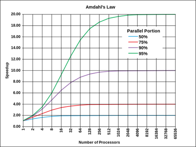
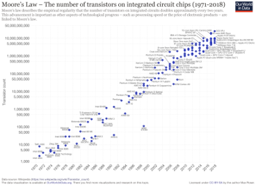

# Threads

<!-- https://openjdk.org/jeps/436 -->

## Parallelism

It is possible to calculate the equation $y(x) = sin(5x) + cos(9x) + exp(x/3)$ in parallel.
If you have more than one calculation unit available, calculating $sin()$, $cos()$ and $exp()$ in three parallel calculation units speeds up the calculation of the equation $y(x)$.

It is not always possible to run things in parallel, e.g., the equation $y(x) = sin(5cos(9exp(x/3)))$ cannot run in parallel because terms depend on each other.

[Amdahl’s law](https://en.wikipedia.org/wiki/Amdahl%27s_law): In parallelization, if $P$ is the proportion of a system or program that can be made parallel, and $1-P$ is the proportion that remains serial, then the maximum speedup $S$that can be achieved using $N$ number of processors is
$$S=1/((1-P)+(P/N))$$

An example: you have two processors ($N=2$) and all your program can be parallelized ($P=1$), then the speedup is $1/(0+½)=2$

Another example: you have four processors ($N=4$), and half of your program can be parallelized ($P=0.5$), then the speedup is $1/(0.5+0.5/4)=1.6$

Maximal speed-up can be found by letting the number of processors go to the infinity
$$\sqrt{3x-1}+(1+x)^2$$

Why we are so much interested about this parallel processing? Due to the advances in silicon process technology, the number of transistors available to construct a processor is increasing all the time.

| Moore's Law                                                                                                                                                                                                                                                                                                                                            |
|--------------------------------------------------------------------------------------------------------------------------------------------------------------------------------------------------------------------------------------------------------------------------------------------------------------------------------------------------------|
| 
 
[Si atom](https://en.wikipedia.org/wiki/Silicon) size &asymp; 2&Aring; (0,2nm) (A strand of human DNA is 2.5 nm). [Up to 2029 shirking dimensions will do](https://spectrum.ieee.org/a-better-way-to-measure-progress-in-semiconductors), then 3D chips will allow Moore’s phenomenon to continue. |
|

We are not able to utilize them anymore so easily in our architectures (e.g., increasing word length or the number of processor registers).
Therefore we need other ways to ”consume” those new logic components (transistors)
- Larger caches
- More processor cores on the same chip &rarr; concurrency (parallelism)

