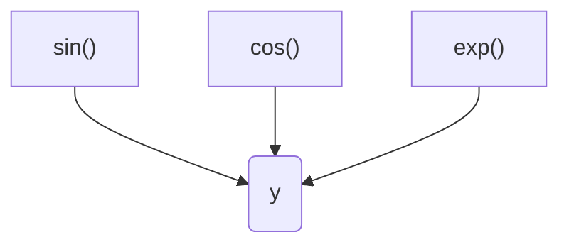
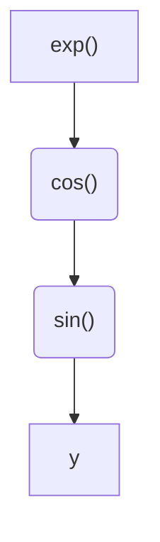
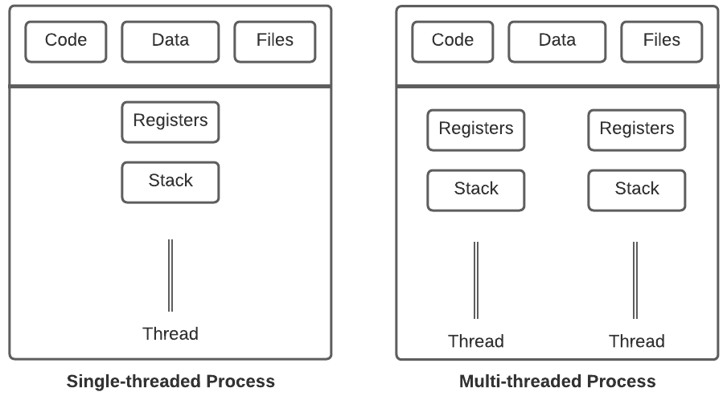
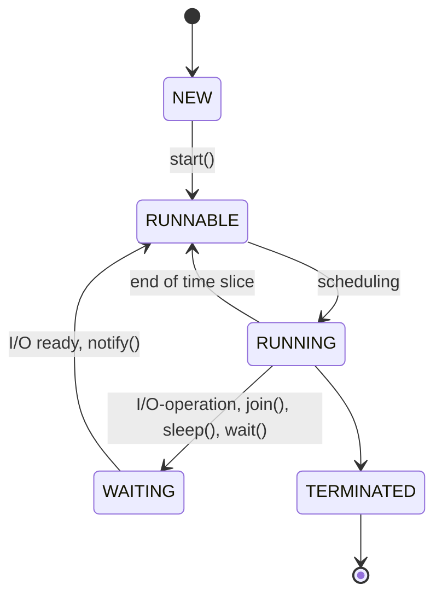

# Parallel processing

<!-- https://openjdk.org/jeps/436 -->
Parallel processing is a computational approach in which multiple tasks or processes are executed *simultaneously* or *concurrently*, with the goal of improving efficiency, performance, and overall throughput. It involves breaking down a larger task into smaller subtasks that can be performed concurrently by multiple processing units, such as CPU cores or separate computing nodes.

*Concurrency* and *parallelism* are related but distinct concepts in the context of computing, particularly in the realm of multi-threaded and multi-core processing. They both deal with managing multiple tasks or threads of execution, but they focus on different aspects of how tasks are handled and executed.

Concurrency refers to the ability of a system to manage and execute multiple tasks or threads in overlapping time intervals. It doesn't necessarily mean that tasks are executed simultaneously. Instead, the focus is on efficiently switching between tasks to give the appearance of simultaneous progress.

Parallelism involves executing multiple tasks or threads simultaneously by utilizing multiple processing units, such as CPU cores or separate computing nodes. Parallelism aims to improve the overall throughput and performance by **truly** running tasks concurrently.

## Parallelism

There are several reasons why parallel processing is used:

1. **Speed and Performance**: By breaking down a task into smaller subtasks and processing them simultaneously, parallel processing can significantly speed up the overall execution time. It allows multiple computations to occur in parallel, harnessing the power of multiple processors or computing resources.

2. **Scalability**: Parallel processing enables systems to handle larger workloads and scale effectively. As data sizes and computational demands increase, parallel processing allows for efficient distribution of tasks across multiple processors or machines, effectively utilizing available resources and avoiding bottlenecks.

3. **Resource Utilization**: With parallel processing, multiple resources can be utilized simultaneously, including CPUs (Central Processing Units), GPUs (Graphics Processing Units), or even distributed computing clusters. This leads to better utilization of hardware resources and increased overall efficiency.

4. **Complex Problem Solving**: Many complex problems can be divided into smaller, more manageable parts that can be solved independently. Parallel processing allows these subproblems to be solved concurrently, accelerating the overall problem-solving process. This is especially useful in fields like scientific research, simulations, and optimization algorithms.

5. **Real-Time Processing**: Certain applications, such as real-time data analysis, signal processing, or video rendering, require rapid processing of continuous streams of data. Parallel processing allows for efficient handling of these time-sensitive tasks by distributing the workload across multiple processors, ensuring timely responses.

It's important to note that not all problems can benefit from parallel processing. Some tasks are inherently sequential and cannot be divided into smaller independent parts. Additionally, parallel processing introduces challenges such as communication overhead, synchronization, and load balancing, which need to be carefully addressed for optimal performance.

### Practical example

It is possible to calculate the equation $y(x) = sin(5x) + cos(9x) + exp(x/3)$ in parallel.
If you have more than one calculation unit available, calculating $sin()$, $cos()$ and $exp()$ in three parallel calculation units speeds up the calculation of the equation $y(x)$.

It is not always possible to run things in parallel, e.g., the equation $y(x) = sin(5cos(9exp(x/3)))$ cannot run in parallel because terms depend on each other.


### Amdahl's Law

[Amdahl’s law](https://en.wikipedia.org/wiki/Amdahl%27s_law): In parallelization, if $P$ is the proportion of a system or program that can be made parallel, and $1-P$ is the proportion that remains serial, then the maximum speedup $S$ that can be achieved using $N$ number of processors is
$$S=1/((1-P)+(P/N))$$
and is drawn in the following figure.


An example: you have two processors ($N=2$) and all your program can be parallelized ($P=1$), then the speedup is $S=1/(0+½)=2$

Another example: you have four processors ($N=4$), and half of your program can be parallelized ($P=0.5$), then the speedup is $S=1/(0.5+0.5/4)=1.6$

Maximal speed-up can be found by letting the number of processors go to the infinity
$$S_{MAX}=\lim_{N\to\infty}\frac{1}{((1-P)+(P/N))}=\frac{1}{1-P}$$

### Implementation of Computing

Why we are so much interested about this parallel processing? Due to the advances in silicon process technology, the number of transistors available to construct a processor is increasing all the time.

| Moore's Law                                                                                                                                                                                                                                                                                                                                                                                                                                                                                                                              |
|------------------------------------------------------------------------------------------------------------------------------------------------------------------------------------------------------------------------------------------------------------------------------------------------------------------------------------------------------------------------------------------------------------------------------------------------------------------------------------------------------------------------------------------|
| <center><br></center>[Si atom](https://en.wikipedia.org/wiki/Silicon) size &asymp; 2&Aring; (0.2nm) (A strand of human DNA is 2.5 nm).<br> [Up to 2029 shrinkage of dimensions will do](https://spectrum.ieee.org/a-better-way-to-measure-progress-in-semiconductors), then 3D chips will allow Moore’s phenomenon to continue. Notice that the vertical axis is logarithmic, i.e., the increase of the number of transistors is related to the number of transistors itself - the growth is exponential. |

We are not anymore able to utilize them so easily in our architectures (e.g., by increasing the word length or the number of processor registers).
Therefore, we need other ways to “consume” those new logic components (transistors)
- Larger caches
- More processor cores on the same chip &rarr; concurrency (parallelism)

As a result, every year, desktop processor manufacturers introduce new processor generations that will have larger and larger number of processor cores in a single silicon chip, and larger size of cache memories.

In order to be able to utilize this increasing computational power, we need to be able to easily express parallel computation in our programming languages. In Java (as in most modern programming languages), the tool for expressing parallel computation is _thread_.

## Threads

In the context of computer programming and operating systems, a _process_ refers to an instance of a computer program that is being executed. It represents the execution environment for a program and includes the program code, its current state, memory, and system resources allocated to it by the operating system.

Processes play a crucial role in enabling multitasking, allowing multiple programs or tasks to execute concurrently on a single system. The operating system manages and coordinates these processes, ensuring their efficient execution and resource utilization.

Process's resources (program code, memory, files) are protected by the operating system. This protection gives us reliability and security. For example, in [Android](https://en.wikipedia.org/wiki/Android_(operating_system)) (which runs on top of Linux operating system) every application run on their own processes. If one application crashes, or goes mad, it does not hurt other applications, because the operating system protects their resources (e.g. memory).

While processes provide isolation and concurrency in computing systems, they also present certain challenges. Here are some common problems associated with processes:

1. High Overhead: Processes have significant overhead compared to other execution units, such as threads. Creating and managing processes require system calls, memory allocation, and context switching, which can be resource-intensive and time-consuming. This overhead limits the scalability and efficiency of process-based solutions.

2. Limited Communication and Synchronization: Interprocess communication (IPC) and synchronization between processes can be complex and less efficient than within-thread communication. Processes typically rely on mechanisms like shared memory, message passing, or file-based communication, which involve data copying and serialization, leading to additional overhead and potential synchronization issues.

3. Resource Consumption: Each process consumes its own memory space, which includes code, data, and stack. Having multiple processes running simultaneously can result in significant memory overhead. Additionally, processes may require separate instances of system resources (e.g., file handles), leading to inefficient resource utilization.

4. Context Switching Overhead: When the operating system switches between processes, it performs a context switch, saving the current process state and restoring the state of the next process to be executed. Context switching introduces overhead due to the need to save and restore registers, memory mappings, and other process-specific data.

5. Limited Scalability: Processes are heavyweight units of execution, which can limit the scalability of process-based systems. Creating and managing a large number of processes may lead to resource exhaustion and degraded performance due to the associated overhead and increased context switching.

6. Lack of Shared Memory: Processes typically have separate memory spaces, making it challenging to share data efficiently between them. Interprocess communication often involves data copying or serialization/deserialization, which can be costly in terms of time and resources.

7. Security and Protection: Processes may pose security concerns as they can access and modify their own memory space as well as resources owned by the operating system. Ensuring proper process isolation and protection mechanisms is crucial to prevent unauthorized access or malicious activities.

To address some of these problems, lightweight execution units like _threads_, which share the same resources and memory space within a process, are often employed. Threads provide faster communication and synchronization, reduced overhead, and improved scalability compared to processes. However, processes remain important for achieving strong isolation and security boundaries between different applications or components.



Note that in modern operating systems, a process contains always at least one thread (of execution). **Rule of thumb: process is (mainly) a unit of protection, thread is a unit of execution.**

Here are some key points about threads:

1. Thread Execution: Threads are independent sequences of instructions that can be scheduled and executed by the operating system. Each thread has its own program counter, stack, and state, allowing it to run concurrently with other threads within the same process.

2. Concurrency: Multithreading allows multiple threads to execute simultaneously on different processors or CPU cores, if available. This can result in improved performance and responsiveness, as threads can work on different tasks concurrently.

3. Shared Resources: Threads within a process share the same resources, such as memory space, file handles, and other process-related attributes. This enables efficient communication and data sharing between threads, as they can directly access shared variables and data structures.

4. Thread Synchronization: In situations where multiple threads access and modify shared resources concurrently, thread synchronization mechanisms, such as locks, semaphores, or mutexes, are used to ensure proper coordination and prevent race conditions or data inconsistencies.

5. Benefits of Threads: Threads provide several advantages, including increased responsiveness in user interfaces, efficient utilization of CPU resources, improved performance for parallelizable tasks, and simplified program structure by enabling concurrent execution.

It's important to note that threads within a process share the same memory space, which means they can also introduce challenges like data races and synchronization issues. Careful design and synchronization techniques are necessary to ensure proper coordination and avoid conflicts when multiple threads access shared resources.

### Java's Threads

#### Java scheduler

In Java, the term "scheduler" typically refers to the mechanisms used by the Java Virtual Machine (JVM) to manage the execution of threads and tasks within a Java program. The scheduler is responsible for allocating CPU time to different threads, determining the order of thread execution, and ensuring that threads run concurrently or in parallel when appropriate.

Java's scheduler operates based on the following concepts:

- **Thread Priority**: Each thread in Java is assigned a priority, which is an integer value that indicates the relative importance of the thread. Threads with higher priority values are given preference by the scheduler. However, thread priorities are only hints to the scheduler, and the actual behavior can vary between different JVM implementations and operating systems.

- **Time Slicing**: The scheduler employs a time-slicing technique to allocate CPU time to different threads. Each thread is given a small time slice to execute before the scheduler switches to another thread. This gives the illusion of concurrent execution, even though the CPU is rapidly switching between different threads.

- **Context Switching**: When the scheduler switches between threads, it performs a context switch, which involves saving the current state of the executing thread (registers, program counter, etc.) and restoring the state of the next thread to be executed. Context switching has some overhead, so minimizing unnecessary context switches is important for optimal performance.

The following diagram shows how the Java scheduler switches between thread states. 


#### Creating Threads

To create a thread of control, you start by creating a `Thread` object
```Java
Thread worker = new Thread();
```
After a `Thread` object is created, you can configure it and then run it. Configuring a thread involves setting its initial priority, name, and so on. When the thread is ready to run, you invoke its `start` method. The `start` method spawns a new thread of control based on the data in the `Thread` object, then returns. Now the Java virtual machine invokes the new thread's `run` method, making the thread active. You can invoke `start` only once for each thread.

When thread's `run` method returns, the thread has exited (stopped and deleted). You can request that a thread cease running by invoking its `interrupt` method - a request well-written thread will always respond to. While a thread is running, you can interact with it in other ways, as we will see later.

The standard implementation of `Thread.run` does nothing. To get a thread that does something you must either extend `Thread` to provide a new `run` method or create a `Runnable` object and pass it to the thread's constructor. Let's first discuss how to create new kinds of threads by extending `Thread`. After that we describe how to use `Runnable` in the next section.

Here is a simple two-threaded application that prints the words "ping" and "PONG" at different rates:
```Java
public class PingPong extends Thread {
    private String word;    // what word to print
    private int    delay;   // how long to pause

    public PingPong(String whatToSay, int delayTime) {
        word = whatToSay;
        delay = delayTime;
    }

    public void run() {
        try {
            while (true) {
                System.out.print(word + " ");
                Thread.sleep(delay);    // wait until next time
            }
        } catch (InterruptedException e) {
            return;                     // end this thread
        }
    }

    public static void main(String[] args) {
        new PingPong("ping", 33).start();   // 1/30 second
        new PingPong("PONG", 100).start();  // 1/10 second
    }
}
```
We define a type of thread called `PingPong`. Its run method loops forever, printing its `word` instance variable and sleeping for `delay` milliseconds (`Thread.sleep(dt)` will stop the execution of the current thread of `dt` milliseconds). `PingPong.run` cannot throw exceptions because `Thread.run`, which it overrides, doesn't throw ay exceptions. Accordingly, we must catch the `InterruptedException` that `sleep` can throw (in case its operation is interrupted by the system).

Now we can create some working thread, and `PingPong.main` does just that. It creates two `PingPong` objects, each with its own word and delay cycle, and invokes each thread object's `start` method. Now the threads are off and running. Here is some example output:
```text
ping PONG ping ping PONG ping ping PONG ping ping PONG ping PONG ping ping PONG ping ping PONG
ping PONG ping ping PONG ping ping PONG ping ping PONG ping PONG ping ping PONG ping ping PONG
ping ping PONG ping ping PONG ping PONG ping ping PONG ping ping PONG ping PONG ping ping PONG
ping ping PONG ping PONG ping ping PONG ping ping PONG ping ping PONG ping ping PONG ping PONG
ping ping PONG ping PONG ping ping PONG ping ping PONG ping ping PONG ping PONG ping ping PONG
ping ping PONG ping ping PONG ping PONG ping ping PONG ping ping PONG ping PONG ping ping PONG
ping ping PONG ping ping PONG ping ping PONG ping PONG ping ping PONG ping ping PONG ping ping
PONG ping PONG ping ping PONG ping ping PONG ping ping PONG ping PONG ping ping PONG ping ping
PONG ping PONG ping ping PONG ping ping PONG ping ping PONG ping PONG ping ping PONG ping ping
PONG ping PONG ping ping PONG ping ping PONG ping ping PONG ping PONG ping ping PONG ping ping
PONG ping PONG ping ping PONG ping ping PONG ping PONG ping ping PONG ping ping PONG ping ping
```
The output contains most of the time a sequence PONG ping ping PONG, but sometimes we get PONG ping PONG sequences. It is a strange thing, because the computer is a deterministic machine that should operate always exactly in the same deterministic way. The reason for this strange behaviour is the operating system who schedules those threads (and processes) to be executed, if the operating system is busy to serve other applications, it may be that our `sleep` function delays the time a little more than it was requested, and one ping is delayed over the PONG.

#### Using `Runnable`

Thread abstracts the concept of a worker—an entity that gets something done. The work done by a thread is packaged up in its `run` method. When you need to get some work done, you need both a worker and the work—the `Runnable` interface abstracts the concept of work and allows that work to be associates with a worker—the thread. The `Runnable` interface declares a single method:
```Java
public void run();
```
The `Thread` class itself implements the `Runnable`interface because a thread can also define a unit of work.

We have seen that `Thread` can be extended to provide specific computation for a thread, but this approach is awkward in many cases. First, a class extension is single inheritance—if you extend a class to make it runnable in a thread, you cannot extend any other class, even if you need to. Also, if your class needs only to be runnable, inheriting all the overhead of `Thread` is more than you need.

Implementing `Runnable` is easier in many cases. You can execute a `Runnable` object in its own thread by passing it to a `Thread`  constructor. If a `Thread` object is constructed with a `Runnable` object, the implementation of `Thread.run` will invoke the runnable object's `run` method.

Let's have a second example which is not easy to implement without threads. We want to have an application which prints out ascending integer numbers at their own line every second. At the same time, we want to read from the keyboard whether the user wants to stop the application. We can read the keyboard by invoking the `Scanner.nextline()` method. But there is a problem with this easy solution—the invoking to this `nextLine()` is blocking. This means that the application will stop the execution of the application when it is waiting for the input. And at the same time when waiting for the keyboard input, we should print those integer numbers.

Now we have to different tasks to be run at the same time. One task is to write numbers periodically to the output, and another task is to read the input to check whether the user has pressed the escape character. Remember that when you start the application, the system has created one thread for you, it is the thread who has invoked your `main` method. Therefore, you need to create only one thread by yourself. Our work is to periodically write ascending numbers to the output. It can be easily implemented as a class who implements the `Runnable` interface:
```Java
import java.util.Scanner;

class ContinuousCounter implements Runnable {
    private int counter;
    
    ContinuousCounter() {
        counter = 1;
    }

    public void run() {
        try {
            while (true) {
                System.out.println(counter++);
                Thread.sleep(1000);  // write one value/second
            }
        } catch (InterruptedException e) {
            System.out.println("Thread interrupted");
            return;
        }
    }
}

public class Main {
    public static void main(String[] args) {
        String   s       = " ";
        Scanner  scanner = new Scanner(System.in);
        Runnable writer  = new ContinuousCounter();
        Thread t         = new Thread(writer);

        t.start();
        while (scanner.nextLine().charAt(0) != 'q');    // wait for the character 'q'
        t.interrupt();
        System.out.println("Program terminated");
    }
}
```
Notice that we store the new thread to a variable `t`. This is because we want to later be able to cancel (or terminate) the operation of the thread when the user presses the 'q' key. This termination is done by calling the `interrupt` method of the thread object.

When you run the application, you get something like this at the output:
```text
1
2
3
4
5
6
7
q8

Program terminated
Thread interrupted
```
The text `Program terminated` appears before `Thread interrupted` because Java does not guarantee that the thread is canceled immediately when you invoke the `interrupt` method.

## Task splitting

When a problem can be divided to separate, non-interfering parts, then it is quite easy to utilize multiple threads to speed up the problem-solving. Let's have an example.

Our task is to scan a matrix to count the number of positive non-zero elements. The code snippet below will do that:
```Java
/* Thread class to count the number of positive elements in a section of a matrix */
public class MatHunter extends Thread {
    int [][] matrix;
    int iLo, iHi, jLo, jHi;
    int found;

    /* constructor gets the matrix and the indices specifying what section to examine */
    MatHunter(int [][] matrix, int iLo, int iHi, int jLo, int jHi) {
        this.matrix = matrix;
        this.iLo = iLo; this.iHi = iHi;
        this.jLo = jLo; this.jHi = jHi;

        found = 0;
    }

    /* examine a section of a 2D matrix and count the number of positive elements */
    public void run() {
        for (int i = iLo; i <= iHi; i++) {
            for (int j = jLo; j <= jHi; j++)
                if (matrix[i][j] > 0)
                    found++;

            // to give the possibility for other threads to run
            yield();
        }
    }

    public int getFound() {
        return found;
    }
}
```

The program `TaskSplitDemo` creates a metrix with a random distribution of zero and non-zero positive elements (note that the newly created matrix is quarantined to have all zero-value elements). Then it finds out how many separate processor cores we have with the `Runtime.getRuntime().availableProcessors()` function call. Then we create the matching number of instances (of `MatHunter`) with their own part of the matrix. Each instance works on the same problem by in a separate, independent section of the matrix.
```Java
import java.util.ArrayList;

public class TaskSplitDemo {
    private static final int N = 2000;

    public static void execute(int[][] matrix, int cores) {
        /* split the task to individual threads */
        ArrayList<MatHunter> mathunters = new ArrayList<>();
        int dy = N/cores;
        int slicey = 0;
        for (int i = 0; i < cores; i++) {
            mathunters.add(new MatHunter(matrix, 0, N-1, slicey, slicey+dy-1));
            slicey += dy;
        }

        /* start treads */
        long start = System.nanoTime();
        for (MatHunter mh : mathunters)
            mh.start();

        /* wait for them to complete their tasks, and collect results */
        int result = 0;
        for (MatHunter mh : mathunters) {
            try {
                mh.join();
            } catch (InterruptedException e) {
                // thread was interrupted, the result may be incorrect
                e.printStackTrace();
            }
            result += mh.getFound();
        }
        long finish = System.nanoTime();
        long timeElapsed = finish - start;
        System.out.println("Time elapsed " + timeElapsed/10e6 + " ms. The result is " + result);
    }

    public static void main(String[] args) {
        int[][] matrix = new int[N][N];

        /* create a matrix having zeros and random number of ones */
        for (int i = 0; i < N; i++)
            for (int j = 0; j < N; j++)
                if (Math.random() > 0.5)
                    matrix[i][j] = 1;

        int cores = Runtime.getRuntime().availableProcessors();
        System.out.println("Our system has " + cores + " processor cores\n");
        System.out.print("1 Thread(s): "); execute(matrix, 1);
        System.out.print("1 Thread(s): "); execute(matrix, 1);
        System.out.print(cores + " Thread(s): "); execute(matrix, cores);
    }
}
```
The execution time of the task is done using `System.nanoTime()` function call. It returns time in nanoseconds (ns). Accuracy and resolution depend on the system, but on modern desktop computer the resolution is typically 100 ns. When you want to calculate how much time is spent on some portion of your code, take first the time when the code starts. Then take another time stamp when the code is ready. Then just calculate the difference between those time stamps; this is the real-time used to run the code block.

<!-- https://www.baeldung.com/java-microbenchmark-harness -->

When we run the `TaskSplitDemo` program, we get results like this:
```text
Our system has 4 processor cores

1 Thread(s): Time elapsed 3.37113 ms. The result is 2001205
1 Thread(s): Time elapsed 2.94012 ms. The result is 2001205
4 Thread(s): Time elapsed 1.07239 ms. The result is 2001205

Our system has 4 processor cores

1 Thread(s): Time elapsed 3.24499 ms. The result is 2000703
1 Thread(s): Time elapsed 2.6543799 ms. The result is 2000703
4 Thread(s): Time elapsed 1.1696699 ms. The result is 2000703
```

## Assignments

**Task 1: Multi-threaded Number Printing**

Write a Java program that uses two threads to print numbers alternately. One thread should print odd numbers, and the other thread should print even numbers. The program should allow specifying a range of numbers to be printed. The output should be something like this:
```text
Odd Thread: 1
Even Thread: 2
Even Thread: 4
Even Thread: 6
Even Thread: 8
Even Thread: 10
Even Thread: 12
Even Thread: 14
Even Thread: 16
Even Thread: 18
Even Thread: 20
Odd Thread: 3
Odd Thread: 5
Odd Thread: 7
Odd Thread: 9
Odd Thread: 11
Odd Thread: 13
Odd Thread: 15
Odd Thread: 17
Odd Thread: 19
Printing complete.
```

**Task 2: Parallel Number Summation**

Create a Java program that calculates the sum of numbers in parallel using multiple threads. In this exercise, each thread calculates the sum of a portion of the numbers.

For this assignment, you get points in the following way:
1. Task 1 completed: 3 points
2. Task 2 completed: 3 points
