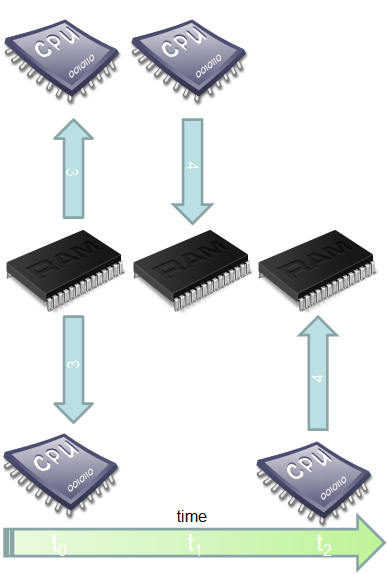
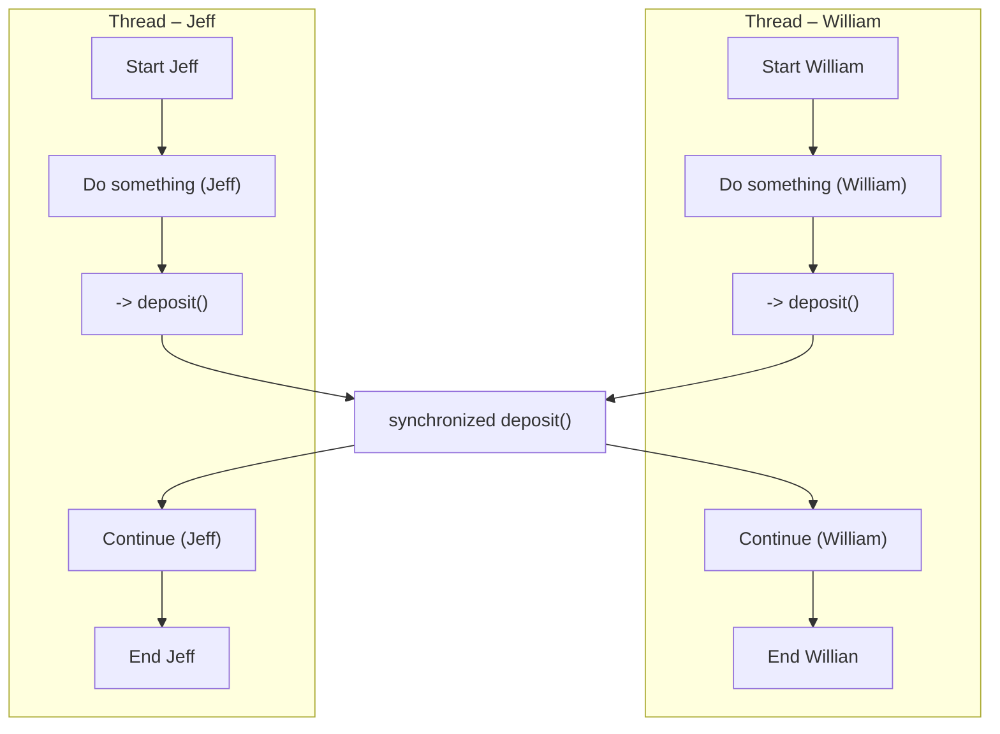

# Synchronization

## An example

We would like to implement a bank account. We should be able to deposit and withdraw money, and check the saldo of the bank account. [Floating point numbers](https://en.wikipedia.org/wiki/doubleing-point_arithmetic) have only finite precision available (Java `double` type conforms [IEEE 754 floating-Point Standard](https://en.wikipedia.org/wiki/IEEE_754), and has 15 digits precision). If you have to deal with huge sums of money, accuracy of `double` datatype may not be enough, i.e., you are not able to represent single euros when your values are in Quadrillions. That is not acceptable when we are dealing with money.
> If you execute the following Java-statement `System.out.println(0.1 + 0.2);`, you will get `0.30000000000000004` as a result. This is because of the limited precision of the `double` datatype.
 
For those cases when we need to be able to represent huge values with full precision, we have `BigInteger` package in Java. [BigInteger](https://docs.oracle.com/javase/8/docs/api/java/math/BigInteger.html) is able to represent numbers in range $-2^{2^{31}}...+2^{2^{31}}$ with full accuracy which should enough for most of the requirements (Note: the number of stars that exist in the universe is about $10^{21}$ which fits easily to the BigInteger). Because we are dealing with money in this application, we choose to use `BigInteger` to represent our values.

To have multiple independent accounts, we build the account as a class (so that the reusing of it is straightforward, simply create a new account object with `new`-operator):
```Java
import java.math.BigInteger;

class Account {
    private BigInteger credit;

    public Account() {
        credit = BigInteger.ZERO;       // 0 to credit
    }

    public void deposit(BigInteger amount) {
        credit = credit.add(amount);
    }

    public boolean withdraw(BigInteger amount) {
        BigInteger result = credit.subtract(amount);

        if (result.signum() == -1) {    // test whether the result is negative
            return false;
        } else {
            credit = result;
            return true;
        }
    }

    public BigInteger getSaldo() {
        return credit;
    }
}
```

Then we want to have individuals who deposit money to the bank account. Again, we want to have many of them, so we create a `Depositor` class. This class is also a worker (depositing money to an account is work), and we want that this work can be done simultaneously with other depositors. Thus, we implement `Runnable` interface here:
```Java
// Depositor is our worker here
class Depositor implements Runnable {
    private Account account;
    private int     n;

    public Depositor(Account account, int n) {
        this.account = account;
        this.n       = n;
    }

    public void run() {
        for (int i = 0; i < n; i++)
            account.deposit(BigInteger.ONE);    // we deposit 1 (unit of money)
    }
}
```

Then in the `main` method, we create two depositor workers, william and jeff. Start their work, and then we wait for them to have completed their work using the `join` method.
```Java
public class Main {
    static final int N = 1000;
    static final int M = 10;

    public static void main(String[] args) {
        for (int i = 0; i < M; i++) {
            Account account = new Account();

            Thread william = new Thread(new Depositor(account, N));
            Thread jeff = new Thread(new Depositor(account, N));

            // depositors start their work
            william.start(); jeff.start();

            // here we wait for them to be ready
            try {
                william.join(); jeff.join();
            } catch (InterruptedException e) {
            }

            System.out.println("Account balance is: " + account.getSaldo());
        }
    }
}
```
Both depositors deposit 1000 times 1€. Therefore, the account balance after the deposits should be 2000€. But when we run the application, we will get various results:
```text
Account balance is: 1029
Account balance is: 2000
Account balance is: 2000
Account balance is: 1134
Account balance is: 2000
Account balance is: 1000
Account balance is: 1099
Account balance is: 1959
Account balance is: 2000
```
There are correct answers, but a lot of incorrect results. The output seems random, aren't computers deterministic machines? 

## The problem

Let's analyze what happens in the statement
```Java
credit = credit.add(amount);
```
We can model this statement as
```Java
credit = credit + amount;
```
Now we need to think a little how the computer evaluates this statement. The variable `credit` is stored in the central memory (RAM). It needs to be read from the memory to the processor (CPU) register. Then we can add the content of another memory location, variable `amount`, to it. After we have done the addition, the result should be written back to the memory, where the variable `credit` resides.


As a matter of fact, an addition is made of three operations: 
1. Read the current value of variable
2. Add another value to the current value
3. Write that new value to variable

When you run that code using a single thread, there are no problems.
It will execute each part of the operation one after another.
But when you have several threads, you can start having troubles.



Imagine this situation:
1. Thread 1 : read the value, get 3, add 1, so value = 4
2. Thread 2 : read the value, get 3, add 1, so value = 4
3. Thread 1 : write 4 to the field value and return 4
4. Thread 2 : write 4 to the field value and return 4

These situations come from what we call interleaving. Interleaving describe the possible situations of several threads executing some statements.
Even for three operations and two threads, there are a lot of possible interleaving. When you have more threads and more operations, it is almost impossible to enumerate the possible interleavings.
The problem can also occur when a thread gets preempted between instructions of the operation. This phenomenon is called a [data race](https://www.mathworks.com/products/polyspace/static-analysis-notes/what-data-races-how-avoid-during-software-development.html).

To fix the problem, we need to make the addition operation indivisible, i.e., when one thread starts the operation, it should be able to complete the operation before any other thread will start the same operation. This kind of operation is called as an [atomic operation](https://wiki.osdev.org/Atomic_operation).

## The solution

There are [several solutions](https://en.wikipedia.org/wiki/Synchronization_(computer_science)) to fix this problem: 
- Semaphores
- Atomic references
- Monitors
- Condition codes
- Compare and swap
- etc.

### The Java synchronized Keyword

Synchronized blocks in Java are marked with the `synchronized` keyword. A synchronized block in Java is synchronized on an object. All synchronized blocks synchronized on the same object can only have one thread executing inside them at the same time. All other threads attempting to enter the synchronized block are blocked until the thread inside the synchronized block exits the block.

The synchronized keyword can be used to mark four different types of blocks:
1. Instance methods
2. Static methods
3. Code blocks inside instance methods
4. Code blocks inside static methods

These blocks are synchronized on different objects. Which type of synchronized block you need depends on the concrete situation.

### Synchronized Instance Methods

Here is a synchronized instance method:
```Java
import java.math.BigInteger;

class Account {
private BigInteger credit;

    public Account() {
        credit = BigInteger.ZERO;       // 0 to credit
    }

    public synchronized void deposit(BigInteger amount) {
        credit = credit.add(amount);
    }

    public synchronized boolean withdraw(BigInteger amount) {
        BigInteger result = credit.subtract(amount);

        if (result.signum() == -1) {    // test whether the result is negative
            return false;
        } else {
            credit = result;
            return true;
        }
    }

    public BigInteger getSaldo() {
        return credit;
    }
}
```
Notice the use of the synchronized keyword in the `deposit` method declaration. This tells Java that the method is synchronized.

A synchronized instance method in Java is synchronized on the instance (object) owning the method. Thus, each instance has its synchronized methods synchronized on a different object: the owning instance.

Only one thread per instance can execute inside a synchronized instance method. If more than one instance exist, then one thread at a time can execute inside a synchronized instance method per instance. One thread per instance.

This is true across all synchronized instance methods for the same object (instance). Thus, in the previous example, only one thread can execute inside either of of the two synchronized methods. One thread in total per instance.

Now when we run the application, the results are correct:
```text
Account balance is: 2000
Account balance is: 2000
Account balance is: 2000
Account balance is: 2000
Account balance is: 2000
Account balance is: 2000
Account balance is: 2000
Account balance is: 2000
Account balance is: 2000
```

A visual representation of synchronized method:


### Synchronized Blocks in Instance Methods
You do not have to synchronize a whole method. Sometimes it is preferable to synchronize only part of a method. Java synchronized blocks inside methods make this possible.

Here is a synchronized block of Java code inside an unsynchronized Java method:
```Java
public void deposit(BigInteger amount) {
    // here we can have unsychronized tasks
    synchronized(this) {
        credit=credit.add(amount);
    }
    // here we can have unsychronized tasks
}
```    
This example uses the Java synchronized block construct to mark a block of code as synchronized. This code will now execute as if it was a synchronized method.

Notice how the Java synchronized block construct takes an object in parentheses. In the example `this` is used, which is the instance the add method is called on. The object taken in the parentheses by the synchronized construct is called a monitor object. The code is said to be synchronized on the monitor object. A synchronized instance method uses the object it belongs to as monitor object.

Only one thread can be executed inside a Java code block synchronized on the same monitor object.

## Thread Safety

We have noticed that building concurrent programs requires the correct use of threads and locks. But they are just mechanisms—means to an end. Writing thread-safe code is, at its core, about managing access to *state*, and in particular to *shared*, *mutable state*.

Informally, an object's *state* is its data, stored in *state variables* such as instance or static fields. An object's state may include fields from other, dependent objects; a `HashMap`'s state is partially stored in the `HashMap` object itself, but also in many `Map.Entry` objects. An object's state encompasses any data that can affect its externally visible behaviour.

By *shared*, we mean that a variable could be accessed by multiple threads; by *mutable*, we mean that its value could change during its lifetime. We may talk about thread safety as if it were about *code*, but that we are really trying to do is protect *data* from uncontrolled concurrent access.

Whether an object needs to be thread-safe depends on whether it will be accessed from multiple threads. This is a property of how the object is *used* in a program, not what it *does*. Making an object thread-safe requires using synchronization to coordinate access to its mutable state; failing to do so could result in data corruption and other undesirable consequences.

*Whenever more than one thread accesses a given state variable, and one of them might write to it, they all must coordinate their access to it using synchronization*. The primary mechanism for synchronization is Java is the `syncronized` keyword, which provides exclusive locking, but the term "syncronization" also includes the use of other Java tools ([`volatile` variables](https://jenkov.com/tutorials/java-concurrency/volatile.html), [explicit locks](https://docs.oracle.com/javase/8/docs/api/java/util/concurrent/locks/Lock.html), and [atomic variables](https://docs.oracle.com/javase/8/docs/api///?java/util/concurrent/atomic/package-summary.html)).

You should avoid the temptation to think that there are "special" situations in which this rule does not apply. A program that omits necessary synchronization might appear to work, passing its tests and performing well for years, but it is still broken and may fail at any moment.

If multiple threads access the same mutable variable without appropriate synchronization, *your program is broken*. There are three ways to fix it:
- *Don't share* the state variable across threads
- Make the state variable *immutable*
- Use *synchronized* whenever accessing the state variable

When designing thread-safe classes, good object-oriented techniques—encapsulation, immutability, and clear specification of invariants—are your best friends.

### What is a thread safety

>A class is *thread-safe* if it behaves correctly when accessed from multiple threads, regardless of the scheduling or interleaving of the execution of those threads by the runtime environment, and with no additional synchronization or other coordination on the part of the calling code.

Thread-safe classes encapsulate any needed synchronization so that clients need not provide their own.

<!-- https://jenkov.com/tutorials/java-concurrency/synchronized.html -->

## Assignments

**Task 1: Ticket Reservation System**

Create a Java program that simulates a ticket reservation system for a limited number of seats in a theater. Implement synchronization to ensure that multiple threads representing customers can reserve seats without exceeding the available capacity.

One possibility for the output:
```text
Customer 2 reserved 1 tickets.
Customer 5 reserved 2 tickets.
Customer 1 reserved 2 tickets.
Customer 3 reserved 3 tickets.
Customer 4 reserved 1 tickets.
Customer 6 couldn't reserve 2 tickets.
Customer 7 reserved 1 tickets.
Customer 9 couldn't reserve 3 tickets.
Customer 8 couldn't reserve 1 tickets.
Customer 10 couldn't reserve 3 tickets.
Customer 11 couldn't reserve 2 tickets.
Customer 14 couldn't reserve 4 tickets.
Customer 15 couldn't reserve 3 tickets.
Customer 12 couldn't reserve 4 tickets.
Customer 13 couldn't reserve 1 tickets.
```

**Task 2: Thread-safe**

Assuming `ArrayList` is not thread-safe, design a class that has methods for adding an element to an `ArrayList` collection, querying the size of the collection, and removing an element from the collection. The elements may be any objects of your choice, such as Strings. The class you design should be thread-safe. Design a class that you can use to test thread-safety of your class.

For this assignment, you get points in the following way:
1. Task 1 completed: 3 points
2. Task 2 completed: 3 points
