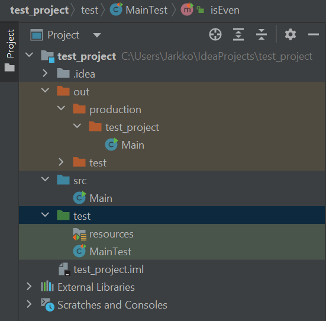

# Testing

How many 'F' characters are you able to find?
```text
FINISHED FILES ARE THE RESULT OF YEARS OF SCIENTIFIC STUDY
COMBINED WITH THE EXPERIENCE OF YEAR
```
Should we check that using a computer? - Yes, every time it is possible!

## Unit testing

Unit testing is a software testing methodology where individual units or components of a software application are tested to ensure their correctness and proper functioning. The purpose of unit testing is to isolate and verify the behavior of each unit of code in isolation, ensuring that it works as intended and does not have any unintended side effects.

Unit tests are typically written by developers and focus on testing small, independent units of code, such as functions, methods, or classes, in isolation from the rest of the application. The idea is to test each unit of code independently to ensure that it produces the expected output given specific inputs, and that it handles various scenarios and edge cases correctly.

Unit testing offers several benefits, including:

1. Early detection of defects: By testing individual units of code, defects can be identified and fixed early in the development process, preventing them from propagating to other parts of the application.

2. Simplified debugging: When a unit test fails, it provides a clear indication of which specific unit of code is causing the problem, making it easier to locate and fix the issue.

3. Code maintainability: Unit tests act as documentation for the expected behavior of units of code. They serve as a safety net when making changes or refactoring code, ensuring that existing functionality remains intact.

4. Improved design and modularity: Unit testing encourages developers to write modular, loosely coupled code that can be tested independently, leading to more maintainable and extensible software.

In the context of Unity, unit testing can be performed using various testing frameworks such as NUnit, Unity Test Framework, or third-party frameworks like MSTest or xUnit.NET. These frameworks provide APIs and utilities to write and execute unit tests within the Unity environment.

Unity unit tests typically focus on testing individual scripts or components within the game or application, checking their behavior, interactions, and responses to different inputs or conditions. This helps ensure that game mechanics, logic, and functionality work correctly and that changes or updates to the codebase don't introduce regressions.

Unit testing in Unity often involves creating test cases that simulate specific scenarios, setting up the required objects or dependencies, invoking methods or functions, and asserting that the actual results match the expected results.

By incorporating unit testing into the development process, developers can gain confidence in the reliability and correctness of their code, leading to more robust and stable applications.

## JUnit 5

JUnit 5 is a popular testing framework for Java applications, including those developed with Unity. It is the next major version of JUnit, introducing several new features and improvements over its predecessor, JUnit 4.

JUnit 5 provides a comprehensive and flexible platform for writing and executing unit tests in Java. It offers a rich set of annotations, assertions, and APIs to support various testing scenarios and methodologies. Some key features of JUnit 5 include:

1. Modularity: JUnit 5 is designed with a modular architecture, allowing developers to use only the modules they need. The framework consists of three main modules: JUnit Platform, JUnit Jupiter, and JUnit Vintage. The JUnit Platform serves as the foundation for test execution, while JUnit Jupiter provides the programming model and annotations for writing tests. JUnit Vintage supports running tests written in JUnit 3 and 4.

2. Annotations: JUnit 5 introduces new annotations for test configuration and execution. Some commonly used annotations include `@Test` for marking test methods, `@BeforeEach` and `@AfterEach` for setup and teardown actions before and after each test, `@BeforeAll` and `@AfterAll` for setup and teardown actions before and after all tests, and many more.

3. Assertions: JUnit 5 provides a comprehensive set of assertion methods for verifying expected conditions in tests. These assertions are more expressive and flexible compared to previous versions of JUnit. They include methods like `assertEquals()`, `assertTrue()`, `assertThrows()`, `assertTimeout()`, and others, making it easy to check values, conditions, exceptions, and performance characteristics.

4. Parameterized Tests: JUnit 5 introduces the ability to write parameterized tests, where a single test method is executed multiple times with different sets of parameters. This is useful for testing the same functionality with different inputs or configurations, reducing code duplication and improving test coverage.

5. Extensions: JUnit 5 supports the use of extensions to enhance test capabilities and add additional behaviors. Extensions can be used to perform actions before and after tests, provide custom test instance lifecycle management, modify test behavior, or even create custom annotations. Extensions allow developers to extend and customize the testing framework according to their specific needs.

6. Dynamic Tests: JUnit 5 introduces dynamic tests, which are generated at runtime based on some logic or data. Dynamic tests allow for more flexible and programmatically generated test cases, enabling scenarios where the number or structure of tests is determined dynamically during test execution.

To use JUnit 5 with Unity, you can add the necessary JUnit 5 libraries as dependencies to your project and write test classes and methods using the JUnit 5 annotations and assertions. You can then execute the tests using an IDE, build tools like Gradle or Maven, or the JUnit console launcher.

JUnit 5 offers a modern and powerful testing framework for Java, providing developers with improved flexibility, readability, and maintainability when writing unit tests.

<!-- https://java-programming.mooc.fi/part-6/3-introduction-to-testing -->

### IntelliJ IDEA JUnit 5 Set-up 

By default, IntelliJ IDEA uses its own project management system, IntelliJ IDEA projects. In order to be able to use JUnit 5 framework for testing, you need to prepare IntelliJ IDEA for testing, follow the instructions at this [link](https://www.jetbrains.com/help/idea/testing.html). In summary, you need to:
1. Add testing libraries (JUnit) to your project. After this, the editor is able to recognize JUnit annotations (e.g. `@test`).
2. Then you need to create Test Sources Root directory. Follow the instructions carefully.

Your project structure should look like this:


Now you are able to create JUnit tests. First create the following Main class to be tested:
```Java
public class Main {
    public static boolean isEven(int number) {
        return ((number % 2) == 0);
    }

    public static void main(String[] args) {
        int n = 3;

        System.out.println("Number " + n + " is even: " + isEven(n));
    }
}
```

Then create the JUnit test class. Follow the instructions presented [here](https://www.jetbrains.com/help/idea/create-tests.html), press `Alt+Enter` when the cursor caret is over the `Main` class name. Insert the following code to the `MainTest` class you created:
```Java
import org.junit.jupiter.api.*;

import static org.junit.jupiter.api.Assertions.*;

class MainTest {
    @BeforeAll
    static void beforeAll() {
        System.out.println("**--- Executed once before all test methods in this class ---**");
    }

    @BeforeEach
    void beforeEach() {
        System.out.println("**--- Executed before each test method in this class ---**");
    }

    @Test
    void isEven() {
        System.out.println("**--- Test isEven executed ---**");
        assertEquals(false, Main.isEven(3));
        assertEquals(true, Main.isEven(2));
    }

    @Test
    void testMethod1() {
        System.out.println("**--- Test method1 executed ---**");
    }

    @DisplayName("Test method2 with condition")
    @Test
    void testMethod2() {
        System.out.println("**--- Test method2 executed ---**");
    }

    @Test
    @Disabled("implementation pending")
    void testMethod3() {
        System.out.println("**--- Test method3 executed ---**");
    }

    @AfterEach
    void afterEach() {
        System.out.println("**--- Executed after each test method in this class ---**");
    }

    @AfterAll
    static void afterAll() {
        System.out.println("**--- Executed once after all test methods in this class ---**");
    }
}
```
When you run the test according [these](https://www.jetbrains.com/help/idea/performing-tests.html) instructions, you should get the output like this:
```text
**--- Executed once before all test methods in this class ---**
**--- Executed before each test method in this class ---**
**--- Test isEven executed ---**
**--- Executed after each test method in this class ---**
**--- Executed before each test method in this class ---**
**--- Test method1 executed ---**
**--- Executed after each test method in this class ---**
**--- Executed before each test method in this class ---**
**--- Test method2 executed ---**
**--- Executed after each test method in this class ---**

implementation pending
**--- Executed once after all test methods in this class ---**

Process finished with exit code 0
```

<!- https://www.digitalocean.com/community/tutorials/junit5-tutorial-->

<!-- Tänne myös IntellJ:n debuggerin demoa -->