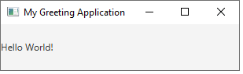
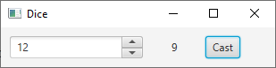
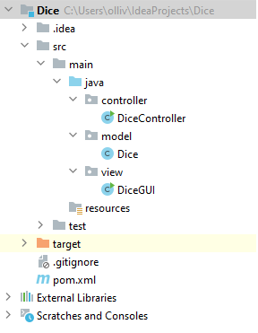

# 6.1. Principles of GUI, events, MVC model

In this submodule, you learn to write graphical user interfaces (GUIs) in Java. You also learn about event-driven programming and the MVC model.

Event-driven programming is a programming paradigm in which the flow of the program is determined by events such as user actions (mouse clicks, key presses) or messages from other programs. The program responds to events by calling methods that handle the events.

The MVC model, on the other hand, is a design pattern that separates the data (model) from the user interface (view) and the logic (controller). The model contains the data and the methods that operate on the data. The view contains the user interface components. The controller contains the methods that handle events and update the model and the view.

The MVC model is the most important design pattern for a Java programmer. It brings clarity to the design of a program and makes it easier to maintain and extend the program. From now on, you should always use the MVC model when you write a Java program (except for very simple programs).

## 6.1.1. Installing JavaFX

The easiest way to install JavaFX into your program is to use [Maven](https://maven.apache.org/). Maven is a build automation tool used primarily for Java projects. It is used to manage the dependencies of a project, i.e., the libraries that the project depends on. When you use Maven, you can often skip the tedious task of downloading and installing the libraries manually.

In IntelliJ Idea, you can build a new Maven project by selecting **File / New / Project...** and the selecting **New Project** on the left. Then, select Maven as the build tool.

In the new project, you will have a file called **pom.xml**. This file contains the dependencies of the project. The file follows [XML format](https://aws.amazon.com/what-is/xml/), which is a commonly used format for storing structured data. You may notice that the format resembles HTML a lot.

In the **pom.xml** file, the dependencies are added inside the ```<dependencies>``` tag that does not exist at this point. To add the dependencies, copy-paste the following code into the `pom.xml` file, right after the **properties** element:

```xml
   <dependencies>
        <dependency> <groupId>org.openjfx</groupId> <artifactId>javafx</artifactId> <version>20.0.1</version> <type>pom</type> </dependency>
        <dependency> <groupId>org.openjfx</groupId> <artifactId>javafx-graphics</artifactId> <version>20.0.1</version> </dependency>
        <dependency> <groupId>org.openjfx</groupId> <artifactId>javafx-fxml</artifactId> <version>20.0.1</version> </dependency>
        <dependency> <groupId>org.openjfx</groupId> <artifactId>javafx-controls</artifactId> <version>20.0.1</version> </dependency>
    </dependencies>

```

Once added, load the libraries by right-clicking on the **pom.xml** file and selecting **Maven / Sync Project**.

Now you are ready to write JavaFX programs.

> [Oracle Corporation](https://www.oracle.com/corporate/), the company that develops Java, has moved JavaFX to a separate library. This means that JavaFX is no longer included in the Java Development Kit (JDK) by default. This is the reason we use Maven to install JavaFX. The JavaFX library is developed by the [OpenJFX community](https://openjfx.io/), which is an open-source project that develops JavaFX. The OpenJFX community is supported by Oracle Corporation, but it is not directly controlled by Oracle. This means that the development of JavaFX is now more open and community-driven than it was before.

## 6.1.2. Overview of a user interface

The key concepts of a JavaFX user interface are the following:
- Stage: The main window of the application.
- Scene: The contents of the stage. The scene contains the user interface components.
- Control: A component that the user can interact with. For example, a button is a control.


A stage contains one scene. It is possible to change the scene of a stage. A scene contains a component, or usually, an entire tree of components. If the scene contains more than one component, a container component is used. A container component is a component that contains other components. Each container component has a layout that determines the position of the components inside the container. We will use containers and layouts slightly later.

## 6.1.3. A sample GUI application

Let's start with a simple application that just prints "Hello World!" on the screen. The application consists of two classes: `HelloWorld` and `HelloWorldApplication`. For now, we place these classes inside the **src/main/java** folder.

The `HelloWorld` class contains the main method. It creates an instance of the `HelloWorldApplication` class and calls its `launch` method. The `launch` method starts the application.

```java
public class HelloWorld {
    public static void main(String[] args) {
        HelloWorldApplication.launch(HelloWorldApplication.class);
    }
}
```

To ensure the proper startup of a JavaFX application, the launch method needs to be initiated from a separate class, as is shown above.

The `HelloWorldApplication` class builds the user interface:

```java
import javafx.application.Application;
import javafx.scene.Scene;
import javafx.scene.control.Label;
import javafx.stage.Stage;

public class HelloWorldApplication extends Application {
    public void start(Stage window) {
        Label text = new Label("Hello World!");
        Scene view = new Scene(text);
        window.setTitle("My Greeting Application");
        window.setScene(view);
        window.show();
    }
}
```

The `start` method is called by the JavaFX library after the application has started. The method is passed an object named `window` that represents the stage of the application. The method creates the user interface and sets it as the contents of the stage.

In the code, we create a label that contains the text "Hello World!". Then, we create a scene that contains just the label as its content. Finally, we set the scene of the stage and show the stage.

The **window** object passed as a parameter to the `start` method is the stage of the application. The stage is created automatically by the JavaFX library. 

The title of the window is set with the `setTitle` method defined in the **Stage** class.

The result of the program is the following:



At this point, the first JAvaFX program is ready. In the next section, we learn how to create more complex user interfaces and make the application react to user actions.

## 6.1.4. Containers and layouts

Next, we create another application that contains more than one component. The application contains a label and a button. When the user clicks the button, the text in the label changes.

As we now need to put two components into the scene, a label and a button, we need a container component. The container component that we use is called `FlowPane`. The `FlowPane` is a container that places the components in a row. If the row becomes full, the components are placed in the next row.

Let's replace the previous `HelloWorldApplication` class with the following code:

```java
import javafx.application.Application;
import javafx.scene.Scene;
import javafx.scene.control.Button;
import javafx.scene.control.Label;
import javafx.scene.layout.FlowPane;
import javafx.stage.Stage;

public class HelloWorldApplication extends Application {
    public void start(Stage window) {
        Label text = new Label("Hello World!");
        Button button = new Button("Click me!");
        FlowPane componentGroup = new FlowPane();
        componentGroup.getChildren().add(text);
        componentGroup.getChildren().add(button);
        Scene view = new Scene(componentGroup);
        window.setTitle("My Greeting Application");
        window.setScene(view);
        window.show();
    }
}
```

In the code, we create a button and a label. Then, we create a `FlowPane` container and add the button and the label into it. Finally, we create a scene that contains the `FlowPane` as its content.

The components are placed in the `FlowPane` in the order they are added. In this case, the label is added first, so it is placed on the left and the button is placed on the right. The `FlowPane` is not only a container but a layout. A layout is a container that not only contains other elements but also determines the position of the elements inside it.

The result of the program is the following:


Try to adjust the width and the height of the window. You will notice that the `FlowPane` container automatically adjusts the size of the components so that they are stacked either horizontally or vertically depending on the size of the window.

> At this point you may notice that the content of the scene looks quite cramped: there are no margins between the components. We will fix this later.

## 6.1.5. Event-driven programming

Next, we make the application react to user actions. We want to change the text of the label when the user clicks the button. To do this, we need to add an event handler to the button. The event handler is a method called when the user clicks the button.

The event handler is added to the button with the `setOnAction` method. The method is passed the event handler as a parameter. The event handler is an object that implements the `EventHandler` interface. The `EventHandler` interface defines one method, `handle`, that is called when the event occurs.

Let's replace the `HelloWorldApplication` class with the following code:

```java
import javafx.application.Application;
import javafx.event.ActionEvent;
import javafx.event.EventHandler;
import javafx.scene.Scene;
import javafx.scene.control.Button;
import javafx.scene.control.Label;
import javafx.scene.layout.FlowPane;
import javafx.stage.Stage;

public class HelloWorldApplication extends Application {
    public void start(Stage window) {
        Label text = new Label("Hello World!");
        Button button = new Button("Click me!");
        FlowPane componentGroup = new FlowPane();
        componentGroup.getChildren().add(text);
        componentGroup.getChildren().add(button);
        button.setOnAction(new EventHandler<ActionEvent>() {
            public void handle(ActionEvent event) {
                text.setText("Hello Universe!");
            }
        });
        Scene view = new Scene(componentGroup);
        window.setTitle("My Greeting Application");
        window.setScene(view);
        window.show();
    }
}
```

In the example above, the event handler is written as an anonymous inner class. The event handler is passed as a parameter to the `setOnAction` method. The `setOnAction` method is defined in the `Button` class.

When the user clicks the button, the `handle` method is called. The `handle` method changes the text of the label to "Hello Universe!".

Now you can write a simple application that reacts to user inputs. In the next section, we will write a more complex application that uses the MVC model.

## 6.1.6. The MVC model

MVC model is the most commonly used design pattern in object-oriented programming. The MVC model is used to separate the user interface from the application logic. The MVC model consists of three components:

1. Model (M): The model contains the application logic and the data of the application.
2. View (V): The view contains the user interface.
3. Controller (C): The controller is the link between the model and the view. The controller updates the view when the model changes and updates the model when the user interacts with the view.

Applying MVC model adds clarity to the structure of the application. The MVC model also makes it easier to modify the application. For example, if you want to change the user interface, you only need to modify the view. The model and the controller remain unchanged.

Due to these obvious benefits, the MVC model is used in many JavaFX applications, and it should be used in all applications that are more complex than the simple applications that we have written so far.

Next, we create another JavaFX application which is slightly more complex in logic. The application implements an electronic dice that can be used to play board games. The application has a button that rolls the dice. When the user clicks the button, the application generates a random number between 1 and 6 and displays it on the screen. The user interface also provides the possibility to change the number of sides of the dice. Thus, you can use the application to throw a regular 6-side dice, or, if you wish, a role-player's dice with 20 sides.

The following image shows the user interface of the application:



Again, the user interface implementation is bare-bones: it lacks labels and other elements that would make it more user-friendly. These can be added later.

As we use MVC model, we make the project structure reflect this. We create three packages: `model`, `view`, and `controller`.
The following image shows the structure of the project:




The `model` package contains the model of the application. The model classes implement the application logic and store the data of the application. In this case, the model contains one class called `Dice`. The `Dice` class contains the number of sides of the dice and the current value of the dice. The `Dice` class also has methods for rolling the dice and for changing the number of faces of the dice.

The `view` package contains the user interface of the application. In this case, the view has a single class called `DiceGUI`. The user interface, in turn, contains a button for rolling the dice, a label for displaying the value of the dice, and a spinner for changing the number of sides of the dice.

Finally, the `controller` package contains the controller of the application. The controller is the link between the model and the view. The controller updates the view when the model changes and updates the model when the user interacts with the view. In this case, the controller contains a class called `DiceController`. The `DiceController` class contains the application logic for casting the dice. This consists of rolling the dice and updating the label. The `DiceController` class also contains the application logic for changing the number of sides of the dice. This consists of asking the user interface for the new number of sides and updating the model.

Even though the proper handling of the dice cast is written in the controller, we still need to provide an event handler for the button. The event handler is written in the `DiceGUI` class. The event handler is passed to the button with the `setOnAction` method. The `setOnAction` method is defined in the `Button` class. Whenever the event handler is called, the control moves to the `cast`method in the `DiceController` class.

Note that we do not add any more application logic to the event handler method than is absolutely necessary.  Figuratively speaking, the event handler tries to throw the ball to the `DiceController` class as soon as possible. All subsequent actions are handled by controller object.

The model class `Dice` looks like this:

```java
package model;


public class Dice {

    private int sides;

    public Dice(int sides) {
        this.sides = sides;
    }

    public void setSides(int sides) {
        this.sides = sides;
    }

    public int cast() {
        return (int) (Math.random() * sides) + 1;
    }

}

```

The view class `DiceGUI` looks like this:

```java
package view;

/*
The application implements an electronic dice that can be used to play board games. The application has a button that rolls the dice. When the user clicks the button, the application generates a random number between 1 and 6 and displays it on the screen. The user interfice also provides the possibility to change the number of sides of the dice. Thus, you can use the application to throw a regular 6-side dice, or, if you wish, a role-player's dice with 20 sides.

 */

import controller.DiceController;
import javafx.application.Application;
import javafx.event.ActionEvent;
import javafx.stage.Stage;
import javafx.scene.Scene;
import javafx.scene.control.Button;
import javafx.scene.control.Label;
import javafx.event.EventHandler;
import javafx.scene.layout.FlowPane;
import javafx.scene.control.Spinner;
import javafx.geometry.Insets;
import javafx.geometry.Pos;


public class DiceGUI extends Application {

    // initialize components that need to be accessed from multiple methods
    private Label result = new Label("0");
    private Spinner<Integer> sidesSpinner = new Spinner<Integer>(1, 20, 6);
    private DiceController controller;

    public void start(Stage stage) {

        Button castButton = new Button("Cast");
        FlowPane pane = new FlowPane();

        stage.setTitle("Dice");

        // add outside margins for components
        Insets insets = new Insets(10, 10, 10, 10);
        pane.setMargin(result, insets);
        pane.setMargin(castButton, insets);
        pane.setMargin(sidesSpinner, insets);

        // reserve space for result
        result.setMinWidth(30);
        result.setAlignment(Pos.CENTER);

        pane.getChildren().add(sidesSpinner);
        pane.getChildren().add(result);
        pane.getChildren().add(castButton);
        Scene scene = new Scene(pane);
        stage.setScene(scene);
        stage.show();

        castButton.setOnAction(new EventHandler<ActionEvent>() {
            public void handle(ActionEvent event) {
                controller.cast();
            }
        });

        stage.show();
    }


    public void init() {
        controller = new DiceController(this);
    }

    public int getSides() {
        return sidesSpinner.getValue();
    }

    public void setResult(int result) {
        this.result.setText(String.valueOf(result));
    }
}

```

The controller class `DiceController` looks like this:

```java
package controller;

import view.DiceGUI;
import model.Dice;

public class DiceController {

    private DiceGUI gui;
    private Dice dice = new Dice(6);

    public DiceController(DiceGUI gui) {
        this.gui = gui;
    }

    public void cast() {
        int sides = gui.getSides();
        dice.setSides(sides);
        int result = dice.cast();
        gui.setResult(result);
    }
}

```

As always, you need to write a separate class to act as the starting point for the application:

```java
import view.DiceGUI;

public class Main {
    public static void main(String[] args) {
        DiceGUI.launch(DiceGUI.class);
    }
}
```


Now, you have learnt to write an application that contains a graphical user interface and uses the MVC model. In the next module, we will learn how to design the layout of the user interface. For this, we learn to use special containers called layouts.

> To find out what is available in JavaFX, look for the [JavaFX API documentation](https://openjfx.io/javadoc/24/). There is also a good [tutorial about JavaFX](https://jenkov.com/tutorials/javafx/index.html) where you are able to find easy descriptions about components of the JavaFX.

## Assignment: Virtual dictionary

Your task is to create a JavaFX application that functions as a virtual dictionary.
The dictionary allows users to search for words and view their meanings.

Steps to complete the assignment:

1. Create three classes: `Dictionary` (Model), `DictionaryController` (Controller), and `DictionaryView` (View).

2. The `Dictionary` class (Model) should be responsible for managing the dictionary data. It should include at least the following methods:
   - A method to add a word and its meaning to the dictionary.
   - A method to search for a word in the dictionary and retrieve its meaning.

3. The `DictionaryController` class (Controller) is responsible for the dictionary's functionality. It should interact with the `Dictionary` class to perform the search operation.

4. The `DictionaryView` class (View) is responsible for creating and displaying the user interface. Use a suitable layout (e.g., `FlowPane`) to display the components in the interface.

5. Create a JavaFX application with a user interface for the dictionary. The user interface should include the following components:
   - A text field where users can enter a word.
   - A button to trigger the search for a word.
   - A text area or label to display the word's meaning.

6. Use the methods from the `DictionaryController` class to interact with the dictionary in the user interface. For example, when the search button is pressed, the controller should search for the word in the dictionary.

7. Handle cases where the user enters an empty word or when the word is not found in the dictionary. Provide appropriate feedback to the user in the user interface.

8. Test your application by entering various words and verifying that the correct meanings are displayed. Also, test for cases where the word is not found in the dictionary and ensure appropriate feedback is given.

Hints:

- Use a `HashMap<String, String>` to store the dictionary's words and meanings efficiently.
- Handle empty word inputs and word not found cases gracefully in the user interface.
- Design an intuitive and user-friendly interface that allows users to interact with the dictionary effectively.
In this stage, you can temporarily hardcode a set of method calls to add words and their meanings in the controller's constructor to populate the dictionary with some content. This is a temporary solution, and later on, you can modify the implementation to load words from a file or a database.
- You can raise an exception if the word is not found in the dictionary and handle it in the controller's method that searches for the word. This way, the controller can return a message to the view that the word was not found, and the view can display the message to the user.
- Design your controller in such a way that JavaFX components are never passed to it. That is, do not pass a `TextField` but a `String` to the controller. This way, the controller is not dependent on JavaFX and can be reused in other applications.

You get points for this assignment in the following way (PLEASE NOTE! You need to inform in your answer what of the following items (1–6) you have done, otherwise you will not get points for the assignment):
1. The `Dictionary` class has the necessary properties and methods: 1 point
2. The `DictionaryView` class contains all the necessary components and is rendered correctly: 1 point
3. The `DictionaryController` class contains all the necessary methods: 1 point
4. The application reacts to the user pressing the search button: 1 point
5. The meaning of a word is displayed correctly when the user has searched for a word that is found in the dictionary: 1 point
6. The user is informed when the word is empty or not found in the dictionary: 1 point

> Note: Remember that hardcoding data should be considered a temporary solution and not a final implementation for a production-level application.


---
_This learning material has been produced with assistance from OpenAI's ChatGPT-4 and GitHub Copilot. These large language models have provided suggestions and solutions that have assisted the author in producing and supplementing the material. While their contribution has been significant, the final responsibility for the content and its correctness resides with the author._
