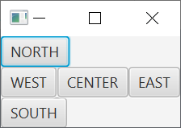
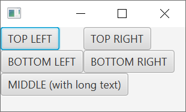
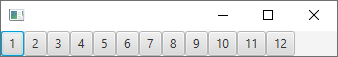
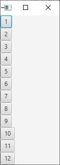
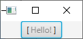
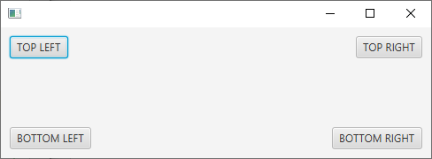
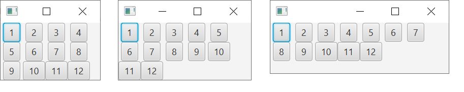
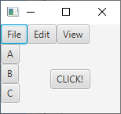
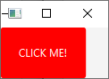

# 6.2. Layouts, building the UI

In the previous submodule, we learnt the basics of building a graphical user interface. In this submodule, we will learn how to build a more complex UI, using layouts.

In JavaFX, layouts are containers that can be used to group UI elements together. They are a way to organize the UI elements in a specific way. For example, we can use layouts to create a grid of buttons, or to stack buttons on top of each other.

In the examples of the previous submodule, we used one layout: the FlowPane. The FlowPane is a simple layout that stacks the UI elements horizontally or vertically. It is not very useful for building complex UIs, but it is a good layout to start with.

In this submodule, we will learn about more layouts used in JavaFX: the BorderPane, the GridPane, the HBox and the VBox. We will also learn how to use CSS to style our UI elements.

For each layout, a simple example with Button elements is shown. The examples are not very useful per se, but they are a good way to learn how the layouts work.

## 6.2.1. The BorderPane

The BorderPane is a layout that divides the window into five regions: top, bottom, left, right and center. Each region can contain only one UI element. The following image shows a BorderPane with a button in each region:



The following code shows how to create a BorderPane and add a button to each region:

```java
public class BorderPaneExample extends Application {

    @Override
    public void start(Stage stage) {
        BorderPane layout = new BorderPane();

        Button topButton = new Button("NORTH");
        Button rightButton = new Button("EAST");
        Button bottomButton = new Button("SOUTH");
        Button leftButton = new Button("WEST");
        Button centerButton = new Button("CENTER");

        layout.setTop(topButton);
        layout.setRight(rightButton);
        layout.setBottom(bottomButton);
        layout.setLeft(leftButton);
        layout.setCenter(centerButton);

        Scene view = new Scene(layout);

        stage.setScene(view);
        stage.show();
    }

    public static void main(String[] args) {
        launch(BorderPaneExample.class);
    }

}
```

Note that the content located in the TOP and BOTTOM regions is not centered by default. If we would like to center the content in these regions, we can add the following lines to the code:

```java
layout.setAlignment(topButton, Pos.CENTER);
layout.setAlignment(bottomButton, Pos.CENTER);
```

In real applications, BorderPane provides a good layout for the main window of the application. The main menu of the application can be placed in the top region, and the main content of the application can be placed in the center region.

## 6.2.2. The GridPane

The GridPane is a layout that divides the window into a grid. The grid can have any number of rows and columns. Each cell of the grid can contain only one UI element. The following image shows a GridPane with a button in each cell:



The code that creates the GridPane and adds the buttons to it is shown below:

```java
public class LayoutDemo extends Application {

    @Override
    public void start(Stage stage) {
        GridPane layout = new GridPane();

        Button button1 = new Button("TOP LEFT");
        Button button2 = new Button("TOP RIGHT");
        Button button3 = new Button("BOTTOM LEFT");
        Button button4 = new Button("BOTTOM RIGHT");
        Button button5 = new Button("MIDDLE (with long text)");

        layout.add(button1, 0, 0);
        layout.add(button2, 1, 0);
        layout.add(button3, 0, 1);
        layout.add(button4, 1, 1);
        layout.add(button5, 0, 2, 2, 1);

        Scene view = new Scene(layout);

        stage.setScene(view);
        stage.show();
    }
}
```

The code adds the buttons to the GridPane by using the add method. The first parameter of the add method is the UI element to be added. The second and third parameters are the coordinates of the cell where the UI element is added. The coordinates start from the upper left corner of the grid, and the first column and row have index 0. The fourth and fifth parameters are the number of columns and rows that the UI element will span.

In the example, the last button is placed in the middle of the grid. It spans two columns and one row.

The GridPane is a good layout for building UIs that contain a grid of UI elements. An example of a natural layout for the GridPane is a chessboard, or the keyboard of a calculator.

## 6.2.3. The HBox and VBox

The HBox and VBox layouts are used to stack UI elements horizontally or vertically. The HBox stacks the UI elements horizontally, and the VBox stacks the UI elements vertically. The following image shows an HBox with a button in each cell:



The following code shows how to create an HBox and add buttons to it:

```java
import javafx.application.Application;
import javafx.scene.Scene;
import javafx.scene.control.Button;
import javafx.scene.layout.*;
import javafx.stage.Stage;

public class LayoutDemo extends Application {

    public void start(Stage stage) {
        HBox layout = new HBox();

        Button[] buttons = new Button[12];

        for (int i = 0; i < 12; i++) {
            buttons[i] = new Button("" + (i + 1));
            layout.getChildren().add(buttons[i]);
        }

        Scene view = new Scene(layout);

        stage.setScene(view);
        stage.show();
    }
}

```

Note that the twelve buttons are placed in a single row. If the window is resized, the buttons will not wrap to the next row. When the window width becomes smaller than the width of the buttons, the buttons will be clipped.

The Vbox container behaves in the similar fashion. The difference is that the UI elements are stacked vertically. The following image shows a VBox with a button in each cell:



In the code, just change the `HBox`  to `VBox`, and the buttons will be stacked vertically. Analogously to the HBox, the buttons will not wrap to the next column when the window is resized. If the window height becomes smaller than that of the buttons, the buttons, again, will be clipped.


## 6.2.4. StackPane

The purpose of the StackPane is to stack UI elements on top of each other. This is useful if we want to place UI elements on top of a background image, or construct a component that consists of several layers, some of which may be transparent. The following image shows a StackPane with two stacked components:



The component in the bottom layer is a button, and the component in the top layer is a label. The label is transparent, and the button is visible through it.

The following code shows how to create a StackPane and add UI elements to it:

```java
import javafx.application.Application;
import javafx.scene.Scene;
import javafx.scene.control.Button;
import javafx.scene.layout.*;
import javafx.stage.Stage;
import javafx.scene.control.Label;

public class LayoutDemo extends Application {

    public void start(Stage stage) {
        StackPane layout = new StackPane();

        Button button1 = new Button("[           ]");
        Label label = new Label("Hello!");

        label.setOpacity(0.5);

        layout.getChildren().add(button1);
        layout.getChildren().add(label);

        Scene view = new Scene(layout);

        stage.setScene(view);
        stage.show();
    }
}
```

StackPane contains a list of children that are stacked. This list can be obtained with the `getChildren()` method. Using the `add()` method for the list, we can add UI elements to the StackPane. The order in which the UI elements are added to the StackPane determines the order in which they are stacked. The first UI element added is at the bottom of the stack, and the last UI element added is at the top of the stack.

## 6.2.5. AnchorPane

The AnchorPane is a layout that allows us to anchor UI elements to the top, bottom, left side, or right side of the window. Anchoring means that the distance between the UI element and the edge of the window is fixed.

The following image shows an AnchorPane with a button in each corner:



The following code shows how to create an AnchorPane and add UI elements to it:

```java
import javafx.application.Application;
import javafx.scene.Scene;
import javafx.scene.control.Button;
import javafx.scene.layout.*;
import javafx.stage.Stage;
import javafx.scene.control.Label;

public class LayoutDemo extends Application {

    public void start(Stage stage) {
        AnchorPane layout = new AnchorPane();

        Button button1 = new Button("TOP LEFT");
        Button button2 = new Button("TOP RIGHT");
        Button button3 = new Button("BOTTOM LEFT");
        Button button4 = new Button("BOTTOM RIGHT");

        layout.getChildren().add(button1);
        layout.getChildren().add(button2);
        layout.getChildren().add(button3);
        layout.getChildren().add(button4);

        AnchorPane.setTopAnchor(button1, 10.0);
        AnchorPane.setLeftAnchor(button1, 10.0);

        AnchorPane.setTopAnchor(button2, 10.0);
        AnchorPane.setRightAnchor(button2, 10.0);

        AnchorPane.setBottomAnchor(button3, 10.0);
        AnchorPane.setLeftAnchor(button3, 10.0);

        AnchorPane.setBottomAnchor(button4, 10.0);
        AnchorPane.setRightAnchor(button4, 10.0);

        Scene view = new Scene(layout);

        stage.setScene(view);
        stage.show();
    }
}
```

In the example, each of the four buttons is anchored to a corner of the window. This is done by setting two anchors for each button. For example, the top left button is anchored to the top and left sides of the window. The distance to each side is 10 pixels.

Try resizing the window. You see that the buttons stay in the same place, as they are anchored to the respective locations.


## 6.2.6. FlowPane and TilePane

In the earlier submodule, we used the FlowPane to stack UI elements horizontally or vertically. You probably remember that the FlowPane arranges the UI elements in the order they are added to the layout. If the UI elements do not fit in the window, the FlowPane wraps the UI elements to the next row or column.

The TilePane is quite similar to the FlowPane. The difference is that the TilePane arranges the UI elements in a grid. The UI elements are placed in the grid in the order they are added to the layout. If the UI elements do not fit in the window, the TilePane wraps the UI elements to the next row or column. The following image shows a TilePane with a button in each cell. In the image, you see how resizing the window affects the layout:



In the following code, we create an array of 12 buttons and add them to a TilePane:

```java
public class LayoutsDemo extends Application {

    @Override
    public void start(Stage stage) {
        TilePane layout = new TilePane();

        Button[] buttons = new Button[12];

        for (int i = 0; i < 12; i++) {
            buttons[i] = new Button("" + (i + 1));
            layout.getChildren().add(buttons[i]);
        }

        Scene view = new Scene(layout);

        stage.setScene(view);
        stage.show();
    }
}
```


## 6.2.6. Nesting containers

The previous examples demonstrates the use of the different containers. In practice, we often need to nest containers. For example, we may want to use BorderPane as the root container, and place a HBox in the top section, a VBox in the left section, and a StackPane in the center section. The following image shows the layout:



The following code shows how to nest containers:

```java
import javafx.application.Application;
import javafx.scene.Scene;
import javafx.scene.control.Button;
import javafx.scene.layout.*;
import javafx.stage.Stage;
import javafx.scene.control.Label;

public class LayoutDemo extends Application {

    public void start(Stage stage) {
        BorderPane layout = new BorderPane();

        HBox top = new HBox();
        top.getChildren().add(new Button("File"));
        top.getChildren().add(new Button("Edit"));
        top.getChildren().add(new Button("View"));
        layout.setTop(top);

        VBox left = new VBox();
        left.getChildren().add(new Button("A"));
        left.getChildren().add(new Button("B"));
        left.getChildren().add(new Button("C"));
        layout.setLeft(left);

        StackPane center = new StackPane();
        center.getChildren().add(new Button("CLICK!"));
        layout.setCenter(center);

        Scene view = new Scene(layout);

        stage.setScene(view);
        stage.show();
    }
}
```

Nesting the containers is the key technique for creating complex layouts. This can be done either manually, or by using a layout tool such as Scene Builder. Later, we learn how to use Scene Builder to create layouts. Even if you use Scene Builder, it is important to understand how to nest containers manually.


## 6.2.7. Styling the UI with CSS

In this section, we learn how to style the UI with Cascading Style Sheets (CSS). As you probably remember, CSS is a language for styling web pages.
JavaFX supports CSS, and we can use CSS to style the UI elements.

In contemporary software development, maintaining a separation of concerns between the application logic and the presentation layer is a recommended practice. This not only results in cleaner, more maintainable code but also allows for more flexibility and ease of changes in the appearance of the application.

When developing applications with JavaFX, one way to achieve this separation is by using CSS. This approach provides a powerful and flexible mechanism to define the look and feel of your JavaFX application.

JavaFX's CSS is designed to be familiar to anyone who has worked with web-based CSS, making it an approachable option for those with web development experience. While it has some unique features tailored for JavaFX, the core principles remain similar to those of web CSS. This makes the transition for web developers smoother and allows them to apply their existing CSS knowledge to a new context.

Additionally, using CSS with JavaFX allows you to define many properties simultaneously in a single declaration, compared to method calls where usually only one property is adjusted at a time. This can make your code more concise and easier to understand. CSS also facilitates the creation and application of themes and style classes to multiple components at once, which can significantly speed up the development process.

The following code shows how to style a button with CSS:

```java
import javafx.application.Application;
import javafx.scene.Scene;
import javafx.scene.control.Button;
import javafx.scene.layout.*;
import javafx.stage.Stage;

public class LayoutDemo extends Application {

    public void start(Stage stage) {
        VBox layout = new VBox();

        Button button = new Button("CLICK ME!");
        layout.getChildren().add(button);

        Scene view = new Scene(layout);

        view.getStylesheets().add("style.css");

        stage.setScene(view);
        stage.show();
    }
}
```

From the code example above, you see that there is a reference to an external CSS file. The CSS file is named style.css, and it should be located in the **Resources** folder. The following code shows the content of the CSS file:

```css
.button {
    -fx-background-color: #ff0000;
    -fx-text-fill: #ffffff;
    -fx-padding: 20px;
}
```

The CSS file contains the style definitions for the Scene. The file has one rule, which defines the style for the button. The rule starts with the selector .button, which means that the rule applies to all UI elements with the style class button. The rule contains three style definitions. The first style definition sets the background color to red. The second style definition sets the text color to white.
Finally, the third style definition sets the padding (the distance between the button edge and the content) to 20 pixels.

> At this point, you might be tempted to set the margin as well with CSS. However, the margin is not a CSS attribute. The correct way to set the margin of a component is to use the corresponding Java method like this: ```button.setMargin(new Insets(20));```


Note that the CSS attribute names differ from the web counterparts. For example, the background color is set with the attribute -fx-background-color, not with the attribute background-color. The following table shows some of the most common CSS attributes:

| Attribute | Description |
| --------- | ----------- |
| -fx-background-color | Background color |
| -fx-text-fill | Text color |
| -fx-font-size | Font size |
| -fx-font-family | Font family |
| -fx-font-weight | Font weight |
| -fx-border-color | Border color |
| -fx-border-width | Border width |
| -fx-border-radius | Border radius |
| -fx-padding | Padding |
| -fx-background-radius | Background radius |

> All CSS attributes are described in the JavaFX CSS Reference Guide. You can find the guide [here](https://openjfx.io/javadoc/24/javafx.graphics/javafx/scene/doc-files/cssref.html).

The following image shows the result of the example code:



At this point, you are able to design the structure of the UI with containers, and style the UI with CSS. In the next section, we learn to apply graphics in the UI.

## Assignment: A currency converter

Your task is to implement a currency converter application. The application should allow the user to convert an amount of money from one currency to another. The application should have a graphical user interface, and it should be implemented with the MVC pattern.

Requirements for the user interface:

1. The user interface should consist of a window with appropriate dimensions to display the converter components.
2. The window should have a title indicating the purpose of the application, such as "Currency Converter."
3. Use appropriate layout(s) to organize the components effectively.
4. The user interface should include the following components:
   - Two text fields for inputting the amount to convert and displaying the converted amount.
   - Two choice boxes or combo boxes for selecting the source currency and the target currency.
   - A button labeled "Convert" to initiate the currency conversion.
   - Labels to indicate the purpose of each input field, choice box, and the result field. The labels for the choice boxes should appear right on top of each choice box.
5. The choice boxes should contain a list of available currencies that the user can select from. The list of currencies should be retrieved from the model, which should contain the abbreviation, name, and conversion rate to a fixed currency (e.g., USD).
6. The user interface should provide clear instructions on how to use the converter.
7. Implement the appropriate event handling for the button to trigger the controller. The controller should compute the actual result based on the information obtained from the model and update the result field accordingly.
8. The user interface should handle any potential errors or invalid input gracefully, providing appropriate error messages if necessary.
9. Adjust the font and font size using CSS to improve screen readability. The font should be changed to a sans-serif font for better legibility.
   
Hints:
- In the current stage of the project, you may hardcode the creation of a few currencies in the constructor of the controller. This is done to facilitate the initial development process. Note that this hardcoded approach will be revised and replaced with a more flexible solution in later stages of the course.
- Think how you can calculate the conversion rate between two currencies based on the conversion rates to a fixed currency. For example, if you know the conversion rates from USD to EUR and from USD to GBP, you can calculate the conversion rate from EUR to GBP. Use an online currency converter to verify your calculations.
- Error prevention is always better than error handling. Think how you can prevent the user from entering invalid input in the first place. For example, you can prevent the user from entering letters in the amount field by using a text field with a numeric input restriction.

Remember to follow the MVC design pattern by separating the model, view, and controller components appropriately. The model should contain the currencies (abbreviation, name, and conversion rate), the view should handle the user interface components and layout, and the controller should compute the actual result based on the selected currencies and communicate with the model and view.

Ensure that the user interface meets the specified requirements and demonstrates a good understanding of JavaFX layouts, CSS, and the MVC design pattern.

For this assignment, you get points as follows (PLEASE NOTE! You need to inform in your answer what of the following items (1–6) you have done, otherwise you will not get points for the assignment):
1. The user interface contains the required components. (1 point)
2. The user interface components are organized effectively with appropriate layouts. (1 point)
3. The application follows the MVC pattern with the required classes. (1 point)
4. The application calculates and displays the correct result. (1 point)
5. The application handles errors and invalid input gracefully. (1 point)
6. The application provides clear instructions on how to use the converter. (1 point)

---
_This learning material has been produced with assistance from OpenAI's ChatGPT-4 and GitHub Copilot. These large language models have provided suggestions and solutions that have assisted the author in producing and supplementing the material. While their contribution has been significant, the final responsibility for the content and its correctness resides with the author._
