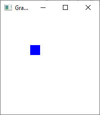
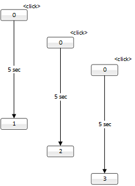

# 6.3. Graphics, mouse and keyboard events, updating the GUI

In this submodule, we will learn how to create a graphical user interface (GUI) for a Java application. We will also learn how to handle keyboard and mouse events. Finally, we will learn how to update the GUI.

## 6.3.1. Canvas

In JavaFX, the 2D canvas is represented by the `Canvas` class. The canvas is a rectangular area where you can draw graphics. The canvas is added to a scene, which is then added to a stage. The stage is the main window of the application.

You can draw various shapes in the canvas, such as lines, rectangles, and circles. You can also draw images on the canvas. The canvas is drawn in the order in which the drawing commands are given. This means that the last shape drawn will be on top of the previous shapes.

A canvas can be created as follows:

```java
Canvas canvas = new Canvas(200, 200);
```
The constructor takes two parameters: the width and the height of the canvas.

On top of the canvas, you can draw various elements such as a circle and line:

```java
GraphicsContext gc = canvas.getGraphicsContext2D();
gc.setFill(Color.RED);
gc.fillOval(10, 10, 30, 30);

gc.moveTo(0, 0);
gc.lineTo(20, 20);
gc.stroke();        // this is needed to actually draw the line
```

The `getGraphicsContext2D` method returns an object that implements the `GraphicsContext` interface.  It provides different drawing operations and methods. It acts as an intermediary between the `Canvas` object and the actual drawing operations. GraphicsContext can be thought of as a drawing tool that offers methods like `drawLine`, `drawRect`, `drawText`, etc., which are used to create and render drawable elements on the Canvas.

To draw something on a Canvas, you need to obtain its associated `GraphicsContext` object. You can retrieve the `GraphicsContext` object by calling the `getGraphicsContext2D` method on the Canvas. Once you have the GraphicsContext object, you can directly invoke its drawing operations and methods to perform the actual drawing. To check what kind of operations and methods are available, you can refer to the [GraphicsContext API documentation](https://docs.oracle.com/javase/8/javafx/api/javafx/scene/canvas/GraphicsContext.html).

In the example, the `setFill` method sets the fill color. The `fillOval` method draws a filled oval. The first two parameters are the x and y coordinates of the upper left corner of the oval. The last two parameters are the width and the height of the oval. As we want to draw a circle, the width and the height are the same.

As the components of the canvas are in place, we need to add the canvas to a scene, which is then added to a stage. The stage is the main window of the application. The following code shows how to create a stage and add a scene to it, and make the stage visible:

```java
StackPane root = new StackPane(canvas);
Scene scene = new Scene(root, 200, 200);
stage.setTitle("Canvas Demo");
stage.setScene(scene);
stage.show();
```

## 6.3.2. Keyboard and mouse events

In an earlier submodule, we learned to write event handlers for buttons. Next, let's take a look how we can make the application react to keyboard and mouse events.

There are various types of keyboard events. A keyboard event can arise when:
- a key is pressed (KEY_PRESSED event)
- a key is released (KEY_RELEASED event)
- a key is typed, i.e. pressed and released (KEY_TYPED event)

Tho following mouse events can arise:
- a mouse button is pressed (MOUSE_PRESSED event)
- a mouse button is released (MOUSE_RELEASED event)
- a mouse button is clicked, i.e., pressed and released (MOUSE_CLICKED event)
- the mouse cursor enters a node (MOUSE_ENTERED event)
- the mouse cursor exits a node (MOUSE_EXITED event)
- the mouse cursor is moved (MOUSE_MOVED event)
- the mouse cursor is dragged (MOUSE_DRAGGED event)
- the mouse wheel is moved (MOUSE_WHEEL event)

The following code shows how to write an event handler for a key pressed event:

```java
canvas.setOnKeyPressed(event -> {
    KeyCode keyCode = event.getCode();
    System.out.println("Key pressed: " + keyCode);
});
```

We were using here lambda function for the event handler. We'll talk more about lambda functions [later](8.3_Lambda). For now, it is enough to know that the lambda function is a shorthand notation for writing an event handler.

If we wanted, instead, react to a mouse moving over a canvas, we could use the MOUSE_MOVED event:

```java
canvas.setOnMouseMoved(event -> {
    double x = event.getX();
    double y = event.getY();
    System.out.println("Mouse moved to (" + x + ", " + y + ")");
});
```

In both examples, you can ask the event object for more information about the event. For example, you can ask the event object for the key code of the key that was pressed. You can also ask the event object for the x and y coordinates of the mouse cursor.

Later in this submodule, we will see how to use keyboard events to create a simple game. 


## 6.3.3. An example: a moving player

In the next example, we create a simple skeleton for a game. The game world is a 10 times 10 grid. The player is a square that can be moved with the arrow keys. The player is not allowed to move outside the game world. The player is drawn in a canvas.

The following image shows the game world as well as the player's location.



This is just a simple example. Thus, the game world is empty and the player is just a blue square. However, the example shows how to create a simple interactive game with a graphical user interface.

Let's start with the user interface class. Its code is shown below.

```java
package view;

import javafx.application.Application;
import javafx.scene.Scene;
import javafx.scene.canvas.Canvas;
import javafx.scene.canvas.GraphicsContext;
import javafx.scene.input.KeyCode;
import javafx.scene.layout.StackPane;
import javafx.scene.paint.Color;
import javafx.stage.Stage;

import controller.Controller;
import utils.Direction;

public class GraphicsDemo extends Application {
    private static final int CELL_SIZE = 20;

    private Canvas canvas;
    private GraphicsContext gc;
    private Controller controller;
    
    @Override
    public void init() {
        controller = new Controller(this);
    }
    
    @Override
    public void start(Stage primaryStage) {
        int gridSize = controller.getGridSize();
        int canvasSize = gridSize * CELL_SIZE;
        canvas = new Canvas(canvasSize, canvasSize);
        gc = canvas.getGraphicsContext2D();

        canvas.setFocusTraversable(true);
        canvas.setOnKeyPressed(event -> {
            KeyCode keyCode = event.getCode();
            Direction direction = getDirectionFromKeyCode(keyCode);
            if (direction != null) {
                controller.handleMove(direction);
            }
        });

        StackPane root = new StackPane(canvas);
        Scene scene = new Scene(root, canvasSize, canvasSize);
        primaryStage.setTitle("Graphics Demo");
        primaryStage.setScene(scene);
        primaryStage.show();

        updateCanvas(controller.getPlayerX(), controller.getPlayerY());
    }

    private Direction getDirectionFromKeyCode(KeyCode keyCode) {
        switch (keyCode) {
            case UP:
                return Direction.UP;
            case DOWN:
                return Direction.DOWN;
            case LEFT:
                return Direction.LEFT;
            case RIGHT:
                return Direction.RIGHT;
            default:
                return null;
        }
    }

    public void updateCanvas(int playerX, int playerY) {
        int gridSize = controller.getGridSize();
        int canvasSize = gridSize * CELL_SIZE;

        gc.clearRect(0, 0, canvasSize, canvasSize);

        gc.setFill(Color.BLUE);
        int x = playerX * CELL_SIZE;
        int y = playerY * CELL_SIZE;
        gc.fillRect(x, y, CELL_SIZE, CELL_SIZE);
    }
}
```

In the `start` method, the canvas is created. The canvas is added to a StackPane object, which is then added to the scene, and finally
the scene is added to the stage (i.e. the main window). After this, the stage is made visible. The call to the `updateCanvas` method first clears the canvas and then draws the player in the canvas. Note that this same method will eventually be called by the controller when the player's location changes.

The canvas needs an event handler that reacts to keyboard events. In this case, an event arises when a key has been pressed. The `getCode` method of the event object returns the key that was pressed. These key codes are then mapped to four simple directions (up, down, left, right) by the `getDirectionFromKeyCode` method. The switch/case structure ensures that only the four arrow keys are mapped to directions.
If the keyboard event was caused some other key, the method returns a null value.

Once the keypress has been mapped to one of the four directions (such as Direction.UP), the event handler method calls the `handleMove` method in the controller.

```java
import view.GraphicsDemo;

public class Main {
    public static void main(String[] args) {
        GraphicsDemo.launch(GraphicsDemo.class);
    }
}
```

Main class with main() method.

The controller, as we know, is the intermediary between the user interface and the model. It is responsible for updating the model and the user interface. The controller class is shown below.


```java
package controller;

import model.Player;
import utils.Direction;
import view.GraphicsDemo;

public class Controller {
    private Player player;
    private GraphicsDemo gui;

    public Controller(GraphicsDemo gui) {
        this.player = new Player(0, 0);
        this.gui = gui;
    }

    public void handleMove(Direction direction) {
        System.out.println("handleMove");
        player.move(direction);
        gui.updateCanvas(player.getX(), player.getY());
    }

    public int getPlayerX() {
        return player.getX();
    }

    public int getPlayerY() {
        return player.getY();
    }

    public int getGridSize() {
        return player.getGridSize();
    }
}
```

The most important method in the `Controller` class is the `handleMove` method. It is called when the user presses an arrow key. The `handleMove` method calls the `move` method of the `Player` class. The `move` method updates the player's location. After the player's location has been updated, the `updateCanvas` method of the GUI class is called. The `updateCanvas` method draws the player's new location in the canvas.

The `Player` class that constitutes the model stores the player's location. Its code is shown below.

```java
package model;

import utils.Direction;

public class Player {
    private int x;
    private int y;
    private static final int GRID_SIZE = 10;

    public Player(int x, int y) {
        this.x = x;
        this.y = y;
    }

    public void move(Direction direction) {
        switch (direction) {
            case UP:
                if (y >= 1) {
                    y--;
                }
                break;
            case DOWN:
                if (y < GRID_SIZE - 1) {
                    y++;
                }
                break;
            case LEFT:
                if (x >= 1) {
                    x--;
                }
                break;
            case RIGHT:
                if (x < GRID_SIZE - 1) {
                    x++;
                }
                break;
        }
        System.out.println("Player moved to (" + x + ", " + y + ")");
    }

    public int getX() {
        return x;
    }

    public int getY() {
        return y;
    }

    public static int getGridSize() {
        return GRID_SIZE;
    }
}
```

In this case, the model's state consists of the player's location. The player's location is represented by the x and y coordinates. The player's location is updated by the move() method. The move() method takes a Direction object as a parameter. The Direction object is an enum that represents the direction in which the player should move. The move() method updates the player's location based on the direction. The player's location is updated only if the player is not at the edge of the game world.

> Note that the player's location is printed to the console after it is updated. It may be a good practice to print the state of the model to the console to verify that the model is updated correctly.


In addition, we have a small utility class that defines the directions. Its code is shown below.

```java 
package utils;

public enum Direction {
    UP, DOWN, LEFT, RIGHT
}
```

The purpose of this class is to define the directions in which the player can move. The Direction class is an enum that defines four directions: UP, DOWN, LEFT, and RIGHT. This is more convenient and less error-prone than using strings to represent the directions.

In the example above, the objects were created in a specific order that aligns with the Model-View-Controller (MVC) architectural pattern. This order was chosen to ensure proper communication and coordination between the components.

The creation process starts with the GUI (GraphicsDemo), which is the graphical user interface. The GUI is created first as the entry point of the application. It provides the main application window and sets up the visual environment for the game.

Next, the Controller object is created. The Controller acts as the intermediary between the Model and the View. It handles user input and updates the Model based on user actions. The Controller is created after the GUI to establish a reference to the GUI instance and enable interaction with its components.

Finally, the Model (Player) is created within the Controller's constructor. The Model represents the game logic and player's state. By creating the Model last, we ensure that the Model is instantiated and ready to store and update the player's position once the game starts.

To summarize, in this example, the object creation order is as follows: GUI, Controller, and Model. This order allows for the necessary dependencies and connections to be established. The GUI is created first to set up the visual environment, followed by the Controller, which interacts with the GUI, and finally the Model, which represents the game logic.

By following this object creation order, the MVC pattern is upheld, ensuring a clear separation of concerns and facilitating modularity and maintainability within the application.

While the object creation order in the given example follows the conventional Model-View-Controller (MVC) pattern, it's important to note that there can be alternative approaches to object creation. The specific order chosen depends on the requirements, design considerations, and context of the application. In some cases, it might make sense to create the View (GUI) first, allowing it to define the initial visual layout and structure. Subsequently, the Controller could be created to handle user input and coordinate the interactions between the Model and the View. Finally, the Model could be instantiated, providing the underlying logic and state management for the application. Such an order could be suitable in scenarios where the visual representation of the application or the structure of the GUI components heavily influences the overall architecture. Ultimately, the choice of object creation order should be based on the specific needs of the application and the desired architectural principles, such as separation of concerns, modularity, and code maintainability.

## 6.3.4. Updating the GUI

In the previous examples, the graphical user interface was updated in a straightforward manner: the controller called a GUI method that updated the canvas (or any other user interface component).

This approach is adequate for simple applications that run in the same thread as the user interface. 
However, in more complex applications, it may be necessary to run the background logic in a separate thread. The purpose of this is to keep the user interface responsive while the background logic is running.

In such cases, the user interface must be updated in a thread-safe manner. This means that the user interface must be updated in the same thread that created it. If the user interface is updated from a different thread, the application may crash or behave unexpectedly.

For this purpose, the JavaFX framework provides the Platform.runLater() method. This method allows us to update the user interface from a different thread. The `Platform.runLater()` method takes a Runnable object as a parameter. The Runnable object contains the code that updates the user interface. The `Platform.runLater()` method then executes the Runnable object in the JavaFX application thread at a convenient time.

A simple example of updating the user interface from a different thread is shown below. This example consists of two classes: a GUI class and a background computation class. The GUI class contains a button that is used to start the background computation. The background computation class contains a method that performs a long-running computation. The computation is started when the button is pressed. The GUI class is updated when the computation is finished.

The user interface class looks as follows:

```java
import javafx.application.Application;
import javafx.application.Platform;
import javafx.scene.Scene;
import javafx.scene.control.Button;
import javafx.scene.layout.VBox;
import javafx.stage.Stage;

public class PlatformRunLaterDemo extends Application {
    private int counter = 0;
    private Button button;

    @Override
    public void start(Stage stage) {
        button = new Button("0");
        BackgroundComputation computation = new BackgroundComputation(this);
        button.setOnAction(event -> computation.startComputation());

        VBox root = new VBox();
        root.getChildren().add(button);

        Scene scene = new Scene(root, 300, 250);
        stage.setScene(scene);
        stage.show();
    }

    public synchronized void updateButtonText() {
        counter++;
        String counterText = Integer.toString(counter);
        button.setText(counterText);
    }

}
```

Separate Main class with nothing but main() method:
```java
public class Main {
    public static void main(String[] args) {
        PlatformRunLaterDemo.launch(PlatformRunLaterDemo.class);
    }
}
```

The background computation class looks as follows:

```java
import javafx.application.Platform;

public class BackgroundComputation {
    private PlatformRunLaterDemo gui;

    public BackgroundComputation(PlatformRunLaterDemo gui) {
        this.gui = gui;
    }

    public void startComputation() {
        new Thread(() -> {
            try {
                // This represents a long-running computation
                Thread.sleep(5000);
            } catch (InterruptedException e) {
                e.printStackTrace();
            }

            Platform.runLater(() -> gui.updateButtonText()); // safe way to update GUI
        }).start();
    }
}
```


In this example, we have a button that, when clicked, starts a new thread. The new thread sleeps for 5 seconds and then updates the button's counter. The update is initiated by the `Platform.runLater()` method. Note that this approach keeps the user interface responsive while the background logic is running.

You can click the button multiple times. Each time you click it, a new thread is started. The threads run in parallel, and each one updates the button's counter after 5 seconds in a way that is thread-safe. The following image illustrates the application's behavior.



After this submodule, you should be able to create a simple graphical user interface using JavaFX that contains 2D graphics and reacts to events of various types.
You should also be able to update the user interface from a different thread using the `Platform.runLater()` method.


## Assignment: A virtual pet

Your task is to create an application where the user walks a virtual pet. The pet is represented by an icon that moves around the canvas. Whenever the user moves the mouse over the canvas, the pet starts moving towards the mouse cursor. Once the pet has reached the mouse cursor, it stops moving. The pet also stops moving if the user moves the mouse cursor outside the canvas.

You get points for this assignment based on the following criteria (PLEASE NOTE! You need to inform in your answer what of the following items (1–5) you have done, otherwise you will not get points for the assignment):
1. A cute pet image is displayed on the canvas (1 point). You can use any small image you like.
2. The pet moves towards the mouse cursor when the mouse is moved over the canvas (+ 1 point)
3. The pet stops moving when it reaches the mouse cursor (+ 1 point)
4. The pet stops moving when the mouse cursor is moved outside the canvas (+ 1 point)
5. The program follows the MVC pattern (+ 2 points). The model consists of the `Pet` class that stores the pet's location. The controller class contains the method for updating the pet's location. The view class contains the canvas and draws the pet on the canvas.

Hints:
- Use the `Image` class for loading the pet image.
- Can you calculate the movements of the pet in such a way that the pet moves directly towards the mouse cursor? This involves some interesting trigonometry.
- Find a way to limit the speed of the pet so that it does not move too fast.


---
_This learning material has been produced with assistance from OpenAI's ChatGPT-4 and GitHub Copilot. These large language models have provided suggestions and solutions that have assisted the author in producing and supplementing the material. While their contribution has been significant, the final responsibility for the content and its correctness resides with the author._
