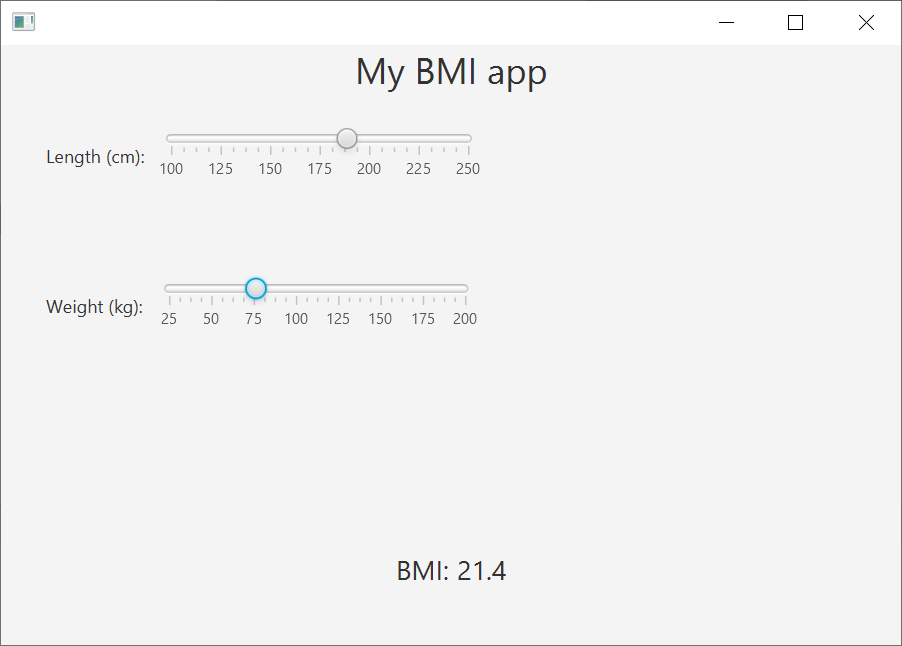
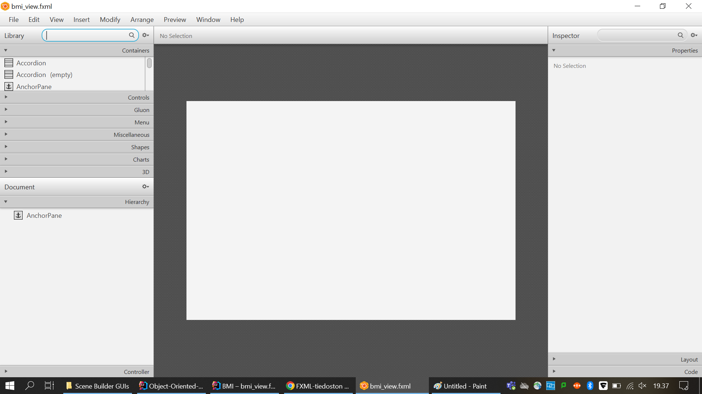
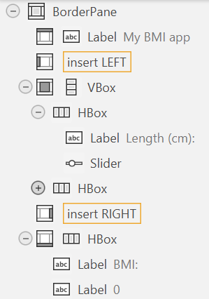
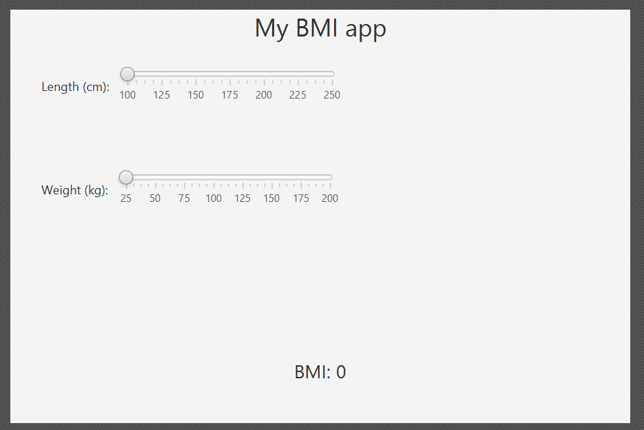

# 6.4. GUI design tools

In the previous submodules we have learn to build a graphical user interface from scratch. However, there are some tools that can help us to build a GUI in a faster way. In this submodule we will learn to use the Scene Builder tool to build a GUI.

Scene Builder is a visual layout tool that lets users quickly design JavaFX application user interfaces, without coding. Users can drag and drop UI components to a work area, modify their properties, apply style sheets, and the FXML code for the layout that they are creating is automatically generated in the background. The result is an FXML file that can then be combined with a Java project by binding the UI to the application’s logic.

FXML is an XML-based user interface markup language created by Oracle Corporation for defining the user interface of a JavaFX application.

## 6.4.1. Installing Scene Builder

Scene Builder is a standalone design tool that can be used with any Java IDE to create JavaFX UI designs. It is developed by Gluon and delivered as part of the OpenJFX distribution. It is free to download and use, and it is available for Windows, macOS, and Linux.

To install Scene Builder, follow these steps:

1. Download the latest version of Scene Builder from the [Scene Builder website](https://gluonhq.com/products/scene-builder/). If you are using Windows, download the Windows installer (.msi). If you are using macOS, download the macOS installer.
2. Run the installer and follow the instructions to install Scene Builder on your computer.

## 6.4.2. Building the first application with Scene Builder

Our goal is to build a simple BMI calculator with Scene Builder. The final result will be the following:



There are various ways in which you can utilize Scene Builder to create a JavaFX application. In this submodule we will use the following approach:

1. Create a new JavaFX project in IntelliJ IDEA.
2. Add an empty FXML file to the project.
2. Create the UI design in Scene Builder. The design will be saved in the FXML file.
3. Add the event handlers to the FXML file in IntelliJ IDEA.

This is the recommended approach for beginners that provides a good balance between the use of Scene Builder and IntelliJ IDEA.

First, generate a new JavaFX project in IntelliJ IDEA, and add the `model`, `view` and `controller` packages into the `src` folder. To do so, follow the steps described in the previous submodules.

Then, add a new FXML file to the src/resources folder of the
project. To do so, right-click on the `resources` folder and select `New` > `FXML File`. Name the file `bmi_view.fxml` and click `OK`. IntelliJ Idea creates a simple FXML file for a user interface that has an `AnchorPane` as the root element.

At this point, open Scene Builder and load the FXML file that you have just created. To do so, click `Open Project` and select the `bmi_view.fxml` file. The Scene Builder window will look like this:



On the Hierarchy card on the left, you see the structure of the user interface. It just displays one node, the AnchorPane, in the user interface. As we want to replace the AnchorPane with the BorderPane, we need to delete the AnchorPane. To do so, select the AnchorPane in the Hierarchy card and press the `Delete` key. The AnchorPane will be removed from the user interface.

Now that the user interface has changed, we need to save the changes to the FXML file. To do so, click `File/Save` in Scene Builder. The FXML file will be updated with the changes that you have made.

If you take a quick peek at your code in IntelliJ IDEA, you will see that the FXML file has been updated with the changes that you have made in Scene Builder. The FXML file is now empty, as you have deleted the AnchorPane.

Now, let's build the following hierarchy into our user interface by dragging and dropping the components from the Containers and Controls cards on the left. First draw a BorderPane into the user interface. 

We follow these principles:
- In the TOP area, we will place a Label (in the Controls section) with the text "BMI Calculator".
- In the CENTER area, there is a VBox (in the Containers section) that contains two HBox containers.
- Each HBox container contains a Label and a slider.
- In the BOTTOM area, there is a HBox with two labels, one holding the text "BMI: " and the other one holding the result of the calculation.
- The HBox elements have proper padding.

As a consequence, the Hierarchy card on the left will look like this:



The user inteface looks like this:



Now that the user interface is ready, we need to add event handlers to the sliders. We want the BMI update to be triggered when the user moves the sliders. To do so, first click `File/Save` in Scene Builder to make sure that the changes are written to the FXML file.

From now on, we work in IntelliJ IDEA. Open the `bmi_view.fxml` file and specify the event handlers for the sliders. To do so, locate the `Slider` elements in the FXML file and add the following attributes to their opening tags:

```xml
<Slider fx:id="heightSlider" onDragDetected="#updateBMI" onMouseDragged="#updateBMI" onMouseReleased="#updateBMI" ... />
<Slider fx:id="weightSlider" onDragDetected="#updateBMI" onMouseDragged="#updateBMI" onMouseReleased="#updateBMI" ... />
```

The three dots in the code above are just an abbreviation for the pre-existing attributes of the `Slider` elements. If there are such attributes, do not delete them, but just add the new attributes.

We have now specified one event handler called `updateBMI` for three events: `onDragDetected`, `onMouseDragged` and `onMouseReleased`. The `updateBMI` method will be called when the user starts to drag the slider, when the user drags the slider, and when the user releases the slider. The same event handler is defined for both sliders.

The first attribute, `fx:id`, is a unique identifier for referring to that element from the Java code.

Next, locate the `Label` element that stores the result of the calculation, and add the `fx:id` attribute to the opening tag:
```xml
<Label fx:id="bmiLabel" text="0">
```
> Alternatively, you can specify the `fx:id` on the **Code** page of the stacked menu on the right hand side of the SceneBuilder user interface.


Now, we need to implement the `updateBMI` method in the `BmiController` class. As a result, the class looks like this:

```java
package controller;

import view.BMI;
import javafx.fxml.FXML;
import javafx.scene.control.Label;
import javafx.scene.control.Slider;
import java.util.Locale;

public class BMIController {

    @FXML
    private Slider heightSlider;

    @FXML
    private Slider weightSlider;

    @FXML
    private Label bmiLabel;

    @FXML
    private void updateBMI() {
        System.out.println("updateBMI() called");
        double height = heightSlider.getValue()/100.0;
        double weight = weightSlider.getValue();
        double bmi = weight / Math.pow(height, 2);
        System.out.println("BMI: " + bmi);

        String bmiFormatted = String.format(Locale.US, "%.1f", bmi);
        bmiLabel.setText(bmiFormatted);
    }

    public static void main(String[] args) {
        BMI.launch(BMI.class);
    }
}
```

The `@FXML` annotations bind the attributes of the `BmiController` class to the elements of the user interface. The `updateBMI` method is called when the user interacts with the sliders. The method calculates the BMI and displays it in the `bmiLabel` label.

Finally, we need to specify the controller class in the FXML file. To do so, add the following attribute to the root element of the FXML file:

```xml
        fx:controller="controller.BMIController"
```

In the end, the FXML file looks like this:

```xml
<?xml version="1.0" encoding="UTF-8"?>

<?import javafx.scene.control.Label?>
<?import javafx.scene.control.Slider?>
<?import javafx.scene.layout.BorderPane?>
<?import javafx.scene.layout.HBox?>
<?import javafx.scene.layout.VBox?>
<?import javafx.scene.text.Font?>

<BorderPane fx:controller="controller.BMIController" maxHeight="-Infinity" maxWidth="-Infinity" minHeight="-Infinity" minWidth="-Infinity" prefHeight="400.0" prefWidth="600.0" xmlns="http://javafx.com/javafx/19" xmlns:fx="http://javafx.com/fxml/1">
    <top>
        <Label text="My BMI app" BorderPane.alignment="CENTER">
         <font>
            <Font size="24.0" />
         </font></Label>
    </top>
    <center>
        <VBox prefHeight="200.0" prefWidth="100.0" BorderPane.alignment="CENTER">
            <children>
                <HBox prefHeight="100.0" prefWidth="200.0" style="-fx-padding: 20;">
                    <children>
                        <Label style="-fx-padding: 10;" text="Length (cm):" />
                        <Slider fx:id="heightSlider" onDragDetected="#updateBMI" onMouseDragged="#updateBMI" onMouseReleased="#updateBMI" max="250.0" min="100.0" prefHeight="37.0" prefWidth="212.0" showTickLabels="true" showTickMarks="true" />
                    </children>
                </HBox>
                <HBox prefHeight="100.0" prefWidth="421.0" style="-fx-padding: 20;">
                    <children>
                        <Label style="-fx-padding: 10;" text="Weight (kg):" />
                        <Slider fx:id="weightSlider" onDragDetected="#updateBMI" onMouseDragged="#updateBMI" onMouseReleased="#updateBMI" blockIncrement="25.0" max="200.0" min="25.0" prefHeight="37.0" prefWidth="211.0" showTickLabels="true" showTickMarks="true" />
                    </children>
                </HBox>
            </children>
        </VBox>
    </center>
    <bottom>
        <HBox alignment="CENTER" prefHeight="100.0" prefWidth="200.0" BorderPane.alignment="CENTER">
            <children>
                <Label text="BMI: ">
               <font>
                  <Font size="18.0" />
               </font></Label>
                <Label fx:id="bmiLabel" text="0">
               <font>
                  <Font size="18.0" />
               </font></Label>
            </children>
        </HBox>
    </bottom>

</BorderPane>
```

Next, we create the user interface class in the `view` package. The class is called `BMI` and it looks like this:

```java
package view;

import javafx.application.Application;
import javafx.scene.Scene;
import javafx.scene.Parent;
import javafx.stage.Stage;
import javafx.fxml.FXMLLoader;

public class BMI extends Application {

    @Override
    public void start(Stage stage) throws Exception {
        FXMLLoader fxmlLoader = new FXMLLoader(getClass().getResource("/bmi_view.fxml"));
        Parent root = fxmlLoader.load();

        stage.setScene(new Scene(root));
        stage.show();
    }

    public static void main(String[] args) {
        launch(args);
    }
}
```

In the `start` method, the FXML file is loaded and the contents of the user interface are displayed in a window.

At this point, you have learnt the basics of building a user interface with Scene Builder and JavaFX. You can now start to build your own user interfaces.

## Assignment: A notebook application

Design and implement a JavaFX application using the MVC (Model-View-Controller) pattern, utilizing SceneBuilder and FXML. The goal is to create a simple note-taking application with the following features:

1. The application should have a graphical user interface (GUI) created in SceneBuilder, consisting of the following elements:

- A `TextArea` where users can write their notes.
- A `TextField` where users can enter the title of the note.
- A `Button` labeled **Add** that, when clicked, saves the note.
- A container element, such as a `VBox` or `GridPane`, to arrange the elements.

2. When the user clicks the **Add** button, the application should save the note with its title and content. The saved notes should be displayed in a textual format, such as a separate section below the input elements.

3. Implement the Model, which represents the data and logic of the application. The Model should include the following classes:
   - `Note`: Represents a single note and has properties for the title and content of the note, along with appropriate getters and setters.
   - `Notebook`: Represents a collection of notes. The `Notebook` class should have a list structure to store the Note objects, as well as methods for adding and retrieving notes.

4. Implement the `Controller`, which serves as an intermediary between the `View` (GUI) and the `Model`. The `Controller` should have methods for handling user interactions and managing the notes. For example, when the user clicks the **Add** button, the `Controller` should create a new `Note` instance, populate it with the entered title and content, and add it to the `Notebook`.

5. Create an FXML file using SceneBuilder to define the layout of the GUI. Set the appropriate event handlers for the user interactions, such as button clicks, in the FXML file.

6. Create a main Java class to launch the application. In the main method, load the FXML file, instantiate the View, and set it as the application's primary stage.

For this assignment, you get points for the following:

1. The user interface is generated in SceneBuilder and the layout is defined in an FXML file. The user interface contains the required elements. (1 point)
2. The application reads the FXML file successfully and displays the user interface. (1 point)
3. The application has the Model classes `Note` and `Notebook` with the relevan properties and methods (1 point)
4. The application has the Controller class `NoteController` with the required methods. (1 point)
5. When the user writes a note and clicks the **Add** button, the note is saved and successfully displayed in a textual format. (2 points)

Optional advanced tasks for extra points:

6. Learn about the `ListView` element in JavaFX. Use the `ListView` element to display the notes. (+1 point)
7. Provided that you use the `ListView` element, implement a feature where the user can select a note from the list and edit or delete it. (+1 point)

---
_This learning material has been produced with assistance from OpenAI's ChatGPT-4 and GitHub Copilot. These large language models have provided suggestions and solutions that have assisted the author in producing and supplementing the material. While their contribution has been significant, the final responsibility for the content and its correctness resides with the author._


