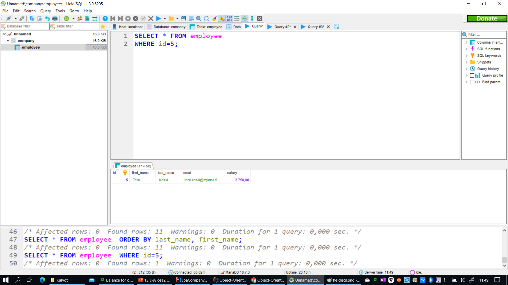
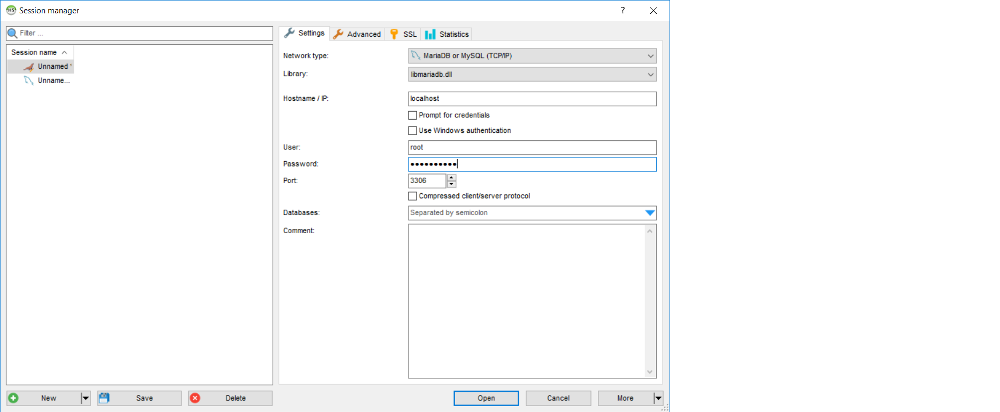

# Preparing the database and the connection

In this module, we learn to use a relational database programmatically. For this purpose, we start
by installing the necessary applications.

## 7.1.1. Installing MariaDB

If you have not yet done so, install MariaDB on your computer. You can find the installation instructions
at the MariaDB website: https://mariadb.org/download/. In the installation process, you need to set
the root password for the database. Remember the password, as you will need it later.

Once the MariaDB database server has been installed, it will automatically run in the background.

> If you run MacOS instead of Windows, you can either install MariaDB homebrew or use MySQL Community Server. The installation instructions for MySQL Community Server are available at https://dev.mysql.com/downloads/mysql/. The installation instructions for homebrew are available at https://mariadb.com/kb/en/installing-mariadb-on-macos-using-homebrew/. In both cases, the usage is similar to the regular installation of MariaDB.


## 7.1.2. Installing a database editor

In general, there are two options to work with databases:
1. via the command prompt
2. using a database editor

It is usually easier to work with a database editor such as HeidiSQL that allows you to easily compose your SQL statements, see their results, and monitor the structure and content of the database tables.

The following image shows the HeidiSQL database editor in use:



You can download HeidiSQL from https://www.heidisql.com/download.php, or it may come
bundled with the Windows version of MariaDB.

>If you use a MacOS computer instead, you can use SequelPro as a database editor. You can download it from https://www.sequelpro.com/. The course material has been written with HeidiSQL in mind, but all the same things can be done with SequelPro.

One the database editor is installed, you can use it to connect to the MariaDB database server. While connecting, use root as the username
and the password you set during the installation process. Set localhost as the host name and 3306 as the port number. That port number
is the default port number for MariaDB. In HeidiSQL, the connection parameters are entered like this:



While carrying out administrator tasks such as creating a database, you need to use the root user account. In the future, when your application connects to a database, it should not use the root user account but a separate user account created for the application. That enables you to restrict the permissions of the application to those that it actually needs.
We will discuss the user accounts later in this module.

## 7.1.2. Creating the database

The commands for setting up a database are typically collected into a database script. You can compose the script using HeidiSQL or a text editor.
The database script is just a text file that contains SQL commands. The SQL commands are executed in the order they appear in the script.

We design the database script in such a way that it completely recreates the database.
That is, if you ever need to modify the structure of the database, you can simply run the script again and the database will be
recreated from the scratch.

To achieve this, we enter the following commands into the database script:

```sql
DROP DATABASE IF EXISTS company;
CREATE DATABASE company;
USE company;
```

The `IF EXISTS` clause in the `DROP DATABASE` statement ensures that the database is dropped only if it exists. If the database does not exist,
the `DROP DATABASE` statement does not cause an error.

The `USE` statement selects the database that we want to use. In this case, we select the company database.


## 7.1.3. Creating the table

To begin with, we just add one table to the database. The table is called `EMPLOYEE` and it contains the following columns:
- `id` - the unique identifier of the employee
- `first_name` - the first name of the employee
- `last_name` - the last name of the employee
- `email` - the email address of the employee
- `salary` - the salary of the employee

We also set the id as a primary key. For each table, it is important to set a primary key that uniquely identifies the rows in the table.
The primary key is used to identify the rows when we want to update or delete them. Also, the database management system automatically
creates an index for the primary key. Indexes are used to speed up the retrieval of data from the database.

The following statement creates the `employee` table. The statement specifies the table name, the field names and data types as well as the primary key:

```sql
CREATE TABLE EMPLOYEE (
    id INT NOT NULL AUTO_INCREMENT,
    first_name VARCHAR(50) NOT NULL,
    last_name VARCHAR(50) NOT NULL,
    email VARCHAR(50) NOT NULL,
    salary DECIMAL(10, 2) NOT NULL,
    PRIMARY KEY (id)
);
```
The `NOT NULL` clause ensures that the field cannot be empty. The `AUTO_INCREMENT` clause ensures that the id field is set automatically by the database management system. The `DECIMAL(10, 2)` clause ensures that the salary field can store a number with two decimal places.

The `CREATE TABLE` statement is inserted into the database script after the `DROP DATABASE` and `CREATE DATABASE` statements.

## 7.1.4. Inserting data into the table 

Sometimes, we want to insert some data into the table when we create the table. For example, we may want to insert some
initial data into the table. We can do this by adding the `INSERT INTO` statement to the database script.

The following statement inserts three employees into the `EMPLOYEE` table:

```sql
INSERT INTO EMPLOYEE (first_name, last_name, email, salary) VALUES
    ('John', 'Doe', 'johndoe@somemail.com', 1000.00),
    ('Mary', 'Smith', 'msmith@goodmail.com', 2000.00),
    ('Peter', 'Jones', 'peterjones@greatmail.com', 3000.00); 
```

The `INSERT INTO` statement is inserted into the database script after the `CREATE TABLE` statement.

Now you have created a database script, you can run it in HeidiSQL. To do this, select the script in HeidiSQL and click the
**Execute** button. The script will be executed and the database will be created.

## 7.1.4. Creating a user account and setting the privileges

So far, we have been working work the `root` user account. However, when you are developing an application, you should not use
the `root` account, as it is a major security risk. Instead, you should create a separate user account for the application.
Normally, it is enough to create just one user account with the `SELECT`, `INSERT`, `UPDATE`, and `DELETE` privileges.

Technically, we can insert the user creation commands into the database script. However, it is better to create the user account
separately. This way, we can easily change the password of the user account without having to modify the database script.

The next statement creates a user account called `appuser`:

```sql
CREATE USER 'appuser'@'localhost' IDENTIFIED BY 'password';
```

In the statement above, `appuser` is the username and `password` is the password. The `@'localhost'` part specifies that the user
account can be used only from the localhost. Normally, it is wise to restrict the user account to the localhost, as it is a major
security risk to allow the user account to be used from any computer. In reality, you may want to locate the database server software
on a separate computer and allow the user account to be used only from the computer that runs the backed code (such as the web server or the Flask backend).

The next statement grants the `SELECT`, `INSERT`, `UPDATE`, and `DELETE` privileges to the `appuser` account:

```sql  
GRANT SELECT, INSERT, UPDATE, DELETE ON company.* TO 'appuser'@'localhost';
```

The statement above grants the privileges to all tables of the `company` database. If you want. for example,
to grant just `SELECT` privileges to the `employee` table for `appuser` connecting from a fixed IP address 139.112.64.8, you can use the following statement:

```sql
GRANT SELECT ON company.employee TO 'appuser'@'139.112.64.8';
```

This time, we use the former version of the `GRANT` statement, as the connection is initiated from localhost. Also,
we may add additional tables to the company database later, so we want to grant the privileges to all tables at this point.

## 7.1.5. Testing the user account

To test the user account, we can connect to the database server using HeidiSQL. While connecting, use appuser as the username
and the password you set during the user creation process. Set localhost as the host name and 3306 as the port number. That port number
is the default port number for MariaDB.

If you have set the privileges correctly, you should be able to connect to the database server using the `appuser` account.

You can specify the database name in the database field at the login phase, or you can select the database after you have logged in.
To select the database after you have logged in, click the **Database** menu and select the `company` database. Alternatively, you can
issue the `USE company` statement.

Once connected, why not try a `SELECT` statement to see if the user account indeed has the `SELECT` privilege?

Type the following statement into HeidiSQL:

```sql
SELECT * FROM company.employee;
``` 

You should see the following output:

```
+----+-----------+----------+-------------------------+--------+
| id | first_name| last_name| email                   | salary |
+----+-----------+----------+-------------------------+--------+
|  1 | John      | Doe      | johndoe@somemail.com    | 1000.00|
|  2 | Mary      | Smith    | msmith@goodmail.com     | 2000.00|
|  3 | Peter     | Jones    | peterjones@greatmail.com| 3000.00|
+----+-----------+----------+-------------------------+--------+
```

If you get an error message, you have probably not set the privileges correctly. Check the privileges again and try again.

You can also try submitting other SQL statements, such as a `CREATE TABLE` statement with the `appuser`account. That should fail, as the `appuser` account does not have the `CREATE` privilege.

At this point, let's switch back to the `root` account. We will need the `root` account to create the database script. Later, when our Java application connects to the database, it will use the `appuser` account.


## 7.1.6. Creating the database script

Remember that previously you composed the `DROP DATABASE`, `CREATE DATABASE`, `CREATE TABLE` and `INSERT` statements in a database script.
Now that you have created the database script, you can save it to a file. The file name should be something like `company.sql`.
You can save the file in the same directory where you have saved the Java source code files.

As the database script is now ready, and the database created, we can connect to the database from a Java application.

Save the script for later use. You can always run the script again to recreate the database, if things go wrong.


## 7.1.7. Creating the structure for a Java project

Now it's time to get started with the Java code.

We will create a new Java project in IntelliJ Idea. In creating the project, we select Maven as the build system.
As a consequence, the project will be created with a `pom.xml` file. We will use the `pom.xml` file to install the JDBC driver.

The JDBC driver is not part of the Java SE standard library. It is a separate library that you need to install
in your project. The JDBC driver is available from the Maven Central Repository (https://mvnrepository.com/). You can install the driver in your
project by adding the following dependency to your `pom.xml` file.

```xml
<dependency>
    <groupId>org.mariadb.jdbc</groupId>
    <artifactId>mariadb-java-client</artifactId>
    <version>3.1.2</version>
</dependency>
```

> If you use Mac OS and installed MySQL Community server instead of MariaDB, look for a Connector/J driver in the Maven Central Repository.

Hint: Some JDBC drivers may use SLF4J for logging, and therefore require SLF4J-compatible logging libraries.
Without installing one, you may get warnings while running JDBC-enabled programs.
Thus, at this point, you might also want to add a dependency for a logging library:

```xml
<dependency>
    <groupId>ch.qos.logback</groupId>
    <artifactId>logback-classic</artifactId>
    <version>1.4.6</version>
</dependency>
```

Both `dependency` elements go inside the `dependencies` element. The `groupId` and `artifactId` elements
specify the name of the library. The `version` element specifies the version of the library.
Replace 3.1.2. with the current version of the JDBC driver, and 1.4.6. with the current version of the logging library.

After the `pom.xml` has been edited, you can select **Maven/Reload Project** from the menu. This will install the JDBC driver
and the logging library in your project.

If the installation is successful, you should see a tick mark on the Build tab of the Maven tool window.

Once the libraries have been installed, you can use JDBC in your project. In the next submodule, we will learn how to
connect to the database, and persist and retrieve object data using the JDBC driver.
