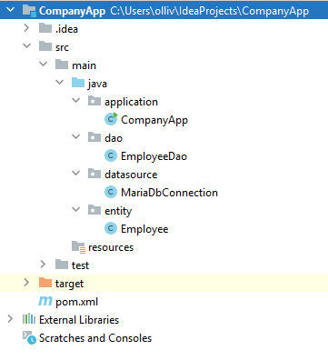

# 7.2 Database usage via JDBC driver

In this submodule, we learn to persist information
into the database and retrieve information from the database.

We use the Company database introduced in the previous submodule as an example. So far, the database contains
just one table, the `EMPLOYEE` table.

Our goal is to provide functionality for three operations:
2. to retrieve all employees from the database
3. to retrieve an employee from the database by id
3. to persist an employee into the database

## 7.2.1. Designing the structure of the application

At this point, we design a structure for our application. We create a new Java project, and split the code into four
packages:
- `application`. This package contains the code for the main application.
- `dao`. This package contains the code for accessing the database.
- `datasource`. This package contains the code for connecting to the database.
- `entity`. This package contains the entity classes. Using MVC terms, this constitutes the model.

The following image shows the structure of the project:




In each package, there can be one or more classes. In our example, there is just one class in each package.

## 7.2.2. The entity class

The entity class is a class that represents an entity in the database. In our example, the entity class is the `Employee` class. It looks like this:

```java
package entity;

public class Employee {

    private String firstName, lastName, email;
    private double salary;

    public Employee(String firstName, String lastName, String email, double salary) {
        super();
        this.firstName = firstName;
        this.lastName = lastName;
        this.email = email;
        this.salary = salary;
    }

    public String getFirstName() {
        return firstName;
    }

    public void setFirstName(String firstName) {
        this.firstName = firstName;
    }

    public String getLastName() {
        return lastName;
    }

    public void setLastName(String lastName) {
        this.lastName = lastName;
    }

    public String getEmail() {
        return email;
    }

    public void setEmail(String email) {
        this.email = email;
    }

    public double getSalary() {
        return salary;
    }

    public void setSalary(double salary) {
        this.salary = salary;
    }
}
```

The class contains the declarations of the instance variables, the constructor, and the getters and setters for the instance variables.

## 7.2.3. The datasource class

In our example, `MariaDbConnection` is the datasource class. It looks like this:

```java
package datasource;

import java.sql.Connection;
import java.sql.DriverManager;
import java.sql.SQLException;

public class MariaDbConnection {

    private static Connection conn = null;

    public static Connection getInstance() {
        if (conn==null) {
            // connect if necessary
            try {
                conn = DriverManager.getConnection(
                        "jdbc:mariadb://localhost:3306/company?user=appuser&password=password");
            } catch (SQLException e) {
                System.out.println("Connection failed.");
                e.printStackTrace();
            }
            return conn;
        }
        else {
            return conn;
        }
    }

    public static void terminate() {
        try {
            getInstance().close();
        } catch (SQLException e) {
            // TODO Auto-generated catch block
            e.printStackTrace();
        }
    }
}

``` 

This class contains the code for connecting to the database. The method `getInstance()` returns the connection object. The method `terminate()` closes the connection.

For the `getInstance()` method, we use the singleton pattern. The singleton pattern ensures that there is only one instance of the class.
The motivation for using the singleton pattern is that we want to have only one connection object. If we create a new connection object for each request, we would run out of connections.
Also, establishing a connection is a costly operation. We want to avoid establishing a connection for each request.

## 7.2.4. The DAO class

The idea of the DAO class is to encapsulate the database access code. The DAO class contains the code for accessing the database. In our example, the DAO class is the `EmployeeDAO` class. It looks like this:

```java
package dao;

import entity.Employee;
import java.sql.*;
import datasource.MariaDbConnection;
import java.util.*;

public class EmployeeDao {

    public List<Employee> getAllEmployees() {
        Connection conn = MariaDbConnection.getInstance();
        String sql = "SELECT first_name, last_name, email, salary FROM employee";
        List<Employee> employees = new ArrayList<Employee>();

        try {
            Statement s = conn.createStatement();
            ResultSet rs = s.executeQuery(sql);

            while (rs.next()) {
                String firstName = rs.getString(1);
                String lastName = rs.getString(2);
                String email = rs.getString(3);
                double salary = rs.getDouble(4);
                Employee emp = new Employee(firstName, lastName, email, salary);
                employees.add(emp);
            }
        } catch (SQLException e) {
            e.printStackTrace();
        }

        return employees;
    }


    public Employee getEmployee(int id) {
        Connection conn = MariaDbConnection.getInstance();
        String sql = "SELECT first_name, last_name, email, salary FROM employee WHERE id=?";

        String firstName = null;
        String lastName = null;
        String email = null;
        double salary = 0.0;
        int count = 0;

        try {
            Statement s = conn.createStatement();
            PreparedStatement ps = conn.prepareStatement(sql);
            ps.setInt(1, id);

            ResultSet rs = ps.executeQuery();

            while (rs.next()) {
                count++;
                firstName = rs.getString(1);
                lastName = rs.getString(2);
                email = rs.getString(3);
                salary = rs.getDouble(4);
            }
        } catch (SQLException e) {
            e.printStackTrace();
        }

        if (count==1) {
            return new Employee(firstName, lastName, email, salary);
        }
        else {
            return null;
        }
    }

    public void persist(Employee emp) {
        Connection conn = MariaDbConnection.getInstance();
        String sql = "INSERT INTO employee (first_name, last_name, email, salary) VALUES (?, ?, ?, ?)";
        try {
            PreparedStatement ps = conn.prepareStatement(sql);
            ps.setString(1, emp.getFirstName());
            ps.setString(2, emp.getLastName());
            ps.setString(3, emp.getEmail());
            ps.setDouble(4, emp.getSalary());

            ps.executeUpdate();
        } catch (SQLException e) {
            e.printStackTrace();
        }
    }
}

```

The class contains three methods:
- `getAllEmployees()` returns a list of all employees in the database.
- `getEmployee(int id)` returns the employee with the given id.
- `persist(Employee emp)` persists the given employee in the database.

The class uses the connection object from the datasource class.

The `getAllEmployees()` method first creates a list of employees. Then it executes a query to retrieve all employees from the database.
For each employee, it creates an Employee object and adds it to the list. Finally, it returns the list.

As a `SELECT` query always returns a result set, we use a `ResultSet` object to store the result of the query.
In the beginning, variable `rs` points to the first row of the result set. The `next()` method moves the pointer to the next row.
If there is no next row, the method returns false.

For each row, the data is retrieved using the `getString()` and `getDouble()` methods.
Based on this data, an `Employee` object is created and added to the list of employees that is eventually returned.


The `getEmployee(int id)` method treats the SQL statement slightly differently.
Instead of using a `Statement` object to pass the query to the database, we use a `PreparedStatement` object.
A prepared statement is an SQL statement with a placeholder for one or more of the parameters. In this case, there is one parameter, the id.
The placeholder is represented by a question mark. The prepared statement is first created by a `Statement` object. The `Statement` object is, in turn, created
using the connection object given by the datasource class.

Before we are able to execute the prepared statement, we have to set the value of the placeholder. This is done using the `setInt()` method. The first parameter is the index of the placeholder. The second parameter is the value of the placeholder.
There are dedicated methods for different types of placeholders.
If the type of the placeholder is `String`, we use the `setString()` method. If the type of the placeholder is `double`, we use the `setDouble()` method.

The prepared statement is executed using the `executeQuery()` method. The `executeQuery()` method then returns a `ResultSet` object,
which can be iterated in a similar way as before.

This time, since we are only interested in one employee, we use a counter to check whether there is only one employee with the given id.
If there is exactly one employee with the given id, we return the employee. As the id is the primary key of the employee table,
there should never be a situation where the result set contains more than one employee. However, it is possible that there is no employee with the given id.
In this case, we return null.

The `persist(Employee emp)` method also creates a prepared statement. This time, the prepared statement is an insert statement that contains four placeholders.
As before, the placeholders are replaced by the values of the `Employee` object.
Since this is a data modification statement, we use the `executeUpdate()` method instead of the `executeQuery()` method.
The `executeUpdate()` method always returns the number of rows that were affected by the statement. In our example, the number of affected rows is always 1.

Finally, it is worth noting that in the previous example we had just one entity class that was well represented by a single DAO class.
If we had more entity classes, we might want to create a separate DAO class for each entity class. Alternatively, we could create a single DAO class that
contains methods for all entity classes.


## 7.2.5. The application class

The application class is the class that contains the main method. It looks like this:

```java
package application;

import entity.*;
import dao.*;
import java.util.*;

public class CompanyApp {

    public static void main(String[] args) {

        EmployeeDao empdao = new EmployeeDao();

        List <Employee> employees = empdao.getAllEmployees();
        for (Employee emp : employees) {
            System.out.println(emp.getFirstName() + " " + emp.getLastName());
        }

        Employee emp = empdao.getEmployee(2);
        System.out.println(emp.getFirstName() + " " + emp.getLastName());
        
        empdao.persist(new Employee("Viivi", "Puro", "viivip@mymail.fi", 8300.00));

        datasource.MariaDbConnection.terminate();
    }
}

```

The simple application class just demonstrates the use of the `EmployeeDao` class.

The first thing we do is to create an instance of the `EmployeeDao` class. This is done using the `new` operator.
The `EmployeeDao` class has a default constructor, so we don't have to pass any parameters to the constructor.

The `getAllEmployees()` method is called and the result is stored in a list of employees. The list is then iterated and the first and last names of each employee are printed.

Next, we find the data of a single employee. The `getEmployee(int id)` method is called and the result is stored in an `Employee` object.
Then, the first and last names of the employee are printed.

Finally, we create a new employee and persist it in the database. The `EmployeeDao` class has a `persist(Employee emp)` method for this purpose.
The new employee is created using the `Employee` constructor. The constructor takes four parameters: the first name, the last name, the email and the salary.
The new employee is then passed to the `persist(Employee emp)` method.

Finally, we terminate the connection to the database. This is done using the `terminate()` method of the `MariaDbConnection` class.
The call to the `terminate()` method is not strictly necessary, but it is good practice to close the connection to the database when we are done with it.
The resources would be released anyway when the application terminates.

## 7.2.6. Error handling

In the `EmployeeDao` class, we have used a try-catch block to handle exceptions. The try-catch block is used to catch exceptions that are thrown by the code inside the try block.

As we connect to a database, various exceptions can occur. For example, the database might not be available. In this case, an exception is thrown and the application terminates.
Also, if the SQL statement is invalid, an exception is thrown.
In the code above, we only have a simple catch block that catches all exceptions. In a real application, we would have to handle the different exceptions separately.
Moreover, we should replace the `printStackTrace()` method call with a more meaningful error message or error handling procedure.


