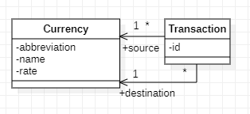

# 7.4. Association in object-relational mapping

In the previous submodule, we learned how to map a class to a table in the database. In this submodule, we will learn how to map associations between classes to tables in the database.

This time we let Hibernate generate the database tables for us. We will use the same example as in the previous submodule, but this time we will add a new class, `Department`, and an association between `Employee` and `Department`.


## 7.4.1. Association, navigability, and cardinality

Association means that two classes are related to each other. In the example, `Employee` and `Department` are associated with each other.

Navigability means that we can navigate from one class to another class. For example, if an `Employee` object knows which `Department` it belongs to, we can navigate from `Employee` to `Department`. If a `Department` object knows which `Employee`s belong to it, we can navigate from `Department` to `Employee`. An association can be unidirectional or bidirectional.

Cardinality means how many objects of one class can be associated with an object of another class. For example, an `Employee` can belong to only one `Department`, but a `Department` can have many `Employee`s. When annotating associations, it is vital to specify the cardinality correctly. If we specify the cardinality incorrectly, Hibernate will not be able to generate the database tables correctly.

Let's consider the following example shown in the UML class diagram:


In the image, the arrowhead displays the navigability of the association. The arrowhead points from `Employee` to `Department`, which means that we can navigate from `Employee` to `Department`, or that the `Employee`object knows which `Department` it belongs to. Other solutions are also possible at the Java level: for instance we could have a `Department` object that knows which `Employee`s belong to it. In this case, the arrowhead would point from `Department` to `Employee`. Or, we could make the association bi-directional, so that both `Employee` and `Department` know about each other. In this case, the arrowhead would point from both `Employee` and `Department` to each other. Irrespective of how we choose the navigability of the association, Hibernate will generate the database tables correctly, provided that we specify the cardinality correctly.

The symbols `*` and `1` in the diagram indicate the cardinality. That is, one department per employee, and many employees per department. 

## 7.4.2. Preparing the database

As we don't want to damage our existing `company` database, we create a new database for this example. Let's call the database `company2`.

First, we create the database in the SQL editor (such as HeidiSQL) or command prompt:
    
```sql
CREATE DATABASE company2;
```

Then we give our existing user account the privileges to perform CRUD operations on the new database:

```sql
GRANT SELECT,INSERT,UPDATE,DELETE ON company2.* TO 'appuser'@'localhost';
```

As we let Hibernate create (and drop) tables this time, we also need to grant the privileges for that:
```sql
GRANT CREATE, DROP ON company2.* TO 'appuser'@'localhost';
```

Now we are ready to start writing the application. We can copy the previous example of submodule 7.3. and modify it to suit our needs.


## 7.4.3. Persisting the data

The first thing to do is to tell Hibernate that we want the database tables to be created automatically. We do this by modifying the 
property with the name `jakarta.persistence.schema-generation.database.action` in the `persistence.xml` file. We change the value from `none` to `drop-and-create`:

```xml
<property name="jakarta.persistence.schema-generation.database.action" value="drop-and-create"/>
```

Then we write the DAO classes for our application. This time, we add a new instance variable into the `Employee` class that contains a reference
to the `Department` object that the employee belongs to:

```java
package entity;

import jakarta.persistence.*;

@Entity
public class Employee {

    @Id
    @GeneratedValue(strategy=GenerationType.IDENTITY)
    private int id;
    private String firstName;
    private String lastName;
    private String email;
    private double salary;
    @ManyToOne
    private Department department;

    public Employee(String firstName, String lastName, String email, double salary, Department department) {
        this.firstName = firstName;
        this.lastName = lastName;
        this.email = email;
        this.salary = salary;
        this.department = department;
    }

    public Employee() {
    }

    public int getId() {
        return id;
    }

    public void setId(int id) {
        this.id = id;
    }

    public String getFirstName() {
        return firstName;
    }

    public void setFirstName(String firstName) {
        this.firstName = firstName;
    }

    public String getLastName() {
        return lastName;
    }

    public void setLastName(String lastName) {
        this.lastName = lastName;
    }

    public String getEmail() {
        return email;
    }

    public void setEmail(String email) {
        this.email = email;
    }

    public double getSalary() {
        return salary;
    }

    public void setSalary(double salary) {
        this.salary = salary;
    }
}

```

The reference to the `Department` object is annotated with the `@ManyToOne` annotation. This annotation tells Hibernate that the association is many-to-one, that is, many employees can belong to one department. This time, as we let Hibernate generate the database tables, we don't need to specify the names of the columns. Hibernate will automatically use the instance variable names as the column names. Also, the table name will be taken directly from the class name.

It may be self-evident, but it is worth mentioning that all references to other classes must be proper object references, not just integers or strings. For example, the `department` instance variable in the `Employee` class is a reference to a `Department` object, not just an integer that contains the department id.

Next, we add the new class, `Department` to the `entity`package that now contains two classes. The `Department` class looks like this:

```java
package entity;

import jakarta.persistence.*;

@Entity
public class Department {

    @Id
    private int id;
    private String name;

    public Department(int id, String name) {
        this.id = id;
        this.name = name;
    }

    public Department() {
    }

    public String getName() {
        return name;
    }

    public void setName(String name) {
        this.name = name;
    }

    public int getId() {
        return id;
    }

    public void setId(int id) {
        this.id = id;
    }
}

```

This class contains only the mandatory annotations. The `@Id` annotation tells Hibernate that the `id` instance variable is the primary key of the table. The `@Entity` annotation tells Hibernate that this class is an entity class.

As the Department objects do not know anything about the Employee objects, we don't need to add any annotations about the association to the `Department` class.

We also write a new DAO class, `DepartmentDAO` that contains the methods for saving and retrieving `Department` objects:

```java
package dao;

import entity.*;
import jakarta.persistence.EntityManager;

public class DepartmentDao {

    public void persist(Department dept) {
        EntityManager em = datasource.MariaDbJpaConnection.getInstance();
        em.getTransaction().begin();
        em.persist(dept);
        em.getTransaction().commit();
    }

    public Department find(int id) {
        EntityManager em = datasource.MariaDbJpaConnection.getInstance();
        Department dept = em.find(Department.class, id);
        return dept;
    }
}
```

For simplicity, we omitted the other methods from the DAO classes, such as the ones for updating and deleting objects.

Finally, the updated `CompanyApp` class in the `application` package inserts a few employees into the database:

```java
package application;

import entity.*;
import dao.*;
public class CompanyApp {
    public static void main(String[] args) {

        EmployeeDao empdao = new EmployeeDao();
        DepartmentDao deptdao = new DepartmentDao();

        Department d1 = new Department(1, "Sales");
        Department d2 = new Department(2, "Marketing");

        deptdao.persist(d1);
        deptdao.persist(d2);

        empdao.persist(new Employee("Viivi", "Puro", "viivip@mymail.fi", 7300.00, d2));
        empdao.persist(new Employee("Tero", "Koski", "tero.koski@mymail.fi", 3750.00, d1));
        empdao.persist(new Employee("Ahmed", "Bakir", "ahmed.bakir@mymail.fi", 4800.00, d1));

    }
}
```

As we run the application, we get the following console output:
```
Hibernate: alter table if exists Employee drop foreign key if exists FK14tijxqry9ml17nk86sqfp561
Hibernate: drop table if exists Department
Hibernate: drop table if exists Employee
Hibernate: create table Department (id integer not null, name varchar(255), primary key (id)) engine=InnoDB
Hibernate: create table Employee (id integer not null auto_increment, email varchar(255), firstName varchar(255), lastName varchar(255), salary float(53) not null, department_id integer, primary key (id)) engine=InnoDB
Hibernate: alter table if exists Employee add constraint FK14tijxqry9ml17nk86sqfp561 foreign key (department_id) references Department (id)
Hibernate: insert into Department (name, id) values (?, ?)
Hibernate: insert into Department (name, id) values (?, ?)
Hibernate: insert into Employee (department_id, email, firstName, lastName, salary) values (?, ?, ?, ?, ?)
Hibernate: insert into Employee (department_id, email, firstName, lastName, salary) values (?, ?, ?, ?, ?)
Hibernate: insert into Employee (department_id, email, firstName, lastName, salary) values (?, ?, ?, ?, ?)
```

We see that a lot has happened behind the scenes:

1. Hibernate has dropped the old tables from the database (if they existed).
2. Hibernate has created the tables for the `Employee` and `Department` classes. The foreign key field `department_id` has been added to the `Employee` table.
3. Hibernate has inserted the data into the tables.

The content of the database tables after the execution looks as follows:

```
+----+-----------+
| id | name      |
+----+-----------+
|  1 | Sales     |
|  2 | Marketing |
+----+-----------+

+----+-----------------------+-----------+----------+--------+---------------+
| id | email                 | firstName | lastName | salary | department_id |
+----+-----------------------+-----------+----------+--------+---------------+
|  1 | viivip@mymail.fi      | Viivi     | Puro     |   7300 |             2 |
|  2 | tero.koski@mymail.fi  | Tero      | Koski    |   3750 |             1 |
|  3 | ahmed.bakir@mymail.fi | Ahmed     | Bakir    |   4800 |             1 |
+----+-----------------------+-----------+----------+--------+---------------+
```

In the example above, the objects have to be persisted in the database in the correct order. First, the `Department` objects have to be persisted, and then the `Employee` objects. If we try to persist the `Employee` objects first, we get an exception
in reaction to the error code sent by the database server. The error would be caused by a foreign key constraint violation, as the `department_id` field in the `Employee` table is a foreign key that references the `id` field in the `Department` table.

It is worth noting that JPA allows automatic cascading of persist operations. This means that if we persist an `Employee` object, the `Department` object that is referenced by the `Employee` object is also persisted automatically. This is a very useful feature, but it is not enabled by default. We can enable it by adding the `cascade` attribute to the `@ManyToOne` annotation in the `Employee` class:

```java
@ManyToOne(cascade = CascadeType.PERSIST)
```

On this course, we will not use this feature, but it is good to know that it exists.


## 7.4.3. Retrieving objects

In the previous example, objects were persisted in the database. Now, we want to retrieve the objects from the database. We can do this by writing a DAO method `find()` in the `EmployeeDao` class that uses the EntityManager's `find` method :

```java
public Employee find(int id) {
    EntityManager em = datasource.MariaDbJpaConnection.getInstance();
    Employee emp = em.find(Employee.class, id);
    return emp;
}
```

We can test the `find()` method by adding the following code to the `CompanyApp` class:

```java
Employee emp = empdao.find(1);
System.out.println(emp.getFirstName() + " " + emp.getLastName());
```

The output of the application is as follows:

```
Viivi Puro
```

The DAO method did not create a `SELECT` statement to fetch the individual's data from the database. The reason for this is that the `Employee` object was already managed by the `EntityManager`. `EntityManager` keeps track of all the objects that it has fetched from (or persisted to) the database. If we try to fetch an object that is already managed by the `EntityManager`, the EntityManager returns the managed object instead of fetching it from the database.

If we wanted to detach the object from the `EntityManager` (and, consequtively, force `EntityManager` to fetch the data from the database the next time the object's data was requested), we could use the `EntityManager.detach()` method. The following DAO method detaches an object from the `EntityManager`:

```java
public void detach(Employee emp) {
    EntityManager em = datasource.MariaDbJpaConnection.getInstance();
    em.detach(emp);
}
```

Now, let's try to fetch the same object again:
```java 
    empdao.detach(empdao.find(1));
    Employee emp = empdao.find(1);
    System.out.println(emp.getFirstName() + " " + emp.getLastName());
```

This time, as the object was detached from the `EntityManager`, the `EntityManager` fetched the data from the database. The output of the application is as follows:

```
Hibernate: select e1_0.id,d1_0.id,d1_0.name,e1_0.email,e1_0.firstName,e1_0.lastName,e1_0.salary from Employee e1_0 left join Department d1_0 on d1_0.id=e1_0.department_id where e1_0.id=?
Viivi Puro
```

Normally, the call of the `detach()` method is not necessary. The previous example is just for the sake of demonstration.

If you look carefully at the previous SQL statement, you notice that there is a `LEFT JOIN` operation to make the `SELECT` statement fetch not only the `Employee` object's data but also the `Department`object's data. This is because the `Employee` class has a `@ManyToOne` association with the `Department` class.  For `@ManyToOne` associations, Hibernate by default uses eager fetching, which means that the data of the associated object is fetched automatically. Eager fetching makes programming easier, but it can cause performance problems if the associated object is not needed in the application. Because of that,
lazy fetching is often preferred in applications where performance is important. We can change the fetching strategy of the `@ManyToOne` association to lazy fetching by adding the `fetch` attribute to the `@ManyToOne` annotation:
```java
@ManyToOne(fetch = FetchType.LAZY)
```
In this case, the `SELECT` statement generated by the `find()` method would only create a one-table `SELECT` statement that fetches the `Employee` object's data from the database. The `Department` object's data would need to be separately fetched only at the time it is needed. Hibernate can do this automatically, if we are in the scope of the `EntityManager`. If we are not in the scope of the `EntityManager`, we need to use the `EntityManager.find()` method to fetch the `Department`'s data.

The choice between eager and lazy loading is not always easy. On this course, you may prefer to use eager loading, as it eliminates the need to write additional code to fetch the associated objects. 

Now that eager loading was on, we can retrieve the data of the related department simply by using the getter method of the `department` field:

```java
System.out.println(emp.getDepartment().getName());
```

The output is as follows:

```
Marketing
```


## 7.4.3. Other types of associations

So far, we have covered association of type `@ManyToOne`. There are other types of associations as well:

* `@OneToOne` - one-to-one association
* `@OneToMany` - one-to-many association
* `@ManyToMany` - many-to-many association

Also, you can make each association either uni-directional or bi-directional. A bidirectional association means that the association is defined in both classes. For example, in the `Employee` class, we have a `@ManyToOne` association with the `Department` class. In the `Department` class, we can also have a `@OneToMany` association with the `Employee` class. This way, we can navigate from the `Employee` object to the `Department` object and vice versa.

The use of a bi-directional association means that you have to specify the owner of the association. The owner is the class that is in charge of persisting the information about the relationship of the associated objects.

These other association types, as well as bi-directional associations, will not be covered on this course, but feel free to explore them on your own.


## Assignment: Storing currency exchange transactions

In the previous assignment, you modified the currency converter application so that it uses JPA to store the currency data in the database. Now, modify the application so that it also stores the currency exchange transactions in the database. An example of a transaction is: _convert 100 euros to Swedish crowns_. 

For the modification, it is advisable to make a new branch in your Git repository. You may create a new database for the application, or you may choose to use the same database as in the previous assignment.


Use the following class structure for your entities:



As you see from the diagram, each `Transaction` object is associated to two `Currency` objects: the source currency and the target currency.

It is enough to store the transactions in the database. You do not need to modify the application so that it would read the transactions from the database.
In general, the observed behaviour of the application should not change from the previous application. The only difference is that the transactions are now stored in the database.

This time, let JPA construct the schema for you based on your annotations. You can do this by modifying the corresponding property in the `persistence.xml` file:

```xml
<property name="jakarta.persistence.schema-generation.database.action" value="drop-and-create"/>
```

Each transaction has a transaction id. The transaction id should become the primary key in the database table. Let the database server generate the transaction id automatically.


Use HeidiSQL to check that the database schema was created correctly. Pay attention to the primary keys and foreign keys: are they correct?

For this assignment, you get points in the following way:

- Both `Currency` and `Transaction` classes are implemented and annotated: 1 point
- The application successfully generates the database schema: 1 point
- There is a new DAO class for the `Transaction` class with a method for storing a transaction in the database: 1 point
- The handler method for the conversion button calls the new DAO method to store the transaction in the database: 1 point
- The application successfully stores the transactions in the database: 1 point
- The transaction id is generated automatically by the database server: 1 point

---
_This learning material has been produced with assistance from OpenAI's ChatGPT-4 and GitHub Copilot. These large language models have provided suggestions and solutions that have assisted the author in producing and supplementing the material. While their contribution has been significant, the final responsibility for the content and its correctness resides with the author._
