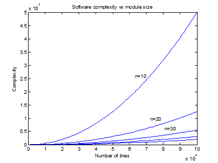

# Testing

How many 'F' characters are you able to find in the text below?

>FINISHED FILES ARE THE RESULT OF YEARS OF SCIENTIFIC STUDY
COMBINED WITH THE EXPERIENCE OF YEAR

Should we check that using a computer? — Yes, indeed; every time it is possible!

## An alternative for testing, mathematical proof

Instead of testing, another possibility is to mathematically [_proof_](https://en.wikipedia.org/wiki/Correctness_(computer_science)) that the algorithm/program is correct. It works in ever-increasing cases, but in general it is difficult. For example, in the following piece of code, is the variable `x` being used uninitialized or not?
```Java
int x;

int k = 1, j = 1;
for (int i = 1; --j != 0 || k != 0; k = j != 0 ? i % j != 0 ? k : k-j : (j=i+=2));
System.out.println(x);
```
The answer is: nobody knows!

The for loop terminates if and only if `i` holds an odd [perfect](https://en.wikipedia.org/wiki/Perfect_number) number, an integer that is the sum of its proper positive divisors (28 is a perfect number because 28=1+2+4+7+14).

In that nobody knows today whether odd perfect number exists, it is unknown whether the `println(x)` statement will ever be executed. Neither humans nor machines have a straightforward way of deciding this.

In practice, `println(x)` may be treated as unreachable because it is known that an odd perfect number must be greater than 10<sup>300</sup>, which means that at least 10<sup>600</sup> iterations must be taken. (Zellers, A., “Why Programs Fail, A Guide to Systematic Debugging”, MK, 2009, p. 166).

Probably in the future we will be able to prove that odd perfect number exists (or not), and thus be able to answer whether the previous program is wrong or not. But new, more difficult problems will always arise, and we have no idea how to solve them. [Kurt Gödel](https://en.wikipedia.org/wiki/Kurt_G%C3%B6del) showed in 1931 that it is impossible for a sufficiently rich formalized deductive system to prove consistency of the system by methods belonging to the system, i.e., **every** _consistent_ logical system contains "undecidable" problems (Eves, H., "Foundations and Fundamental Concepts of Mathematics", Dover, 1990).

## Large programs are complex, modularize them

[Complexity](https://en.wikipedia.org/wiki/Complex_system) is related to the number of ways its components (e.g., objects, functions, etc.) can interact. Software is full of components and their interactions. We can model the interactions/connections between components/modules using full [mesh network](https://en.wikipedia.org/wiki/Mesh_networking).

If $N$ is the number of code lines in the application, $n$ is the average number of code lines in a software module, then the number of interactions (&asymp; complexity $C$) can be given as:
$$C(N,n)=\frac{(\frac{N}{n})(\frac{N}{n}-1)}{2}=\frac{\frac{N^2}{n^2}-\frac{N}{n}}{2}$$
This can be drawn as:



From the picture, we can see that by dividing source code (by increasing the number of lines in modules, $n$) to reasonable sized, relatively independent and encapsulated modules, we can keep the complexity manageable.

This reducing of the application complexity (and error probability) can be done by increasing the size of modules ($n$) using:
- Information hiding
- Abstraction
- Interfaces

## Practical testing

### Error Situations and Step-By-Step Problem Resolving
Errors end up in the programs that we write. Sometimes the errors are not serious and cause headache mostly to users of the program. Occasionally, however, mistakes can lead to [grave consequences](https://en.wikipedia.org/wiki/Mars_Climate_Orbiter). In any case, it's certain that a person learning to program makes many mistakes.

As programs grow in their complexity, finding errors becomes even more challenging. Sometimes it is easier to find errors if you can run the program step by step and examine the changes made by each step. For this purpose, there is a tool called a *debugger*. There is a debugger integrated into IntelliJ IDEA. The use of the debugger is introduced in this good [tutorial](https://www.jetbrains.com/help/idea/debugging-your-first-java-application.html).

### Stack Trace

When an error occurs in a program, the program typically prints something called a stack trace, i.e., the list of method calls that resulted in the error. If you catch an exception, you can use `printStackTrace`. It makes it possible to find out how the program has progressed to the point of failure.
```Java
catch (Exception e) {
    e.printStackTrace();
    // your execption processing here
}
```
For example, a stack trace might look like this:
```text
  Exception in thread "main" java.lang.ArithmeticException: / by zero
	at Main.erroronpurpose(Main.java:17)
	at Main.main(Main.java:23)
```

The type of error is stated at the beginning of the list, and the following line tells us where the error occurred. The line "at Main.erroronpurpose(Main.java:17)" says that the error occurred at line number 17 (in method erroronpurpose of the class Main in the Main.java file). The next line "Main.main(Main.java:23)" tells us that the previous method (erroronpurpose) was invoked at line 23 in the Main.java file.

### Checklist for Troubleshooting

If your code doesn't work, and you don't know where the error is, these steps will help you get started.

1. Indent your code properly and find out if there are any missing parentheses. IntelliJ IDEA can help you with this with the `Code`-`Reformat Code` command.
2. Verify that the variables used are correctly named.
3. Test the program flow with different inputs and find out the sort of input that causes the program to not work as desired. If you received an error in the tests, the tests may also indicate the input used.
4. Add print commands to the program in which you print out the values of the variables used at various stages of the program's execution.
5. Verify that all variables you are using are initialized. If they aren't, a `NullPointerException` error will occur.
6. If your program causes an exception, you should definitely pay attention to the stack trace associated with the exception, which is the list of method calls that resulted in the situation that caused the exception.
7. Learn how to use the debugger.

### Passing Test Input to Scanner

Manually testing the program is often laborious. It's possible to automate the passing of input by, for example, passing the string to be read into a Scanner object. You'll find an example below of how to test a program automatically. The program first enters five strings, followed by the previously seen string ("one"). After that, we try to enter a new string ("six"). The string "six" should not appear in the word set.

The test input can be given as a string to the `Scanner` object in the constructor. Each line break in the test feed is marked on the string with a combination of a backslash and an 'n' character, e.g., "\n".

```Java
String input = "one\n" + "two\n"  +
                "three\n" + "four\n" +
                "five\n" + "one\n"  +
                "six\n";

Scanner reader = new Scanner(input);    // Not System.in, but a string!

ArrayList<String> read = new ArrayList<>();

while (true) {
    System.out.println("Enter an input: ");
    String line = reader.nextLine();
    if (read.contains(line)) {
        break;
    }

    read.add(line);
}

System.out.println("Thank you!");

if (read.contains("six")) {
    System.out.println("A value that should not have been added to the group was added to it.");
}
```

The program's output only shows the one provided by the program, and no user commands.
```text
Enter an input:
Enter an input:
Enter an input:
Enter an input:
Enter an input:
Enter an input:
Thank you!
```

Passing a string to the constructor of the Scanner class replaces input read from the keyboard. As such, the content of the string variable `input` 'simulates' user input. A line break in the input is marked with `\n`. Therefore, each part ending in a newline character in a given string input corresponds to one input given to the `nextLine()` command.

When testing your program again manually, change the parameter Scanner object constructor to `System.in`, i.e., to the system's input stream. Alternatively, you can also change the test input, since we're dealing with a string.

The working of the program should continue to be checked on-screen. The print output can be a little confusing at first, as the automated input is not visible on the screen at all. The ultimate aim is to also automate checking the correctness of the output so that the program can be tested and the test result analyzed with the "push of a button".

## Unit testing

_Unit testing_ is a software testing methodology where individual units or components of a software application are tested to ensure their correctness and proper functioning. The purpose of unit testing is to isolate and verify the behavior of each unit of code in isolation, ensuring that it works as intended and does not have any unintended side effects.

Unit tests are typically written by developers and focus on testing small, independent units of code, such as functions, methods, or classes, in isolation from the rest of the application. The idea is to test each unit of code independently to ensure that it produces the expected output given specific inputs, and that it handles various scenarios and edge cases correctly.

Unit testing offers several benefits, including:

1. Early detection of defects: By testing individual units of code, defects can be identified and fixed early in the development process, preventing them from propagating to other parts of the application.

2. Simplified debugging: When a unit test fails, it provides a clear indication of which specific unit of code is causing the problem, making it easier to locate and fix the issue.

3. Code maintainability: Unit tests act as documentation for the expected behavior of units of code. They serve as a safety net when making changes or refactoring code, ensuring that existing functionality remains intact.

4. Improved design and modularity: Unit testing encourages developers to write modular, loosely coupled code that can be tested independently, leading to more maintainable and extensible software.

Unit testing often involves creating test cases that simulate specific scenarios, setting up the required objects or dependencies, invoking methods or functions, and asserting that the actual results match the expected results.

By incorporating unit testing into the development process, developers can gain confidence in the reliability and correctness of their code, leading to more robust and stable applications.

## JUnit 5

[JUnit 5](https://junit.org/junit5/) is a popular testing framework for Java applications. It is the next major version of JUnit, introducing several new features and improvements over its predecessor, JUnit 4.

JUnit 5 provides a comprehensive and flexible platform for writing and executing unit tests in Java. It offers a rich set of annotations, assertions, and APIs to support various testing scenarios and methodologies. Some key features of JUnit 5 include:

1. Modularity: JUnit 5 is designed with a modular architecture, allowing developers to use only the modules they need. The framework consists of three main modules: JUnit Platform, JUnit Jupiter, and JUnit Vintage. The JUnit Platform serves as the foundation for test execution, while JUnit Jupiter provides the programming model and annotations for writing tests. JUnit Vintage supports running tests written in JUnit 3 and 4.

2. Annotations: JUnit 5 introduces new annotations for test configuration and execution. Some commonly used annotations include `@Test` for marking test methods, `@BeforeEach` and `@AfterEach` for setup and teardown actions before and after each test, `@BeforeAll` and `@AfterAll` for setup and teardown actions before and after all tests, and many more.

3. Assertions: JUnit 5 provides a comprehensive set of assertion methods for verifying expected conditions in tests. These assertions are more expressive and flexible compared to previous versions of JUnit. They include methods like `assertEquals()`, `assertTrue()`, `assertThrows()`, `assertTimeout()`, and others, making it easy to check values, conditions, exceptions, and performance characteristics.

4. Parameterized Tests: JUnit 5 introduces the ability to write parameterized tests, where a single test method is executed multiple times with different sets of parameters. This is useful for testing the same functionality with different inputs or configurations, reducing code duplication and improving test coverage.

5. Extensions: JUnit 5 supports the use of extensions to enhance test capabilities and add additional behaviors. Extensions can be used to perform actions before and after tests, provide custom test instance lifecycle management, modify test behavior, or even create custom annotations. Extensions allow developers to extend and customize the testing framework according to their specific needs.

6. Dynamic Tests: JUnit 5 introduces dynamic tests, which are generated at runtime based on some logic or data. Dynamic tests allow for more flexible and programmatically generated test cases, enabling scenarios where the number or structure of tests is determined dynamically during test execution.

To use JUnit 5 with IntelliJ IDEA, you can add the necessary JUnit 5 libraries as dependencies to your project and write test classes and methods using the JUnit 5 annotations and assertions. You can then execute the tests using an IDE, build tools like IntelliJ IDEA projects, Gradle or Maven, or the JUnit console launcher.

JUnit 5 offers a modern and powerful testing framework for Java, providing developers with improved flexibility, readability, and maintainability when writing unit tests. JUnit 5 official [documentation](https://junit.org/junit5/docs/current/user-guide/) is a quite good introduction to the properties of JUnit 5.

<!-- https://java-programming.mooc.fi/part-6/3-introduction-to-testing -->

### IntelliJ IDEA JUnit 5 Set-up 

By default, IntelliJ IDEA uses its own build tool, IntelliJ IDEA projects (other possibilities are Maven and Gradle). To be able to use JUnit 5 framework for testing, you need to prepare IntelliJ IDEA for testing, follow the instructions at this [link](https://www.jetbrains.com/help/idea/testing.html). In summary, you need to:
1. Add testing libraries (JUnit) to your project. After this, the editor is able to recognize JUnit annotations (e.g. `@test`). Be careful, select JUnit 5 library (not JUnit 4, you may need to select ´More actions´ menu).
2. Then you need to create Test Sources Root directory (green folder named 'test' in the picture below). Follow the instructions carefully, if you are using IntelliJ IDEA build tool (builder), then you need to manually create the test root (which holds the JUnit 5 test source files).

Your project structure should look like this:


Now you are able to create JUnit tests. First create the following Main class to be tested:
```Java
public class Main {
    public static boolean isEven(int number) {
        return ((number % 2) == 0);
    }

    public static void main(String[] args) {
        int n = 3;

        System.out.println("Number " + n + " is even: " + isEven(n));
    }
}
```

Then create the JUnit test class. Follow the instructions presented [here](https://www.jetbrains.com/help/idea/create-tests.html), press `Alt+Enter` when the cursor caret is over the `Main` class name. Insert the following code to the `MainTest` class you created:
```Java
import org.junit.jupiter.api.*;

import static org.junit.jupiter.api.Assertions.*;

class MainTest {
    @BeforeAll
    static void beforeAll() {
        System.out.println("**--- Executed once before all test methods in this class ---**");
    }

    @BeforeEach
    void beforeEach() {
        System.out.println("**--- Executed before each test method in this class ---**");
    }

    @Test
    void isEven() {
        System.out.println("**--- Test isEven executed ---**");
        assertEquals(false, Main.isEven(3));
        assertEquals(true, Main.isEven(2));
    }

    @Test
    void testMethod1() {
        System.out.println("**--- Test method1 executed ---**");
    }

    @DisplayName("Test method2 with condition")
    @Test
    void testMethod2() {
        System.out.println("**--- Test method2 executed ---**");
    }

    @Test
    @Disabled("implementation pending")
    void testMethod3() {
        System.out.println("**--- Test method3 executed ---**");
    }

    @AfterEach
    void afterEach() {
        System.out.println("**--- Executed after each test method in this class ---**");
    }

    @AfterAll
    static void afterAll() {
        System.out.println("**--- Executed once after all test methods in this class ---**");
    }
}
```
When you run the test according [these](https://www.jetbrains.com/help/idea/performing-tests.html) instructions, you should get the output like this:
```text
**--- Executed once before all test methods in this class ---**
**--- Executed before each test method in this class ---**
**--- Test isEven executed ---**
**--- Executed after each test method in this class ---**
**--- Executed before each test method in this class ---**
**--- Test method1 executed ---**
**--- Executed after each test method in this class ---**
**--- Executed before each test method in this class ---**
**--- Test method2 executed ---**
**--- Executed after each test method in this class ---**

implementation pending
**--- Executed once after all test methods in this class ---**

Process finished with exit code 0
```

# Documentation

Documentation is a crucial component of software development and plays a key role in ensuring the long-term success, maintainability, and usability of any project. Whether it's documenting code, APIs, or providing user manuals, good documentation enhances collaboration, reduces errors, and facilitates efficient development.

### Introduction to JavaDoc

[**JavaDoc**](https://www.oracle.com/java/technologies/javase/javadoc-tool.html) is a documentation tool that is an integral part of the Java programming language. It is used to automatically generate API documentation in HTML format from comments in the source code. JavaDoc comments provide a structured way to document classes, methods, fields, and other program elements, making it easier for developers to understand and use the code.

JavaDoc comments are written in special comment blocks that start with `/**` and end with `*/` (Notice: normal comments starts with `/*`). These comments are placed just before the program elements (such as classes, methods, and fields) that they describe. JavaDoc provides a set of special tags (e.g., `@param`, `@return`, `@throws`) that make it possible to add detailed descriptions of method parameters, return values, exceptions, and more.

### Key Features of JavaDoc:
1. **HTML Generation**: JavaDoc creates professional-looking HTML documentation, including the descriptions, parameters, return types, and exceptions.
2. **Tag-based Annotations**: Tags like `@param`, `@return`, `@throws`, and `@see` allow detailed descriptions of program elements.
3. **Consistent Documentation**: Encourages developers to document code consistently across teams.
4. **IDE Integration**: Most modern Integrated Development Environments (IDEs) like IntelliJ IDEA offer tools to help generate and maintain JavaDoc comments.

### Example of a JavaDoc Comment:

```java
/**
 * Represents a simple calculator for performing basic arithmetic operations.
 *
 * @author Enzio Benzino  
 * @version 1.0
 */
public class Calculator {
    /**
     * Adds two integers.
     *
     * @param a The first number.
     * @param b The second number.
     * @return The sum of a and b.
     */
    public int add(int a, int b) {
        return a + b;
    }

    /**
     * Subtracts one integer from another.
     *
     * @param a The number to be subtracted from.
     * @param b The number to subtract.
     * @return The result of subtracting b from a.
     */
    public int subtract(int a, int b) {
        return a - b;
    }
}
```

### Common JavaDoc Tags:
- **@param**: Describes a method's parameters.
- **@return**: Describes the return value of a method.
- **@throws (or @exception)**: Describes the exceptions thrown by a method.
- **@see**: Adds a reference to other related methods or classes.
- **@author**: Indicates the author of the class or method.
- **@version**: Specifies the version of the class or method.

JavaDoc serves as both a guide for developers using your code and a reference for yourself and other team members, ensuring the long-term maintainability and usability of the codebase.

### Generating JavaDoc in IntelliJ IDEA:

To generate JavaDoc in IntelliJ IDEA, follow these steps:
1. Open the class or method for which you want to generate JavaDoc.
2. Place the cursor at the beginning of the class or method declaration.
3. Press `Alt+Enter` to open the context menu.
4. Select "Generate JavaDoc" from the menu.
5. IntelliJ IDEA will generate a JavaDoc comment template based on the class or method signature.
6. Fill in the details in the JavaDoc comment, including descriptions, parameters, return values, and exceptions.
7. To generate the HTML documentation, go to `Tools` -> `Generate JavaDoc`.
8. Specify the output directory and other settings, then click `OK` to generate the JavaDoc.
9. The HTML documentation will be generated in the specified output directory, allowing you to view and share the API documentation.
10. You can also view the JavaDoc comments directly in the code editor by hovering over the class or method name.
11. IntelliJ IDEA provides auto-completion and suggestions for JavaDoc tags, making it easier to write comprehensive documentation.

## Assignments

**Task 1: Design a class when JUnit tests are available**

You are given the following unit tests for a pencil class (`Pen`):
```Java
class PenTest {
    @Test
    void canDrawDefault() {
        Pen p = new Pen();
        assertEquals("", p.draw());
        p.capOff();
        assertEquals("Drawing red", p.draw());
        p.capOn();
        assertEquals("", p.draw());
    }

    @Test
    void canDrawSelectedColor() {
        Pen p = new Pen(Pen.Color.BLUE);
        assertEquals("", p.draw());
        p.capOff();
        assertEquals("Drawing blue", p.draw());
        p.capOn();
        assertEquals("", p.draw());
    }

    @Test
    void canChangeColor() {
        Pen p = new Pen(Pen.Color.RED);
        p.capOff();
        assertEquals("Drawing red", p.draw());
        p.changeColor(Pen.Color.GREEN);
        assertEquals("Drawing red", p.draw());

        p.capOn();
        p.changeColor(Pen.Color.GREEN);
        assertEquals("", p.draw());
        p.capOff();
        assertEquals("Drawing green", p.draw());
    }
}
```

Your task is to design the actual class `Pen`. Here is a skeleton for the `Pen` class:
```Java
public class Pen {
    public enum Color {
        RED("red"), GREEN("green"), BLUE("blue");
        private final String color;
        Color(String color) { this.color = color; };
        @Override public String toString() { return color; }
    }
    
    // your code here
}
```

**Task 2: Design a class and JUnit tests**

#### StringManipulator Class

Create a Java class called `StringManipulator` with the following methods:

1. `String concatenate(String str1, String str2)` - Concatenates two input strings and returns the result.
2. `int findLength(String str)` - Returns the length of the input string.
3. `String convertToUpperCase(String str)` - Converts the input string to uppercase and returns the result.
4. `String convertToLowerCase(String str)` - Converts the input string to lowercase and returns the result.
5. `boolean containsSubstring(String str, String subStr)` - Checks if the input string contains the given substring and returns `true` if it does, otherwise returns `false`.

Your task is to write JUnit test cases for the `StringManipulator` class to ensure that these methods work as expected.

#### StringManipulatorTest Class

Create a JUnit test class called `StringManipulatorTest` and implement test cases for each of the methods mentioned above.

Remember to create the `StringManipulator` class with the specified methods before implementing the test cases. Additionally, include the necessary JUnit dependencies in your project to use the annotations and assertion methods (`assertEquals`, etc.).

Once you've written the test cases, run them using your IDE to verify that the `StringManipulator` methods behave correctly.

For this assignment, you get points in the following way:
1. Task 1 completed: 3 points
2. Task 2 completed: 3 points
