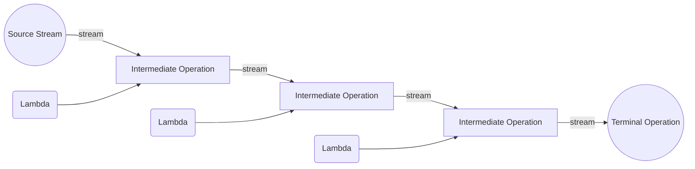

# Functional programming in Java

This section is about modeling problems and implementing systems with *immutable data* and operations that implement *pure functions*, as opposed to *mutable data* and operations with *side effects*. *Functional programming* is the name for this style of programming.

Functional programming is much easier to do when you have *first-class functions* in your language, and you can build *higher-order functions* that abstract away control flow code. Some languages (e.g., Scala) are strongly associated with functional programming. Many other languages (e.g., Java,JavaScript, C++) use functional programming to a greater or lesser extent. With Java’s recently-added functional language features, if you continue programming in Java you should expect to see more functional programming there, too.

## Programming paradigm

[Programming paradigms](https://en.wikipedia.org/wiki/Programming_paradigm) are a way to classify
programming languages based on their features. Languages can be classified into multiple paradigms:
- **Declarative programming** is a paradigm describing **WHAT** the program does, without explicitly specifying its control flow.
- **Imperative programming** is a paradigm describing **HOW** the program should do something by explicitly specifying each instruction (or statement) step by step, which [mutate](https://en.wikipedia.org/wiki/Immutable_object) the program's state.

## Declarative programming

Java has been traditionally supporting the imperative style of programming and object-oriented style
of programming. Nowadays, Java has started supporting the functional style of programming with its
Java 8 release.

- **What is functional programming?**  It is a declarative style of programming rather than imperative.
The basic objective of this style of programming is to make code more concise, less complex,
more predictable, and easier to test compared to the legacy style of coding. Functional programming
deals with certain key concepts such as pure function, immutable state, assignment-less programming
etc.
- **Functional programming vs Purely Functional programming**:
Pure functional programming languages don’t allow any mutability in its nature, whereas a functional
style language provides higher-order functions but often permits mutability at the risk of we failing
to do the right things, which put a burden on us rather than protecting us. So, in general, we can
say if a language provides higher-order function, it is functional style language, and if a language
goes to the extent of limiting mutability in addition to higher-order function then it becomes purely
functional language. Java is a functional style language, and the language like Haskell is a purely
functional programming language.

Let’s understand a few concepts in functional programming: 

- **Higher-order functions**: In functional programming, functions are to be considered as [first-class
citizens](https://ericnormand.me/podcast/what-are-first-class-functions). That is, so far in the legacy style of coding, we can do below stuff with objects:
  1. We can pass objects to a function.
  2. We can create objects within function.
  3. We can return objects from a function.

  When functions are first-class citizens, the following is also possible:
  4. We can pass a function to a function.
  5. We can create a function within function.
  6. We can return a function from a function.
- **Pure functions**: A function is called pure function if it always returns the same result for same argument values, and it has no side effects like modifying an argument (or global variable) or outputting something.
- **Lambda expressions**: A Lambda expression is an anonymous method that has mutability at very
minimum and it has only a parameter list and a body. The return type is always inferred based on the
context. Also, make a note, Lambda expressions work in parallel with the functional interface.

## Imperative vs. Declarative Programming

The functional style of programming is declarative programming. In the imperative style of coding,
we define what to do a task and how to do it. Whereas, in the declarative style of coding, we only
specify what to do. Let’s understand this with an example. Given a list of number let’s find out
the sum of double of even numbers from the list using an imperative and declarative style of coding.

```Java
import java.util.Arrays;
import java.util.List;
public class ImperativeDemo {
    public static void main(String[] args) {
        List<Integer> numbers
            = Arrays.asList(11, 22, 33, 44,
                            55, 66, 77, 88,
                            99, 100);
 
        int result = 0;
        for (Integer n : numbers) {
            if (n % 2 == 0) {
                result += n * 2;
            }
        }
        System.out.println(result);
    }
}
```
Output
```text
640
```

The first issue with the above code is that we are mutating the variable result again and again.
So mutability is one of the biggest issues in an imperative style of coding. The second issue with
the imperative style is that we spend our effort telling not only what to do but also how to do the
processing. Now let’s re-write the above code in a declarative style.

### Java stream

[Stream API](https://docs.oracle.com/javase/8/docs/api/java/util/stream/Stream.html) is used to process collections of objects. A stream is a sequence of objects that
supports various methods which can be pipelined to produce the desired result. The features of Java
stream are:
- A stream is not a data structure instead it takes input from the Collections, Arrays or I/O channels.
- Streams don’t change the original data structure, they only provide the result as per the pipelined methods.
- Each intermediate operation is lazily executed and returns a stream as a result, hence various intermediate operations can be pipelined. Terminal operations mark the end of the stream and return the result.



#### Generating a stream

In Java, you can generate a stream using various methods provided by the `java.util.stream` package.
Here are a few common ways to generate a stream in Java:

1. **From a Collection**: You can generate a stream from an existing collection, such as a `List`, `Set`, or `Map`. Use the `stream()` method to obtain a sequential stream or `parallelStream()` for a parallel stream.

   ```java
   List<String> names = Arrays.asList("Alice", "Bob", "Charlie");
   Stream<String> stream = names.stream();
   ```

2. **From an Array**: You can generate a stream from an array using the `Arrays.stream()` method. This allows you to perform stream operations on the elements of the array.

   ```java
   String[] names = {"Alice", "Bob", "Charlie"};
   Stream<String> stream = Arrays.stream(names);
   ```

3. **Using Stream.of()**: The `Stream.of()` method allows you to create a stream directly from individual elements or a variable number of arguments.

   ```java
   Stream<String> stream = Stream.of("Alice", "Bob", "Charlie");
   ```

4. **Using Stream.generate()**: If you need to generate a stream with a custom sequence or pattern, you can use the `Stream.generate()` method. You provide a `Supplier` function that generates the elements for the stream.

   ```java
   Stream<Integer> stream = Stream.generate(() -> 42);
   ```

5. **Using Stream.iterate()**: The `Stream.iterate()` method allows you to generate a stream with a sequential series of elements. You provide an initial value and a function that generates the next element based on the previous one.

   ```java
   Stream<Integer> stream = Stream.iterate(0, n -> n + 2);
   ```

These are just a few examples of how to generate streams in Java. Once you have a stream, you can apply various intermediate and terminal operations on it, such as filtering, mapping, sorting, and collecting the results. Streams provide a declarative and functional way to process data, promoting more concise and readable code.

Remember to import the necessary classes from the `java.util.stream` package to use streams effectively.

```java
import java.util.Arrays;
import java.util.List;
import java.util.stream.Stream;
```

If we imagine Streams as streams of water flowing through a tank,
then our job is to use each byte that gets out of the tank through
the pipe with Stream API methods.

#### Different Operations On Streams


##### Intermediate Operations

1. `map`: The map method is used to return a stream consisting of the results of applying the given function to the elements of this stream.
```java
List   number = Arrays.asList(2,3,4,5);
Stream stream = number.stream();
List   square = stream.map(x->x*x).collect(Collectors.toList());
```
2. `filter`: The filter method is used to select elements as per the Predicate passed as an argument.
```java
List names = Arrays.asList("Reflection","Collection","Stream");
List result = names.stream().filter(s->s.startsWith("S")).collect(Collectors.toList());
```
3. sorted: The sorted method is used to sort the stream.
```java
List names = Arrays.asList("Reflection","Collection","Stream");
List result = names.stream().sorted().collect(Collectors.toList());
```

##### Terminal Operations

1. `collect`: The collect method is used to return the result of the intermediate operations performed on the stream.
```java
List number = Arrays.asList(2,3,4,5,3);
Set square = number.stream().map(x->x*x).collect(Collectors.toSet());
```
2. forEach: The forEach method is used to iterate through every element of the stream.
```java
List number = Arrays.asList(2,3,4,5);
number.stream().map(x->x*x).forEach(y->System.out.println(y));
```
3. reduce: The reduce method is used to reduce the elements of a stream to a single value. The reduce method takes a BinaryOperator as a parameter.
```java
List number = Arrays.asList(2,3,4,5);
int even = number.stream().filter(x->x%2==0).reduce(0,(ans,i)-> ans+i);
```
Here ans variable is assigned 0 as the initial value and i is added to it

#### Method references

A lambda expression like `x -> Math.sqrt(x)` has an unnecessary level of indirection – it takes an argument, calls `sqrt` on that argument, and directly returns the result of `sqrt`. So calling the lambda expression is effectively the same as calling `sqrt` directly.

Java lets us eliminate this level of indirection by referring to the `sqrt` method directly:
```java
Arrays.asList(1, 4, 9, 16).stream().map(Math::sqrt)
```

This syntax, `Math::sqrt`, is called a *method reference*. Note the `::` between the class name and method name, rather than the usual `.` which distinguishes the method reference from an ordinary method call or field lookup. You can read more about **method references** in the [Java Tutorials](https://docs.oracle.com/javase/tutorial/java/javaOO/methodreferences.html) for the details about the several kinds of method references that Java supports, including not only static methods like `sqrt` but also instance methods like `String::lowercase`.

But let’s pause here for a second, because we’re doing something unusual with functions. The map method takes a reference to a *function* as its argument — not to the result of that function. When we wrote `map(Math::sqrt)`, we didn’t call *sqrt*, like `Math.sqrt(25)` is a call. Instead, we referred to the function itself by name. `Math::sqrt` is a reference to an object representing the `sqrt` function. The type of that object is `Function<T,R>`, which represents unary functions from `T` to `R`. The primary operation of a `Function` is `apply()`, which calls the function with an argument. So `(Math::sqrt).apply(25.0)` returns 5.0, just like `Math.sqrt(25.0)` would.

But you can also assign that function object to another variable if you like, and it still behaves like sqrt:
```java
Function<Double,Double> mySquareRoot = Math::sqrt;
mySquareRoot.apply(16.0); // returns 4.0
```        
You can also pass a reference to the function object as a parameter to another function, and that’s what we’re doing here with `map`. You can use function objects the same way you would use any other value in Java, like ints or string references or other object references. This is how functions are first-class in Java.

#### Stream processing

Now let's implement the `ImperativeDemo` in functional way:

```Java
import java.util.Arrays;
import java.util.List;
public class DeclarativeDemo {
public static void main(String[] args) {
    List<Integer> numbers
    = Arrays.asList(11, 22, 33, 44,
                    55, 66, 77, 88,
                    99, 100);

    System.out.println(
        numbers.stream()
            .filter(number -> number % 2 == 0)
            .mapToInt(e -> e * 2)
            .sum());
    }
}
```
Output
```text
640
```
From the above code, we are not mutating any variable. Instead, we are transforming the data from one
function to another. This is another difference between Imperative and Declarative. Not only this but
also in the above code of declarative style, every function is a pure function and pure functions
don’t have side effects.

In the above example, we are doubling the number with a factor 2, that is called Closure. Remember,
lambdas are stateless and closure has immutable state. It means in any circumstances, the closure
could not be mutable.

#### Closure


## Map/Filter/Reduce


<!-- http://web.mit.edu/6.031/www/fa17/classes/26-map-filter-reduce/ -->

<!-- https://www.geeksforgeeks.org/functional-programming-in-java-with-examples/ -->

<!-- https://www.baeldung.com/java-synchronized -->

## Assignments

**Task 1: Calculate mean of an array in functional way (e.g. no `for`-loops)**

