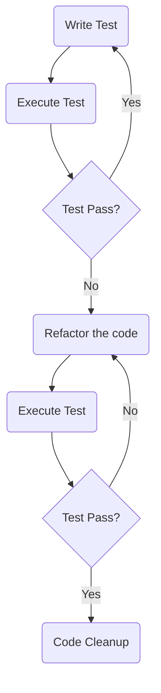
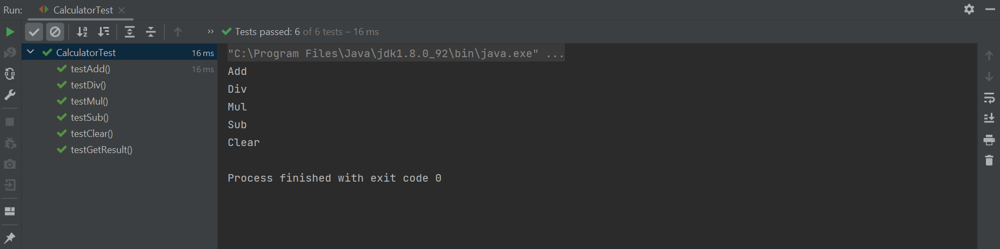

# Test-Driven Development

[Test-driven development](https://en.wikipedia.org/wiki/Test-driven_development) is a software development process that's based on constructing a piece of software in small iterations. In test-driven software development, the first thing a programmer always does is write an automatically-executable test, which tests a single piece of the computer program.
The test will not pass because the functionality that satisfies the test, i.e., the part of the computer program to be examined, is missing. Once the test has been written, functionality that meets the test requirements is added to the program. The tests are then run again. If all tests pass, a new test is added, or alternatively, if the tests fail, the already-written program is corrected. If necessary, the internal structure of the program will be corrected or refactored, so that the functionality of the program remains the same, but the structure becomes clearer.

Test-driven software development consists of five steps that are repeated until the functionality of the program is complete.

1. Write a test. The programmer decides which program functionality to test and writes a test for it.
2. Run the tests and check if the tests pass. When a new test is written, the tests are run. If the test passes, the test is most likely erroneous and should be corrected—the test should only test functionality that hasn't yet been implemented.
3. Write the functionality that meets the test's requirements. The programmer implements functionality that only meets the test requirements. Note: this doesn't do things that the test does not require - functionality is only added in small increments.
4. Perform the tests. If the tests fail, there is likely to be an error in the functionality written. Correct the functionality—or, if there is no error in the functionality, fix the latest test that was performed.
5. Repair the internal structure of the program. As the size of the program increases, its internal structure is adjusted as needed. Methods that are too long are broken down into multiple parts and classes representing concepts are isolated. The tests are not modified, but are instead used to verify the correctness of the changes made to the program's internal structure—if a change in the program structure changes the functionality of the program, the tests will produce a warning and the programmer can remedy the situation.



## Creating the program in small steps

1. Create a test that tests some feature that will be added to the program.
2. Run the test. It should not pass.
   - If the test passes, move to step 1.
3. Develop the program so that it has the functionality required to pass the test.
4. Run the tests.
   - If the tests don’t pass, move to step 3 and further develop the functionality.
5. Refactor
   - If the program is ready, stop ...
   - Otherwise, go to step 1.

Read Martin Fowler [Test Driven Development](https://martinfowler.com/bliki/TestDrivenDevelopment.html) article.

## An example

### Preparation: Create a skeleton for the class to be tested

In this phase we design methods and their parameters (API - Application Programmers Interface), but **not** the implementation. Code compiles, but does nothing.
```Java
public class Calculator {
    private int result;

    public void clear() {
        // not yet implemented
    }
    public void add(int n) {
        // not yet implemented
    }
    public void sub(int n) {
        // not yet implemented
    }
    public void mul(int n) {
        // not yet implemented
    }
    public void div(int n) {
        // not yet implemented
    }
    public int giveResult() {
        return result;
    }
}
```

### Device a test case and create a test method

Create a separate tester class for the class to be tested. Don't insert any testing code to the class to be tested. Then write to the tester class methods that invoke those methods to be tested (be careful with the parameters). For every method to be tested, create one or more tester methods (e.g., one for each test case). According to TDD principles, first run tests so that the result is failure (to check that the test skeleton works).

Using JUnit 5 this tester class could be something like this:

```Java
import org.junit.jupiter.api.Test;

import static org.junit.jupiter.api.Assertions.fail;

public class CalculatorTest {
   @Test
   void testClear() {
       fail("Not yet implemented");
   }
   @Test
   void testAdd() {
       fail("Not yet implemented");
   }
   @Test
   void testSub() {
       fail("Not yet implemented");
   }
   @Test
   void testMul() {
       fail("Not yet implemented");
   }
   @Test
   void testDiv() {
       fail("Not yet implemented");
   }
   @Test
   void testGetResult() {
       fail("Not yet implemented");
   }
}
```

The logic behind testing method:
- **arrange**: initialize test settings (e.g., create objects, etc.)
- **act**: invoke the method to be tested with test case parameters
- **assert**: check whether we got the expected result

#### Annotations

When you have many test methods in the test class, pre- and postprocessing operations for testing methods can be merged
- `@BeforeEach` annotation
  - annotates method which is invoked **before every** testing method
  - used e.g., initializing variables, to open files, etc.
- `@AfterEach` annotation
  - annotates method which is invoked **after every** testing method
  - used e.g., for closing files
- `@BeforeAll` annotation
  - annotates method which is invoked **only once before** invoking the first testing method
  - used e.g., for resource allocation, opening files
- `@AfterAll` annotation
  - annotates method which is invoked **only once after** invoking the last testing method
  - used e.g., for releasing resources, closing files
- Complete list can found [here](https://junit.org/junit5/docs/current/api/), look Package org.junit.jupiter.api

#### Annotations for testing methods

Annotate testing methods with `@Test` or `@ParametrizedTest` annotations. Testing methods never return any values, returning type should be `void`. Visibility is package wide by default. There is no need to change it, so leave it without `private/protected/public` keywords.
> A variable or method declared without any access control modifier is available to any other class in the same package. The default modifier cannot be used for methods, fields in an interface. 

JUnit invokes testing methods automatically and in random order. There is no need to implement `main()` method.

It is possible to annotate testing method so that it is not invoked by `@Disabled("reason why we don't use this")`.

You can have `private` methods inside testing class, they don't have any JUnit annotations, and they are executed when explicitly invoked.

#### Check results using assertions

Implement the test condition which should be true after invoking the method to be tested. If the test condition is not true, test was not successful.

- `fail(String message)`
  - informs that the test was not successful
- `assertTrue(boolean condition, String message)`
- `assertFalse(boolean condition, String message)`
  - check whether the condition parameter given is true/false
- `assertEquals(Object expected, Object actual)`
- `assertEquals(Object expected, Object actual, String message)`
  - check if the parameters expected and actual are the same
  - if not, reports the message given
  - if comparing floating point values, the third parameter is the precision used in comparison (delta)
    - `assertEquals(100.0, result, 0.0)` &rarr; exact match
    - `assertEquals(100.0, result, 0.1)` &rarr; match with a precision of 0.1
- `assertArrayEquals(Object[] expecteds, Object[] actuals)`
- `assertArrayEquals(Object[] expecteds, Object[] actuals, String msg)`
  - every element of an array must be the same

It is possible to limit the testing time, e.g. `@Timeout(value=2, unit=TimeUnit.SECONDS)`. Exception can be also a valid result, `assertThrows()`. Complete list can found [here](https://junit.org/junit5/docs/current/api/).

```Java
import org.junit.jupiter.api.*;
import static org.junit.jupiter.api.Assertions.*;

public class CalculatorTest {
    private static Calculator c;

    @BeforeAll
    static void setupBeforeClass() throws Exception {
        c = new Calculator();   // same object in every test
    }
    @BeforeEach
    void setUp() {
        c.clear();              // clear the calculator before every test
    }
    @Test
    void testClear() {
        System.out.println("Clear");
        c.clear();
        assertEquals(0, c.giveResult(), "Clearing was not successful");
    }
    @Test
    void testAdd() {
        System.out.println("Add");
        c.add(2);
        assertEquals(2, c.giveResult(), "Addition was not succesful");
        c.add(2);
        assertEquals(4, c.giveResult(), "Addition was not succesful");
    }
    @Test
    void testSub() {
        fail("Not yet implemented");
    }
    @Test
    void testMul() {
        fail("Not yet implemented");
    }
    @Test
    void testDiv() {
        fail("Not yet implemented");
    }
    @Test
    void testGetResult() {
        fail("Not yet implemented");
    }
}
```

> For curious: `static import` is a feature introduced in the Java programming language that allows members (fields and methods) which have been scoped within their container class as `public static`, to be used in Java code without specifying the class in which the field has been defined.

`testAdd()` methods fails tests, because it has not been implemented yet. `textClear()` succeeds, because integer type instance variables have zero as an initial value.
```text
Add
org.opentest4j.AssertionFailedError: Addition was not succesful ==>
Expected :2
Actual   :0
org.opentest4j.AssertionFailedError: Not yet implmented
org.opentest4j.AssertionFailedError: Not yet implmented
org.opentest4j.AssertionFailedError: Not yet implmented
Clear
org.opentest4j.AssertionFailedError: Not yet implmented
Process finished with exit code -1
```

### Implement the method to be tested

One simple implementation could be like this:
```Java
public class Calculator {
    private int result;

    public void clear() {
        result = 0;
    }
    public void add(int n) {
        result += n;
    }
    public void sub(int n) {
        result -= n;
    }
    public void mul(int n) {
        result *= n;
    }
    public void div(int n) {
        result /= n;
    }
    public int giveResult() {
        return result;
    }
}
```

### Run tests again

Now this implementation passes tests:


### Correct errors, improve the implementation

Maybe the first way to implement the task was not the best possible. Think also re-using modules (Don't invent the wheel again). &rarr; refactor

General instructions for refactoring can be found [here](https://sourcemaking.com/refactoring).

Often tests should also be improved, e.g., more tests are needed, refactoring of tests. Maybe we need to test what happens when we divide by zero in our Calculator class. 

## Parametrized test

It is possible to arrange the JUnit to invoke the test method many times with different parameters. This is called as 
[Parametrized test](https://junit.org/junit5/docs/current/user-guide/#writing-tests-parameterized-tests).

## Reports

Name the JUnit test methods with an identifier that describes the purpose of the test, e.g. test class CalculatorTest for a class Calculator, test class PersonTest for a class Person. 

Name the test methods with a verb describing the action/behavior

Use `@DisplayName` annotation and attach a textual explanation. it will appear in the JUnit results window instead of the test method name, like `assertEquals(100, result, 0.0, "Upper limit not reached");`

Please comment the test class code sufficiently. What you are testing in which case, also make sure the test coverage. Also consider special cases.

Put a general comment at the beginning of the test class, indicating the test cases, i.e. what kind of situations will be tested.

## Other considerations

- Each method marked with an annotation must be able to stand on its own
  - It cannot depend on the order in which the other test methods are run
- You don't need your own self-evident tests for the obvious (too simply to break)
- The constructor does not necessarily need its own test method if all variations are tested in other tests. Examine the effect of the constructor with getters: are the attributes assigned the expected values?
- For getters and setters, a separate test is usually not necessary
  - They are tested alongside the other tests
  - If a getter programmatically calculates a return value, a test may be appropriate (e.g. returns a value in a different unit than it was stored)

What if the method does not return a value (void) that could be examined in the assert?
- If a method changes the value of a variable, examine it
  - it is so-called side effect
  - if addition increases the size of list, and deletion decreases the size &rarr; observe the size of the list
- Make methods return something relevant, even if the caller doesn't use it
  - then you can check it using assert in the tests
  - it does not have any effect to invokes (of the method), because in Java the callee does not need to receive the return value
- If necessary, extra method (e.g. `isValid()`) can be created to the class, which can test whether everything is ok
  - like `assertTrue(object.isValid())`

What if the entity is using the service of another entity and the class has not yet been implemented?
- Prioritize
  - implement and test the other class first
- Use a fake object (test double, stub)
  - is pretending to be the original
  - does its job so that the caller doesn't notice the difference
  - return the right values for the caller
    - maybe with a hardcoded `return` statement
  - to be replaced with the real class
- Use a mock
  - Produce functionality corresponding to that object in the mock library during the test
  - there are available libraries for that, e.g. Mockito, JMockit, EasyMock, jMock

## Assignments

### Task 1: creating a simple class and writing tests for it following the TDD approach

Your task is to create a Java class called `PalindromeChecker` that can determine if a given string is a palindrome or not. A palindrome is a word, phrase, number, or other sequences of characters that reads the same forward and backward (ignoring spaces, punctuation, and capitalization).

#### Steps

1. **Write Tests:** Begin by writing tests for the `PalindromeChecker` class based on different cases of palindromes and non-palindromes.

2. **Implement the Class:** Create the `PalindromeChecker` class with a method `isPalindrome(String str)` that takes a string as input and returns `true` if it's a palindrome and `false` otherwise.

3. **Run Tests:** Run your test suite. Initially, the tests should fail because you haven't implemented the class yet.

4. **Implement the Method:** Implement the `isPalindrome` method in the `PalindromeChecker` class to satisfy the test cases you've written.

5. **Refactor (if needed):** Once your tests pass, you can refactor your code for better readability and maintainability while ensuring that all tests still pass.

#### Example

Here's a sample set of test cases you might consider:

```java
public class PalindromeCheckerTest {
    @Test
    public void testIsPalindrome() {
        PalindromeChecker checker = new PalindromeChecker();
        
        assertTrue(checker.isPalindrome("radar"));
        assertTrue(checker.isPalindrome("A man, a plan, a canal, Panama"));
        assertFalse(checker.isPalindrome("hello"));
        assertFalse(checker.isPalindrome("openai"));
    }
}
```

#### Your Task

1. Begin by writing the test cases in the `PalindromeCheckerTest` class. These tests should guide you on what the `isPalindrome` method should do.

2. Implement the `PalindromeChecker` class with the `isPalindrome` method, ensuring that it passes all the test cases.

3. Run your tests frequently to make sure you're making progress.

This exercise follows the TDD approach: you start by writing tests, then implement the functionality to make the tests pass, and finally refactor your code if necessary.

### Task 2: creating a simple class and writing tests for it following the TDD approach

Your task is to create a Java class called `ShoppingCart` that can manage items in a shopping cart. The class should allow users to add items, remove items, and calculate the total cost of items in the cart.

#### Steps

1. **Write Tests:** Begin by writing tests for the `ShoppingCart` class. Consider test cases for adding items, removing items, and calculating the total cost.

2. **Implement the Class:** Create the `ShoppingCart` class with methods to add items, remove items, and calculate the total cost.

3. **Run Tests:** Run your test suite. Initially, the tests should fail because you haven't implemented the class yet.

4. **Implement the Methods:** Implement the methods in the `ShoppingCart` class to satisfy the test cases you've written.

5. **Refactor (if needed):** Once your tests pass, you can refactor your code for better readability and maintainability while ensuring that all tests still pass.

#### Example

Here's a sample set of test cases you might consider:

```java
public class ShoppingCartTest {
    @Test
    public void testAddItem() {
        ShoppingCart cart = new ShoppingCart();
        
        cart.addItem("Apple", 1.0);
        cart.addItem("Banana", 0.5);
        
        assertEquals(2, cart.getItemCount());
    }
    
    @Test
    public void testRemoveItem() {
        ShoppingCart cart = new ShoppingCart();
        
        cart.addItem("Apple", 1.0);
        cart.addItem("Banana", 0.5);
        cart.removeItem("Apple");
        
        assertEquals(1, cart.getItemCount());
    }
    
    @Test
    public void testCalculateTotal() {
        ShoppingCart cart = new ShoppingCart();
        
        cart.addItem("Apple", 1.0);
        cart.addItem("Banana", 0.5);
        cart.addItem("Orange", 0.75);
        
        assertEquals(2.25, cart.calculateTotal(), 0.01);
    }
}
```

#### Your Task

1. Begin by writing the test cases in the `ShoppingCartTest` class. These tests should guide you on what methods the `ShoppingCart` class should have.

2. Implement the `ShoppingCart` class with the methods to add items, remove items, and calculate the total cost.

3. Run your tests frequently to make sure you're making progress.

Remember that this exercise follows the TDD approach: you start by writing tests, then implement the functionality to make the tests pass, and finally refactor your code if necessary.

For this assignment, you get points in the following way:
1. Task 1 completed: 3 points
2. Task 2 completed: 3 points
