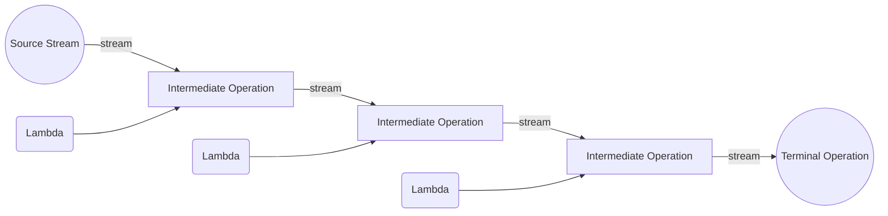
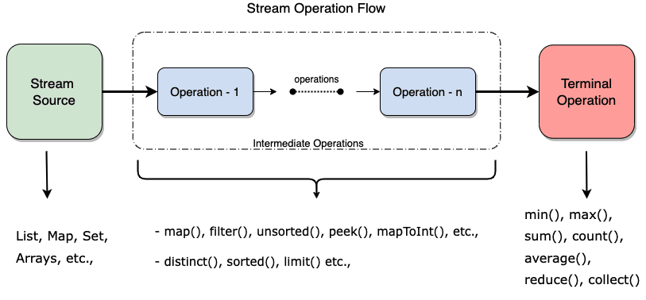

# Functional programming in Java

This section is about modeling problems and implementing systems with *immutable data* and operations that implement *pure functions*, as opposed to *mutable data* and operations with *side effects*. *Functional programming* is the name for this style of programming.
> Functional programming is a style of programming that emphasizes the evaluation of expressions, rather than execution of commands. The expressions in these languages are formed by using functions to combine basic values. A functional language is a language that supports and encourages programming in a functional style. — FAQ for comp.lang.functional

Functional programming is much easier to do when you have *first-class functions* in your language, and you can build *higher-order functions* that abstract away control flow code. Some languages (e.g., Scala) are strongly associated with functional programming. Many other languages (e.g., Java, Kotlin, JavaScript, C++) use functional programming to a greater or lesser extent. With Java’s recently added functional language features, if you continue programming in Java, you should expect to see more functional programming there, too.

## Programming paradigm

[Programming paradigms](https://en.wikipedia.org/wiki/Programming_paradigm) are a way to classify
programming languages based on their features. Languages can be classified into multiple paradigms:
- **Declarative programming** is a paradigm describing **WHAT** the program does, without explicitly specifying its control flow. Functional programming is based on this paradigm.
- **Imperative programming** is a paradigm describing **HOW** the program should do something by explicitly specifying each instruction (or statement) step by step, which [mutate](https://en.wikipedia.org/wiki/Immutable_object) the program's state. Traditional programming is based on this paradigm.

## Declarative programming

Java has been traditionally supporting the imperative style of programming and object-oriented style
of programming. Nowadays, Java has started supporting the functional style of programming with its
Java 8 release.

- **What is functional programming?**  It is a declarative style of programming rather than imperative. The basic objective of this style of programming is to make code more concise, less complex, more predictable, and easier to test compared to the legacy style of coding. Functional programming deals with certain key concepts such as pure function, immutable state, assignment-less programming etc.
- **Functional programming vs Purely Functional programming**:
Pure functional programming languages don’t allow any mutability in its nature, whereas a functional style language provides higher-order functions but often permits mutability at the risk of failing to do the right things, which put a burden on us rather than protecting us. So, in general, we can say if a language provides higher-order function, it is functional style language, and if a language goes to the extent of limiting mutability in addition to higher-order function then it becomes purely functional language. Java is a functional style language, and the language like Haskell is a purely functional programming language.

Let’s understand a few concepts in functional programming: 

- **Higher-order functions**: In functional programming, functions are to be considered as [first-class
citizens](https://ericnormand.me/podcast/what-are-first-class-functions). That is, so far in the legacy style of coding, we can do below stuff with objects:

  1. We can pass objects to a function.
  2. We can create objects within function.
  3. We can return objects from a function.

  When functions are first-class citizens, the following is also possible:

  4. We can pass a function to a function.
  5. We can create a function within function.
  6. We can return a function from a function.

    A higher-order function is a function that takes functions as parameters, or returns a function.
- **Pure functions**: A function is called pure function if it always returns the same result for the same argument values, and it has no side effects like modifying an argument (or global variable) or outputting something.
- **Lambda expressions**: A Lambda expression is an anonymous method that has mutability at the very minimum, and it has only a parameter list and a body. The return type is always inferred based on the context. Also, Lambda expressions work in parallel with the functional interface.

## Imperative vs. Declarative Programming

The functional style of programming is declarative programming. In the imperative style of coding, we define what to do a task and how to do it. Whereas, in the declarative style of coding, we only specify what to do. Let’s understand this with an example. Given a list of number let’s find out the largest of odd numbers divided by two from the list using an imperative and declarative style of coding. First the imperative version:

```Java
import java.util.Arrays;
import java.util.List;
public class ImperativeDemo {
    public static void main(String[] args) {
        List<Integer> numbers
            = Arrays.asList(11, 22, 33, 44,
                            55, 66, 77, 88,
                            99, 100);
 
        int largest = Integer.MIN_VALUE;
        for (Integer n : numbers) {
            if (n % 2 != 0) {
                int temp = n/2;
                
                if (temp > largest)
                    largest = temp;
            }
        }
        System.out.println(largest);
    }
}
```
Output
```text
49
```

The first issue with the above code is that we are mutating the variable result again and again.
So mutability is one of the biggest issues in an imperative style of coding. The second issue with
the imperative style is that we spend our effort telling not only what to do but also how to do the
processing. Now let’s re-write the above code in a declarative style. Before that, we need to know what is the _Java stream_.

### Java stream

[Stream API](https://docs.oracle.com/javase/8/docs/api/java/util/stream/Stream.html) is used to process collections of objects. A stream is a sequence of objects that supports various methods which can be [pipelined](https://en.wikipedia.org/wiki/Pipeline_(software)) to produce the desired result. The features of Java stream are:
- A stream is not a data structure, instead it takes input from the Collections, Arrays or I/O channels.
- Streams don’t change the original data structure, they only provide the result as per the pipelined methods.
- Each intermediate operation is [lazily](https://en.wikipedia.org/wiki/Lazy_evaluation) executed and returns a stream as a result, hence various intermediate operations can be pipelined. Terminal operations mark the end of the stream and return the result.



#### Generating a stream

In Java, you can generate a stream using various methods provided by the `java.util.stream` package.
Here are a few common ways to generate a stream in Java:

1. **From a Collection**: You can generate a stream from an existing collection, such as a `List`, `Set`, or `Map`. Use the `stream()` method to obtain a sequential stream or `parallelStream()` for a parallel stream.

   ```java
   List<String> names = Arrays.asList("Alice", "Bob", "Charlie");
   Stream<String> stream = names.stream();
   ```

2. **From an Array**: You can generate a stream from an array using the `Arrays.stream()` method. This allows you to perform stream operations on the elements of the array.

   ```java
   String[] names = {"Alice", "Bob", "Charlie"};
   Stream<String> stream = Arrays.stream(names);
   ```

3. **Using Stream.of()**: The `Stream.of()` method allows you to create a stream directly from individual elements or a variable number of arguments.

   ```java
   Stream<String> stream = Stream.of("Alice", "Bob", "Charlie");
   ```

4. **Using Stream.generate()**: If you need to generate a stream with a custom sequence or pattern, you can use the `Stream.generate()` method. You provide a `Supplier` function that generates the elements for the stream.

   ```java
   Stream<Integer> stream = Stream.generate(() -> 42);
   ```

5. **Using Stream.iterate()**: The `Stream.iterate()` method allows you to generate a stream with a sequential series of elements. You provide an initial value and a function that generates the next element based on the previous one.

   ```java
   Stream<Integer> stream = Stream.iterate(0, n -> n + 2);
   ```

6. **Using input stream** : You can generate a stream from an input stream, such as a file or network socket. Use the `lines()` method to create a stream of lines from the input stream.

   ```java
   BufferedReader reader = new BufferedReader(new FileReader("data.txt"));
   Stream<String> lines = reader.lines();
   ```
> Notice that input/output streams are different that functional streams. The former is used to read/write data from/to a file, network, or other sources, while the latter is used to process collections of objects in a functional way.

These are just a few examples of how to generate streams in Java. Once you have a stream, you can apply various intermediate and terminal operations on it, such as filtering, mapping, sorting, and collecting the results. Streams provide a declarative and functional way to process data, promoting more concise and readable code.

Remember to import the necessary classes from the `java.util.stream` package to use streams effectively.

```java
import java.util.Arrays;
import java.util.List;
import java.util.stream.Stream;
```

If we imagine Streams as streams of water flowing through a tank, then our job is to use each byte that gets out of the tank through the pipe with Stream API methods.

#### Different Operations On Streams

Streams support various operations to perform on the data. These operations are divided into two categories: intermediate operations and terminal operations.



##### Intermediate Operations

1. `map`: The map method is used to return a stream consisting of the results of applying the given function to the elements of this stream.
```java
List<Integer>   number = Arrays.asList(2,3,4,5);
Stream stream = number.stream();
List   square = stream.map(x->x*x).collect(Collectors.toList());
```
2. `filter`: The filter method is used to select elements as per the Predicate passed as an argument.
```java
List<String> names = Arrays.asList("Reflection","Collection","Stream");
List result = names.stream().filter(s->s.startsWith("S")).collect(Collectors.toList());
```
3. sorted: The sorted method is used to sort the stream.
```java
List<String> names = Arrays.asList("Reflection","Collection","Stream");
List result = names.stream().sorted().collect(Collectors.toList());
```

##### Terminal Operations

1. `collect`: The collect method is used to return the result of the intermediate operations performed on the stream.
```java
List<Integer> number = Arrays.asList(2,3,4,5,3);
Set square = number.stream().map(x->x*x).collect(Collectors.toSet());
```
2. forEach: The forEach method is used to iterate through every element of the stream.
```java
List<Integer> number = Arrays.asList(2,3,4,5);
number.stream().map(x->x*x).forEach(y->System.out.println(y));
```
3. reduce: The reduce method is used to reduce the elements of a stream to a single value. The reduce method takes a BinaryOperator as a parameter.
```java
List<Integer> number = Arrays.asList(2,3,4,5);
int even = number.stream().filter(x->x%2==0).reduce(0,(ans,i)-> ans+i);
```
Here `ans` variable is assigned 0 as the initial value and `i` (the value of current element) is added to it. In this case, we calculate the total sum of the integers in the given stream. 

#### Method references

A lambda expression like `x -> Math.sqrt(x)` has an unnecessary level of indirection – it takes an argument, calls `sqrt` on that argument, and directly returns the result of `sqrt`. So calling the lambda expression is effectively the same as calling `sqrt` directly.

Java lets us eliminate this level of indirection by referring to the `sqrt` method directly:
```java
Arrays.asList(1, 4, 9, 16).stream().map(Math::sqrt)
```

This syntax, `Math::sqrt`, is called a *method reference* that we talked about in the [previous subsection](8.3_Lambda). Note the `::` between the class name and method name, rather than the usual `.` which distinguishes the method reference from an ordinary method call or field lookup. You can read more about **method references** in the [Java Tutorials](https://docs.oracle.com/javase/tutorial/java/javaOO/methodreferences.html) for the details about the several kinds of method references that Java supports, including not only static methods like `sqrt` but also instance methods like `String::lowercase`.

But let’s pause here for a second, because we’re doing something unusual with functions. The map method takes a reference to a *function* as its argument — not to the result of that function. When we wrote `map(Math::sqrt)`, we didn’t call *sqrt*, like `Math.sqrt(25)` is a call. Instead, we referred to the function itself by name. `Math::sqrt` is a reference to an object representing the `sqrt` function. The type of that object is `Function<T,R>`, which represents unary functions from `T` to `R` (`T` and `R` are [generic types](https://www.baeldung.com/java-generics)). The primary operation of a `Function` is `apply()`, which calls the function with an argument. So `(Math::sqrt).apply(25.0)` returns 5.0, just like `Math.sqrt(25.0)` would.

But you can also assign that function object to another variable if you like, and it still behaves like sqrt:
```java
Function<Double,Double> mySquareRoot = Math::sqrt;
mySquareRoot.apply(16.0); // returns 4.0
```        
You can also pass a reference to the function object as a parameter to another function, and that’s what we’re doing here with `map`. You can use function objects the same way you would use any other value in Java, like int or string references or other object references. This is how functions are first-class in Java.

#### Stream processing

Now let's implement the `ImperativeDemo` in functional way:

```Java
import java.util.Arrays;
import java.util.List;
public class DeclarativeDemo {
public static void main(String[] args) {
    List<Integer> numbers
    = Arrays.asList(11, 22, 33, 44,
                    55, 66, 77, 88,
                    99, 100);

    System.out.println(
        numbers.stream()
            .filter(number -> number % 2 != 0)
            .mapToInt(e -> e / 2)
            .max());
    }
}
```
Output
```text
49
```
From the above code, we are not mutating any variable. Instead, we are transforming the data from one
function to another. This is another difference between Imperative and Declarative. Not only this but
also in the above code of declarative style, every function is a pure function and pure functions
don’t have side effects.

In the above example, we are dividing the number with factor 2, that is called *closure*. Remember,
lambdas are stateless and closure has an immutable state. It means in any circumstances, the closure
could not be mutable.

#### Closure

A closure in the Java programming language refers to a powerful and flexible concept that involves bundling together both code and the environment in which it operates. In essence, a closure allows a function to capture and retain the variables and context from its containing scope, even after that scope has finished executing. This enables the function to access and manipulate those variables even when it is called in a different context.

Closures are particularly useful in scenarios where you need to create functions that remember state, maintain context, or encapsulate behavior for later execution. They are commonly used for implementing callback functions, event handling, and various functional programming paradigms.

In Java, closures are primarily achieved through the use of anonymous inner classes or, more conveniently, through lambda expressions introduced in Java 8. Lambda expressions allow you to write concise and expressive code by defining functions inline, directly within the body of other functions. These lambda expressions capture variables from their enclosing scope and can be passed around as first-class citizens, providing a compact and readable way to work with closures.

The concept of closures brings greater flexibility and expressiveness to Java programming, enabling developers to write more modular and maintainable code by encapsulating behavior within self-contained units. They contribute to the evolution of Java towards more functional programming paradigms and can greatly enhance the way you design and structure your applications.

Let's have an example:

```Java
import java.util.function.Consumer;

public class ClosureExample {
    public static void main(String[] args) {
        int externalValue = 10;

        // Creating a closure using a lambda expression
        Consumer<Integer> closure = (x) -> {
            int result = x + externalValue; // Accessing externalValue from the enclosing scope
            System.out.println("Result: " + result);
        };

        // Calling the closure
        closure.accept(5); // Prints: Result: 15

        // Modifying externalValue will not affect the closure
        //externalValue = 20; // Uncommenting this line will cause a compilation error
    }
}
```
In this example, we define a closure using a lambda expression. The `Consumer` functional interface represents an operation that takes a single input argument and performs some action on it. In this case, the lambda expression captures the variable `externalValue` from its enclosing scope and uses it within the closure. When we call the `closure.accept(5)` method, the lambda expression is executed, and it adds the external value to the input argument, producing the result `15`.

The lambda expression in this example acts as a closure because it captures the variable `externalValue` from the surrounding context, allowing the enclosed code to access and utilize it even after the original scope (the `main` method) has exited. This demonstrates how closures in Java enable the encapsulation of behavior along with its associated context.

#### Function Lotto generator/checker

Functional programming makes it easy to generate random numbers and check them against a given set of numbers. Below is an example of a simple Lotto generator and checker using functional programming principles in Java.

```Java
import java.util.Arrays;
import java.util.stream.Stream;
import java.util.concurrent.ThreadLocalRandom;

/*
 * Lotto class to generate random lotto numbers and count matching numbers against given lotto vector using functional programming
 */
public class Lotto {
    private int[] numbers;
    private int size;
    private int range;

    public Lotto(int size, int range) {
        this.numbers = new int[size];
        this.size = size;
        this.range = range;
    }

    // generate size random numbers between 1 and range
    public void generateLottoNumbers() {
        numbers = Stream.iterate(1, n -> n + 1)
                .limit(range)
                .sorted((a, b) -> ThreadLocalRandom.current().nextInt(-1, 2))   // randomize the order
                .distinct()
                .limit(size)
                .mapToInt(Integer::intValue)
                .toArray();
    }

    // count matching numbers between the generated numbers and the given numbers
    public int countMatchingNumbers(int[] givenNumbers) {
        return (int) Arrays.stream(numbers)
                .filter(num -> Arrays.stream(givenNumbers).anyMatch(givenNum -> givenNum == num))
                .count();
    }

    // get the numbers from the stream
    public int[] getNumbers() {
        return numbers;
    }
}
```

In this example, we define a `Lotto` class that generates random lotto numbers and checks them against a given set of numbers. The `generateLottoNumbers` method uses functional programming techniques to generate a stream of random numbers, while the `countMatchingNumbers` method counts the matching numbers using streams and functional operations. To test this class, you can create a main method:

```Java
public class Main {
    public static void main(String[] args) {
        // Create a Lotto object with size 7 and range 40
        // The number of combinations is C(40, 7) = 18.643.560
        Lotto lotto = new Lotto(7, 40);

        // Generate random lotto numbers
        lotto.generateLottoNumbers();
        int[] generatedNumbers = lotto.getNumbers();

        // Print the generated numbers
        System.out.println("Generated Lotto Numbers: " + java.util.Arrays.toString(generatedNumbers));

        // Given numbers to compare with
        int[] givenNumbers = {1, 2, 3, 4, 5, 6, 7};

        // Count matching numbers
        int matchingCount = lotto.countMatchingNumbers(givenNumbers);

        // Print the count of matching numbers
        System.out.println("Count of Matching Numbers: " + matchingCount);
    }
}
```

## Map/Filter/Reduce

The _map/filter/reduce paradigm_ is a fundamental concept in functional programming that provides a structured approach to processing and transforming collections of data. It enables you to perform operations on elements within a collection in a declarative and composable manner. Each step of the paradigm contributes to a more expressive and modular code design.

The map/filter/reduce paradigm is widely used in functional programming languages and libraries, and it has also been integrated into languages like Java through constructs like the Stream API (as seen in the previous examples). It encourages a more functional and expressive programming style, making code easier to reason about and maintain.

### An imperative style application

Suppose we’re given the following problem: write a method that finds the words in the Java files in your project.

Following good practice, we break it down into several simpler steps and write a method for each one:
- find all the files in the project, by scanning recursively from the project’s root folder
- restrict them to files with a particular suffix, in this case .java
- open each file and read it in line-by-line
- break each line into words

Writing the individual methods for these substeps, we’ll find ourselves writing a lot of low-level iteration code. For example, here’s what the recursive traversal of the project folder might look like:
```Java
/**
 * Find all the files in the filesystem subtree rooted at folder.
 * @param folder root of subtree, requires folder.isDirectory() == true
 * @return list of all ordinary files (not folders) that have folder as
 *         their ancestor
 */
public static List<File> allFilesIn(File folder) {
    List<File> files = new ArrayList<File>();
    for (File f: folder.listFiles()) {
        if (f.isDirectory()) {
            files.addAll(allFilesIn(f));
        } else if (f.isFile()) {
            files.add(f);
        }
    }
    return files;
}
```
And here’s what the filtering method might look like, which restricts that file list down to just the Java files. Imagine calling this like `onlyFilesWithSuffix(files, ".java")`:
```Java
/**
 * Filter a list of files to those that end with suffix.
 * @param files list of files (all non-null)
 * @param suffix string to test
 * @return a new list consisting of only those files whose names end with
 *         suffix
 */
public static List<File> onlyFilesWithSuffix(List<File> files, String suffix) {
    List<File> result = new ArrayList<File>();
    for (File f : files) {
        if (f.getName().endsWith(suffix)) {
            result.add(f);
        }
    }
    return result;
}
```
In this example, we’ll have lots of sequences — lists of files; input streams that are sequences of lines; lines that are sequences of words; frequency tables that are sequences of (word, count) pairs. Map/filter/reduce will enable us to operate on those sequences with no explicit control flow — not a single `for` loop or `if` statement.

### A functional style application

The map/filter/reduce patterns do something similar to `Iterator` (remember the interface in Java collections), but at an even higher level: they treat the entire sequence of elements as a unit, so that the programmer doesn’t have to name and work with the elements individually. In this paradigm, the control statements disappear: specifically, the `for` statements, the `if` statements, and the `return` statements in the code from our introductory example will be gone. We’ll also be able to get rid of most of the temporary names (i.e., the local variables `files`, `f`, and `result`).

Going back to the example we started with, where we want to find all the words in the Java files in our project, let’s try creating a useful abstraction for filtering files by suffix:
```Java
/**
 * Make a filename suffix testing predicate.
 * @param suffix string to test
 * @return a predicate that returns true iff the filename ends with suffix.
 */
static Predicate<File> endsWith(String suffix) {
    return f -> f.getPath().endsWith(suffix);
}
```
`Predicate` is a functional interface and can therefore be used as the assignment target for a lambda expression or method reference. It represents a [predicate](https://en.wikipedia.org/wiki/Predicate_(mathematical_logic)) (boolean-valued function) of one argument.

A *functional interface* is an interface that contains only one abstract method. They can have only one functionality to exhibit. Functional interfaces are included in Java with Lambda expressions and method references in order to make code more readable, clean, and straightforward.

`endsWith` returns functions that are useful as filters. It takes a filename suffix like `.java` and dynamically generates a function that we can use with filter to test for that suffix. Given a `Stream<File>` files, we can now write, e.g., `files.filter(endsWith(".java"))` to obtain a new filtered stream.

`endsWith` is a different from our usual functions. It’s a *higher-order function*, meaning that it’s a function that takes another function as an argument, or returns another function as its result. Higher-order functions are operations on the datatype of functions; in this case, `endsWith` is a creator of functions.

Now let’s use a map and filter to recursively traverse the folder tree:
```Java
/**
 * Find all files in the filesystem subtree rooted at folder.
 * @param folder root of subtree, requires folder.isDirectory() == true
 * @return stream of all ordinary files (not folders) that have folder as
 *         their ancestor
 */
static Stream<File> allFilesIn(File folder) {
    File[] children = folder.listFiles();
    Stream<File> descendants = Arrays.stream(children)
            .filter(File::isDirectory)
            .flatMap(FuncDemo::allFilesIn);     // FuncDemo is the name of the current class
    return Stream.concat(descendants, Arrays.stream(children).filter(File::isFile));
}
```
The first line gets all the children of the folder, which might look like this:
```text
["src/client", "src/server", "src/Main.java", ...]
```
The second line is the key bit: it filters the children for just the subfolders using the `isDirectory` method, and then recursively maps `allFilesIn` against this list of subfolders. The result might look like this:
```text
[["src/client/MyClient.java", ...], ["src/server/MyServer.java", ...], ...]
```
So we have to flatten it to remove the nested structure, which is what `flatMap` (reducing hierarchy of data structure, see [this](https://www.geeksforgeeks.org/stream-flatmap-java-examples/)) does:
```text
["src/client/MyClient.java", ..., "src/server/MyServer.java", ...]
```
Finally, we add the immediate children that are plain files (not folders), and that’s our result.

We can also do the other pieces of the problem with map/filter/reduce. Once we have the list of all files underneath the current folder, we can filter it to just the Java files:
```Java
Stream<File> files = allFilesIn(new File(".")).filter(endsWith(".java"));
```
Now that we have the files we want to extract words from, we’re ready to load their contents. Java has a useful utility function for this, [Files.readAllLines](https://docs.oracle.com/javase/8/docs/api/?java/nio/file/Files.html), which requires first converting the `File` objects into `Paths`:
```Java
Stream<Path> paths = files.map(File::toPath);
```
and then calling `readAllLines`:
```Java
Stream<List<String>> fileContents = paths.map(path -> {
    try {
        return Files.readAllLines(path);
    } catch (IOException ioe) {
        throw new UncheckedIOException(ioe);
    }
});
```
Note that this step is complicated slightly by the fact that the functions passed to map/filter/reduce must not be declared to throw any checked exceptions, so `readAllLines` has to be wrapped with a lambda expression that converts the checked `IOException` into an unchecked exception.

Finally, we can flatten the stream of lists of lines into a simple stream of lines:
```Java
Stream<String> lines = fileContents.flatMap(List::stream);
```
and then extract the nonempty words from each line:
```Java
Stream<String> words = lines.flatMap(line -> Arrays.stream(line.split("\\W+")).filter(s -> s.length() > 0));
```
And we’re done, we have our list of all words in the project’s Java files! As promised, the control statements have disappeared.
```Java
/**
 * Print the words in Java files in the project.
 * @param args unused
 */
public static void main(String[] args) throws IOException {
    Stream<File> files = allFilesIn(new File("./WordsExplorer")).filter(endsWith(".java"));
    Stream<Path> paths = files.map(File::toPath);
    Stream<List<String>> fileContents = paths.map(path -> {
        try {
            return Files.readAllLines(path);
        } catch (IOException ioe) {
            throw new UncheckedIOException(ioe);
        }
    });
    Stream<String> lines = fileContents.flatMap(List::stream);
    Stream<String> words = lines.flatMap(line -> Arrays.stream(line.split("\\W+")).filter(s -> s.length() > 0));
    words.forEach(System.out::println);
}
```
<!-- http://web.mit.edu/6.031/www/fa17/classes/26-map-filter-reduce/ -->

<!-- https://www.geeksforgeeks.org/functional-programming-in-java-with-examples/ -->

<!-- https://www.baeldung.com/java-synchronized -->

## Assignments

**Task 1: Calculate mean of an array in functional way (e.g. no `for`-loops)**

**Task 2: Filtering and Transforming a List of Numbers**

You are given a list of integers. Your task is to perform the following operations using Java functional programming techniques:
- Filter out all the even numbers from the list.
- Double each remaining number.
- Find the sum of the resulting numbers.

Write a Java program that demonstrates these operations using lambda expressions, streams, and functional interfaces.

For this assignment, you get points in the following way:
1. Task 1 completed: 3 points
2. Task 2 completed: 3 points

